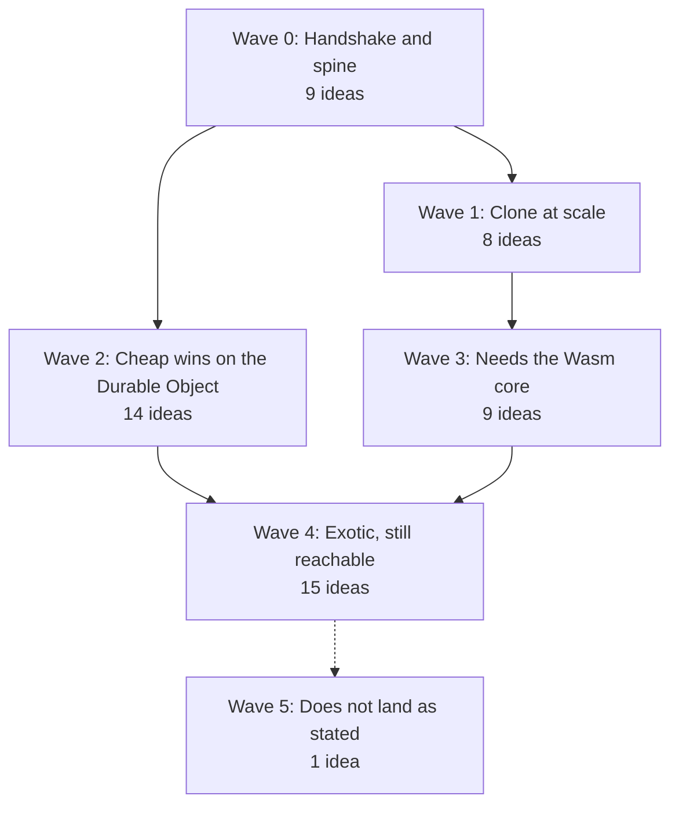

# What we can build, and in what order

This document turns the 56 verdicts into a plan. The plan has six waves. Each wave must work with a normal git program before the next wave starts. git is a tool that keeps every version of a set of files, and lets many people share those versions.

Think of it like this. You build a house in waves. First the foundation. Then the frame. Then the rooms. You do not hang pictures before the walls stand. Each wave here is a layer that the next wave stands on.

## The picture

## Wave 0: Handshake and spine

**What it is.** The smallest server that a normal git program can clone from and push to. Nothing else exists until this works.

**Why first.** Every other idea depends on at least one of these nine. The dependency map shows that almost every arrow ends here.

**What must be true at the end of this wave.** A user runs `git clone` and gets the files. A user runs `git push` and the server keeps the commits. A second user who pushes at the same time does not lose work.

The nine ideas, in build order:

1. The entry point and message format. Verdict: lands.
2. Login and routing of each repo to its own Durable Object. Verdict: lands with caveats.
3. One Durable Object per repo that owns the refs. Verdict: lands with caveats.
4. Refs in the small database, objects in the large file store. Verdict: lands with caveats.
5. Object names that are their own fingerprints. Verdict: lands with caveats.
6. The pack reader that unpacks a push as it arrives. Verdict: lands with caveats.
7. The two-step push that writes files first and moves the branch second. Verdict: lands with caveats.
8. The step that works out which objects a fetch needs. Verdict: lands with caveats.
9. The newer git message set, with a small adapter for old git programs. Verdict: risky.

**Effort.** Weeks. Most of the effort goes into fixing the nine problems in the cross-cutting defects document, because they all live in this wave.

## Wave 1: Clone at scale

**What it is.** Making a first clone fast for a large project, and keeping storage tidy.

**Why second.** A small project works after wave 0. A large project makes thousands of small reads and hits limits. This wave adds the packfile index, the background repack, and the fast paths for a first clone.

**What must be true at the end.** A clone of a large project is one big download from the file store. Storage does not grow forever. A clone that skips file contents until needed works.

The eight ideas:

1. The background task that repacks and deletes unused objects. Verdict: risky.
2. A ready-made bundle for first clones. Verdict: lands with caveats.
3. Telling git where to download the bundle directly. Verdict: lands with caveats.
4. Keeping a few base objects close so deltas are cheap. Verdict: lands with caveats.
5. Clones that skip file contents until needed. Verdict: risky.
6. Large file support with direct uploads to the file store. Verdict: lands with caveats.
7. A copy of the refs in every region for fast reads. Verdict: lands with caveats.
8. A small cache of hot files inside the Durable Object. Verdict: risky.

**Effort.** Weeks. The repack task is the hard part.

## Wave 2: Cheap wins on the Durable Object

**What it is.** Features that cost a few extra rows in the same database write that moves a branch, or a small job that a timer drains later.

**Why here.** These do not need anything from wave 1. They need only the spine. Each is days of work, not weeks.

**What must be true at the end.** A user can lock a branch, look at a branch as it was on a given date, prove who moved a branch, and get a message the moment a branch moves.

The fourteen ideas:

1. Branch locks with a time limit. Verdict: lands with caveats.
2. Look at a branch as it was at a past time. Verdict: lands with caveats.
3. A signed record of every branch move. Verdict: lands with caveats.
4. A saved copy of the refs in the file store after every push. Verdict: lands with caveats.
5. Web addresses that can push only one branch for a short time. Verdict: lands with caveats.
6. Every commit sent to a queue for other systems to read. Verdict: lands with caveats.
7. Messages in the same shape GitHub sends. Verdict: lands with caveats.
8. Hooks that run in a user's own Worker before and after a push. Verdict: risky.
9. Tests that run as a chain of timers after a push. Verdict: lands with caveats.
10. A live connection that tells a client the moment a branch moves. Verdict: lands with caveats.
11. A search index built after each push. Verdict: lands with caveats.
12. Repos that delete themselves after a set time. Verdict: lands with caveats.
13. A push from a sister Durable Object with no web request. Verdict: lands with caveats.
14. Moving cold objects to cheaper storage. Verdict: lands with caveats.

**Effort.** Days each.

## Wave 3: Needs the Wasm core

**What it is.** Features that need real git logic, such as merge, rebase, diff, and blame. Wasm is a way to run code from other languages, such as Rust, inside a Worker. We bring a proven git library in through Wasm once, and these features open together.

**Why here.** Writing merge and diff logic from nothing is slow and error-prone. Bringing in a proven library is one large job that unlocks nine ideas.

**A later decision changes this wave.** The server will be written in Rust with gitoxide from the start. See [rust-and-gitoxide.md](./rust-and-gitoxide.md). With Rust everywhere, the first item in this wave, the separate Wasm core, is no longer a separate step. The other eight ideas still need the merge and diff blocks, which gitoxide does not yet build for the Worker in full.

**What must be true at the end.** The server can merge two branches, rebase one branch onto another, and show a diff, all without a client.

The nine ideas:

1. The git library brought in through Wasm. Verdict: risky.
2. Merge on the server when a push asks for it. Verdict: risky.
3. Rebase and squash on the server. Verdict: risky.
4. Diffs read straight from the packfile. Verdict: risky.
5. Diffs that understand functions, not only lines. Verdict: risky.
6. Blame that shows which agent wrote each line. Verdict: risky.
7. Reading the repo as a folder with no checkout. Verdict: risky.
8. A git client that runs in the browser and works offline. Verdict: risky.
9. Proofs that let a client check a partial download. Verdict: lands with caveats.

**Effort.** Weeks to months. The first item is the long pole.

## Wave 4: Exotic, still reachable

**What it is.** The ideas the reviewers rated risky or with caveats, but for which a path exists once the waves above are solid.

**Why last.** Each depends on two or more earlier waves. None is needed for a working server.

The fifteen ideas:

1. Extra commands for AI agents, such as search and explain-diff. Verdict: lands with caveats.
2. Commit search by meaning. Verdict: lands with caveats.
3. Code review notes stored as git objects. Verdict: lands with caveats.
4. One shared object store for all repos, so nothing is stored twice. Verdict: lands with caveats.
5. Forks that share the parent's objects. Verdict: risky.
6. One Durable Object per branch for very large repos. Verdict: risky.
7. Direct uploads of huge files during a push. Verdict: risky.
8. Packs built ahead of time for the next fetch. Verdict: risky.
9. Finding the commit that broke a test, on the server. Verdict: lands with caveats.
10. A preview site for every branch. Verdict: lands with caveats.
11. Old history folded into checkpoints. Verdict: lands with caveats.
12. One push to three repos, all or nothing. Verdict: risky.
13. Repos that copy each other with no central server. Verdict: risky.
14. Objects encrypted with a key only the user holds. Verdict: risky.
15. git as a database for an application. Verdict: risky.

## Wave 5: Does not land as stated

**What it is.** One idea. A branch that many people edit at once, with the server merging their edits live.

**Why it does not land.** A normal git program refuses to push a branch that has moved since you last fetched. It refuses on the user's own machine, before any data reaches the server. So the server never gets the chance to merge.

**What works instead.** Keep the live shared document in the Durable Object, and have the Durable Object write a normal commit to a normal branch when asked. git programs then see an ordinary branch.

## Two checks to do before any code

1. Check whether the database's count of changed rows counts index rows too. Several ideas use that count to decide whether a branch moved.
2. Check whether the Worker runtime can unsqueeze one object at a time from a packfile and report how many bytes it used. The standard browser tool cannot stop at object boundaries.
