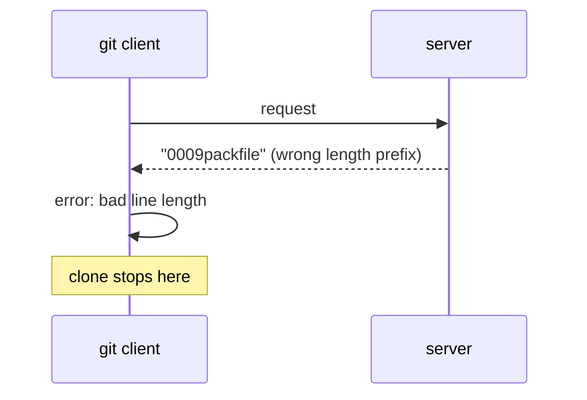
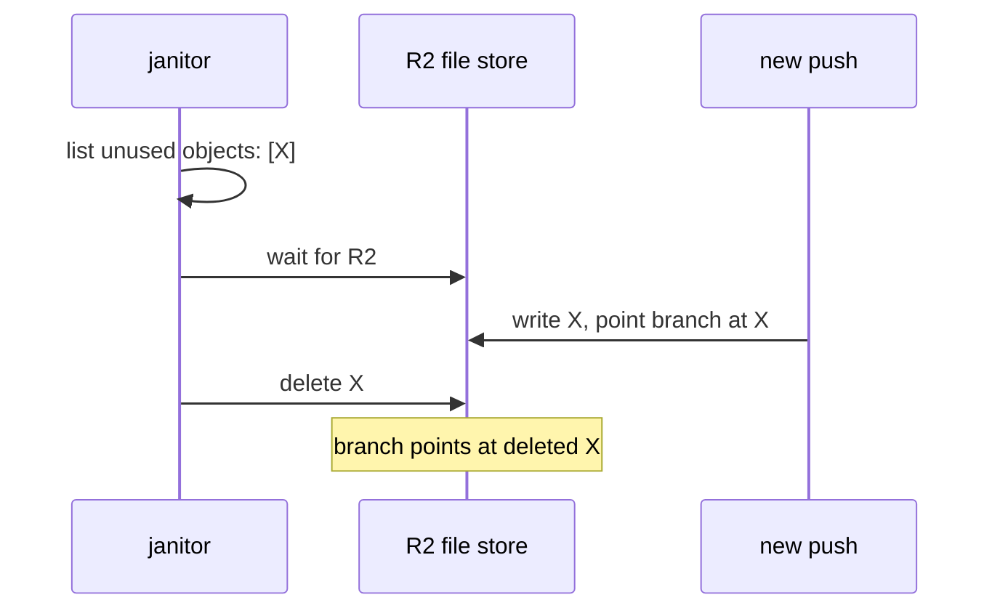
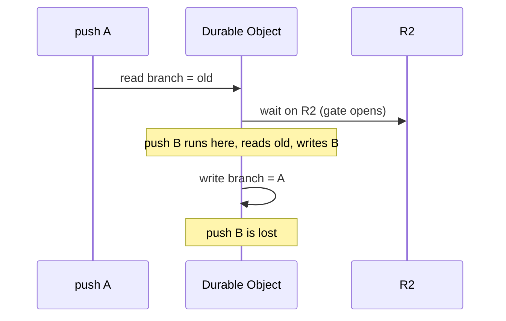

# The nine problems that kept coming back

The reviewers checked 56 ideas. The same nine problems appeared again and again, in ideas that had nothing to do with each other. These problems are not mistakes in one idea. They are facts about how Cloudflare Workers and Durable Objects behave. If we fix each one once, in the foundation, most of the per-idea problems disappear.

Think of it like this. A gardener plants 56 different seeds. Many of them grow badly. The gardener looks closer and finds the same nine causes: the soil is too wet, the wall casts a shadow, the hose is too short. Fixing the soil once helps every plant, not one plant.

Each section below gives four things. What goes wrong. Why it matters. A picture. The one fix.

## 1. The message format git checks byte by byte

**Hit 37 of 56 ideas.**

**What goes wrong.** git is a tool that keeps every version of a set of files, and lets many people share those versions. When git talks to a server, it uses a strict message format called pkt-line. Each line starts with four characters that give the line's length. Many proofs got a detail of this format wrong. Some wrote the length without counting the four length characters themselves. Some sent a chunk larger than the maximum of 65,515 bytes. Some sent a status reply on the wrong channel. Some sent a reply section that git does not expect.

**Why it matters.** git does not forgive a wrong byte. It stops with an error and the user sees a failed clone or a failed push. The server can be perfect inside and still be useless if the first message is wrong.

Think of it like this. A postal service that only accepts letters in one exact envelope size. The letter can be brilliant. If the envelope is one millimeter too wide, the letter comes back.

**The one fix.** Write one shared code module that builds and reads pkt-line messages and sideband channels. Test that module against a real git program before any feature uses it. Then every idea uses the same tested module.

## 2. The cleanup task deletes files that are still in use

**Hit 31 of 56 ideas.**

**What goes wrong.** Every git server needs a background task that deletes objects nobody points to anymore. An object is one stored item in git, such as a file's content or a commit. We call this task the janitor. The janitor makes a list of unused objects, then waits for the file store to respond, then deletes. While the janitor waits, a new push can arrive and start to use one of those objects. The janitor then deletes an object that a branch now points to.

**Why it matters.** The result is a repository with a hole in it. A branch points at a commit, but the commit's data is gone. Every later clone of that branch fails. This is data loss, and it is silent until someone clones.

Think of it like this. A hotel cleaner makes a list of empty rooms at 9:00, goes to get the cart, and starts cleaning at 9:10. A guest checked into room 12 at 9:05. The cleaner throws out the guest's luggage.

**The one fix.** Give every object a grace period, so the janitor never deletes an object younger than a set time. Check a version number of the refs at the exact moment of the delete, all at once with the delete. Never delete in the same run that made the list.

## 3. Real pushes arrive squeezed, and readers expected them unsqueezed

**Hit 27 of 56 ideas.**

**What goes wrong.** When you push, git does not send each object one by one. It sends one packfile, which is one bundle that holds many objects, squeezed to save space. Inside the bundle, many objects are stored as a delta. A delta says "the same as that other object, with these changes". Many proofs assumed each object arrives on its own, fully written out. They had no code to unpack a delta.

**Why it matters.** Every real push from a real git program is a packfile with deltas. A server that cannot read deltas cannot accept a normal push. It also cannot read back objects that arrived that way.

Think of it like this. A recipe book where most pages say "same as page 40, but use butter instead of oil". If you tear out page 40, half the book is unreadable.

**The one fix.** The pack reader must unpack every delta as the push arrives, and store each object fully written out. It must also keep an index in the database that says which bundle holds each object and at what position. Then every later reader can find any object with one small read.

## 4. The proofs did not agree on how objects are stored

**Hit 15 of 56 ideas.**

**What goes wrong.** Some proofs stored each object squeezed. Some stored it unsqueezed with a small label next to it. Some used one folder layout, some another. Each proof worked on its own. Two proofs together could not read each other's files.

**Why it matters.** The system is one system. If the pack reader writes objects one way and the clone builder reads them another way, nothing works end to end.

Think of it like this. A band where the guitarist tunes to one pitch and the singer to another. Each sounds fine alone. Together it is noise.

**The one fix.** Write one short document that says exactly how objects are stored: the folder layout, the squeezed or unsqueezed format, the label fields, and the shape of the index table. Every idea reads and writes through one shared object reader that follows that document.

## 5. The Durable Object lets requests collide while it waits on the network

**Hit 15 of 56 ideas.**

**What goes wrong.** A Durable Object, or DO, is a single small program with its own storage that handles one thing at a time. That is the promise. The promise has a condition. The DO handles one thing at a time only while it waits on its own storage. When the DO waits on the network instead, for example on R2, another request can run in the middle. Many proofs read a branch pointer, then waited on R2, then wrote the branch pointer. Two pushes could both read the old value and both write, and one push is lost.

**Why it matters.** This is the exact problem the whole design exists to avoid. A lost push means a user's commit vanished with a success message.

Think of it like this. One librarian updates the catalog. She reads the card for a book, walks to the back room to fetch something, and comes back to write the card. While she was away, a second librarian read the same card and wrote a different value. The first librarian overwrites it without knowing.

**The one fix.** Do all the R2 work first. Then run the read and the write of the branch pointer inside one storage transaction with no network wait inside it. Use the compare-and-swap rule: change the value only if it still has the value you expect.

## 6. A Durable Object has only one alarm, and everyone used it

**Hit 10 of 56 ideas.**

**What goes wrong.** An alarm is a timer inside a Durable Object. A DO has only one alarm at a time. The janitor set the alarm. The repack task set the alarm. The test runner set the alarm. The lease timer set the alarm. Each one silently cancelled the one before it.

**Why it matters.** A task that never runs looks fine until you need it. The janitor never runs, so storage grows. The test runner never runs, so results never appear.

Think of it like this. One kitchen timer, four cooks. Each cook resets it for their own dish. Only the last dish gets a ring. The other three burn.

**The one fix.** Keep a small table of jobs in the DO database, each with a time to run. Set the single alarm for the earliest job. When the alarm rings, run that job, then set the alarm for the next earliest.

## 7. git sends request bodies in ways the proofs did not expect

**Hit 8 of 56 ideas.**

**What goes wrong.** git squeezes small requests with gzip. git sends large pushes in chunks with no total size up front. Many proofs read the body as plain bytes with a known size. R2 needs a known size to accept a file in one write.

**Why it matters.** A small push arrives squeezed and the server reads garbage. A large push arrives with no size and the R2 write fails.

Think of it like this. A parcel that arrives shrink-wrapped, or arrives as ten boxes with no note about the total. The receiving desk expected one open box with a label.

**The one fix.** Unsqueeze the body at the edge when the request says it is gzip. Write large pushes to R2 with the multipart upload method, which accepts parts of at least 5 MiB and does not need the total size up front.

## 8. One R2 read per object hits the 1,000-call limit

**Hit 7 of 56 ideas.**

**What goes wrong.** A subrequest is one call from a Worker to another service, such as one read from R2. Each request may make at most 1,000 subrequests. Several proofs read or wrote one object per call. A checkout of a 2,000-file project, or a push of a 2,000-file workspace, stops at call 1,000.

**Why it matters.** The failure is not a slow request. It is a hard stop in the middle, with a half-finished result.

Think of it like this. A library card that allows 1,000 checkouts per visit. A researcher who needs 2,000 books has to come back tomorrow, and the proofs had no "tomorrow".

**The one fix.** Group objects into packfiles and read many objects with one range read. For jobs that need thousands of calls, split the job across several alarm runs and save the position in the database between runs.

## 9. The Durable Object does not know its own name

**Hit 5 of 56 ideas.**

**What goes wrong.** The system creates one Durable Object for each repo by name, such as "owner/repo". Inside the DO, the code asked the DO for its own name and got nothing back. Cloudflare does not fill in that field for DOs created this way. Proofs that built their R2 folder path from the name wrote to a folder called "undefined".

**Why it matters.** Every repo writes to the same wrong folder. Repos overwrite each other. Nothing can be found again.

Think of it like this. A new employee who never asks what their own desk number is, and files everything under "desk unknown".

**The one fix.** On the first request, write the owner and repo name into the DO's database. Read the name from there afterwards.

## What to do with this list

Fix all nine in the foundation, before any edge or wild idea. The order matters:

1. The message format module, tested against real git.
2. The object storage document and the shared object reader.
3. The pack reader that unpacks deltas and keeps an index.
4. The compare-and-swap rule with no network wait inside the transaction.
5. The single alarm dispatcher.
6. The janitor with a grace period.
7. The request body handling for gzip and chunked pushes.
8. The DO name stored in its own database.
9. Grouping of reads to stay under 1,000 calls.

## Where to check this in git's own code

git is open source at https://github.com/git/git. These files are where the claims above come from. Read them to check us.

| Claim | File in git's source |
|---|---|
| A message line has a four-character length, and the maximum line is 65,520 bytes | `pkt-line.c` and `pkt-line.h` |
| The rules for the newer message set, including when the reply must skip the acknowledgments section | `Documentation/gitprotocol-v2.txt` and `upload-pack.c` |
| What the server must send back after a push, and on which channel | `builtin/receive-pack.c` |
| A git program refuses to push a branch that moved, before any data leaves the machine | `remote.c`, function `set_ref_status_for_push` |
| A shallow clone sends extra lines before its push commands | `send-pack.c` |
| Small requests are squeezed with gzip and large pushes are sent in chunks | `remote-curl.c` |
| How a packfile and its deltas are laid out | `Documentation/gitformat-pack.txt` |
