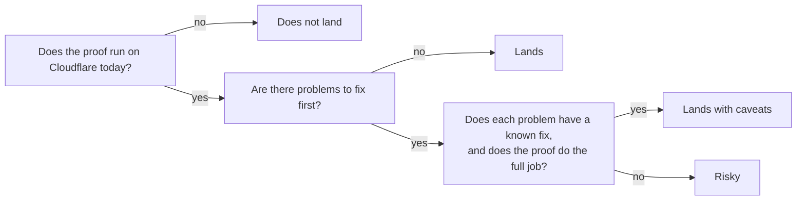

# How to read the findings

This page explains the words used in every other findings document. Read it once. Then the scores and verdicts will make sense.

## The four verdicts

Each idea got one of four verdicts from its reviewer.

**Lands.** The proof works on Cloudflare today. The reviewer found no problem that must be fixed first. Think of it like a flight with a clear runway.

**Lands with caveats.** The idea is sound and can be built. The proof has one or more problems that must be fixed first, and the reviewer described each fix. Think of it like a flight with a runway that needs some repairs before you land. The runway is there. The repairs are known.

**Risky.** The idea can be built. But the proof shows one or more problems the reviewer could not fully solve, or it does a weaker version of the goal. Think of it like a runway you can see on the map, but nobody has checked it for holes.

**Does not land.** The idea does not work as stated. The reviewer showed the exact reason. There may be a different, weaker idea that does work. Think of it like a runway that turned out to be a lake.

## Blockers and caveats

A **blocker** is a problem that stops the idea from working until it is fixed. Every blocker in a review is written out in the plain explainer under "Problems that must be fixed first". Each one says what goes wrong, why it matters, and how to fix it.

A **caveat** is a limit or a condition. The idea works, but only inside this limit. Every caveat is written out under "Things to know".

Think of it like this. You buy a car. A blocker is a flat tyre. You cannot drive until you change it, but changing it is a known job. A caveat is "this car cannot tow a trailer". The car drives fine. It has a limit.

## The three scores

Each idea got three scores from 1 to 5.

| Score | Question it answers | 5 means | 1 means |
|---|---|---|---|
| Feasibility | Can we build this on Cloudflare today? | Every building block exists and is finished. | A needed building block does not exist. |
| Reliability | Can a crash or two users at once lose data? | No way to lose data was found. | Data loss is easy to cause. |
| Correctness | Does the proof do what the idea says? | It does the full job. | It does something much weaker. |

A low reliability score is the one to worry about most. A low feasibility score means we wait for Cloudflare. A low correctness score means the proof needs more work. A low reliability score means a user can lose a commit and see a success message.

## Effort

Each review gives a rough effort to reach a working version: days, weeks, or months. The effort is for one engineer who already knows git and Cloudflare. The effort does not include the nine shared problems, which are counted once in wave 0 of the build order.

## Tiers

The ideas are in three groups.

- **Foundation.** The 14 ideas that make a basic git server. Everything else stands on these.
- **Edge.** The 19 ideas that exist only because the server runs on Cloudflare's network with no fixed machine.
- **Wild.** The 23 ideas that go beyond what a git server normally does.

## Words you will see

- **git**: a tool that keeps every version of a set of files, and lets many people share those versions.
- **repository, repo**: one project's full set of files and their history.
- **commit**: one saved version of the files, with a note about what changed.
- **branch**: a named line of commits, like a bookmark that moves forward as you save.
- **ref**: a name that points at one commit. A branch is a ref. A tag is a ref.
- **object**: one stored item in git. An object is a file's content, a folder listing, or a commit.
- **push**: sending your new commits to the server.
- **fetch, clone**: getting commits from the server. A clone gets everything for the first time.
- **packfile**: one bundle that holds many objects, squeezed to save space.
- **Worker**: a small program that runs on Cloudflare's network close to the user, with no server to manage.
- **Durable Object, DO**: a single small program with its own storage that handles one thing at a time. There is one for each repo. Think of it like the one librarian who is allowed to update the catalog.
- **R2**: Cloudflare's large file store. It holds the git objects.
- **alarm**: a timer inside a Durable Object. A DO has only one alarm at a time.
- **compare-and-swap**: change a value only if it still has the value you expect. If someone changed it first, do nothing and report it.

The full glossary is in [STYLE.md](../STYLE.md).
