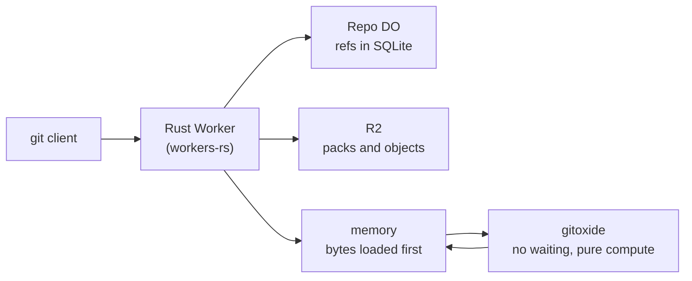

# Writing the server in Rust with gitoxide

> Verdict for Rust with gitoxide: **lands with caveats**. Verdict for Rust with git2-rs inside the Worker: **does not land**. The engineer-level memo with every source link is at [research/rust-server.md](../research/rust-server.md).

## What this idea is

The 56 proofs were written in TypeScript, the language Cloudflare Workers use by default. This idea writes the server in Rust instead. Rust is a language that catches many mistakes before the program runs, and it can run inside a Worker through Wasm. Wasm, or WebAssembly, is a way to run code from other languages, such as Rust, inside a Worker.

The main reason to use Rust is a library called gitoxide. gitoxide is a set of small Rust building blocks that already know how to read and write git's file formats. git is a tool that keeps every version of a set of files, and lets many people share those versions. The two hardest parts of our study, the message format and the squeezed packfiles, are exactly the parts gitoxide already does.

Think of it like this. You are building a piano. You can carve every key and cast every string yourself. Or you can buy the keys and strings from a maker who has tested them for years, and spend your time on the case and the tuning. gitoxide is the maker of keys and strings.

## Why not git2-rs

git2-rs was the first library we looked at. git2-rs is a thin Rust wrapper around libgit2, a large C library. The user chose gitoxide instead. The memo confirms that choice with three reasons.

1. **libgit2 does not build for the Worker.** Its build script has no path for Wasm. It expects a normal operating system with files, threads, and network libraries. The only working Wasm build of libgit2 uses a different toolchain that cannot be linked into a Rust Worker.
2. **libgit2 waits, and Cloudflare does not let it.** libgit2 asks for a file and waits for the answer on the spot. Cloudflare's file store, R2, answers later, as a promise. Inside a Worker there is no way to make Wasm code stand still and wait for a promise today.
3. **Even if it ran, it is the wrong shape.** libgit2 wants a working folder, config files, and temporary files. Our design keeps refs in a Durable Object and objects in R2. We would rebuild all of that under a library that then redoes the same work in its own memory.

git2-rs still has a place off the Worker. A test harness that clones and pushes against the edge server from a normal computer is a good use. So is a small command-line tool for importing repositories.

## How it works

Cloudflare Workers are small programs that run on Cloudflare's network close to the user, with no server to manage. workers-rs is Cloudflare's own Rust toolkit for writing Workers. A Durable Object, or DO, is a single small program with its own storage that handles one thing at a time. There is one DO for each repo. Think of it like the one librarian who is allowed to update the catalog. R2 is Cloudflare's large file store. It holds the git objects.

1. The whole Worker and the repo DO are written in Rust with workers-rs. There is no TypeScript in the request path.
2. All waiting on the network, such as reads from R2 and writes to the DO database, is done by the Rust host code. This code can wait, because it is written in Rust's async style.
3. All git logic is done by gitoxide building blocks. These blocks never wait. They work on bytes that are already in memory.
4. The host loads the bytes it needs first. Then it hands them to gitoxide. Then it takes the answer and writes it out.
5. gitoxide gives us the message format, the packfile reader, the delta unpacker, the object parser, the fingerprint maker, the commit walker, and the packfile writer.
6. We still write the server side of the git conversation ourselves. gitoxide has the client side only.

The rule in step 4 is the heart of the design. gitoxide cannot wait on the network, and Cloudflare cannot make Wasm wait. So the host must fetch first and compute second, every time. This is the same rule the TypeScript design had to follow. In Rust, the boundary is a function call inside one program instead of a bridge between two languages.

## What the reviewer decided

The verdict for Rust with gitoxide is lands with caveats. The idea is sound and can be built. The proof has one or more problems that must be fixed first, and the reviewer described each fix. Think of it like a flight with a runway that needs some repairs before you land. The runway is there. The repairs are known.

| Question | Answer |
|---|---|
| Does workers-rs support what we need? | Yes. DO SQLite, alarms, WebSocket hibernation, R2 range reads, R2 multipart upload, and streaming bodies are all there. |
| Which gitoxide blocks build for the Worker? | The ones we need most. Fingerprints, objects, packfiles with deltas, the message format, and commit walks. Cloudflare's own build checks them. |
| Which do not? | The high-level ones that want a file system. Also the merge block, but its 926-line text merge can be copied in. |
| Effort for the foundation? | About 12 to 13 weeks in Rust. About 14 to 15 weeks in TypeScript. The platform rules cost the same in both. |

## What Rust helps with, and what it does not

The nine problems in [cross-cutting-defects.md](./cross-cutting-defects.md) are platform facts. Rust changes some and not others.

| Problem | Effect of Rust with gitoxide |
|---|---|
| 1. The message format git checks byte by byte | Helps a lot. gitoxide owns the length prefix, the size cap, and the channel bytes. We buy the fix instead of building it. |
| 2. The cleanup task deletes files in use | No effect. This is a design rule, the same in any language. |
| 3. Real pushes arrive squeezed | Helps a lot. gitoxide reads packfiles and unpacks deltas. The index of where each object lives is still ours. |
| 4. Proofs disagreed on storage | Helps some. One Rust type for the object store makes "one shared reader" a rule the compiler enforces. |
| 5. Requests collide during network waits | No effect. Waiting on R2 from Rust opens the gate the same way. The fix is the same. |
| 6. One alarm per DO | No effect. The jobs table is still needed. |
| 7. gzip and chunked bodies | No effect. Slightly more work, because gitoxide does not unsqueeze gzip. Use the browser tool for that. |
| 8. Subrequest limit | No effect. Range reads over packs are still needed. |
| 9. The DO does not know its name | Slightly worse. workers-rs has no name field. Store the name on the first request, as before. |

## Things to know

- gitoxide has no server side. The commands for listing refs, sending a pack, and receiving a push must be written by us on top of gitoxide's message codec. Budget for that.
- Every walk over commits must load first and walk second. A walk that discovers what to load next must be written as a loop of small loads. This is the same shape as the fix for the subrequest limit.
- The compiled Rust program is 605 KB, measured. Cloudflare allows 64 MiB. Start-up cost was 20 to 30 ms locally against a 1 second budget. The number on Cloudflare's own machines is still to be measured.
- A build takes minutes, not seconds. The change-and-test loop is slower than in TypeScript.
- A Rust panic stops the whole Worker unless a flag is set. Every byte from a client must be checked, never assumed.
- gitoxide checks that its blocks build for Wasm. It does not run its tests on Wasm. We must run our own tests for delta unpacking and pack streaming inside a Worker.
- gitoxide releases monthly and bumps many crate versions together. Pin exact versions and upgrade on purpose.
- workers-rs has small gaps. Typed calls between DOs are experimental, so use web-shaped calls. The DO cannot read its own name, so store it.

## We built the first slice, and it works

After the memo, we built the first milestone as a real program and ran it on the Cloudflare runtime locally. The results are in [research/rust-spike.md](../research/rust-spike.md) and the source is in `spikes/rust-ls-refs/`.

- A normal git program ran `git ls-remote` against the Rust Worker and printed all four seeded refs. It worked over the newer message set and over the old one.
- The Worker read a small packfile with two deltas, unpacked them, and computed every fingerprint. Every value matched what git itself reports for the same packfile.
- The whole program with all six gitoxide building blocks is 605 KB. That is well under the 64 MiB limit. The memo's guess of 1 to 3 MB was too pessimistic.
- The first request after start costs 20 to 30 ms more than later requests. The start-up budget is 1 second. The risk the memo raised is closed for local runs. The number on Cloudflare's own machines is still to be measured.
- Three details in the memo were wrong and are now corrected in the contract. The message encoder lives under a different module path. The delta function is not public, so deltas go through the packfile reader instead. One build flag had to change.

Think of it like this. The memo was the map. The spike was the first walk down the road. The road is there, two signposts were mislabelled, and the walk was shorter than the map suggested.

## Where to start

The memo gives an exact list of crates and versions for a first milestone: list the refs and serve a clone from a ready-made pack. That milestone exercises the message codec, the DO database for refs, R2 range reads for the pack, and the sideband framing. It does not yet accept a push. Start there.

## How this idea connects to the others

This idea replaces the language of every proof, so it touches everything. It most directly replaces [#25 Wasm git core](../plain/wasm-git-core.md), which proposed a small Rust core inside a TypeScript Worker. With Rust everywhere, the two-language bridge that proof needed goes away, and the three problems its reviewer found go away with it.
