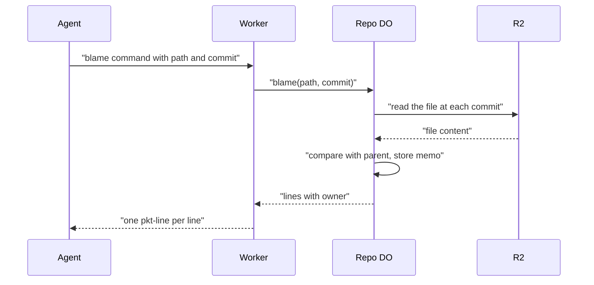

# Blame that knows which agent wrote each line

> Verdict: **risky** · feasibility 3/5 · reliability 3/5 · correctness 2/5 · effort: weeks
> Read the words in [how-to-read.md](../findings/how-to-read.md). Engineers: [proof](../proofs/agent-blame.md) · [review](../reviews/agent-blame.md)

## What this idea is

git is a tool that keeps every version of a set of files, and lets many people share those versions. git can already tell you which person last changed each line of a file. That report is called blame. This idea extends blame to AI agents. Each agent adds a short note to its commits with its session ID and model name. The server can then say which agent session wrote each line.

Think of it like this. In an orchestra, each copied part carries the name of the copyist who wrote the notes out. When a wrong note turns up, the conductor reads the name on that line and asks that copyist.

## How it works

1. A commit is one saved version of the files, with a note about what changed. An agent writes a commit as normal. At the end of the commit note, the agent adds two lines named Agent-Session and Agent-Model. git calls such lines trailers, and git already knows how to read them.
2. Push means sending your new commits to the server. The agent pushes the commits.
3. A repository is one project's full set of files and their history. A Durable Object, or DO, is a single small program with its own storage that handles one thing at a time. There is one DO for each repo. Think of it like the one librarian who is allowed to update the catalog. DO SQLite is the small database inside each Durable Object.
4. During the push, the DO already opens every new commit to record its parents. The DO also splits off the trailers and stores the session and model in a table in DO SQLite.
5. The DO marks the record as attested only if the token used for the push was issued to that same session. Otherwise the server shows the session with a question mark, because any agent could write any session ID.
6. Protocol v2 is the newer, cleaner set of messages git uses to talk to a server. Pkt-line is git's way of framing a message. Each line starts with four characters that give its length. An agent asks for a blame by sending a protocol v2 command named blame, in pkt-line form, with one file path and one commit.
7. The DO builds the blame step by step along the history, following the first parent of each commit. For each commit, the DO takes the blame of the parent commit and compares the two versions of the file. Lines that did not change keep their old owner. New lines belong to the new commit.
8. R2 is Cloudflare's large file store. It holds the git objects. An object is one stored item in git. An object is a file's content, a folder listing, or a commit. The DO reads the file content for each version from R2.
9. The DO stores each finished result in a memo table, so each commit is compared only once.
10. An alarm is a timer inside a Durable Object. A DO has only one alarm at a time. If a file has a long history, the DO does the first 64 steps at once. The DO then finishes the rest in the background with an alarm. The agent gets a pending answer and must ask again later.
11. The server streams back one pkt-line per source line. Each line holds the commit, the session or the word human, the model, the line number, and the text.

## What the reviewer decided

The reviewer decided that this idea is risky.

| Score | Value |
|---|---|
| Feasibility | 3 of 5 |
| Reliability | 3 of 5 |
| Correctness | 2 of 5 |

Feasibility asks if Cloudflare can run the idea today. Reliability asks if the idea keeps data safe when things fail. Correctness asks if the idea does what its title says.

Risky. The idea can be built. But the proof shows one or more problems the reviewer could not fully solve, or it does a weaker version of the goal. Think of it like a runway you can see on the map, but nobody has checked it for holes.

A blocker is a problem that stops the idea from working until it is fixed. A caveat is a limit or a condition. The idea works, but only inside this limit. For this idea, the reviewer found five blockers and six caveats.

The trailer half of the idea is cheap and works with normal git. Fetch means getting commits from the server. A clone gets everything for the first time. A normal git push carries the trailers with no change, and a normal git clone or fetch ignores the new blame command.

The blame half crashes on every first call and has no cap on memory. The blame half can also store wrong answers for good, and gives the wrong owner for merged work. The reviewer expects a rewrite of the blame code, which takes weeks.

## Problems that must be fixed first

### Problem 1: Merged work loses its owner

**What goes wrong.** A branch is a named line of commits, like a bookmark that moves forward as you save. The blame follows only the first parent of each commit. When a branch is merged with a merge commit, every line from that branch appears to belong to the merge commit. The merge commit carries the note of the person or bot who merged, not the agent who wrote the lines.

**Why it matters.** Merging with a merge commit is the most common way that agent work reaches the main branch. So the idea loses the owner exactly where people need it most.

**How to fix it.** Follow all parents of a merge commit, as git blame does.

### Problem 2: Every first blame of a file crashes

**What goes wrong.** The code reads a database row with a helper named one. That helper throws an error when there is no row. The first blame of a file always starts with no memo row, so the lookup on line 54 throws. The lookup of an unknown commit on line 50 throws in the same way.

**Why it matters.** Every blame of a file that nobody has blamed before ends in a server error. The feature does not work as written.

**How to fix it.** Use a helper that returns nothing when there is no row. Check for the empty result.

### Problem 3: Memory runs out on modest files

**What goes wrong.** The blame function calls itself once per commit. The function reads the file content before it calls itself. So with a long history, up to 1,000 file versions and 1,000 memo lists sit in memory at the same time. A DO has 128 MB of memory.

**Why it matters.** A file of 200 KB with a long history fills the memory and the DO fails. Many real files are that size.

**How to fix it.** Walk forward from the nearest memo in a loop. Hold one file version at a time.

### Problem 4: A wrong answer gets stored for good

**What goes wrong.** An agent asks for blame at a commit whose objects are already in R2, but whose row in the commits table is not yet written. That happens while a push is still in its second phase, or after a push was rejected. The DO finds no parent, marks every line as written by that commit, and stores that result in the memo table.

**Why it matters.** Once the push lands, every later blame of that commit and of all its later commits inherits the wrong answer. Nothing ever corrects the memo.

**How to fix it.** Refuse the request with an unknown commit error. Do not store an answer for a commit the table does not know.

### Problem 5: Memo rows are too large and are never deleted

**What goes wrong.** Each memo row holds the whole file as one JSON value, with one entry per line. DO SQLite caps a single value at 2 MB. A file of about 15,000 lines does not fit, and the insert throws. There is also no rule for deleting old memo rows.

**Why it matters.** Large files cannot be blamed at all. The memo table grows without limit for every other file.

**How to fix it.** Split each memo into pieces under 2 MB. Add a rule that keeps memos only for the tips of branches.

## Things to know

- A first blame walks every first-parent commit, and for each commit reads every folder listing on the path from R2. For an old file that means hours of alarm work and hundreds of thousands of billed reads. Skipping commits that did not change the file is required, not optional.
- The trailer record is a separate call from the ref update. A ref is a name that points at one commit. A branch is a ref. A tag is a ref. If the DO crashes between the two calls, those agent commits are reported as human for good.
- The attested mark means something only when each session has its own scoped token. Without scoped tokens, every session gets the question mark.
- The trailer parser is stricter than git's own parser, and rejects the whole last paragraph when any stray line is in it. Some commit notes then lose their owner with no warning.
- A pkt-line can carry at most 65,516 bytes. Any source line over about 65 KB produces an invalid pkt-line, and the agent's parser loses its place in the stream.
- Files that end with a newline get one line too many. A renamed file starts its blame over. A background job that exceeds 30 seconds of CPU on every try uses up all alarm retries and never finishes.

## How this idea connects to the others

This idea needs [#3 Speak git protocol v2 only, translate v0 at the edge](./protocol-v2-only.md), because the blame command is a protocol v2 command.

This idea needs [#2 Refs in DO SQLite, objects in R2](./refs-sqlite-objects-r2.md), which puts the file contents in R2 where the blame reads them.

This idea needs [#6 Two-phase push](./two-phase-push.md), because the push step that opens each commit is where the trailers are read.

This idea needs [#56 Want/have negotiation with a commit-graph in SQLite](./want-have-negotiation.md), which builds the commits table that the blame walks.

This idea needs [#32 Agent-native protocol v2 commands](./agent-native-commands.md), which gives agents the client that can send a blame command.

This idea needs [#28 Rate-limited, token-scoped remote URLs](./scoped-token-remotes.md), which issues the per-session tokens that make the attested mark true.

This idea needs [#27 Diff API served with R2 range reads](./diff-api-range-reads.md), which reads file versions from R2 the same way.
