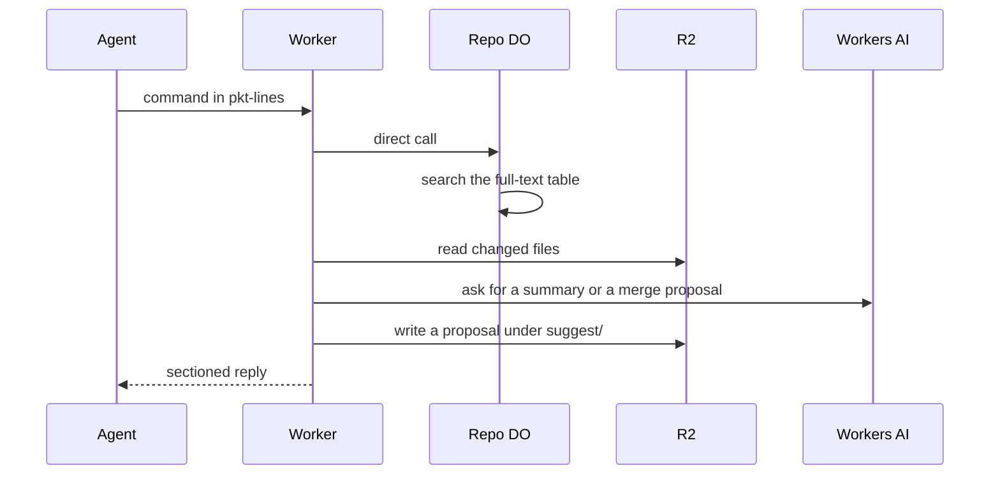

# Agent-native protocol v2 commands (search, explain-diff, suggest-merge)

> Verdict: **lands with caveats** · feasibility 4/5 · reliability 3/5 · correctness 3/5 · effort: weeks
> Read the words in [how-to-read.md](../findings/how-to-read.md). Engineers: [proof](../proofs/agent-native-commands.md) · [review](../reviews/agent-native-commands.md)

## What this idea is

Git is a tool that keeps every version of a set of files, and lets many people share those versions. Git talks to a server with protocol v2. Protocol v2 is the newer, cleaner set of messages git uses to talk to a server. This idea adds three commands to that set: search, explain-diff, and suggest-merge. A normal git client ignores the three new commands. 

An AI agent that knows them can search a repo's files, ask for a plain summary of a change, and ask for a proposed merge. A repository, or repo, is one project's full set of files and their history.

Think of it like this. A restaurant adds three dishes to its menu. Regular guests order what they always order, and the new dishes do not bother them. Guests who read the whole menu can try the new dishes.

## How it works

1. The server's list of features on the first request gains three extra lines. Real git ignores lines it does not know, so clone and fetch keep working. A fetch is getting commits from the server. A clone gets everything for the first time. A commit is one saved version of the files, with a note about what changed.
2. An agent sends the command name to the same web address that a fetch uses, framed as pkt-lines. A pkt-line is git's way of framing a message. Each line starts with four characters that give its length. The agent uses the same login and the same routing as a fetch.
3. The Worker sends the command to the repo's Durable Object with a direct call. Cloudflare Workers are small programs that run on Cloudflare's network close to the user, with no server to manage. A Durable Object, or DO, is a single small program with its own storage that handles one thing at a time. There is one DO for each repo. Think of it like the one librarian who is allowed to update the catalog.
4. The search command runs one query on a full-text table in DO SQLite. DO SQLite is the small database inside each Durable Object. The table is filled after each push with file paths and the first 64 KB of each changed text file. A push is sending your new commits to the server.
5. The explain-diff command finds the files that changed between two commits and reads them from R2. R2 is Cloudflare's large file store. It holds the git objects. An object is one stored item in git. An object is a file's content, a folder listing, or a commit. The Worker builds a list of changed lines, sends the list to Workers AI, and saves the answer in a DO table.
6. The suggest-merge command runs the server's three-way merge as a dry run and never moves a ref. A ref is a name that points at one commit. A branch is a ref. A tag is a ref. A branch is a named line of commits, like a bookmark that moves forward as you save. For each file with a conflict, Workers AI proposes a resolution. The server writes the proposal to R2 as a git file object under "suggest/<repo>/<SHA>". A SHA, or hash, is a fingerprint of an object's content. Two objects with the same content have the same fingerprint.
7. Each reply streams back as named sections separated by pkt-line markers, the same shape as a normal fetch reply.

## What the reviewer decided

The reviewer looks for blockers and caveats. A blocker is a problem that stops the idea from working until it is fixed. A caveat is a limit or a condition. The idea works, but only inside this limit. The reviewer's verdict is "Lands with caveats."

| Score | Out of 5 |
|---|---|
| Feasibility | 4 |
| Reliability | 3 |
| Correctness | 3 |

Lands with caveats means the following. The idea is sound and can be built. The proof has one or more problems that must be fixed first, and the reviewer described each fix. Think of it like a flight with a runway that needs some repairs before you land. The runway is there. The repairs are known.

For this idea, the protocol extension itself is correct. Real git ignores the extra lines, so clone and fetch keep working. The request and reply framing copies the fetch command exactly. No ref is ever written, so there is no path where two records disagree. Every Cloudflare feature used is GA. GA, or generally available, means a Cloudflare feature that is finished and supported, not a preview.

But as written, the proof delivers a weaker version of the goal. The merge proposal cannot be fetched. The merge base is a stub. The search index drifts after a forced push. And the AI model's size limit is not handled. Each fix takes days, and none needs a new Cloudflare feature.

The reviewer found three blockers and seven caveats. The reviewer expects weeks of work in total. One caveat mentions the janitor. A janitor, also called a sweep or GC, is a background task that deletes files nobody points to anymore. One fix mentions the pack builder. A packfile, or pack, is one bundle that holds many objects, squeezed to save space.

## Problems that must be fixed first

### Problem 1: The merge proposal cannot be fetched

**What goes wrong.** The proposal is written to R2 under "suggest/<repo>/<SHA>". A fetch looks up a wanted SHA under "objects/<SHA>". So a normal "git fetch origin <SHA>" fails with the error "not our ref". Even with the right key, there is a second gap. Protocol v2 lets a client fetch an object no ref points at only if the server allows any SHA in a want. The proof never enables that.

**Why it matters.** The headline promise is that the agent can fetch the proposal as a normal object. That promise is false as written. Two separate changes are needed before the promise holds.

**How to fix it.** Write the proposal under "objects/<SHA>", or teach the pack builder a second prefix. Allow any SHA in a want for proposal SHAs.

### Problem 2: The merge base is a stub

**What goes wrong.** A three-way merge needs the common ancestor of the two commits, called the merge base. The proof's merge base function returns an empty string. So the suggest-merge command depends entirely on a commit graph in DO SQLite that another idea provides.

**Why it matters.** Without a merge base, the suggest-merge command is only a shape. The whole command waits on the negotiation idea landing first.

**How to fix it.** Build the commit graph from the want and have negotiation idea. Compute the merge base from that graph.

### Problem 3: Large conflicts overflow the AI model

**What goes wrong.** The model used has room for about 8,000 tokens. The suggest-merge command sends the full base, ours, and theirs versions of each conflicting file with no trimming. Any conflict over about 20 KB in total makes the AI call fail. The whole command then returns an error line instead of a partial answer. The explain-diff command trims its input to about 24 KB, which is at the edge of the limit.

**Why it matters.** Real conflicts are often large. One large file kills the command for every file in the merge.

**How to fix it.** Trim the three versions before the AI call. When the content is still too large, report the conflict path with no proposal instead of failing.

## Things to know

- The search table only ever adds rows and has no branch column. After a forced push, search returns dead rows and duplicate paths, and nothing tells the agent which row is live.
- The reply is produced by a background task that is not registered with the Worker. If the Worker is evicted or the agent disconnects, the reply stops with no end marker and the rest of the work is dropped.
- Proposal files in R2 are files nobody points to, and the janitor that cleans them is unwritten. The suggest-merge command also writes to R2 and spends AI credit behind a read-looking address, so scoped tokens must treat the command as a write.
- The explain-diff command reads folder listings and files from R2 before checking its saved answers. So a retry saves only the AI call, not the R2 reads.
- The model usually wraps its output in code fences. So the stored file has a valid SHA but does not hold the merged file content.
- Error lines are sent in the middle of a section stream, unlike git's rule that an error comes first. A parser that copies git's rule will not see them as errors.
- Full-text search on DO SQLite is listed as supported, but the proof never shows a test of it. Test the feature once, or fall back to D1 full-text search.

## How this idea connects to the others

This idea needs [#3 Speak git protocol v2 only, translate v0 at the edge](./protocol-v2-only.md), because the new commands are protocol v2 commands.

This idea needs [#53 The /info/refs?service= entrypoint and pkt-line codec](./info-refs-endpoint.md), because the feature list and the message framing come from that idea.

This idea needs [#2 Refs in DO SQLite, objects in R2](./refs-sqlite-objects-r2.md), because the commands read objects from R2 and refs from the DO.

This idea needs [#6 Two-phase push](./two-phase-push.md), because the search table is filled in the second phase of a push.

This idea needs [#17 Server-side three-way merge in the Worker](./server-side-merge.md), because the suggest-merge command reuses that merge.

This idea needs [#27 Diff API served with R2 range reads](./diff-api-range-reads.md), because the explain-diff command reads changed files the same way.

This idea needs [#56 Want/have negotiation with a commit-graph in SQLite](./want-have-negotiation.md), because the merge base comes from that commit graph.

This idea needs [#26 Search index built on push (D1 FTS / Vectorize)](./search-index-on-push.md), because search moves there once the index outgrows one DO.
