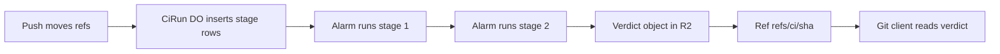

# Push-triggered CI as a DO alarm chain

> Verdict: **lands with caveats** · feasibility 4/5 · reliability 3/5 · correctness 3/5 · effort: weeks
> Read the words in [how-to-read.md](../findings/how-to-read.md). Engineers: [proof](../proofs/alarm-chain-ci.md) · [review](../reviews/alarm-chain-ci.md)

## What this idea is

git is a tool that keeps every version of a set of files, and lets many people share those versions. A repository, or repo, is one project's full set of files and their history. CI, or continuous integration, is a set of automatic checks that run after someone sends new work to the server. This idea runs those checks as a chain of timers inside a small program on Cloudflare. Each timer runs one stage and then sets the next timer, with no separate queue service. The result is stored in the repo itself, so any git client can read it.

Think of it like this. A relay team has one runner on the track at a time. Each runner passes the baton to the next one at a fixed point. If a runner falls, a coach with a stopwatch sends the same runner out again.

## How it works

Some words first. A commit is one saved version of the files, with a note about what changed. A push is sending your new commits to the server. A fetch is getting commits from the server. A clone gets everything for the first time. A branch is a named line of commits, like a bookmark that moves forward as you save.

A ref is a name that points at one commit. A branch is a ref. A tag is a ref. An object is one stored item in git. An object is a file's content, a folder listing, or a commit.

A SHA, or hash, is a fingerprint of an object's content. Two objects with the same content have the same fingerprint. A Cloudflare Worker is one of the small programs that run on Cloudflare's network close to the user, with no server to manage. A Durable Object, or DO, is a single small program with its own storage that handles one thing at a time. There is one DO for each repo. Think of it like the one librarian who is allowed to update the catalog.

DO SQLite is the small database inside each Durable Object. An alarm is a timer inside a Durable Object. A DO has only one alarm at a time. The input gate is the rule that a Durable Object handles one request at a time while it waits on its own storage. The gate opens when the DO waits on the network instead.

R2 is Cloudflare's large file store. It holds the git objects. Compare-and-swap, or CAS, means change a value only if it still has the value you expect. If someone changed it first, do nothing and report it. Sideband is a way to send two kinds of data in one stream, like a main channel and a progress channel. A janitor is a background task that deletes files nobody points to anymore.

1. The repo DO moves the refs for a push. Before it answers the client, it calls a second DO named CiRun for that commit.
2. CiRun inserts one row per stage into a table named stages in DO SQLite. Then CiRun sets its alarm to now.
3. The alarm claims the next pending stage and marks it running. The alarm sets a second timer as a watchdog, in case the program dies.
4. The stage runs in a Worker reached through a service binding. The stage reads the commit's files from R2 by fingerprint.
5. The alarm records the result. A failed stage is retried up to a fixed number of attempts.
6. When a stage passes, the alarm sets the timer again for the next stage.
7. After the last stage, CiRun writes the verdict as a real git object into R2.
8. CiRun asks the repo DO to point the ref refs/ci/ plus the commit fingerprint at the verdict, with a CAS update.
9. Any git client can now read the verdict with a normal ls-remote or fetch of that ref.

## What the reviewer decided

The verdict is "Lands with caveats".

| Score | Value |
|---|---|
| Feasibility | 4 out of 5 |
| Reliability | 3 out of 5 |
| Correctness | 3 out of 5 |

The idea is sound and can be built. The proof has one or more problems that must be fixed first, and the reviewer described each fix. Think of it like a flight with a runway that needs some repairs before you land. The runway is there. The repairs are known.

A caveat is a limit or a condition. The idea works, but only inside this limit. GA, or generally available, means a Cloudflare feature that is finished and supported, not a preview. For this idea, the chain mechanics are correct. A running row, a watchdog timer, and a bounded number of attempts keep the chain alive. Every DO and R2 feature used is GA, and a normal git client can read the verdict ref.

But the central claim that a CI run can never be lost is false as written. The push and the CI start live in two different DOs, and the end step can leave a run stuck. Both fixes need an outbox row and a change of order.

## Problems that must be fixed first

A blocker is a problem that stops the idea from working until it is fixed.

### Problem 1: The CI run is not started in the same step as the ref move

**What goes wrong.** The ref move is saved in the repo DO. The stage rows and the alarm are saved in a separate CiRun DO. There is no shared transaction across two DOs. The repo DO can die after the ref move and before CiRun answers. The call to CiRun can also fail at that moment. In both cases no CI run is ever scheduled for that commit.

**Why it matters.** The proof promises that CI cannot be lost between the ref move and the job start. As written, a crash at the wrong moment loses the run in silence. The user sees the push succeed and waits for a verdict that never comes.

**How to fix it.** Insert an outbox row for the commit in the repo DO, in the same transaction as the ref move. Let the repo DO's own alarm read the outbox and call CiRun with retries. A repeated start for the same commit is safe, because CiRun is named by the commit.

### Problem 2: The last step deletes the alarm too early

**What goes wrong.** The finish step first deletes the alarm. Then it writes the verdict object to R2 and asks the repo DO to set the ref. If either of those two calls fails, no alarm is pending and no ref is set.

**Why it matters.** The run is stuck for ever with all stages marked ok and no verdict. The verdict object can sit in R2 with nothing pointing at it. Whether the runtime retries the alarm after a delete is not specified, so the code cannot rely on it.

**How to fix it.** Make "publish verdict" a final stage row like the others. Delete the alarm only after the repo DO confirms the ref update.

## Things to know

- Whether the watchdog alarm can fire while a stage runs in another Worker is unverified. A stage longer than 90 seconds runs twice, so raise the watchdog above the stage timeout or tag each attempt.
- The same commit pushed to two refs shares one run, and the run records only the first ref. A re-run is impossible as written, because the rows exist and the CAS expects no old value.
- A stage is a Worker, with no shell and no Linux. User-written code needs the paid Workers for Platforms product or the hooks idea.
- Verdict objects are new keys under objects in R2, and the janitor must accept them. The git object helpers and the set-ref endpoint are assumed from other ideas.
- The push path uses the older protocol with sideband, so the status lines must be wrapped in the main channel. The CiRun call must not delay the answer.

## How this idea connects to the others

This idea needs [#1 One Durable Object per repo as the ref authority](./repo-do-ref-authority.md) to move refs and to set the verdict ref.
This idea needs [#2 Refs in DO SQLite, objects in R2](./refs-sqlite-objects-r2.md) for the tables and the object store.
This idea needs [#5 Content-addressed R2 keys](./content-addressed-r2-keys.md) so a stage can read the commit's files by fingerprint.
This idea needs [#6 Two-phase push](./two-phase-push.md) for the push that ends with the ref move.
This idea needs [#23 Pre/post-receive hooks as Workers via service bindings](./hooks-as-workers.md) to run user-written stages.
