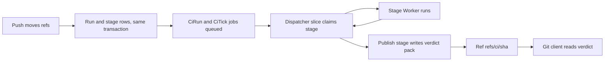

# Push-triggered CI as a DO alarm chain

> Verdict: **lands with caveats** · feasibility 4/5 · reliability 3/5 · correctness 3/5 · effort: weeks
> Read the words in [how-to-read.md](../findings/how-to-read.md). Engineers: [proof](../proofs/alarm-chain-ci.md) · [review](../reviews/alarm-chain-ci.md)

## What this idea is

git is a tool that keeps every version of a set of files, and lets many people share those versions. A repository, or repo, is one project's full set of files and their history. CI, or continuous integration, is a set of automatic checks that run after someone sends new work to the server. This idea runs those checks as background jobs inside the repo's own small program on Cloudflare. A shared timer drives the stages one at a time, with no separate queue service. The result is stored in the repo itself, so any git client can read it.

Think of it like this. A relay team has one runner on the track at a time. Each runner passes the baton to the next one at a fixed point. If a runner falls, a coach with a stopwatch sends the same runner out again.

## How it works

The second pass writes the design in Rust, against one shared contract that every idea in this set follows. A Cloudflare Worker is one of the small programs that run on Cloudflare's network close to the user, with no server to manage. Wasm, or WebAssembly, is a way to run code from other languages, such as Rust, inside a Worker.

The contract gives each repo one Durable Object, one alarm, and one shared dispatcher for background work. A job is one unit of background work, and the dispatcher runs jobs in short slices. The dispatcher is the only code allowed to set the alarm. The separate CI object from the first pass cannot exist under this rule. CI becomes two job kinds and two tables inside the repo's own Durable Object.

Some more words. A commit is one saved version of the files, with a note about what changed. A push is sending your new commits to the server. A fetch is getting commits from the server. A clone gets everything for the first time. A branch is a named line of commits, like a bookmark that moves forward as you save.

A ref is a name that points at one commit. A branch is a ref. A tag is a ref. An object is one stored item in git. An object is a file's content, a folder listing, or a commit.

A SHA, or hash, is a fingerprint of an object's content. Two objects with the same content have the same fingerprint. A Durable Object, or DO, is a single small program with its own storage that handles one thing at a time. There is one DO for each repo. Think of it like the one librarian who is allowed to update the catalog.

DO SQLite is the small database inside each Durable Object. An alarm is a timer inside a Durable Object. A DO has only one alarm at a time. The input gate is the rule that a Durable Object handles one request at a time while it waits on its own storage. The gate opens when the DO waits on the network instead.

R2 is Cloudflare's large file store. It holds the git objects. Compare-and-swap, or CAS, means change a value only if it still has the value you expect. If someone changed it first, do nothing and report it.

A service binding is a direct call from one Worker to another. A lease is a timestamp that says how long a claimed stage can run before another driver takes the stage. A janitor is a background task that deletes files nobody points to anymore.

1. The repo DO moves the refs for a push. In the same transaction, a new step writes one run row, one stage row per stage, and a final publish stage.
2. The same step queues two jobs, named CiRun and CiTick. Both are drivers that scan the whole stage table. The dispatcher arms the alarm after the transaction.
3. A slice claims the next open stage, runs the stage, records the result, and loops while the slice's budget lasts.
4. The claim marks the stage running, adds one to the attempt count, and stamps the lease. If the program dies mid-stage, a later slice claims the stage again after the lease expires.
5. A normal stage runs in a Worker reached through the service binding. The stage reads the commit's files through the repo's public fetch endpoint.
6. The result write is a CAS on the attempt count, so a late answer from an old attempt is dropped. A failed stage retries up to three attempts.
7. The last stage publishes the verdict. The publish step writes a one-object pack to R2, an object row, and the ref refs/ci/ plus the commit fingerprint, all in one step.
8. The janitor collects the dead pack row that a killed publish leaves behind.
9. Any git client reads the verdict with a normal ls-remote or fetch of that ref. A rerun route resets the rows when a new run is wanted.

## What the reviewer decided

The reviewer looks for blockers and caveats. A blocker is a problem that stops the idea from working until it is fixed. A caveat is a limit or a condition. The idea works, but only inside this limit.

The verdict is Lands with caveats.

| Score | Value |
|---|---|
| Feasibility | 4 out of 5 |
| Reliability | 4 out of 5 |
| Correctness | 4 out of 5 |

| Score | First pass | Second pass |
|---|---|---|
| Feasibility | 4 out of 5 | 4 out of 5 |
| Reliability | 3 out of 5 | 4 out of 5 |
| Correctness | 3 out of 5 | 4 out of 5 |

Lands with caveats. The idea is sound and can be built. The proof has one or more problems that must be fixed first, and the reviewer described each fix. Think of it like a flight with a runway that needs some repairs before you land. The runway is there. The repairs are known.

The second pass improved. Reliability moved from 3 to 4 and correctness moved from 3 to 4. Feasibility stayed at 4, and the verdict stayed the same. Both first-pass blockers are closed by the shape of the design, not by a check at run time. The run rows ride the same transaction that moves the refs, and publishing the verdict is one stage row like the others. The old claim that a run can never be lost is now literally true, with no gap between the ref move and the run rows.

What remains is smaller. One narrow stall in the job repair path can still freeze CI for a repo, and the fix belongs to the shared dispatcher. A rerun can mix a late answer into a fresh attempt. The rest is a set of mechanical signature fixes against the sibling ideas.

## What changed in the second pass

- The CI run was not started in the same step as the ref move: fixed. The run rows and both job rows are statements inside the same transaction as the ref moves. If the transaction commits, the refs moved and the run is queued. If the transaction fails, neither happened.
- The last step deleted the alarm too early: fixed. There is no alarm delete and no call across objects. Publishing the verdict is the last stage row, claimed and recorded by the same loop. The pack row is written before the upload, so every crash point leaves work to redo or a row the janitor can collect.
- The watchdog could fire while a stage still ran in another Worker: fixed. The lease now sits above the stage's network timeout, and the result write checks the attempt count.
- The same commit pushed to two refs shared one run, and a re-run was impossible: fixed. The run row keys on the commit fingerprint, so the second push shares the run on purpose. A rerun route resets the rows, and the publish step replaces the old verdict.
- A stage is a Worker, with no shell and no Linux: still open. This is the honest shape of the idea. User-written code still needs the paid Workers for Platforms product or the hooks idea.
- Verdict objects were loose keys the janitor had to tolerate, with helpers assumed from other ideas: fixed. The verdict is a normal pack with an object row, written by the shared pack writer. The ref write is local SQL in the same DO.
- The watchdog could run one stage twice in the same program: fixed. The claim admits only the lowest open stage of a run and lets exactly one driver win. Stages must be safe to repeat.

## Problems that must be fixed first

### Problem 1: Both driver jobs stuck running can stall CI for ever

**What goes wrong.** The repair for a job row orphaned by a kill sits inside the claim step. Once both driver rows are marked running, no path reaches the claim step. Queue calls are dropped against running rows, the dispatcher selects only queued rows, and the boot repair covers dead rows only.

**Why it matters.** The trigger is narrow. An isolate kill while two dispatches overlap during a stage's network wait can strand both rows. After that, CI for the repo stops for ever, with no exit short of manual SQL.

**How to fix it.** The fix belongs in the shared dispatcher or in the queue step, which must refresh a stale running row. This is a gap in the foundation that the proof exposes, not one the proof creates.

### Problem 2: The module does not compile against the sibling ideas

**What goes wrong.** Several helpers the module calls are private in the repo DO code. The bucket helper is undefined. The pack writer call uses four arguments where the sibling idea uses three. The budget helper is spelled a third way across the proofs.

**Why it matters.** Rust code with mismatched signatures does not compile. The whole crate stays broken until one side of each pair changes.

**How to fix it.** Mark the helpers visible inside the crate, add one bucket constructor, and pick one signature per shared function. All the fixes are mechanical.

## Things to know

- Each run drains through at most two driver jobs on the single repo DO. The first pass gave each run its own object and timer. Order inside one run is unchanged.
- While a stage waits on the network, the input gate is open, so two drivers can run at once. The claim admits only the lowest open stage of a run, so stage order is kept.
- The rerun route resets the attempt count to zero. A late answer from an old attempt can then be recorded against the fresh attempt. A unique attempt token fixes this.
- A stage list of 256 or more entries collides with the publish stage at position 255. The error then fails the whole push. Cap the list at 254, or reject the list at write time.
- A failing stage retries only after the stage's lease expires. Three attempts can take about four and a half minutes before the stage is marked failed.
- The budget helper may not count the publish step's two or three network calls, so the per-slice limit can be under-counted.
- Several parts are unverified at run time. These are a service-binding call from inside a DO and the request body path. Also unverified are real R2 multipart uploads, subrequest limits inside a DO, and the platform's own alarm retry.
- The sweep that marks reachable objects does not say what happens at a ref that points at a blob. The verdict pack can be collected while its ref still points at the pack, unless a one-line fix lands.
- The rerun route's own re-arm of the alarm is not shown in the proof. The push route's re-arm is relied on and is correct.
- The refs/ci/ space is an ordinary namespace. A user can delete or overwrite a verdict with a mirror push, and a mirror clone copies the verdicts.

## How this idea connects to the others

- The ref moves, the commit transaction, and the new schedule step come from [#1 One Durable Object per repo as the ref authority](./repo-do-ref-authority.md).
- The tables, the object row, the pack writer, and the R2 keys come from [#2 Refs in DO SQLite, objects in R2](./refs-sqlite-objects-r2.md).
- This idea needs [#6 Two-phase push](./two-phase-push.md) for the push that ends with the ref moves.
- This idea needs [#4 Packfile parsing in a Worker with a streaming inflater](./streaming-pack-parser.md) for the pack format the verdict writer produces.
- The dispatcher, the jobs table, and the single alarm come from [#55 GC and repack as a DO alarm](./gc-and-repack-alarm.md).
- This idea needs [#23 Pre/post-receive hooks as Workers via service bindings](./hooks-as-workers.md) to run user-written stages.
- The stage's read credential comes from [#54 Auth and multi-tenancy: owner/repo routing to DO ids](./auth-and-multitenancy.md).
