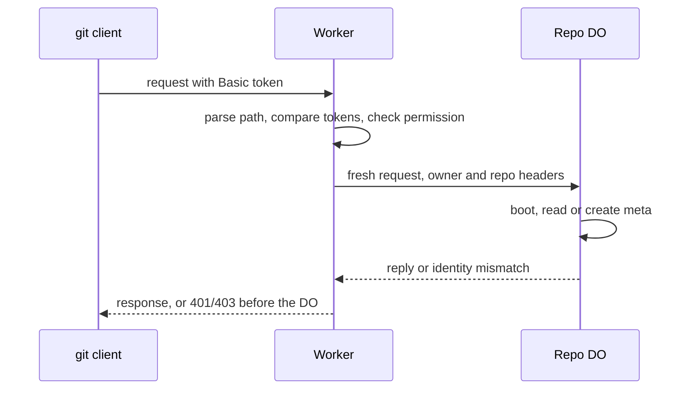

# Auth and multi-tenancy: owner/repo routing to DO ids

> Verdict: **lands with caveats** · feasibility 5/5 · reliability 4/5 · correctness 4/5 · effort: days
> Read the words in [how-to-read.md](../findings/how-to-read.md). Engineers: [proof](../proofs/auth-and-multitenancy.md) · [review](../reviews/auth-and-multitenancy.md)

## What this idea is

git is a tool that keeps every version of a set of files, and lets many people share those versions. A repository is one project's full set of files and their history. A commit is one saved version of the files, with a note about what changed. Many people and many repositories share one service. This idea decides who is allowed to read or write each repository, and keeps each repository's data apart from all the others. In the second pass, two shared tokens replace per-user accounts, and each repository's storage stays apart under its own random id.

Think of it like this. An apartment building has one front door with a card reader. A card proves you may come in. Each apartment still has its own lock, so no apartment can open another's door.

## How it works

The second pass writes the design in Rust, against one shared contract that every idea in this set follows. The contract drops the signed tokens and the per-repository role table of the first pass. Two tokens now cover the whole service, a read token and a write token.

1. Cloudflare Workers are small programs that run on Cloudflare's network close to the user, with no server to manage. Wasm, or WebAssembly, is a way to run code from other languages, such as Rust, inside a Worker. A request arrives at a Worker. One shared parser reads the owner name and the repository name from the web address. A name may hold only letters, digits, dot, underscore, and dash, up to 64 characters. The parser strips a `.git` ending and keeps the case, and every other shape gets a 404.
2. git sends a username and a password in a Basic header. The Worker compares the password against both tokens in constant time, with no storage read. A missing, malformed, or wrong header gets a 401. The 401 carries a challenge header that makes git ask for credentials and retry once. A second 401 ends the attempt.
3. Push means sending your new commits to the server. Fetch means getting commits from the server. A clone gets everything for the first time. The checks run in a fixed order: path shape first, then the credential, then the permission. A read token on a push route gets a 403, which git treats as final.
4. A Durable Object, or DO, is a single small program with its own storage that handles one thing at a time. There is one DO for each repo. Think of it like the one librarian who is allowed to update the catalog. Only after all three checks does the Worker look up the DO. A caller with no token never wakes a DO and never learns whether a repository exists.
5. The same name always finds the same DO, from anywhere in the world. The Worker sends the DO a fresh request that carries exactly two headers, the owner and the repository. No client header reaches the DO, not even the token.
6. The first call inside every DO request is boot. DO SQLite is the small database inside each Durable Object. Boot creates the tables once, then reads a small table named meta. On the first authenticated request, boot writes the identity rows in one unbroken step: a fresh random repository id, the owner, the repository, and a few counters. The same step enqueues the janitor job. A janitor is a background task that deletes files nobody points to anymore.
7. From then on, meta is the source of truth for the repository's identity, and a header that disagrees with meta is an error. R2 is Cloudflare's large file store. It holds the git objects. An object is one stored item in git. An object is a file's content, a folder listing, or a commit. Every R2 key starts with the repository id from meta, so no stored name comes from the web address.
8. For a large push, git first sends a probe request whose body is one flush line. The sibling push module answers the probe with a 200, so the real body streams after auth is settled.
9. Before an early answer on a POST, the Worker reads up to 1 MiB of the body and discards the bytes.
10. Every error becomes a status code at the edge. On a POST the error travels as one framed error line in git's message format. On a GET the error travels as plain text. The internal message of a 500 goes to the Worker's log and never to the client.

## What the reviewer decided

The reviewer looks for blockers and caveats. A blocker is a problem that stops the idea from working until it is fixed. A caveat is a limit or a condition. The idea works, but only inside this limit.

The verdict is Lands with caveats.

| Score | Value |
|---|---|
| Feasibility | 5 of 5 |
| Reliability | 4 of 5 |
| Correctness | 4 of 5 |

| Score | First pass | Second pass |
|---|---|---|
| Feasibility | 5 of 5 | 5 of 5 |
| Reliability | 4 of 5 | 4 of 5 |
| Correctness | 4 of 5 | 4 of 5 |

Feasibility asks if Cloudflare can run the idea today. Reliability asks if the idea keeps data safe when things fail. Correctness asks if the idea does what its title says.

Lands with caveats. The idea is sound and can be built. The proof has one or more problems that must be fixed first, and the reviewer described each fix. Think of it like a flight with a runway that needs some repairs before you land. The runway is there. The repairs are known.

For this idea, the second pass held all three scores flat and kept the same verdict. Even so, the review calls the new design a real step forward. Every first-pass caveat and interop finding is now closed by a line of code the reviewer can point at. The two shared tokens remove the signed-token code and the per-repository role table. The order of checks makes the existence leak impossible by construction, not by a test.

What remains is small. Two contract slips are the only blockers, and the review calls both one-line fixes. The rest is missing imports, one lint rule, and one status code to write back into the contract. The reviewer still expects days of work.

## What changed in the second pass

- The anonymous existence leak: fixed. The route answers 404 only for a malformed path and 401 for every other request without a token. No Durable Object wakes and no storage is read, so a stranger learns nothing about which names exist.
- Two code paths could form the DO name differently: fixed. One parser reads the owner and repository names and forms the DO name for the whole crate. The sibling proofs are claimed to route through the same code, which the reviewer could not check from here.
- A per-owner legal region needed a lookup before routing: fixed. The contract has no regions at all, so the name alone decides the DO. Data residency stays out of scope.
- Schema creation ran on every request: fixed. The constructor now touches no storage, and boot runs the migration only after the edge checked the token. A caller with a token can still create a repository by naming it.
- A rejected call to the DO surfaced as an unhandled error page: fixed. Every platform error now maps to a clean status code, and the internal message of a 500 goes to the log only.
- The username had to match the name inside the token: fixed. The code checks only the password. The username becomes a label in the push log, never a credential.
- The claim that git cannot resend a streamed push body was wrong: fixed. The proof now describes git's probe request correctly. Answering that flush-only request with a 200 is a requirement placed on the sibling push idea, not code here.
- Bearer tokens were refused as anonymous: fixed. The refusal is now a documented limit. A Bearer header gets a 401 with a Basic challenge, the same as any other bad credential.
- A malformed Authorization header gave a 500: fixed. Every decode step now returns a 401 instead of throwing.
- Renames, transfers, team roles, single sign-on, and instant revocation were out of scope: partly fixed. Rotating the write token now revokes every writer at once, which covers instant revocation. The rest stays out of scope.

## Problems that must be fixed first

### Problem 1: A second property lookup in the DO module fails the contract scan

**What goes wrong.** The helper that draws the random repository id reaches the crypto object through a generic property lookup named `Reflect::get`. The contract allows exactly one such lookup in the whole DO module, the cross-check of the DO's own name inside boot. A second lookup in the same file fails the contract's automatic scan.

**Why it matters.** The scan exists so the DO decides nothing from the name baked into its own id. The code still builds, but the crate fails its contract check until the extra call moves. Each new exception would weaken the rule.

**How to fix it.** Move the random-id helper into the store module, or reach the crypto object through the worker scope binding instead of the lookup. The review calls this a fix of minutes.

### Problem 2: A dead janitor job never comes back

**What goes wrong.** Boot enqueues the janitor job only in the branch that creates the meta table. The contract asks for the janitor to be enqueued at every boot when the job is absent. After eight failed slices a job row is marked dead. The enqueue call ignores dead rows, so nothing ever creates the job again.

**Why it matters.** The janitor is the only task that deletes the leftover files of dead pushes from R2. With the job gone, the leftovers stay forever and keep billing. The review also warns that a crash can leave a queued job with no timer behind it. Only the same fix brings the timer back.

**How to fix it.** Call enqueue on every boot, not only on the first one. The deduplication inside enqueue turns the extra call into one cheap check.

## Things to know

- The service now knows what a caller may do, not who the caller is. Every reader shares one read token and every writer shares one write token. Per-user and per-repository permissions move to a later idea.
- A caller with the read token can still create a repository by naming it. The first authenticated request creates the meta rows and the janitor job. A create step and an exists check are planned for the next wave. Anonymous callers cannot trigger this.
- The drain of up to 1 MiB before an early answer rests on a misread log line. The logged failure was a read after the response, not a restart on an unread body. The drain is harmless but unproven, so drop it or measure again.
- The 409 status for a conflict is not yet in the contract's status table and must be written back. The sibling push code must also turn a late conflict into a 200 report, or git prints a raw HTTP 409.
- Several parts are unverified at run time. These are the reading of the stored tokens, the base64 crate on Wasm, the path to the crypto object, and the name cross-check conversion. A missing token binding shows up as a 500 on the first request, not as an error at deploy time.
- The boot file misses several imports and uses two helpers that sit outside the contract. The auth module reads client bytes but is missing from the contract's strictest lint list. Both are compile-level fixes, not design changes.
- The constant-time compare runs for the length of the longer token, so the token's length leaks. With the 1 KiB cap on the header, the review calls this noise.
- A token rotated while a push streams does not stop that push. The credential is checked once at the start, the same rule as the first pass and as GitHub.
- The Worker cannot refuse a token sent over plain HTTP. The site must force HTTPS for every request.

## How this idea connects to the others

This idea needs [#1 One Durable Object per repo as the ref authority](./repo-do-ref-authority.md), which owns the DO that boot runs inside and the receive-pack code that must answer git's probe request.

This idea needs [#3 Speak git protocol v2 only, translate v0 at the edge](./protocol-v2-only.md), which owns the wire module that frames the error line on a POST.

This idea needs [#6 Two-phase push](./two-phase-push.md), whose code must turn a conflict after the header into a 200 report with an ng line per ref.

Per-user and per-repository grants wait for [#28 Rate-limited, token-scoped remote URLs](./scoped-token-remotes.md), which takes over the role table this idea no longer builds.
