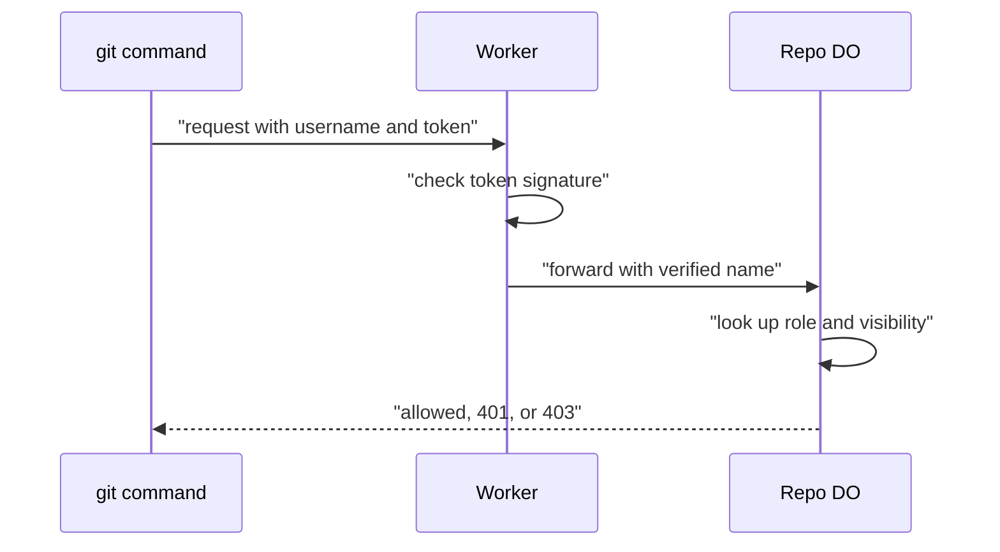

# Auth and multi-tenancy: owner/repo routing to DO ids

> Verdict: **lands with caveats** · feasibility 5/5 · reliability 4/5 · correctness 4/5 · effort: days
> Read the words in [how-to-read.md](../findings/how-to-read.md). Engineers: [proof](../proofs/auth-and-multitenancy.md) · [review](../reviews/auth-and-multitenancy.md)

## What this idea is

git is a tool that keeps every version of a set of files, and lets many people share those versions. A repository is one project's full set of files and their history. Many people and many repositories share one service. This idea decides who is allowed to read or write each repository, and keeps each repository's data apart from all the others. A signed token proves who you are, and a small table inside the repository's own storage says what you are allowed to do.

Think of it like this. An apartment building has one front door with a card reader. Your card proves who you are. Each apartment has its own lock and its own list of people who are allowed in.

## How it works

1. Cloudflare Workers are small programs that run on Cloudflare's network close to the user, with no server to manage. A Worker reads the owner name and the repository name from the web address.
2. git sends a username and a token with the request. The token is signed with a secret key. The Worker checks the signature with built-in crypto code, and needs no storage read to do that.
3. A commit is one saved version of the files, with a note about what changed. Push means sending your new commits to the server. If the request is a push and there is no valid token, the Worker answers 401 at once. git then asks the user for credentials and tries again.
4. A Durable Object, or DO, is a single small program with its own storage that handles one thing at a time. There is one DO for each repo. Think of it like the one librarian who is allowed to update the catalog. The Worker lowercases the owner and repository names, and uses that name to find the DO. The same name always finds the same DO, from anywhere in the world.
5. DO SQLite is the small database inside each Durable Object. The DO holds a table of people and their roles in DO SQLite. The DO also holds one row that says if the repository is public or private.
6. Fetch means getting commits from the server. A clone gets everything for the first time. For a fetch, the DO allows everyone into a public repository, and allows people with a role into a private one. For a push, the DO allows only the write and admin roles.
7. The DO answers 401 when there was no token, and 403 when the token was valid but the person is not allowed. git treats 403 as final, and treats 401 as a request for a password.
8. R2 is Cloudflare's large file store. It holds the git objects. An object is one stored item in git. An object is a file's content, a folder listing, or a commit. Each repository has its own DO database and its own folder in R2, so one repository cannot reach another repository's data.

## What the reviewer decided

The reviewer decided that this idea lands with caveats.

| Score | Value |
|---|---|
| Feasibility | 5 of 5 |
| Reliability | 4 of 5 |
| Correctness | 4 of 5 |

Feasibility asks if Cloudflare can run the idea today. Reliability asks if the idea keeps data safe when things fail. Correctness asks if the idea does what its title says.

Lands with caveats. The idea is sound and can be built. The proof has one or more problems that must be fixed first, and the reviewer described each fix. Think of it like a flight with a runway that needs some repairs before you land. The runway is there. The repairs are known.

A blocker is a problem that stops the idea from working until it is fixed. A caveat is a limit or a condition. The idea works, but only inside this limit. For this idea, the reviewer listed no blockers and nine caveats. Several caveats come with a fix that the reviewer asks for.

GA means a Cloudflare feature that is finished and supported, not a preview. Every feature the proof uses is GA. The DO is the only place that decides access, and every write to its tables is safe to repeat. The 401 and 403 answers land where a normal git command expects them. The reviewer expects the fixes to take days.

## Things to know

- A person with no token gets 401 for a private repository and 403 for a repository that does not exist. So anyone can find out which private repositories exist, which is the opposite of the intent. The fix is to answer 401 in both cases.
- This proof lowercases the owner and repository names and strips the `.git` ending, but the sibling proofs #1 and #53 use the raw names. The same repository can then land in two different DOs, so one shared naming function must be used everywhere.
- A DO placed in a legal region such as the EU has a different id from the same name without a region. So a per-owner region needs a lookup before routing, which breaks the claim that the hot path needs no storage read.
- The proof requires the username to equal the name inside the token. Users whose password helper stored a different username get a fatal authentication failure, so ignore the username, as GitHub and GitLab do.
- The proof claims that git cannot resend a large push body after a late 401, and that claim is wrong. git first sends a probe request whose body is only a flush line, and the push handler must answer that probe with 200.
- The DO creates its tables on every request, even for a repository that does not exist. That fills billed storage for every name a stranger tries. Create tables only when the repository is created, or keep a list of real names at the edge.
- KV is Cloudflare's small, fast, world-wide store for simple values. A token ban kept in KV takes up to 60 seconds to reach everywhere. The access check happens once at the start, so a ban that lands mid-push does not stop that push.
- A failed DO call or a broken Authorization header ends in a 500 answer instead of a clean 502 or 401. Wrap the create step in one transaction, and load the signing key once at startup.
- Renames, transfers, team roles, single sign-on, and Bearer tokens are out of scope. Each one adds a lookup to a path the proof calls lookup-free.

## How this idea connects to the others

This idea needs [#1 One Durable Object per repo as the ref authority](./repo-do-ref-authority.md), which is the DO that holds the roles table.

This idea needs [#53 The /info/refs?service= entrypoint and pkt-line codec](./info-refs-endpoint.md), which is the first request, where the 401 answer must go.
