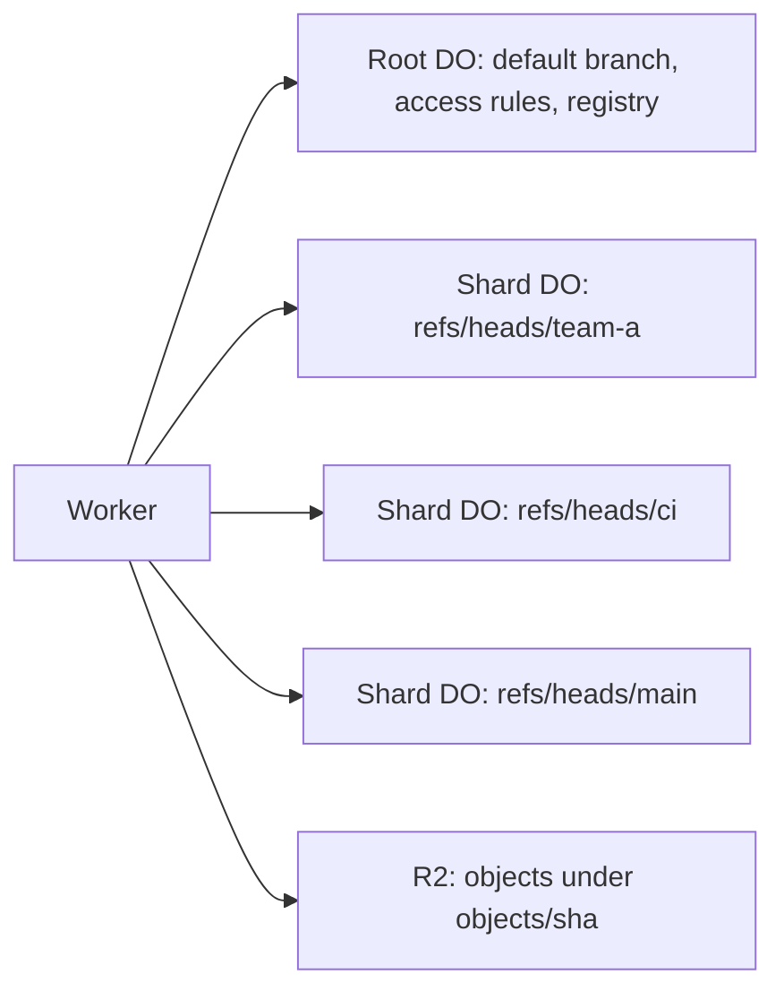

# Branch-level Durable Objects for monorepos

> Verdict: **risky** · feasibility 4/5 · reliability 3/5 · correctness 2/5 · effort: weeks
> Read the words in [how-to-read.md](../findings/how-to-read.md). Engineers: [proof](../proofs/branch-level-dos.md) · [review](../reviews/branch-level-dos.md)

## What this idea is

Git is a tool that keeps every version of a set of files, and lets many people share those versions. A repository, or repo, is one project's full set of files and their history. A commit is one saved version of the files, with a note about what changed.

A branch is a named line of commits, like a bookmark that moves forward as you save. A ref is a name that points at one commit. A branch is a ref. A tag is a ref.

A push is sending your new commits to the server. A fetch is getting commits from the server. A clone gets everything for the first time. Cloudflare Workers are small programs that run on Cloudflare's network close to the user, with no server to manage.

A Durable Object, or DO, is a single small program with its own storage that handles one thing at a time. There is one DO for each repo. Think of it like the one librarian who is allowed to update the catalog. This idea changes that rule and gives one repo many DOs.

A monorepo is one very large repo that many teams share. In the base design, one DO handles every ref of a repo, so a busy branch makes a quiet branch wait. This idea splits the refs into groups by name prefix, such as refs/heads/team-a, and gives each group its own DO. A reader of a quiet branch then never waits behind a flood of pushes to a busy group.

Think of it like this. A post office with one counter serves everyone in one queue. A post office with one counter per district lets a person from a quiet district skip the long queue.

## How it works

1. A root DO for the repo holds only three things: the default branch, the access rules, and a list of the groups. The list is called the registry.
2. Each group of refs lives in its own shard DO. A shard is one of the many small parts that together hold all the refs. The shard keeps its refs in DO SQLite. DO SQLite is the small database inside each Durable Object.
3. On a push, the Worker reads the list of ref commands. Each command names a ref, the old commit, and the new commit.
4. The Worker unpacks the packfile and writes each object to R2 under a content-addressed key. A packfile, or pack, is one bundle that holds many objects, squeezed to save space. An object is one stored item in git. An object is a file's content, a folder listing, or a commit. R2 is Cloudflare's large file store. It holds the git objects. Content-addressed means stored under its own fingerprint, so the name tells you what is inside.
5. If the push dies before any ref moves, its objects stay in R2 as lost files until a janitor removes them. A janitor, also called a sweep or GC, is a background task that deletes files nobody points to anymore.
6. The Worker sorts the commands by group and calls every needed shard at the same time.
7. Each shard checks that the new tip object exists in R2. Then the shard updates its refs in one database transaction with a compare-and-swap. Compare-and-swap, or CAS, means change a value only if it still has the value you expect. If someone changed it first, do nothing and report it.
8. Each shard returns one ok or ng line per ref. The Worker joins the lines into one status report for the client.
9. On a fetch, the client sends a ref prefix with protocol v2. Protocol v2 is the newer, cleaner set of messages git uses to talk to a server. The Worker routes the request to the one shard that owns that prefix.
10. A fetch with no prefix, or a push advertisement, asks every shard in the registry and merges the lists.

## What the reviewer decided

The reviewer's verdict is Risky.

| Score | Value |
|---|---|
| Feasibility | 4 of 5 |
| Reliability | 3 of 5 |
| Correctness | 2 of 5 |

Risky. The idea can be built. But the proof shows one or more problems the reviewer could not fully solve, or it does a weaker version of the goal. Think of it like a runway you can see on the map, but nobody has checked it for holes.

For this idea, the reviewer says the core mechanism is sound. One DO per group, a CAS in each shard, and shared objects in R2 use only GA features. GA, or generally available, means a Cloudflare feature that is finished and supported, not a preview. A reader who sends a full prefix does skip the busy group, which is the goal.

As written, the proof breaks a normal git clone and a normal git fetch. The proof also drops the default branch from listings and keeps one root DO write on every push. The reviewer sees three blockers. A blocker is a problem that stops the idea from working until it is fixed.

The fixes take weeks, and the proof cannot be tested against real git until the routing is redone. The idea also has caveats. A caveat is a limit or a condition. The idea works, but only inside this limit.

## Problems that must be fixed first

### Problem 1: Normal clone and fetch reach an empty shard

**What goes wrong.** A normal git clone sends the prefixes refs/heads/ and refs/tags/. The proof turns the prefix refs/heads/ into a group name that no push ever creates. The Worker asks one empty DO and returns zero refs. A normal git clone of a full repo would fail and warn that the repo is empty. A normal git fetch with the default settings would fail in the same way.

**Why it matters.** Clone and fetch are the two most common git commands. A server that returns no refs to them is not usable.

**How to fix it.** Match each prefix against the registry. Choose every group whose name starts with the prefix, and every group that is a prefix of the request. Route to one shard only when the prefix names a full group.

### Problem 2: A new group is registered too late

**What goes wrong.** The Worker updates the refs in the shard first, and adds the new group to the registry after that. If the Worker crashes between the two steps, the shard holds refs that the registry does not know about. A clone or a full listing then leaves out every ref in that group. The gap stays until the next push to that group.

**Why it matters.** The listing is wrong in a quiet and lasting way. Nobody gets an error, so nobody knows the refs are missing.

**How to fix it.** Add the group to the registry first. Update the refs in the shard after that.

### Problem 3: One failed shard hides the work of the others

**What goes wrong.** The Worker calls all shards with Promise.all. If one shard throws an error, the whole call fails. The Worker then returns a server error with no status report. But the other shards already moved their refs.

**Why it matters.** The client sees an error and does not know that some refs moved. Real git reports each ref on its own line, so the client always knows what happened.

**How to fix it.** Use Promise.allSettled instead. For each failed shard, return an ng line per ref with the reason. Return the ok lines from the shards that succeeded.

## Things to know

- Every push still waits on the single root DO and on a full listing from every shard. Writers gain nothing per repo, and only readers with a prefix benefit.
- The ceiling for a hot ref does not change. The branch refs/heads/main is still one DO.
- The listing leaves out the default branch and its target, and leaves out peeled tags, even when the client asks for them. A clone cannot pick the default branch.
- One stale old commit makes a shard reject its whole batch, which is stricter than git's per-ref rejection. A push that asks for all-or-nothing across two groups must not be advertised, or needs the two-step commit from idea #48.
- Stray prefixes that git sends, such as main or refs/main, create billable empty DOs on every fetch.
- The check that the tip object exists and the ref update are two separate steps, so a janitor can delete the object between them. A listing across shards also has no single moment in time.

## How this idea connects to the others

This idea splits the single ref owner from [#1 One Durable Object per repo as the ref authority](./repo-do-ref-authority.md) into many owners.

Each shard keeps refs in DO SQLite and objects in R2, as in [#2 Refs in DO SQLite, objects in R2](./refs-sqlite-objects-r2.md).

Objects are stored under their fingerprint, as in [#5 Content-addressed R2 keys](./content-addressed-r2-keys.md).

The push writes objects first and refs second, as in [#6 Two-phase push](./two-phase-push.md).

The Worker unpacks the packfile with [#4 Packfile parsing in a Worker with a streaming inflater](./streaming-pack-parser.md).

Prefix routing needs the ref prefix from [#3 Speak git protocol v2 only, translate v0 at the edge](./protocol-v2-only.md).

The root DO holds the access rules from [#54 Auth and multi-tenancy: owner/repo routing to DO ids](./auth-and-multitenancy.md).

A push across two groups that must succeed or fail as one needs [#48 Cross-repo atomic pushes](./cross-repo-atomic-push.md).
