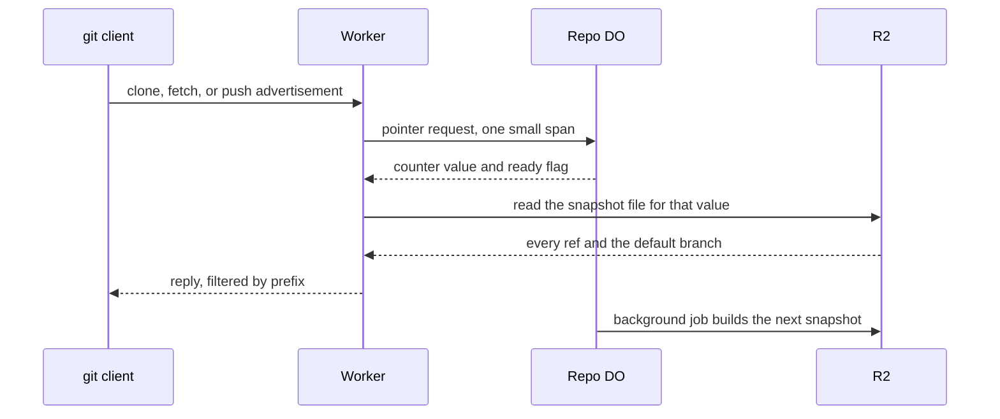

# Branch-level Durable Objects for monorepos

> Verdict: **risky** · feasibility 4/5 · reliability 3/5 · correctness 2/5 · effort: weeks
> Read the words in [how-to-read.md](../findings/how-to-read.md). Engineers: [proof](../proofs/branch-level-dos.md) · [review](../reviews/branch-level-dos.md)

## What this idea is

Git is a tool that keeps every version of a set of files, and lets many people share those versions. A repository, or repo, is one project's full set of files and their history. A commit is one saved version of the files, with a note about what changed.

A branch is a named line of commits, like a bookmark that moves forward as you save. A ref is a name that points at one commit. A branch is a ref. A tag is a ref.

A push is sending your new commits to the server. A fetch is getting commits from the server. A clone gets everything for the first time. Cloudflare Workers are small programs that run on Cloudflare's network close to the user, with no server to manage.

A Durable Object, or DO, is a single small program with its own storage that handles one thing at a time. There is one DO for each repo. Think of it like the one librarian who is allowed to update the catalog. This idea changes that rule and gives one repo many DOs.

A monorepo is one very large repo that many teams share. In the base design, one DO handles every ref of a repo, so a busy branch makes a quiet branch wait. This idea splits the refs into groups by name prefix, such as refs/heads/team-a, and gives each group its own DO. A reader of a quiet branch then never waits behind a flood of pushes to a busy group.

Think of it like this. A post office with one counter serves everyone in one queue. A post office with one counter per district lets a person from a quiet district skip the long queue.

## How it works

The second pass writes the design in Rust, against one shared contract that every idea in this set follows. The contract allows only one DO per repo, so the shard design cannot be written as real code. What the second pass builds instead is the reader half of the idea. The heavy part, turning every ref into bytes for a listing, moves off the DO and into a snapshot file in R2. Wasm, or WebAssembly, is a way to run code from other languages, such as Rust, inside a Worker. DO SQLite is the small database inside each Durable Object. R2 is Cloudflare's large file store. It holds the git objects.

1. One repo DO still owns every ref, every ref update, and a counter that goes up by one on each commit. A push runs the unchanged foundation path, so a writer never sees a shard.
2. Each ref update is a compare-and-swap inside the DO. Compare-and-swap, or CAS, means change a value only if it still has the value you expect. If someone changed it first, do nothing and report it.
3. The expensive part of a monorepo is the listing. git asks for a listing on every clone, every fetch, and at the start of every push.
4. Under the base design the DO turns every ref into bytes for each listing. A repo with hundreds of thousands of refs blocks all other work while the DO does so.
5. After a successful push, the DO queues one background job named AdvBuild. The queue keeps at most one waiting job of this kind, so a burst of pushes causes one build.
6. The job reads the refs table in chunks of 5,000 rows and writes one file that holds the default branch and every ref.
7. The job stores the file in R2 under a name that contains the counter value. The counter in the name means a listing never reads a half-written file.
8. Before the job marks the file ready, the job reads the counter again. If a commit landed during the build, the job discards the file and starts over.
9. When a client asks for a listing, the Worker asks the DO one small question. The question is the current counter value and whether a file for that value is ready.
10. If the file is ready, the Worker reads the file from R2 and writes the reply itself. A prefix such as refs/heads/ is then only a filter over the file, so a normal clone works.
11. If no file is ready, the Worker falls back to the old route and asks the DO for all refs. The repo then behaves exactly as the base design, and the check also queues a build.
12. The job also does janitor work. A janitor, also called a sweep or GC, is a background task that deletes files nobody points to anymore. The job deletes snapshot files older than ten minutes, longer than any request can live. A file over the size limit is never published.

## What the reviewer decided

The reviewer looks for blockers and caveats. A blocker is a problem that stops the idea from working until it is fixed. A caveat is a limit or a condition. The idea works, but only inside this limit.

The verdict is Lands with caveats. The first-pass verdict was Risky.

| Score | Value |
|---|---|
| Feasibility | 4 of 5 |
| Reliability | 3 of 5 |
| Correctness | 3 of 5 |

| Score | First pass | Second pass |
|---|---|---|
| Feasibility | 4 of 5 | 4 of 5 |
| Reliability | 3 of 5 | 3 of 5 |
| Correctness | 2 of 5 | 3 of 5 |

Lands with caveats. The idea is sound and can be built. The proof has one or more problems that must be fixed first, and the reviewer described each fix. Think of it like a flight with a runway that needs some repairs before you land. The runway is there. The repairs are known.

For this idea, the second pass improved. Correctness moved up and the verdict moved from Risky to Lands with caveats. The reason is honest accounting. The proof says plainly that one DO per group cannot exist under the shared contract, and the proof builds the part that can exist instead. Every first-pass blocker is closed. A listing is now exactly one version, which is stronger than the old merge across shards.

The reviewer notes that what remains is closer to idea #13, which replicates refs to the edge, than to the named idea. What keeps the module out of a clean Lands is wiring, not design. Three blockers remain, and the reviewer calls each fix mechanical.

## What changed in the second pass

- A normal clone and fetch reached an empty shard and saw zero refs: fixed. There are no shards to miss. A ref prefix is now a filter over one snapshot that holds every ref.
- A crash between a shard update and the registry update could hide a whole new group from listings: fixed. No registry exists. The listing is the refs table captured under one version.
- One failed shard hid the work of the other shards behind a server error: fixed by the contract modules. One commit step writes one result line per ref, in the order the client sent the commands. There is no fan-out.
- A janitor could delete the tip object between the existence check and the ref update: fixed by the contract modules. Loose object files no longer exist. The check and the update now happen inside one step that cannot be interrupted.
- The listing left out the default branch, its target, and peeled tags: fixed. The default branch rides inside the snapshot file, and the shared writer emits all three.
- The v2 endpoint did not check which command the client sent: fixed by the contract modules. A shared parser now tells a listing request from a fetch request, and fetch still runs in the DO.
- The push advertisement was never shown and could have promised all-or-nothing pushes: fixed. The Worker builds the advertisement at the edge through the shared writer, which never offers the atomic capability.
- Every push waited on a root DO and on a listing from every shard: fixed. There is no root DO. Pushes run the unchanged foundation path, and a listing costs one pointer read plus one R2 read.
- One stale old commit made a whole shard reject its batch: fixed by the contract modules. The commit step does one compare-and-swap per ref, so one stale ref rejects only itself. Atomic across groups is never advertised, so git never asks for atomic.
- A listing merged from many shards had no single moment in time: fixed. The snapshot is exactly one version, checked again before the snapshot is published. A torn listing can never be served.
- Stray prefixes that git sends created billable empty DOs on every fetch: fixed. No per-prefix DO can exist. A stray prefix is now only a filter over the snapshot.
- The ceiling for a hot ref did not change: still open, and now a contract rule. All writes still queue on the one repo DO. What moved off the DO is the listing work, not the write queue.

## Problems that must be fixed first

### Problem 1: The Worker cannot find the snapshot file

**What goes wrong.** The file name in R2 contains the repo id, a random value that only the DO knows. No read route returns the repo id, so the Worker cannot build the file name and cannot open the bucket. A wrong guess fails quietly into the fallback.

**Why it matters.** The fast path is the whole point of the module. As written, the fast path cannot be called, and every listing pays the slow path plus one extra call to the DO.

**How to fix it.** Add the repo id to the pointer answer. Or name the file after the repo name, as the sibling ideas do.

### Problem 2: A queued build can wait for the wrong alarm

**What goes wrong.** When a listing finds no snapshot, the DO queues a build job. The contract says a route that queues a job must reset the DO alarm right after the route finishes. This route does not, and neither do the sibling routes.

**Why it matters.** The build then waits for the next alarm that happens to be set, which can be up to 15 minutes away. Every listing in that window takes the slow path.

**How to fix it.** Declare the alarm reset on the pointer route and make the code actually run the reset, the same fix two other ideas need.

### Problem 3: A repo too large to build retries forever

**What goes wrong.** The build must finish inside one job slice. A repo whose refs do not fit in one slice spends its budget, fails, and gets queued again by the next listing. Each try can block the DO for many seconds. A repo over the file size limit also re-runs the whole build on every push before the build hits the limit again.

**Why it matters.** The oversized monorepos are exactly the repos this module exists to help. For these repos the design is worse than the base design, because every read triggers work that stops the whole DO.

**How to fix it.** Give the build a cursor so the build continues across slices. Or store a flag that marks the repo as too large, so the repo falls back once and stays there.

## Things to know

- The idea as named does not ship. What remains is a snapshot publisher in R2, close to idea #13, so the set could end up with two near-identical pipelines.
- One unlucky kill during the R2 write can stop all builds forever. The job row stays marked running, and the dedup rule then blocks every new build until someone adds a reset.
- Under a heavy write stream the snapshot is never current. Every listing then pays the old slow path plus one extra call to the DO.
- The sweep deletes a file by the age of its build, not by the time since a newer file replaced the old one. The margin still holds, because a request uses the file name moments after the DO hands the name out, and a miss falls back.
- Several parts are unverified at run time. These are the JSON request path to the DO, real R2 put and get behavior, the random id source, and the production subrequest limit. A subrequest is one call from a Worker to another service, such as one read from R2.
- The multi-key delete that the sweep uses does exist in the worker library. The fallback worry in the proof is stale.
- Small cleanups remain. The ref row type should come from the shared module, and the schema version number collides with a sibling idea.

## How this idea connects to the others

The single ref authority, the commit step, and the compare-and-swap come from [#1 One Durable Object per repo as the ref authority](./repo-do-ref-authority.md).

Refs live in DO SQLite and objects live in R2, as in [#2 Refs in DO SQLite, objects in R2](./refs-sqlite-objects-r2.md).

Pushes run the unchanged two-phase path from [#6 Two-phase push](./two-phase-push.md).

The ref prefix on a listing comes from [#3 Speak git protocol v2 only, translate v0 at the edge](./protocol-v2-only.md).

The Worker writes the advertisement and the listing reply through the wire code of [#53 The /info/refs?service= entrypoint and pkt-line codec](./info-refs-endpoint.md).

The repo id and the access rules come from [#54 Auth and multi-tenancy: owner/repo routing to DO ids](./auth-and-multitenancy.md).

The build job runs as one slice of the alarm dispatcher from [#55 GC and repack as a DO alarm](./gc-and-repack-alarm.md).
