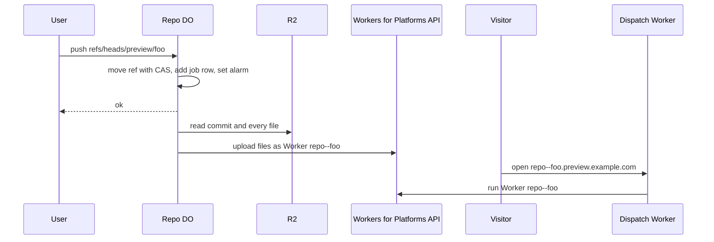

# Branch previews deployed as Workers on push

> Verdict: **lands with caveats** · feasibility 3/5 · reliability 3/5 · correctness 3/5 · effort: weeks
> Read the words in [how-to-read.md](../findings/how-to-read.md). Engineers: [proof](../proofs/branch-preview-workers.md) · [review](../reviews/branch-preview-workers.md)

## What this idea is

Git is a tool that keeps every version of a set of files, and lets many people share those versions. A repository, or repo, is one project's full set of files and their history. A branch is a named line of commits, like a bookmark that moves forward as you save. A commit is one saved version of the files, with a note about what changed. In this idea, a user pushes a branch whose name starts with "preview". The server then puts that branch's files online as a small program with its own web address. Each preview branch gets its own live site within seconds.

Think of it like this. A bakery has a tasting counter by the door. Each time a baker finishes a new recipe, one sample goes on the counter with a name card. Customers can taste each sample without going into the kitchen.

## How it works

Push is sending your new commits to the server. A ref is a name that points at one commit. A branch is a ref. A tag is a ref. A Durable Object, or DO, is a single small program with its own storage that handles one thing at a time. There is one DO for each repo. Think of it like the one librarian who is allowed to update the catalog. DO SQLite is the small database inside each Durable Object. An alarm is a timer inside a Durable Object. A DO has only one alarm at a time. R2 is Cloudflare's large file store. It holds the git objects. An object is one stored item in git. An object is a file's content, a folder listing, or a commit. Cloudflare Workers are small programs that run on Cloudflare's network close to the user, with no server to manage. Workers for Platforms is a paid Cloudflare add-on that lets one account upload and run many separate Workers under one group name.

1. A user pushes to a branch named refs/heads/preview/foo. The repo DO moves the ref with compare-and-swap. Compare-and-swap, or CAS, means: change a value only if it still has the value you expect. If someone changed it first, do nothing and report it.
2. The repo DO adds a job row to a deploys table in DO SQLite and sets an alarm for right now. The push reply goes back to the user at once.
3. The alarm fires. The DO reads the commit and its top folder listing from R2, then walks every subfolder to collect every file.
4. The DO packs the files into one multipart upload and sends it to the Workers for Platforms upload API. The new Worker is named repo--branch.
5. A separate dispatch Worker receives web requests for repo--branch.preview.example.com. The dispatch Worker looks up the named Worker and passes the request to it.
6. When a user deletes the preview branch, the DO queues a job that deletes the named Worker.

## What the reviewer decided

The reviewer's verdict is Lands with caveats.

| Score | Value |
|---|---|
| Feasibility | 3 of 5 |
| Reliability | 3 of 5 |
| Correctness | 3 of 5 |

Lands with caveats. The idea is sound and can be built. The proof has one or more problems that must be fixed first, and the reviewer described each fix. Think of it like a flight with a runway that needs some repairs before you land. The runway is there. The repairs are known.

The proof is the small test program the study wrote to check the idea. The alarm acts as a hook that runs after a push, and the mapping from folder tree to upload is correct. Every feature used is finished and supported by Cloudflare. A normal git push is not affected, because all the work happens after the push reply is sent. But the idea works only for small trees that are already built and ready to run. The proof has two real bugs and one design hole where two branches can overwrite each other. The proof also misses a request limit and a gap in web certificates. The reviewer expects the fixes to take weeks.

## Problems that must be fixed first

A blocker is a problem that stops the idea from working until it is fixed. The reviewer found four blockers.

### Problem 1: Large trees hit the request limit

**What goes wrong.** A subrequest is one call from a Worker to another service, such as one read from R2. Each request may make at most 50 subrequests on the free plan and 10,000 on the paid plan. The alarm reads one object from R2 for each file and folder. So a tree with more than about 1,000 objects cannot be deployed at all. The proof counts only CPU time and never counts subrequests.

**Why it matters.** Many real projects have more than 1,000 files. For those projects the deploy fails every time.

**How to fix it.** Budget the subrequests. Split a large tree across several alarm wakes, or read many objects per subrequest from a pack.

### Problem 2: The ref can move with no deploy job

**What goes wrong.** The ref update and the insert of the deploy job row are two separate calls. If the DO fails between the two calls, the ref has moved but no job row exists. The user has already received "ok" for the push.

**Why it matters.** The preview never updates, and nothing reports the failure. The user believes the preview is live.

**How to fix it.** Write the ref and the job row in one DO SQLite transaction, all at once, or not at all.

### Problem 3: Different branches get the same Worker name

**What goes wrong.** The code builds the Worker name from the repo name and the branch name. The code lowercases the name, replaces every unusual character with a dash, and cuts the name at 63 characters. So preview/Foo, preview/foo_, and preview/foo/ all become the same name. Repo a--b with branch c and repo a with branch b--c also collide.

**Why it matters.** Two unrelated branches overwrite each other's preview. Which one wins depends only on which push came last. Two records disagree about what the preview address shows.

**How to fix it.** Add a short hash of the full names to the end of the Worker name. Or keep a table that maps each branch to a unique Worker name.

### Problem 4: There is no build step

**What goes wrong.** A Worker cannot run a build tool such as npm or a TypeScript compiler. So the pushed tree must already be a ready-to-run module tree with an index.js file at its root.

**Why it matters.** Most real repos need a build step before they can run. For those repos the idea does not deploy the tree at all. The proof delivers a weaker version of the stated idea.

**How to fix it.** Either require users to push a built output folder, or add an external build service that runs before the upload.

## Things to know

A caveat is a limit or a condition. The idea works, but only inside this limit.

- The database call that reads one job row throws an error when the table is empty. So the check for an empty queue never runs, and the alarm fails and retries for nothing. Read the rows as a list and take the first one.
- When the upload API answers with an error, such as a rate limit or a size limit, the job is deleted for good. There is no retry, no delay, and no ref that shows the deploy status.
- The address branch--repo.preview.example.com is two labels below the main domain. Cloudflare's free certificate does not cover that, so the site needs Advanced Certificate Manager or Cloudflare for SaaS. A workers.dev address cannot serve these Workers.
- Files that are not JavaScript are uploaded as plain text, which corrupts images and WebAssembly files. Every file becomes a module and counts against the default limit of 100 modules.
- The proof assumes the push service unpacks each incoming pack into loose objects. A normal git push sends deltas, and the path objects/fingerprint cannot resolve a delta. A delta is a stored object written as "the same as that other object, with these changes".
- The check for a deleted branch looks for 40 zeros, which works only for SHA-1 repos. A SHA, or hash, is a fingerprint of an object's content.
- A broad account API token is stored in the DO, so a leak exposes every preview. The DO memory limit is 128 MB and a Worker upload is capped at 10 MB squeezed. One repo DO runs all deploys one after another.

## How this idea connects to the others

- This idea needs one DO per repo to own the refs, from [#1 One Durable Object per repo as the ref authority](./repo-do-ref-authority.md).
- This idea keeps refs in the DO database and objects in R2, from [#2 Refs in DO SQLite, objects in R2](./refs-sqlite-objects-r2.md).
- This idea reads each object by its fingerprint, from [#5 Content-addressed R2 keys](./content-addressed-r2-keys.md).
- This idea needs pushed packs unpacked by [#4 Packfile parsing in a Worker with a streaming inflater](./streaming-pack-parser.md).
- This idea is one kind of hook that runs after a push, like [#23 Pre/post-receive hooks as Workers via service bindings](./hooks-as-workers.md).
- This idea runs its job from an alarm in the same way as [#14 Push-triggered CI as a DO alarm chain](./alarm-chain-ci.md).
