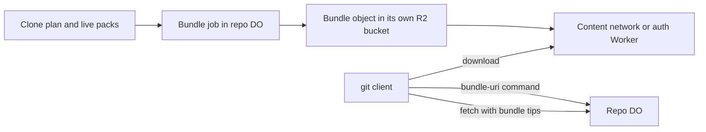

# Bundle-URI support

> Verdict: **lands with caveats** · feasibility 4/5 · reliability 3/5 · correctness 3/5 · effort: days
> Read the words in [how-to-read.md](../findings/how-to-read.md). Engineers: [proof](../proofs/bundle-uri.md) · [review](../reviews/bundle-uri.md)

## What this idea is

git is a tool that keeps every version of a set of files, and lets many people share those versions. A repository, or repo, is one project's full set of files and their history. A git bundle is one file that holds a large part of a repo's history, plus a short list of names at the top. This idea tells the client where to download a ready-made bundle from a fast content network. The client loads the bulk of the history from that file. Then the client asks the server only for what changed since the bundle was made.

Think of it like this. A magazine publisher mails new subscribers a boxed set of all past issues from a warehouse. The editorial office never touches those boxes. From then on, the office sends only the new issues each month.

## How it works

The second pass writes the design in Rust, against one shared contract that every idea in this set follows. This idea is the first module outside that shared foundation. It adds one kind of background job, one new route, one answer to a client command, and one file bucket of its own.

Some words first. A commit is one saved version of the files, with a note about what changed. A push is sending your new commits to the server. A fetch is getting commits from the server. A clone gets everything for the first time.

An object is one stored item in git. An object is a file's content, a folder listing, or a commit. A branch is a named line of commits, like a bookmark that moves forward as you save. A ref is a name that points at one commit. A branch is a ref. A tag is a ref.

A SHA, or hash, is a fingerprint of an object's content. Two objects with the same content have the same fingerprint. A packfile, or pack, is one bundle that holds many objects, squeezed to save space. Protocol v2 is the newer, cleaner set of messages git uses to talk to a server. A pkt-line is git's way of framing a message. Each line starts with four characters that give its length.

A Cloudflare Worker is one of the small programs that run on Cloudflare's network close to the user, with no server to manage. Wasm, or WebAssembly, is a way to run code from other languages, such as Rust, inside a Worker. A Durable Object, or DO, is a single small program with its own storage that handles one thing at a time. There is one DO for each repo. Think of it like the one librarian who is allowed to update the catalog. DO SQLite is the small database inside each Durable Object.

An alarm is a timer inside a Durable Object. A DO has only one alarm at a time. R2 is Cloudflare's large file store. It holds the git objects. A sweep is a background task that deletes files nobody points to anymore.

1. The Worker adds the word bundle-uri to the list of features it tells a protocol v2 client, but only when the deployment sets a bundle address. A client that opted in sends the bundle-uri command. The Worker forwards it to the repo DO.
2. The DO answers from a table named bundles in DO SQLite. The answer lists only the newest live bundle, as one web address and one creation token in pkt-lines. An empty list is allowed.
3. If no live bundle covers the current refs, the DO enqueues a bundle job. The jobs machinery runs each job as slices on the DO alarm.
4. Each run of the job sweeps first. It deletes bundle keys and rows that an earlier slice marked dead at least one hour ago. It also stops uploads left open by a cut that never finished.
5. Then the job plans at most one cut. It reads the clone plan that the clone-pack idea saved. The plan holds a bitmap, a row of bits that marks each object to send, and a snapshot of the refs from the same moment.
6. The job stops with nothing to do when the live bundle already covers that snapshot, when the snapshot is missing, or when the live packs together pass 512 MiB.
7. For a real cut, the job writes a row marked cutting and opens a multipart upload to a second R2 bucket. A multipart upload writes one large object in parts. The job stores the upload id on the row, so a later sweep can stop the upload.
8. The job writes the text header first. It is the line "# v2 git bundle", one line per ref with its fingerprint from the snapshot, and a blank line. Then it writes the pack header with the object count.
9. The job walks the bitmaps in offset order. For each window of 8 MiB of a live pack, it does one range read on the foundation bucket and copies every marked entry whole into the upload. Parts are exactly 8 MiB. The job re-checks the cleanup counter in every step, so a cleanup during the cut stops the job and a later run starts over.
10. The job adds a fingerprint of all the pack bytes, finishes the upload, and publishes. The old live row becomes dead and the new row becomes live. The job books itself to run one hour later, to delete the dead key.
11. In a public deployment the listed address points at the bucket's own domain, so the content network caches the bundle. In a private deployment the address is a Worker route that checks the password and streams the object from R2.
12. The client downloads the bundle and unpacks it, and its refs land under refs/bundles. The client then runs a normal fetch and reports the bundle tips as objects it already has. The server answers with only the objects pushed since the snapshot.

## What the reviewer decided

The reviewer looks for blockers and caveats. A blocker is a problem that stops the idea from working until it is fixed. A caveat is a limit or a condition. The idea works, but only inside this limit.

The verdict is Risky.

| Score | Value |
|---|---|
| Feasibility | 4 out of 5 |
| Reliability | 3 out of 5 |
| Correctness | 3 out of 5 |

| Score | First pass | Second pass |
|---|---|---|
| Feasibility | 4 out of 5 | 4 out of 5 |
| Reliability | 3 out of 5 | 3 out of 5 |
| Correctness | 3 out of 5 | 4 out of 5 |

Risky. The idea can be built. But the proof shows one or more problems the reviewer could not fully solve, or it does a weaker version of the goal. Think of it like a runway you can see on the map, but nobody has checked it for holes.

For this idea, the second pass moved down. The first pass landed with caveats. The wire format and the file format are right, and all three first-pass blockers are closed by code that is actually shown. Correctness rose because the header and the pack now provably come from one snapshot. Reliability stayed flat for new reasons.

The new problems are about the job itself. One eviction in the middle of a cut stops bundles for that repo for good. The header also comes from a snapshot row that the clone-pack idea does not write yet. That idea has its own open blocker, so a stale plan can produce a bundle that breaks the clone instead of helping it. With a dispatcher reset, a resumable cut, and the sibling fixes, the reviewer calls this lands with caveats in days of module work.

## What changed in the second pass

- The header named refs the pack did not contain: partly fixed. The header and the bitmaps now come from one snapshot saved with the clone plan, and the live refs are never read. But that snapshot row is a promised change to the clone-pack idea, which does not write the row yet.
- Old bundle files were never deleted from R2: fixed. Publishing marks the old bundle dead, and a later slice of the same job deletes the key after a one-hour grace. At most one live bundle and one dead bundle exist per repo.
- The bundle needed a full packfile to wrap: fixed. The cut now builds the pack itself, copying whole entries out of any number of live packs by the bitmaps. This works because every stored entry is already a complete object.
- Only clients that opt in use bundles: still open. The setting stays off in every released git, and no server can change that. Default clients get the clone-pack idea's in-band path, which reads the same bitmaps.
- The 512 MB cache limit and the 5 GiB single-write limit bounded large repos: fixed. The upload is now multipart in parts of exactly 8 MiB, and a cut is refused above 512 MiB of pack bytes.
- Private repos had no cached download path: partly fixed. A Worker route now checks the password and streams the bundle from R2. The route is not cached.
- Incremental bundles were out of scope: still open. They remain out of scope.

## Problems that must be fixed first

### Problem 1: A cut that stops midway never runs again

**What goes wrong.** The cut is one job slice that cannot resume. If the DO is evicted during a cut, the job row stays marked running forever. The dispatcher starts only rows marked queued. A rule allows only one queued or running job of each kind, so the stuck row blocks every new bundle job. No cut and no sweep ever runs again for that repo.

**Why it matters.** The repo advertises an empty bundle list until someone edits the database by hand. The half-written upload and its row also stay forever. The cut is the longest slice in the system, so it is the job most likely to be evicted.

**How to fix it.** Make the dispatcher mark old running rows queued again. That is a few lines shared by every job kind. Then cap one cut at about 64 MiB, or carry the checksum state in the job cursor so a later slice can finish the upload.

### Problem 2: The header depends on a row the sibling idea does not write

**What goes wrong.** The header and the bitmaps come from a snapshot the clone-pack idea must save. That proof does not save the ref names yet. That proof also has its own open blocker, a plan whose bitmaps can cover only part of the history. This idea cannot tell the plan is stale and cuts the bundle anyway.

**Why it matters.** A bundle from a stale plan breaks the clone instead of helping it. The client sends the bundle tips as objects it has, and the server answers with a pack that assumes the rest of the history. The clone fails with "did not send all necessary objects" and there is no fallback.

**How to fix it.** Land the clone-pack idea's two fixes and the ref-name capture in its start step. Add a cheap check in the plan step that every header fingerprint is marked in its pack's bitmap.

## Things to know

- Bundles stay opt-in. The setting transfer.bundleURI is off in every released git, and clones that use the depth or filter options never ask for a bundle. The wider value is the same bitmaps the clone-pack idea already serves inside the normal answer.
- The protocol command needs git 2.40 or newer. Older gits can still clone from a bundle address given on the command line. The answer lists only the newest live bundle, so no client downloads two.
- The proof says the bundle-uri request carries no delimiter. git sends one. The shared parser accepts both shapes, so nothing breaks.
- The 512 MiB gate counts all bytes of the live packs, not the marked bytes. A repo whose live packs hold much dead history gets no bundle until cleanup consolidates the packs.
- A fresh bundle can wait about an hour. While the job waits to delete the old key, requests for a new cut are dropped as duplicates.
- Public mode is one switch for the whole deployment. Every repo's history sits at a hard-to-guess but unauthenticated address. Private mode streams from R2 on every clone with no cache, and without a credential helper git asks for the password a second time.
- Several calls are not yet verified at run time. These are the upload id accessor, the metadata option on the multipart builder, and the checksum function names. Also unverified are reading binary columns from DO SQLite, streaming a response, and real R2 part-size rules. The subrequest limit on a deployed Worker is unverified too. A subrequest is one call from a Worker to another service, such as one read from R2.
- Two helper libraries the code uses sit outside the approved list. Adding them is small work.

## How this idea connects to the others

- This idea needs [#7 Precomputed pack slices for clone](./precomputed-clone-pack.md) for the clone plan and the ref snapshot the bundle is built from.
- This idea needs [#55 GC and repack as a DO alarm](./gc-and-repack-alarm.md) for the jobs machinery that runs the cut and the sweep.
- This idea needs [#2 Refs in DO SQLite, objects in R2](./refs-sqlite-objects-r2.md) for the live packs the cut copies entries from.
- This idea needs [#3 Speak git protocol v2 only, translate v0 at the edge](./protocol-v2-only.md) for the parser that accepts the bundle-uri command.
- This idea needs [#53 The /info/refs?service= entrypoint and pkt-line codec](./info-refs-endpoint.md) to advertise the bundle-uri feature and frame the answer.
- This idea needs [#56 Want/have negotiation with a commit-graph in SQLite](./want-have-negotiation.md) so the fetch after the bundle stays small.
