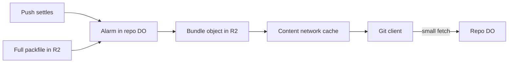

# Bundle-URI support

> Verdict: **lands with caveats** · feasibility 4/5 · reliability 3/5 · correctness 3/5 · effort: days
> Read the words in [how-to-read.md](../findings/how-to-read.md). Engineers: [proof](../proofs/bundle-uri.md) · [review](../reviews/bundle-uri.md)

## What this idea is

git is a tool that keeps every version of a set of files, and lets many people share those versions. A repository, or repo, is one project's full set of files and their history. A git bundle is one file that holds a large part of a repo's history, plus a short list of names at the top. This idea tells the client where to download a ready-made bundle from a fast content network. The client loads the bulk of the history from that file. Then the client asks the server only for what changed since the bundle was made.

Think of it like this. A magazine publisher mails new subscribers a boxed set of all past issues from a warehouse. The editorial office never touches those boxes. From then on, the office sends only the new issues each month.

## How it works

Some words first. A commit is one saved version of the files, with a note about what changed. A push is sending your new commits to the server. A fetch is getting commits from the server. A clone gets everything for the first time.

An object is one stored item in git. An object is a file's content, a folder listing, or a commit. A branch is a named line of commits, like a bookmark that moves forward as you save. A ref is a name that points at one commit. A branch is a ref. A tag is a ref.

A SHA, or hash, is a fingerprint of an object's content. Two objects with the same content have the same fingerprint. A packfile, or pack, is one bundle that holds many objects, squeezed to save space. Protocol v2 is the newer, cleaner set of messages git uses to talk to a server. A pkt-line is git's way of framing a message. Each line starts with four characters that give its length.

A Cloudflare Worker is one of the small programs that run on Cloudflare's network close to the user, with no server to manage. A Durable Object, or DO, is a single small program with its own storage that handles one thing at a time. There is one DO for each repo. Think of it like the one librarian who is allowed to update the catalog. DO SQLite is the small database inside each Durable Object.

An alarm is a timer inside a Durable Object. A DO has only one alarm at a time. R2 is Cloudflare's large file store. It holds the git objects. A janitor is a background task that deletes files nobody points to anymore.

1. The Worker adds the word bundle-uri to the list of features it tells a protocol v2 client.
2. A client that opted in sends the bundle-uri command. The Worker forwards it to the repo DO.
3. The DO answers from a table named bundles in DO SQLite. The answer lists a web address and a creation token per bundle, as pkt-lines.
4. The addresses point at objects in an R2 bucket on a custom domain, so the content network caches them.
5. After pushes settle, an alarm builds the bundle. The alarm writes the bundle header, then streams the full packfile from R2 into one new R2 object.
6. The header is the line "# v2 git bundle", one line per ref with its fingerprint, and a blank line.
7. The DO records the key, the creation token, and the header length in DO SQLite.
8. The same R2 object also serves as the ready-made clone packfile. A range read that starts after the header returns the packfile alone.
9. The client downloads the bundle and unpacks it. Its refs land under refs/bundles.
10. The client then runs a normal fetch. It reports the bundle tips as objects it already has, so the DO streams only the small remainder.

## What the reviewer decided

The verdict is "Lands with caveats".

| Score | Value |
|---|---|
| Feasibility | 4 out of 5 |
| Reliability | 3 out of 5 |
| Correctness | 3 out of 5 |

The idea is sound and can be built. The proof has one or more problems that must be fixed first, and the reviewer described each fix. Think of it like a flight with a runway that needs some repairs before you land. The runway is there. The repairs are known.

A caveat is a limit or a condition. The idea works, but only inside this limit. GA, or generally available, means a Cloudflare feature that is finished and supported, not a preview. For this idea, the message format is right and every Cloudflare feature used is GA. The design is a thin layer over the ready-made clone packfile, so it lands for clients that opt in.

Two real bugs must be fixed first. The header must come from the refs saved with the packfile, not from the live refs. And old bundles must really be deleted from R2.

## Problems that must be fixed first

A blocker is a problem that stops the idea from working until it is fixed.

### Problem 1: The bundle header lists refs the packfile does not contain

**What goes wrong.** The alarm reads the ref list from the live refs table at the moment it runs. The packfile was built earlier, at the last cleanup. Any push between the cleanup and the alarm moves a ref past the packfile. The header then names a commit that is not in the packfile.

**Why it matters.** The client unpacks the bundle and then fails to write the ref, because the object does not exist. git prints a warning and falls back to a full ordinary fetch. Every bundle cut after such a push is useless.

**How to fix it.** Save the ref tips together with the packfile row when the packfile is built. Write the bundle header from those saved tips. Never read the live refs for the header.

### Problem 2: Old bundle files are never deleted from R2

**What goes wrong.** After each rebuild, the DO deletes old rows from the bundles table. The DO never deletes the R2 objects those rows pointed at. Every rebuild leaves one file the size of a full packfile behind.

**Why it matters.** An active repo rebuilds often. The bucket grows by one full packfile per rebuild with no limit, and nobody points at the old files.

**How to fix it.** Delete the R2 object after a grace period, so downloads in progress can finish. Or hand the bundles prefix to the janitor.

### Problem 3: There is nothing to wrap without a full packfile

**What goes wrong.** The bundle is a header glued onto one complete packfile. Per-push packfiles cannot be joined into one valid packfile. Only the cleanup idea and the ready-made clone packfile idea produce such a file.

**Why it matters.** Until those two ideas exist, this idea has no correct input. The bundle cannot be built at all.

**How to fix it.** Build the cleanup and repack idea first. Then build this idea on top of the full packfile it produces.

## Things to know

- Only clients that opt in use bundles. The setting transfer.bundleURI is off in every released git, so the benefit reaches almost no default client.
- On git 2.38 and 2.39 the creation token rule is unknown, and the client downloads every listed bundle. Listing the newest two doubles the clone bytes there, so list only the newest row.
- The content network caches objects up to 512 MB on non-Enterprise plans, and a single R2 put is limited to about 5 GiB. Multipart upload is not shown, so both limits bound large repos.
- The bundle-uri request has no argument section, and the Worker parser must accept that shape. Refs land as refs/bundles/heads/main, not under a bundle id.
- Private repos fall back to a per-location cache behind an auth Worker, and presigned URLs skip the content network cache. Incremental bundles are out of scope.

## How this idea connects to the others

This idea needs [#55 GC and repack as a DO alarm](./gc-and-repack-alarm.md) to produce the full packfile the bundle wraps.
This idea needs [#7 Precomputed pack slices for clone](./precomputed-clone-pack.md) because the bundle object doubles as that packfile.
This idea needs [#2 Refs in DO SQLite, objects in R2](./refs-sqlite-objects-r2.md) for the refs and the objects in R2.
This idea needs [#3 Speak git protocol v2 only, translate v0 at the edge](./protocol-v2-only.md) for the bundle-uri command.
This idea needs [#53 The /info/refs?service= entrypoint and pkt-line codec](./info-refs-endpoint.md) to advertise the bundle-uri feature.
This idea needs [#56 Want/have negotiation with a commit-graph in SQLite](./want-have-negotiation.md) so the fetch after the bundle stays small.
