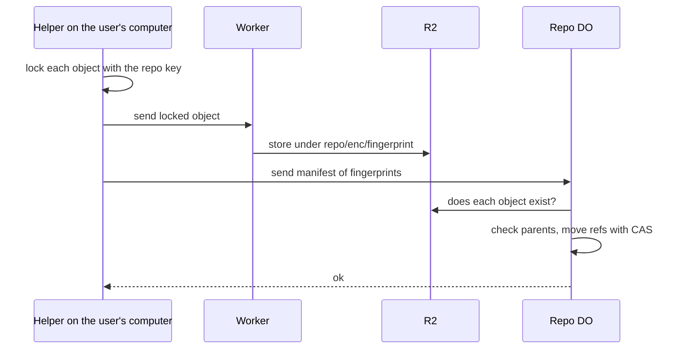

# Encrypted-at-rest with client-held keys

> Verdict: **risky** · feasibility 4/5 · reliability 2/5 · correctness 3/5 · effort: weeks
> Read the words in [how-to-read.md](../findings/how-to-read.md). Engineers: [proof](../proofs/client-key-encryption.md) · [review](../reviews/client-key-encryption.md)

## What this idea is

Git is a tool that keeps every version of a set of files, and lets many people share those versions. A repository, or repo, is one project's full set of files and their history. In this idea, the user's computer locks every file with a secret key before the file leaves the computer. The server stores only locked files. The server never holds the key, so the server can never read the files. The server only knows the names of things and how they link together.

Think of it like this. You rent a locker at a train station and bring your own padlock. The station staff can see how many boxes you stored, and when. The staff can never open a box.

## How it works

An object is one stored item in git. An object is a file's content, a folder listing, or a commit. A commit is one saved version of the files, with a note about what changed. A SHA, or hash, is a fingerprint of an object's content. Two objects with the same content have the same fingerprint. Push is sending your new commits to the server. Fetch is getting commits from the server. A Durable Object, or DO, is a single small program with its own storage that handles one thing at a time. There is one DO for each repo. Think of it like the one librarian who is allowed to update the catalog. R2 is Cloudflare's large file store. It holds the git objects. A Cloudflare Worker is a small program that runs on Cloudflare's network close to the user, with no server to manage.

1. A helper program on the user's computer locks each object with the repo key. The key never leaves the computer. The helper marks each locked object with the object's fingerprint, so the lock and the fingerprint belong together.
2. The helper sends each locked object to the Worker. The Worker streams the locked object into R2 under the path repo/enc/fingerprint.
3. The helper sends a manifest to the DO. The manifest holds only fingerprints. The manifest lists each ref to move, each new commit with its parent commits, and the objects each commit adds. A ref is a name that points at one commit. A branch is a ref. A tag is a ref.
4. The DO checks that every listed object exists in R2. The DO checks that every parent commit is known. Then the DO moves the refs with compare-and-swap, all at once, or not at all. Compare-and-swap, or CAS, means: change a value only if it still has the value you expect. If someone changed it first, do nothing and report it.
5. On fetch, the DO walks its commit list from the commits the user wants to the commits the user has. The DO returns the list of fingerprints.
6. The helper downloads each locked object from R2, unlocks it with the key, and writes it into the local git store.

## What the reviewer decided

The reviewer's verdict is Risky.

| Score | Value |
|---|---|
| Feasibility | 4 of 5 |
| Reliability | 2 of 5 |
| Correctness | 3 of 5 |

Risky. The idea can be built. But the proof shows one or more problems the reviewer could not fully solve, or it does a weaker version of the goal. Think of it like a runway you can see on the map, but nobody has checked it for holes.

The proof is the small test program the study wrote to check the idea. The core mechanics of this proof work today on finished Cloudflare features. The DO holds only fingerprints, R2 holds only locked objects, and two users cannot push two different versions of a ref at the same time. But as written, the system has no login and no permission check. Anyone can overwrite a stored object or move a ref. The cleanup task either leaks storage forever or deletes live data. And no real git command can talk to the server, because the helper program is not written. The reviewer expects the fixes to take weeks, and the result is a separate product, not a mode of the normal git server.

## Problems that must be fixed first

A blocker is a problem that stops the idea from working until it is fixed. The reviewer found three blockers.

### Problem 1: No login and no permission check

**What goes wrong.** The Worker accepts a locked object from anyone. The Worker writes the object under repo/enc/fingerprint without checking whether that path already holds an object. So a new upload replaces the old locked bytes. The DO also accepts a manifest from anyone, so anyone can move a ref.

**Why it matters.** A ref may already point at the object that was replaced. Every user who fetches that object now gets bytes that fail to unlock. The proof claims that only key holders can push. Nothing in the code enforces that claim.

**How to fix it.** Add login and permission checks to both the Worker and the DO. Make the Worker write an object only if no object exists under that path yet.

### Problem 2: The upload, claim, and cleanup steps are not defined

**What goes wrong.** The proof has a table named pending that is meant to track uploaded objects. The Worker never writes to that table. The push step never clears it. A timer task is meant to delete stale uploads after 15 minutes.

**Why it matters.** With an empty pending table, the timer task does nothing. Then lost files, which are files nobody points to, stay in R2 forever. If the task is built the way the comment describes, the task deletes live objects 15 minutes after a successful push. That is permanent loss of data.

**How to fix it.** Design a real claim step between upload and manifest. Record each upload in the pending table. Clear the record when a push succeeds. Delete only records that were never claimed.

### Problem 3: No client exists

**What goes wrong.** Smart HTTP is the way git talks to a server over normal web requests. This server does not speak smart HTTP. A normal git push or git clone first asks the server for /info/refs. The Worker answers 404, and git prints "repository not found". So a normal git push, fetch, or clone command fails.

**Why it matters.** The only way to use the server is the helper program. The helper must list refs, push, fetch, write objects into local git, and recover from a lost reply. That is the bulk of the work, and none of it is written.

**How to fix it.** Write the helper program. Give the helper the standard git helper commands: capabilities, list, push, and fetch. Make the helper check the server's refs after a lost reply before it retries.

## Things to know

A caveat is a limit or a condition. The idea works, but only inside this limit.

- This is not a git smart HTTP server, and protocol v2 is never spoken. Protocol v2 is the newer, cleaner set of messages git uses to talk to a server. The system is a custom locked object store with a git-shaped manifest, usable only through the helper.
- The server still learns some facts. The server sees ref names, the commit graph, how many objects each commit adds, and the size of each locked object. Because the lock depends only on the content, the server can confirm that a known file is present by its fingerprint.
- Each object is one R2 write on push and one R2 read on fetch. There are no packfiles and no deltas. A packfile, or pack, is one bundle that holds many objects, squeezed to save space. The DO reads the whole push manifest into memory at once, inside a 128 MB limit. The existence checks run one at a time.
- The helper's lock code spreads a whole file into a function argument list and locks it in one step. Files of several megabytes throw an error, and files of several gigabytes cannot be locked at all.
- The DO trusts the client's list of added objects, so the server cannot check the repo for missing objects. Deleting a ref leaves a row of zeros instead of removing the row. If a reply is lost, the retry gets a false "fetch first" error even though the push succeeded.
- Changing the key means locking every object again, and sharing the key is out of scope. Every server feature that needs to read file content, such as merge, search, and diff, is impossible on a locked repo.

## How this idea connects to the others

- This idea needs one DO per repo to own the refs, from [#1 One Durable Object per repo as the ref authority](./repo-do-ref-authority.md).
- This idea keeps refs in the DO database and objects in R2, from [#2 Refs in DO SQLite, objects in R2](./refs-sqlite-objects-r2.md).
- This idea stores each locked object under its fingerprint, from [#5 Content-addressed R2 keys](./content-addressed-r2-keys.md).
- This idea uploads objects first and moves refs second, from [#6 Two-phase push](./two-phase-push.md).
- This idea walks from wanted commits to known commits on fetch, from [#56 Want/have negotiation with a commit-graph in SQLite](./want-have-negotiation.md).
- This idea can share the locking code with the browser client from [#52 Offline-first browser client with OPFS and the same Wasm core](./offline-browser-client.md).
