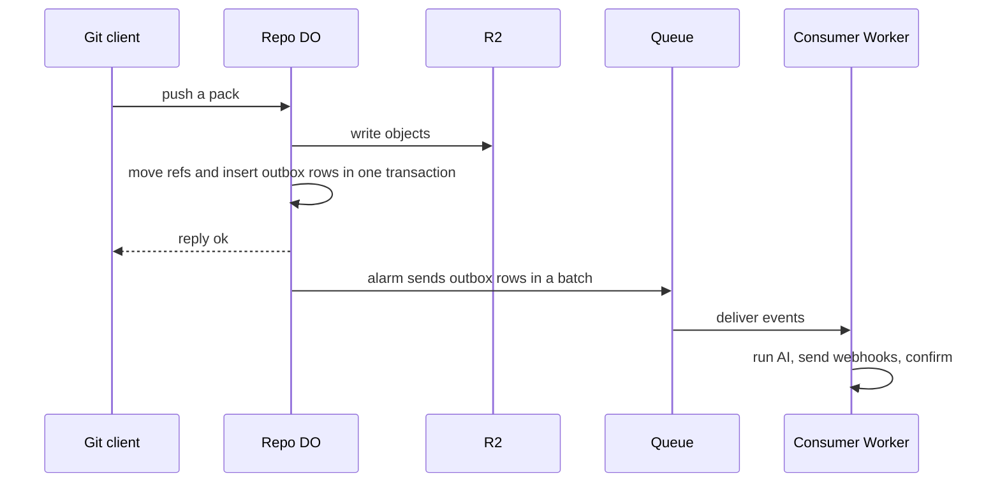

# Commit-as-event-stream

> Verdict: **lands with caveats** · feasibility 4/5 · reliability 3/5 · correctness 3/5 · effort: days
> Read the words in [how-to-read.md](../findings/how-to-read.md). Engineers: [proof](../proofs/commit-event-stream.md) · [review](../reviews/commit-event-stream.md)

## What this idea is

Git is a tool that keeps every version of a set of files, and lets many people share those versions. A commit is one saved version of the files, with a note about what changed. A push is sending your new commits to the server. In this idea, every push that brings new commits also records one event per commit. The record is written in the same database step that moves the branch. A branch is a named line of commits, like a bookmark that moves forward as you save.

A timer then sends those events to a queue. Other programs read the queue. One asks an AI model to summarize each commit, one calls webhooks, and others can build indexes. The push never waits for any of them.

Think of it like this. A post office writes each letter into a ledger the moment the clerk accepts the letter. Carriers pick up letters from the ledger later and deliver them. If a carrier fails, the letter is still in the ledger and goes out again.

## How it works

1. A git client pushes to the repo. A repository, or repo, is one project's full set of files and their history. The request reaches the repo's Durable Object. A Durable Object, or DO, is a single small program with its own storage that handles one thing at a time. There is one DO for each repo. Think of it like the one librarian who is allowed to update the catalog.
2. The DO reads the pushed packfile, writes each object to R2, and finds the commit objects in the pack. A packfile, or pack, is one bundle that holds many objects, squeezed to save space. An object is one stored item in git. An object is a file's content, a folder listing, or a commit. R2 is Cloudflare's large file store. It holds the git objects.
3. In one database transaction in DO SQLite, the DO moves each ref with compare-and-swap and inserts one outbox row per commit. DO SQLite is the small database inside each Durable Object. A ref is a name that points at one commit. A branch is a ref. A tag is a ref. Compare-and-swap, or CAS, means change a value only if it still has the value you expect. If someone changed it first, do nothing and report it.
4. The DO sets an alarm for right now and replies to the client at once. An alarm is a timer inside a Durable Object. A DO has only one alarm at a time.
5. The alarm reads up to 100 outbox rows and sends them to a Cloudflare Queue in one batch. On success, the alarm deletes those rows. On failure, the alarm waits longer each time and tries again.
6. A consumer Worker reads the queue. Cloudflare Workers are small programs that run on Cloudflare's network close to the user, with no server to manage. The consumer runs Workers AI on the commit message, sends signed webhooks, and confirms each message. A message that keeps failing is moved to a dead-letter queue.

## What the reviewer decided

The reviewer looks for blockers and caveats. A blocker is a problem that stops the idea from working until it is fixed. A caveat is a limit or a condition. The idea works, but only inside this limit. The reviewer's verdict is "Lands with caveats."

| Score | Out of 5 |
|---|---|
| Feasibility | 4 |
| Reliability | 3 |
| Correctness | 3 |

Lands with caveats means the following. The idea is sound and can be built. The proof has one or more problems that must be fixed first, and the reviewer described each fix. Think of it like a flight with a runway that needs some repairs before you land. The runway is there. The repairs are known.

For this idea, the reviewer said the design is the right shape for a serverless system. The outbox table, the alarm, and the queue together give reliable delivery with no extra lock. Every Cloudflare feature used is GA. GA, or generally available, means a Cloudflare feature that is finished and supported, not a preview. The ref update stays correct when two pushes arrive at once.

But as written, the proof reports each commit twice on a push that moves several refs. The push reply breaks clients that asked for a sideband. A sideband is a way to send two kinds of data in one stream, like a main channel and a progress channel. And the proof recognizes only commits that arrive in full, not commits sent as deltas. A delta is a stored object written as "the same as that other object, with these changes".

The reviewer found one blocker and seven caveats. The reviewer expects days of work on top of a working pack parser. One caveat mentions pkt-lines. A pkt-line is git's way of framing a message. Each line starts with four characters that give its length.

Another caveat mentions SHAs. A SHA, or hash, is a fingerprint of an object's content. Two objects with the same content have the same fingerprint.

## Problems that must be fixed first

### Problem 1: Commits cannot be found without delta resolution

**What goes wrong.** The proof finds commits by looking at each pack entry's type. But git sends thin packs, and commits inside them are often stored as deltas. A thin pack is a packfile that contains deltas against objects the server already has. A delta entry has the type "delta", not "commit", until the DO resolves the delta against its base object. The base object can live only in R2. The proof treats this step as free.

**Why it matters.** Without delta resolution, the DO sees only the commits that happen to arrive in full. Most commits in a normal push are missed, and no event is sent for them.

**How to fix it.** Land the streaming pack parser idea first, with delta resolution and thin pack support. Identify commits only after the deltas are resolved.

## Things to know

- The push reply is sent as bare pkt-lines with no closing marker, so a normal git push fails or hangs when a sideband was agreed. The server must wrap the reply in the sideband, or not offer a sideband at all.
- A push that moves several refs inserts every commit once per ref, so events are duplicated. When one ref's compare-and-swap fails and another succeeds, commits are credited to the wrong ref.
- The alarm is set outside the transaction, so the ref move and the alarm stay together only because the DO batches its writes. One added wait between them strands outbox rows, and no other task finds them.
- A commit message can exceed the queue's limit of 128 KB per message. The consumer handles messages one at a time and can exceed its budget of 15 minutes.
- Delivery is at-least-once at the outbox, at the queue, and at the consumer. Webhook targets must ignore duplicates by SHA and ref, and retries spend AI credit twice.
- Each commit gets its own AI call, with no grouping per push. A push of 5,000 commits is 5,000 AI calls.
- Deleting a ref writes a ref with an all-zero SHA instead of removing the ref.

## How this idea connects to the others

This idea needs [#1 One Durable Object per repo as the ref authority](./repo-do-ref-authority.md), because that DO is the single writer for refs and the outbox.

This idea needs [#2 Refs in DO SQLite, objects in R2](./refs-sqlite-objects-r2.md), because refs and outbox rows live in the DO and objects live in R2.

This idea needs [#4 Packfile parsing in a Worker with a streaming inflater](./streaming-pack-parser.md), because commits can be identified only after the pack is parsed.

This idea needs [#5 Content-addressed R2 keys](./content-addressed-r2-keys.md), because a retried push rewrites the same objects without harm.
