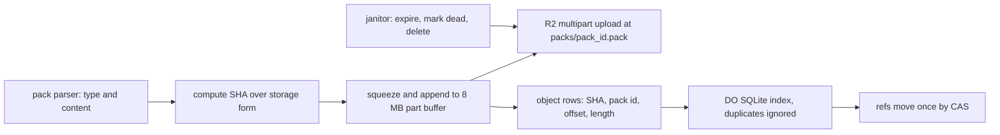

# Content-addressed R2 keys

> Verdict: **lands with caveats** · feasibility 4/5 · reliability 4/5 · correctness 4/5 · effort: days
> Read the words in [how-to-read.md](../findings/how-to-read.md). Engineers: [proof](../proofs/content-addressed-r2-keys.md) · [review](../reviews/content-addressed-r2-keys.md)

## What this idea is

git is a tool that keeps every version of a set of files, and lets many people share those versions. A repository, or repo, is one project's full set of files and their history. A commit is one saved version of the files, with a note about what changed. A branch is a named line of commits, like a bookmark that moves forward as you save.

A ref is a name that points at one commit. A branch is a ref. A tag is a ref.

An object is one stored item in git. An object is a file's content, a folder listing, or a commit. A SHA is a fingerprint of an object's content. Two objects with the same content have the same fingerprint.

A push is sending your new commits to the server. A fetch is getting commits from the server. A clone gets everything for the first time.

This idea keeps the SHA as the true name of every object. The server stores each push as one packfile in R2. R2 is Cloudflare's large file store. It holds the git objects. A packfile, or pack, is one bundle that holds many objects, squeezed to save space. Each pack gets a random name, one name per push attempt.

The repo's index records every object's SHA, the pack that holds the object, and its position inside that pack. The stored object is content-addressed. Content-addressed means stored under its own fingerprint, so the name tells you what is inside. In the second pass, the fingerprint lives in the index row, not in the R2 file name.

A retried push is therefore safe to repeat. Each attempt writes a new pack under a new name, so no attempt can overwrite another. The index ignores a duplicate row, and a ref moves at most once.

Think of it like this. A seed bank stores each shipment in its own crate, and every crate gets a fresh random number. The catalog lists every seed by its DNA fingerprint, with the crate number and the shelf position. If two collectors bring the same seeds, the catalog holds two entries for one fingerprint. The bank merges the crates later, and no seeds are ever mixed up.

## How it works

Cloudflare Workers are small programs that run on Cloudflare's network close to the user, with no server to manage. Wasm, or WebAssembly, is a way to run code from other languages, such as Rust, inside a Worker. The second-pass code is Rust compiled to Wasm. A delta is a stored object written as "the same as that other object, with these changes".

A Durable Object, or DO, is a single small program with its own storage that handles one thing at a time. There is one DO for each repo. Think of it like the one librarian who is allowed to update the catalog. DO SQLite is the small database inside each Durable Object.

1. The pack parser from idea #4 hands the store one finished object at a time, with its type and content. Any delta is already applied.
2. The store computes the SHA over git's storage form. That form is the type, the size, a zero byte, and the content.
3. The store refuses any object larger than 32 MB.
4. The pack writer opens one multipart upload in R2 under packs/pack_id.pack. The pack id is random and belongs to this attempt only.
5. The 12-byte pack header holds the object count that the parser's first pass already verified. The header never changes after that.
6. The writer squeezes each object with zlib at level 6 and appends the result to a buffer. A SHA-1 hasher in Wasm covers every byte as it goes.
7. The writer notes each object's offset and length inside the pack. Those two numbers become the object's index row.
8. Whenever the buffer holds 8 MB, the writer uploads one part. Each upload is a subrequest. A subrequest is one call from a Worker to another service, such as one read from R2. Each request may make at most 50 subrequests on the free plan and 10,000 on the paid plan.
9. At the end, the writer appends the SHA-1 trailer, uploads the last part, and completes the upload. The writer checks that R2 reports the same byte count that the writer wrote.
10. The Worker posts the object rows to the repo's DO in batches of 10,000. The DO inserts each row under the key SHA plus pack id, and ignores a duplicate.
11. The pack stays marked "ingesting" until the push commits. A reader looks up a SHA only in live packs.
12. The refs move once, by compare-and-swap, after the pack is durable and every row is stored. Compare-and-swap, or CAS, means change a value only if it still has the value you expect. If someone changed it first, do nothing and report it.
13. A janitor expires a push that never commits, marks its pack dead, and deletes the R2 file after a grace period. A janitor is a background task that deletes files nobody points to anymore.

## What the reviewer decided

The reviewer looks for blockers and caveats. A blocker is a problem that stops the idea from working until it is fixed. A caveat is a limit or a condition. The idea works, but only inside this limit.

The verdict is Lands with caveats.

| Score | Value |
|---|---|
| Feasibility | 5 of 5 |
| Reliability | 4 of 5 |
| Correctness | 3 of 5 |

Lands with caveats. The idea is sound and can be built. The proof has one or more problems that must be fixed first, and the reviewer described each fix. Think of it like a flight with a runway that needs some repairs before you land. The runway is there. The repairs are known.

For this idea, the reviewer checked every library call against the pinned source code, and every call exists. The pack bytes match what git expects, and no wire byte would break git 2.43 to 2.47. Retried pushes and two pushes at the same time are safe by construction. The reviewer found three small blockers in the code. None of them is a redesign. The reviewer expects weeks of work to reach a working push, with days for this slice alone.

| Score | First pass | Second pass |
|---|---|---|
| Feasibility | 4 of 5 | 5 of 5 |
| Reliability | 4 of 5 | 4 of 5 |
| Correctness | 4 of 5 | 3 of 5 |

Feasibility went up because the proof now rests on verified library code, not on notes. Correctness went down for three reasons. The index code drops the final pack details, the function shapes disagree with two sibling proofs, and one block does not compile.

## What changed in the second pass

- A skipped upload could collide with a cleanup that deletes the same file. Fixed. The write path never reads R2 to decide whether to write. The commit step re-checks the GC epoch and the ref tip inside the DO.
- Each object cost two subrequests, so one request was limited to about 5,000 objects. Fixed. The writer uploads one part per 8 MB and posts rows in batches of 10,000, and a counter charges the budget before every R2 call.
- Web Crypto could not hash data piece by piece. Fixed. A SHA-1 hasher in Wasm updates as each object is appended and produces the trailer at the end.
- Objects were stored unsqueezed, and every fetch had to squeeze them. Fixed. Each object is squeezed with zlib at level 6 when written, so a fetch copies the entries as they are.
- The pending folder of idea #6 conflicted with this idea because R2 cannot rename a file. Fixed at the contract level. The pending file holds the raw thin pack and the final pack holds the rebuilt objects, so nothing is renamed.
- The parser and this idea depended on each other. Fixed at the contract level. The pack parser depends on the store, and not the other way.
- The server must reject a client that asks for the sha256 object format. Still open, but acceptable. The code fixes SHA-1 everywhere, but the rejection lives in the wire layer, which this proof does not show.
- A crash in the middle of a push left lost files in R2. Still open, in a new form. A Worker killed between opening and completing an upload leaves an unfinished upload that nothing can find. See Things to know.

## Problems that must be fixed first

### Problem 1: Final pack details are never recorded

**What goes wrong.** The shared contract says the DO creates the pack row marked "ingesting" on the first index post. At that time the object count, the byte size, and the commit region are not known yet. The proof's insert does nothing when a row with that id already exists. So the final details posted after the upload completes are dropped without any error.

**Why it matters.** Later reads of the commit region and the merge step of the GC task then run on zeros. The proof also claims that rows are inserted only after the upload completes, which contradicts the contract's own rule.

**How to fix it.** Change the insert into an update when the row exists. Guard the update so it applies only while the state is "ingesting" and the push id matches. Or add a separate call that sets the pack details after the upload completes.

### Problem 2: Function shapes disagree across proofs

**What goes wrong.** This proof changes the shared function shapes. The create call gains an expected count and a budget, and the append call now returns a result that can fail. The proof for idea #6 calls create without the count. The proof for idea #4 calls append without checking for an error. The three proofs cannot compile together.

**Why it matters.** The sibling proofs are the callers of this code. If they cannot compile against this code, none of the three ideas can be built as written.

**How to fix it.** Pick one set of function shapes. Write that set into the shared contract. Then change both sibling proofs to match.

### Problem 3: A value is used after it was moved

**What goes wrong.** When the object count does not match the header, the finish step aborts the upload. Then the finish step builds an error message with the two counts. Rust moves the writer into the abort call, so the later read of the counts does not compile.

**Why it matters.** The fix is small, but the error shows that nobody compiled this block.

**How to fix it.** Copy the two counts into local values before the abort call. Then compile the block and run it once.

## Things to know

- A Worker that dies between opening and completing an upload leaves an unfinished upload that nothing can find or delete. Store the upload id on the pack row so the janitor can abort it, because R2's own cleanup rule is unverified.
- The squeezer builds a new zlib state for every object, so a push of one million objects makes one million allocations. Reuse one squeezer and reset it for each object.
- The index inserts one row per database call, up to 10,000 calls in one span. One insert statement with many rows would cut that down.
- The "no commits" marker for the commit region is stored as the largest signed 64-bit number, where the contract says the largest unsigned one. The contract needs that change, and a batch of more than 10,000 rows must report an internal error, not a client error.
- Four things stay unmeasured until the first deploy: squeezing in Wasm, 8 MB parts on real R2, part replacement by number, and duplicate objects. The duplicate case is a pushed pack that carries one object twice, tested on git 2.47.

## How this idea connects to the others

- The finished objects come from [#4 Packfile parsing in a Worker with a streaming inflater](./streaming-pack-parser.md).
- The push attempt, the pending file, and the commit step come from [#6 Two-phase push](./two-phase-push.md).
- The objects index and the packs table come from [#2 Refs in DO SQLite, objects in R2](./refs-sqlite-objects-r2.md).
- The ref move by CAS after the pack lands comes from [#1 One Durable Object per repo as the ref authority](./repo-do-ref-authority.md).
- The janitor that expires pushes and merges duplicate packs comes from [#55 GC and repack as a DO alarm](./gc-and-repack-alarm.md).
