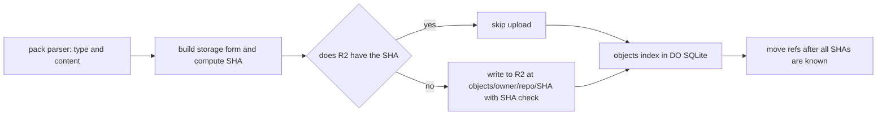

# Content-addressed R2 keys

> Verdict: **lands with caveats** · feasibility 4/5 · reliability 4/5 · correctness 4/5 · effort: days
> Read the words in [how-to-read.md](../findings/how-to-read.md). Engineers: [proof](../proofs/content-addressed-r2-keys.md) · [review](../reviews/content-addressed-r2-keys.md)

## What this idea is

git is a tool that keeps every version of a set of files, and lets many people share those versions. A repository, or repo, is one project's full set of files and their history. A commit is one saved version of the files, with a note about what changed. A branch is a named line of commits, like a bookmark that moves forward as you save.

A ref is a name that points at one commit. A branch is a ref. A tag is a ref.

An object is one stored item in git. An object is a file's content, a folder listing, or a commit. A SHA is a fingerprint of an object's content. Two objects with the same content have the same fingerprint.

A push is sending your new commits to the server. A fetch is getting commits from the server. A clone gets everything for the first time.

This idea stores each object in R2 under its own SHA. R2 is Cloudflare's large file store. It holds the git objects. The stored file is content-addressed. Content-addressed means stored under its own fingerprint, so the name tells you what is inside.

A write is therefore safe to repeat. A retried push writes the same bytes to the same name, and nothing changes.

Think of it like this. A seed bank labels each jar with the exact DNA fingerprint of the seeds inside. If two collectors bring the same seeds, both jars get the same label. The bank keeps one jar, and no seeds are ever mixed up.

## How it works

Cloudflare Workers are small programs that run on Cloudflare's network close to the user, with no server to manage. A packfile is one bundle that holds many objects, squeezed to save space. A delta is a stored object written as "the same as that other object, with these changes".

1. The pack parser hands the Worker one finished object at a time, with its type and its content. Any delta is already applied.
2. The Worker rebuilds git's own storage form. That form is the type, the size, a zero byte, and the content.
3. The Worker computes the SHA over those bytes.
4. The Worker asks R2 whether a file with that name already exists. If yes, the Worker skips the upload. Each such call is a subrequest. A subrequest is one call from a Worker to another service, such as one read from R2. Each request may make at most 1,000 subrequests.
5. If no, the Worker writes the bytes to R2 under objects/owner/repo/SHA. The Worker also gives R2 the expected SHA, and R2 refuses any body that does not match.
6. The repo's Durable Object records the SHA, type, and size in an objects index in DO SQLite. A Durable Object, or DO, is a single small program with its own storage that handles one thing at a time. There is one DO for each repo. Think of it like the one librarian who is allowed to update the catalog. DO SQLite is the small database inside each Durable Object.
7. The refs move only after every SHA in the push is known to exist.

## What the reviewer decided

The reviewer looks for blockers and caveats. A blocker is a problem that stops the idea from working until it is fixed. A caveat is a limit or a condition. The idea works, but only inside this limit.

The verdict is Lands with caveats.

| Score | Value |
|---|---|
| Feasibility | 4 of 5 |
| Reliability | 4 of 5 |
| Correctness | 4 of 5 |

Lands with caveats. The idea is sound and can be built. The proof has one or more problems that must be fixed first, and the reviewer described each fix. Think of it like a flight with a runway that needs some repairs before you land. The runway is there. The repairs are known.

For this idea, the reviewer found no blocker in the idea as scoped. The idea maps git's own naming scheme onto R2 and uses only GA building blocks. GA, or generally available, means a Cloudflare feature that is finished and supported, not a preview. The writes are safe to repeat after a crash in the middle of a push and when two pushes run at the same time. Refs never move on any failure path.

The problems to settle are contracts with other ideas, listed under Things to know. The reviewer expects days of work.

## Things to know

- The pending folder in idea #6 conflicts with this idea, because R2 cannot rename a file and a move would double the cost. Write the final content-addressed name directly, and rely on the DO index plus a cleanup task instead.
- A push can skip an upload because the file exists, and a cleanup can then delete that file, leaving the ref pointing at nothing. The cleanup in idea #55 must therefore wait a grace period and re-check R2 under the DO lock.
- Each object costs two subrequests, and a paid plan allows 10,000 per request, so one push request is limited to about 5,000 objects. Larger pushes need chunked ingest or pack-level storage.
- Web Crypto cannot hash data piece by piece, and a Worker has 128 MB of memory, so objects over about 50 MB cannot be hashed. Those objects need a hasher written in JavaScript or another compiled language, or LFS, and the same gap hits the pack checksum when serving.
- Objects are stored unsqueezed, which costs two to four times the R2 space. Every fetch must then squeeze each object with a CompressionStream.
- The naming scheme is fixed to SHA-1. The server must reject a client that asks for the sha256 object format.
- A push from git sends thin packs, and a thin pack is a packfile that contains deltas against objects the server already has. The parser needs this idea's read path to find those bases, so the two ideas depend on each other, and that must be stated openly.

## How this idea connects to the others

- The finished objects come from [#4 Packfile parsing in a Worker with a streaming inflater](./streaming-pack-parser.md).
- The objects index and the refs table come from [#2 Refs in DO SQLite, objects in R2](./refs-sqlite-objects-r2.md).
- The ref move after the objects land comes from [#1 One Durable Object per repo as the ref authority](./repo-do-ref-authority.md).
