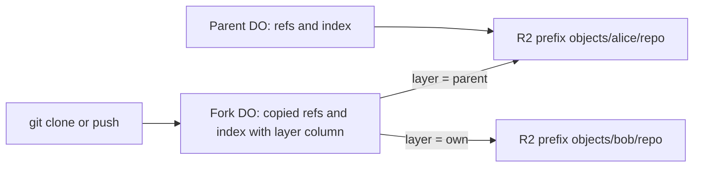

# Copy-on-write forks

> Verdict: **risky** · feasibility 4/5 · reliability 2/5 · correctness 3/5 · effort: weeks
> Read the words in [how-to-read.md](../findings/how-to-read.md). Engineers: [proof](../proofs/cow-forks.md) · [review](../reviews/cow-forks.md)

## What this idea is

Git is a tool that keeps every version of a set of files, and lets many people share those versions. A repository, or repo, is one project's full set of files and their history. A fork is a second repo that starts as a copy of a first repo, so a second person can change the copy. This idea makes a fork without copying any file content. The fork keeps a small list that says where each stored item lives, and stores only new items in the fork's own space.

Think of it like this. A library opens a second reading room. The new room copies no books. The new room has a card catalog that points at the shelves in the old room. When someone donates a new book, only that book goes on a shelf in the new room.

## How it works

An object is one stored item in git. An object is a file's content, a folder listing, or a commit. A commit is one saved version of the files, with a note about what changed. A SHA, or hash, is a fingerprint of an object's content. Two objects with the same content have the same fingerprint. R2 is Cloudflare's large file store. It holds the git objects. A Durable Object, or DO, is a single small program with its own storage that handles one thing at a time. There is one DO for each repo. Think of it like the one librarian who is allowed to update the catalog. DO SQLite is the small database inside each Durable Object. A ref is a name that points at one commit. A branch is a ref. A tag is a ref. An alarm is a timer inside a Durable Object. A DO has only one alarm at a time. A janitor, also called a sweep or GC, is a background task that deletes files nobody points to anymore.

1. A user asks the server to fork the repo alice/repo as bob/repo.
2. The server makes a new DO for bob/repo.
3. The new DO copies the parent's refs into its own DO SQLite.
4. The new DO copies the parent's object index page by page, with an alarm between pages. Each row keeps a layer column that names the parent's storage prefix in R2.
5. The parent DO records the fork and pins the parent's current ref tips, so the parent's janitor keeps those objects.
6. A fetch or clone is getting commits from the server. A clone gets everything for the first time. When a client clones the fork, the fork DO looks up each object's layer and reads the bytes from that prefix in R2.
7. A push is sending your new commits to the server. When a client pushes to the fork, the fork writes the new objects to its own prefix. The fork adds rows whose layer is its own prefix.
8. The fork advertises the parent's refs as its own. Git itself then sends only the new objects on a push.

## What the reviewer decided

The reviewer's verdict is Risky.

| Score | Value |
|---|---|
| Feasibility | 4 of 5 |
| Reliability | 2 of 5 |
| Correctness | 3 of 5 |

Risky. The idea can be built. But the proof shows one or more problems the reviewer could not fully solve, or it does a weaker version of the goal. Think of it like a runway you can see on the map, but nobody has checked it for holes.

For this idea, the way the fork talks to git is correct. A push to the fork sends only new objects, and a clone from the fork gets a valid packfile. A packfile, or pack, is one bundle that holds many objects, squeezed to save space. But the fork loses data on a fixed schedule, because the parent's janitor deletes the files the fork points to. A blocker is a problem that stops the idea from working until it is fixed. The three blockers below need changes in another idea, the GC and repack alarm, before this idea can land. The reviewer expects two to four weeks of work for a correct version.

## Problems that must be fixed first

### Problem 1: The parent's janitor deletes the files the fork points to

**What goes wrong.** The janitor in the GC and repack idea treats only ref tips as roots. That janitor ignores the pins that the fork asks for. That janitor also plans to delete each loose object once a packfile holds a copy. The fork can read only loose objects, one file per SHA. After the parent's second janitor run, every inherited object is gone from R2.

**Why it matters.** This is guaranteed data loss for any fork older than two parent janitor cycles. A normal git clone or git fetch from the fork fails, because the server cannot find the objects.

**How to fix it.** Make the janitor honor the pins. Then pick one of two rules. Either the parent never deletes loose objects while any fork exists. Or each index row stores the pack key, the offset and the length, and the fork reads one byte range from the pack.

### Problem 2: The layer name can change

**What goes wrong.** The layer column holds the text objects/owner/repo. That text changes when the parent is renamed. That text also points at a new repo when the parent is deleted and created again. In both cases every fork row silently points at the wrong place.

**Why it matters.** Fork rows then point at files that are missing or that belong to a different repo. Nobody is told.

**How to fix it.** Use the parent DO's id as the layer. A DO id never changes. The GC and repack idea already keys packs by DO id. The two proofs also disagree on the key layout, and both must use the same layout.

### Problem 3: Pins cover only the first page

**What goes wrong.** The fork pins the parent's ref tips only when the fork copies page 0 of the index. The import takes many pages, ordered by SHA. Objects that land in the parent during the import appear on later pages, but nobody pins them. Objects that arrive by a server-side fork sync are also unpinned. If the parent then force-pushes and the janitor runs, those objects are deleted while the fork still lists them.

**Why it matters.** When a client fetches, the fork finds nothing for that SHA in the middle of the stream. The client gets a cut-off packfile. A normal git fetch fails with the message "fatal: early EOF".

**How to fix it.** Pin the tips on every page. Or import only the objects that the pinned tips reach.

## Things to know

A caveat is a limit or a condition. The idea works, but only inside this limit.

- Two fork requests with the same name can collide, because the check for an existing fork happens before a network wait. The second request gets a database error with code 500 instead of a clean 409, and no data is damaged.
- The fork copies only the refs table, and the default branch marker HEAD is not in that table. A normal git clone of a fork then warns "remote HEAD refers to nonexistent ref" and leaves an empty folder.
- A clone from a fork loses the fast path of the precomputed clone pack, so each object costs one R2 read. The fork must start its own pack build right after the import.
- The parent DO must honor the pins and must refuse to delete its prefix while a fork exists. The fork cannot check or enforce either rule.
- A parent with 2 million objects needs about 400 alarm ticks and 2 million row writes per fork. A fork of a fork pays the whole cost again, because rows are copied rather than shared.
- A fork reads another tenant's R2 prefix by design. A parent that goes private cannot take back bytes that a fork already lists, so this must be a product policy.

## How this idea connects to the others

This idea stores refs and the object index the same way as [#2 Refs in DO SQLite, objects in R2](./refs-sqlite-objects-r2.md).

This idea reads objects by their fingerprint, as set out in [#5 Content-addressed R2 keys](./content-addressed-r2-keys.md).

This idea trusts the fork's DO to own the fork's refs, as in [#1 One Durable Object per repo as the ref authority](./repo-do-ref-authority.md).

This idea needs pins and pack-offset reads from [#55 GC and repack as a DO alarm](./gc-and-repack-alarm.md) before it can land.

This idea reuses the pack reader from [#4 Packfile parsing in a Worker with a streaming inflater](./streaming-pack-parser.md) for pushes to the fork.

This idea uses [#56 Want/have negotiation with a commit-graph in SQLite](./want-have-negotiation.md) to decide which objects a client needs.
