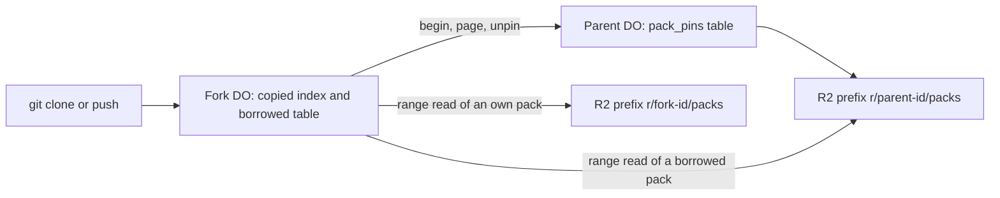

# Copy-on-write forks

> Verdict: **risky** · feasibility 4/5 · reliability 2/5 · correctness 3/5 · effort: weeks
> Read the words in [how-to-read.md](../findings/how-to-read.md). Engineers: [proof](../proofs/cow-forks.md) · [review](../reviews/cow-forks.md)

## What this idea is

Git is a tool that keeps every version of a set of files, and lets many people share those versions. A repository, or repo, is one project's full set of files and their history. A fork is a second repo that starts as a copy of a first repo, so a second person can change the copy. This idea makes a fork without copying any file content. The fork keeps a small list that says where each stored item lives, and stores only new items in the fork's own space.

Think of it like this. A library opens a second reading room. The new room copies no books. The new room has a card catalog that points at the shelves in the old room. When someone donates a new book, only that book goes on a shelf in the new room.

## How it works

The second pass writes the design in Rust, against one shared contract that every idea in this set follows. Cloudflare Workers are small programs that run on Cloudflare's network close to the user, with no server to manage. Wasm, or WebAssembly, is a way to run code from other languages, such as Rust, inside a Worker. An object is one stored item in git. An object is a file's content, a folder listing, or a commit. A commit is one saved version of the files, with a note about what changed. A SHA, or hash, is a fingerprint of an object's content. Two objects with the same content have the same fingerprint. A packfile, or pack, is one bundle that holds many objects, squeezed to save space. There are no loose objects in this design. Every object lives inside a pack. R2 is Cloudflare's large file store. It holds the packs. A Durable Object, or DO, is a single small program with its own storage that handles one thing at a time. There is one DO for each repo. Think of it like the one librarian who is allowed to update the catalog. DO SQLite is the small database inside each Durable Object. A ref is a name that points at one commit. A branch is a ref. A tag is a ref. An alarm is a timer inside a Durable Object. A DO has only one alarm at a time. A janitor is a background task that deletes files nobody points to anymore. A pin is a row in the parent's own database that tells the parent's janitor to keep a pack.

1. A user asks the server to fork the repo alice/repo as bob/repo.
2. The fork's new DO claims the repo in one step. The DO checks the repo is empty, writes the parent's name, and queues a fork job. A second fork request loses this check and gets a clean 409 answer.
3. The fork job runs in slices, one slice per alarm firing. The first slice calls begin on the parent DO. In one step the parent records the fork and pins every live pack. The same step returns the parent's repo id, its HEAD, its refs, and the pinned pack list. A repo id is a fixed identifier that a rename does not change. HEAD is the default branch marker.
4. Back in the fork's own step, the fork marks each pinned pack live in its pack table and records each pack's owner in a borrowed table. The copied refs and HEAD land with them.
5. The next slices call page on the parent. The parent returns index rows only for packs pinned to this fork, 20,000 rows at a time. The fork copies each row into its own index. Each row says which pack holds the object and where inside the pack the bytes sit.
6. When the last page lands, the fork marks itself done. While the import runs, pushes and fetches to the fork get a conflict answer.
7. A fetch or clone is getting commits from the server. A clone gets everything for the first time. A read on the fork finds the object's pack and byte range in the index, then reads that range from the owner's prefix in R2.
8. A push is sending your new commits to the server. A push to the fork stores new objects in a fork-owned pack, exactly as a push to a normal repo does. The copied refs are the fork's advertisement, so git itself sends only the new objects.
9. The parent's janitor cannot delete a pinned pack. The sweep's dead-mark step skips every pack id that any fork still pins, inside the same step.
10. A fork of a fork works the same way. The borrowed table carries the original owner's repo id, so a grandchild reads the grandparent's bytes directly. The pin lives at the direct parent.
11. A sync route re-pins the parent's live set and imports the rows that arrived since the fork. A detach route releases every borrow. The janitor then copies what the fork still needs into a fork-owned pack, and the fork sends the unpins back to the parent.

## What the reviewer decided

The reviewer looks for blockers and caveats. A blocker is a problem that stops the idea from working until it is fixed. A caveat is a limit or a condition. The idea works, but only inside this limit.

The verdict is Risky.

| Score | Value |
|---|---|
| Feasibility | 4 of 5 |
| Reliability | 3 of 5 |
| Correctness | 3 of 5 |

| Score | First pass | Second pass |
|---|---|---|
| Feasibility | 4 of 5 | 4 of 5 |
| Reliability | 2 of 5 | 3 of 5 |
| Correctness | 3 of 5 | 3 of 5 |

Risky. The idea can be built. But the proof shows one or more problems the reviewer could not fully solve, or it does a weaker version of the goal. Think of it like a runway you can see on the map, but nobody has checked it for holes.

For this idea, the second pass moved reliability up one point and left the other two scores flat. The verdict stays Risky. All three first-pass blockers are now closed by the shape of the design, not by a check at run time. The pin unit is the whole pack. The layer is a repo id that never changes. The page query cannot return a row the parent is free to delete.

The remaining work is small but blocking. The owner redirect reaches only two of the five paths that read pack bytes, so a fork cannot answer a fetch as written. The sync route can never move a ref. Both fixes are small, but until they land the feature does not run.

## What changed in the second pass

- The parent's janitor deleted the files the fork points to: fixed. Loose objects are gone from the contract. Every object lives in a pack, and a pin blocks the parent's dead-mark inside the sweep's own step.
- The layer name could change on a rename: fixed. The borrowed table stores the parent's repo id, which a rename does not touch. The old text path is gone.
- Pins covered only the first page: fixed. The begin call pins the whole live set in one step, and the page query returns only rows of pinned packs. A parent push after begin is invisible to the fork, never dangling.
- Two fork requests with the same name could collide: fixed. The claim is one insert inside the fork's own step. The loser gets a clean 409.
- The parent's promise to keep the pinned bytes: partly fixed. The keep rule is now the parent's own query on its own tables, not a promise between two DOs. If the parent's storage is lost anyway, the fork fails loud on the next read instead of silently.
- A fork clone paid one R2 read per object: partly fixed. Borrowed objects now stream through the same grouped range reads as a normal repo. Three of the five read paths still miss the owner redirect, tracked as Problem 1 below.
- A fork reads another tenant's prefix by design: still open. There is one shared bucket. A parent that goes private cannot take back bytes a fork already lists, so this stays a product policy.
- The import cost for a large parent: still open. A parent with 2 million objects now needs about 100 alarm slices at 20,000 rows each. A fork of a fork pays the whole cost again, by design.
- A clone of a fork found no HEAD: fixed. The begin call returns the parent's HEAD and the fork writes it. The peeled lines that annotate tags are still lost, because the sibling ref list never reads that column.
- A missing object cut the pack stream with no error: fixed. A resolved fingerprint cannot be collected while its pin stands. If bytes are missing anyway, the read ends in a clear error, not a cut-off packfile.

## Problems that must be fixed first

### Problem 1: The owner redirect covers only two of the five read paths

**What goes wrong.** A borrowed pack's bytes sit under the owner's prefix in R2. The code redirects reads to the owner for the pack writer and the push lookup only. Three more paths still read under the fork's own prefix. They are the fetch path, the janitor's mark pass, and the pack merge that detach depends on. Each finds nothing and returns a storage error.

**Why it matters.** As written, a fork cannot answer a fetch, run its own mark pass, or finish a detach. Both new test scenarios fail on this.

**How to fix it.** Send every path that reads pack bytes through the same owner lookup and the owner's bucket. The helper already exists. The change is one line in each of the three paths.

### Problem 2: The sync route never moves a ref

**What goes wrong.** The import writes refs with insert-or-ignore. A ref the fork already has keeps its old target. A branch that moved in the parent, and a ref the parent deleted, never reach the fork.

**Why it matters.** A moved branch is the most common upstream change. Sync is the only route that can bring the change over. As written, sync imports the new objects but leaves the ref pointing at the old commit.

**How to fix it.** Change the insert so an existing ref gets the new target. Then delete any fork ref that is missing from the parent's list.

## Things to know

- One page of the import is up to 20,000 row writes with no budget check. A page that cannot finish inside the alarm slice retries as a whole until the job is marked dead. A smaller page or a mid-page resume fixes this, and the cursor already supports both.
- A fork job that is marked dead has no route that starts it again. A parent outage longer than the retry window leaves the fork stuck mid-import and keeps holding the parent's pins.
- The detach route does not check the import state. A detach during an import mixes pinned and unpinned rows. The route must refuse until the import is done.
- A fork's unpin queue retries only when a later sweep starts the fork job. A quiet repo can hold a grandparent's pins forever. This is a leak of space, not a wrong read.
- The parent routes trust the fork repo name the caller sends. Nothing binds that name to the caller. This is moot while the deployment has one tenant.
- A few small write-backs to the sibling ideas are needed before the code compiles. They are derive attributes on three record types, one missing helper, and the shape of one lookup response.
- Three calls stay unverified at run time, each with a fallback shown. They are the request constructor for the DO-to-DO call, the bucket clone behind the owner redirect, and the optional column for peeled refs.
- The pin is a whole pack, dead weight included. An abandoned fork pins its parent's live set forever. This is a real cost, not a defect.
- A fork serves no pushes and no fetches while it imports. A large parent keeps the fork closed for minutes, and each fork generation pays the wait again.
- A parent push after the fork starts is invisible until the sync route runs. The sync re-pins and re-imports the whole pinned set, not only the change.

## How this idea connects to the others

This idea stores refs and the object index the same way as [#2 Refs in DO SQLite, objects in R2](./refs-sqlite-objects-r2.md).

This idea trusts the fork's DO to own the fork's refs, as in [#1 One Durable Object per repo as the ref authority](./repo-do-ref-authority.md).

A push to a finished fork uses the two-phase ingest from [#6 Two-phase push](./two-phase-push.md).

This idea reuses the pack reader from [#4 Packfile parsing in a Worker with a streaming inflater](./streaming-pack-parser.md) for pushes to the fork.

This idea needs the pin-aware sweep and the pack merge chain from [#55 GC and repack as a DO alarm](./gc-and-repack-alarm.md) before it can land.
