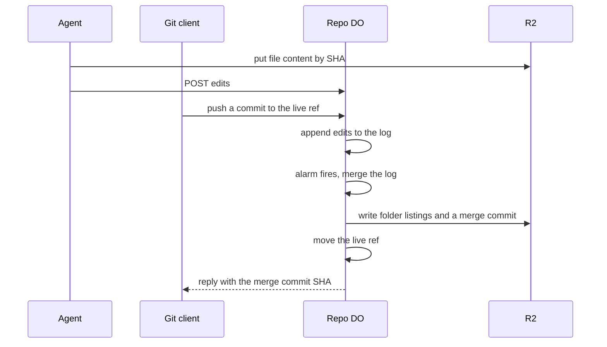

# Multi-writer CRDT branches

> Verdict: **does not land** · feasibility 3/5 · reliability 2/5 · correctness 2/5 · effort: weeks
> Read the words in [how-to-read.md](../findings/how-to-read.md). Engineers: [proof](../proofs/crdt-branches.md) · [review](../reviews/crdt-branches.md)

## What this idea is

Git is a tool that keeps every version of a set of files, and lets many people share those versions. A commit is one saved version of the files, with a note about what changed. A branch is a named line of commits, like a bookmark that moves forward as you save. In normal git, only one writer at a time can move a branch, and a second writer must first fetch and merge. A fetch is getting commits from the server. A clone gets everything for the first time.

This idea lets many writers edit one special "live" branch at the same time. The server keeps a log of small edits, one per file, and merges them by a fixed rule. A timer then turns the merged result into a real commit that any git client can fetch. CRDT is short for conflict-free replicated data type, a data structure that merges edits from many writers with no coordinator.

Think of it like this. A band records a song, and each player records a part alone. A sound engineer mixes all the parts into one track every few seconds. The mixed track is what listeners hear.

## How it works

1. A writer puts each changed file's content into R2 under its SHA. R2 is Cloudflare's large file store. It holds the git objects. An object is one stored item in git. An object is a file's content, a folder listing, or a commit. A SHA, or hash, is a fingerprint of an object's content. Two objects with the same content have the same fingerprint.
2. An agent sends a list of edits to the repo's Durable Object over the web. A repository, or repo, is one project's full set of files and their history. A Durable Object, or DO, is a single small program with its own storage that handles one thing at a time. There is one DO for each repo. Think of it like the one librarian who is allowed to update the catalog. Each edit names a file path, the new content's SHA, and a clock value.
3. A git client instead pushes a commit to a ref named "refs/heads/live/<name>". A push is sending your new commits to the server. A ref is a name that points at one commit. A branch is a ref. A tag is a ref. The server compares the pushed commit's folder tree with the old commit and turns each changed path into an edit. The server never rejects such a push for being behind.
4. The DO appends the edits to a log in DO SQLite. DO SQLite is the small database inside each Durable Object. The log key is the branch, the writer, the clock, and the path, so a repeated edit is ignored.
5. The DO sets an alarm about 1.5 seconds later. An alarm is a timer inside a Durable Object. A DO has only one alarm at a time.
6. When the alarm fires, the DO merges the log. For each path, the newest edit wins. If two writers changed the same file from a known shared base, the DO runs a three-way text merge instead.
7. The DO writes the merged files as real git folder listings and one merge commit to R2. The merge commit lists every contributing pushed commit as a parent.
8. The DO moves the live ref to the merge commit.
9. The push reply tells the client the merge commit's SHA. So the client's next pull is a fast-forward.

## What the reviewer decided

The reviewer looks for blockers and caveats. A blocker is a problem that stops the idea from working until it is fixed. A caveat is a limit or a condition. The idea works, but only inside this limit. The reviewer's verdict is "Does not land."

| Score | Out of 5 |
|---|---|
| Feasibility | 3 |
| Reliability | 2 |
| Correctness | 2 |

Does not land means the following. The idea does not work as stated. The reviewer showed the exact reason. There may be a different, weaker idea that does work. Think of it like a runway that turned out to be a lake.

For this idea, every Cloudflare feature used is GA. GA, or generally available, means a Cloudflare feature that is finished and supported, not a preview. The problem is the idea itself, not the platform. The headline claim is that plain git clients take part as concurrent writers. The reviewer showed that this claim fails on the wire.

A normal git push to a live branch that has moved is refused on the client's own machine. The server never sees the push. The only way past that check is a forced push, and a forced push makes the server undo other writers' edits. On top of that, the merge step loses edits when two merges run at once. The merge step also lets an old, replayed edit overwrite a newer one.

The reviewer described a weaker idea that does work. Accept edits only from agents over the web, not from git clients. Hold a lock per branch during each merge. Compare clock values before updating the merged state. And use the pushed commit's parent as the base for the comparison. The reviewer says this weaker idea takes weeks to build, but calls it a serialized "newest edit wins" merge service, not a multi-writer CRDT.

The reviewer found three blockers and five caveats. The blockers below mention the input gate. The input gate is the rule that a Durable Object handles one request at a time while it waits on its own storage. The gate opens when the DO waits on the network instead.

## Problems that must be fixed first

### Problem 1: A normal git push never reaches the merge

**What goes wrong.** Before a push, git asks the server for the branch's current tip. If the client's commit does not build on that tip, git refuses the push on the client's own machine. The git push command prints "rejected, fetch first" or "non-fast-forward" and sends nothing to the server. A user can force the push. Then git reports the advertised tip as the old commit, not the commit the user started from. The server compares the wrong pair of commits, so every file other writers changed looks like an edit back to old content.

**Why it matters.** The claim that plain git clients take part as concurrent writers is false on the wire. After a normal rejection, the user merges locally and pushes again, which is ordinary git with no merge on the server. Worse, the forced path actively destroys other writers' work, because the merge rule applies those reverts.

**How to fix it.** Do not use the pushed command's old commit as the base. Read the pushed commit's parent from the commit object and use that parent as the base. Better, accept edits only from agents over the web. The reviewer says the git client half needs a new design, not a patch.

### Problem 2: Two merges at once lose edits

**What goes wrong.** The merge step reads the log, then waits on R2 to read file content. The input gate opens during that wait, so a second push or the alarm can start a second merge on the same branch. Each merge ends by deleting the whole log for the branch. The first merge to finish deletes edits that the other merge never applied.

**Why it matters.** The final tip can lack one writer's change, and the merge commit that held the change is reachable from no ref. That writer's client was told the change landed. The result is silent data loss under ordinary two-writer load.

**How to fix it.** Hold a lock per branch, or run the merge inside blockConcurrencyWhile. Delete only the log rows the merge applied, up to the highest row it read.

### Problem 3: Replayed old edits overwrite newer ones

**What goes wrong.** After a merge, the log is emptied and the merged result is kept in a state table. When the state table is updated, the code never compares the stored clock value with the incoming one. If a writer's web request is retried after a merge, the old edit is appended again, because the log no longer holds it. The old edit then overwrites the newer state.

**Why it matters.** The proof claims that replaying a retried request changes nothing and that the newest edit always wins. Both claims are false after a merge empties the log. The failure comes from the design, not from rare timing.

**How to fix it.** Update the state only when the stored clock is older than the incoming clock. Keep a high-water mark per writer, so an old edit is recognized and dropped.

## Things to know

- The push reply names a merge commit the client does not have yet, so git prints an error about a nonexistent object. The push still exits with success, and the next pull is a fast-forward as claimed.
- Each merge re-hashes and rewrites every folder listing and loads every path into memory, not only the changed folders. A large repo exceeds the DO memory limit of 128 MB.
- Each write resets the 1.5-second alarm, so a steady stream of writers starves the merge for ever. Using the current time as the clock also makes edit order depend on wall clocks.
- The state table is updated outside the transaction, so a crash in the middle leaves half-applied state. A retried push then creates a duplicate merge commit.
- Every file is stored as a plain file, so executable flags, symbolic links, and submodule links are silently lost. Branch creation and deletion are unhandled, and a text merge conflict falls back to newest-wins with no warning to the user.

## How this idea connects to the others

This idea needs [#1 One Durable Object per repo as the ref authority](./repo-do-ref-authority.md), because that DO holds the log and moves the live ref.

This idea needs [#2 Refs in DO SQLite, objects in R2](./refs-sqlite-objects-r2.md), because refs live in the DO and file content lives in R2.

This idea needs [#5 Content-addressed R2 keys](./content-addressed-r2-keys.md), because writers put file content into R2 under its SHA before sending edits.

This idea needs [#4 Packfile parsing in a Worker with a streaming inflater](./streaming-pack-parser.md), because a git push arrives as a bundle to unpack first.

This idea needs [#53 The /info/refs?service= entrypoint and pkt-line codec](./info-refs-endpoint.md), because the push reply uses git's message format.

This idea needs [#17 Server-side three-way merge in the Worker](./server-side-merge.md), because the three-way text merge comes from that idea.
