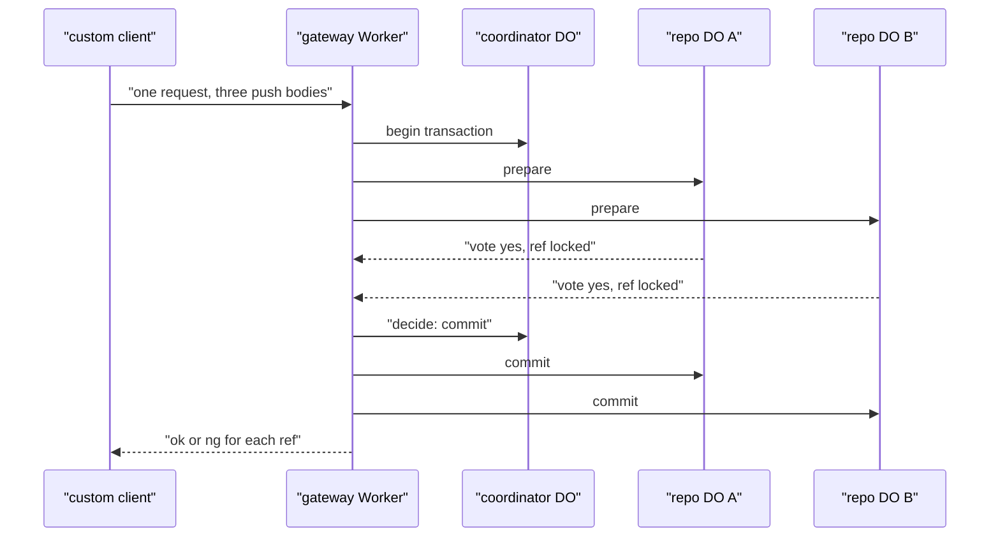

# Cross-repo atomic pushes

> Verdict: **risky** · feasibility 3/5 · reliability 2/5 · correctness 2/5 · effort: weeks
> Read the words in [how-to-read.md](../findings/how-to-read.md). Engineers: [proof](../proofs/cross-repo-atomic-push.md) · [review](../reviews/cross-repo-atomic-push.md)

## What this idea is

Git is a tool that keeps every version of a set of files, and lets many people share those versions. A repository is one project's full set of files and their history. A push is sending your new commits to the server. A commit is one saved version of the files, with a note about what changed. Some changes must land in three repositories together, or not at all. This idea sends three pushes in one request. The server makes sure all three land, or none of them do.

Think of it like this. Three friends want to book seats on the same flight. The travel agent asks each airline desk to hold one seat. Only when all three desks say yes does the agent confirm all three. If any desk says no, the agent releases every held seat.

## How it works

1. A custom client bundles three normal push bodies into one multipart web request and sends it to a gateway Worker. Cloudflare Workers are small programs that run on Cloudflare's network close to the user, with no server to manage.
2. The Worker creates a coordinator Durable Object, keyed by a transaction id. A Durable Object is a single small program with its own storage that handles one thing at a time. There is one DO for each repo. Think of it like the one librarian who is allowed to update the catalog.
3. The Worker calls prepare on each repository's DO at the same time.
4. Each repository DO stores the objects from its pack in R2 under their fingerprints. A packfile is one bundle that holds many objects, squeezed to save space. An object is one stored item in git. An object is a file's content, a folder listing, or a commit. R2 is Cloudflare's large file store. It holds the git objects.
5. Each repository DO checks the old ref values with compare-and-swap. A ref is a name that points at one commit. A branch is a ref. A tag is a ref. Compare-and-swap means: change a value only if it still has the value you expect. If someone changed it first, do nothing and report it.
6. Each repository DO writes a prepared row into DO SQLite, votes yes or no, and sets an alarm for 30 seconds. The prepared row acts as the lock on that ref. DO SQLite is the small database inside each Durable Object. An alarm is a timer inside a Durable Object. A DO has only one alarm at a time.
7. The coordinator records commit or abort in its own DO SQLite before phase two starts.
8. The Worker calls commit or abort on each repository DO. Commit moves the prepared refs in one transaction. Abort drops the prepared rows. Each repository returns a normal git status report with ok or ng for each ref.
9. Alarms recover from crashes. A prepared repository asks the coordinator for the outcome, and an undecided outcome becomes abort. The coordinator calls again any repository that never confirmed.

## What the reviewer decided

The verdict is: risky.

| Score | Value |
|---|---|
| Feasibility | 3 of 5 |
| Reliability | 2 of 5 |
| Correctness | 2 of 5 |

Risky. The idea can be built. But the proof shows one or more problems the reviewer could not fully solve, or it does a weaker version of the goal. Think of it like a runway you can see on the map, but nobody has checked it for holes.

For this idea, the verdict means the following. The coordinator side follows the standard two-phase commit pattern correctly. The coordinator decides once and stores the decision. No repository ever decides alone. The commit step is safe to repeat. Every Cloudflare building block is GA. GA means a Cloudflare feature that is finished and supported, not a preview. The repository side has four blockers. A blocker is a problem that stops the idea from working until it is fixed. One blocker can lose a normal push. Another makes the recovery path dead code. Most important, no normal git client can reach this feature. A normal `git push` cannot send three pushes in one request, so a custom client must be built first. The result is all at once or not at all. But a fetch between the two commit calls can see one repository updated and the other not. A fetch is getting commits from the server. The reviewer listed six caveats. A caveat is a limit or a condition. The idea works, but only inside this limit. The reviewer estimates the work at weeks, on top of the pack parser and the single-repository push.

## Problems that must be fixed first

### Problem 1: A normal push can be silently lost

**What goes wrong.** In prepare, the DO reads the current ref value, then waits on an R2 network call, then writes the prepared row. A Durable Object handles one request at a time only while it waits on its own storage. That rule is the input gate. The input gate is the rule that a Durable Object handles one request at a time while it waits on its own storage. The gate opens when the DO waits on the network instead. During the R2 wait, a normal push to the same repository can run. That push sees no lock, passes its own check, and moves the ref. Then prepare continues with the stale value, writes the lock, and votes yes. Later, commit moves the ref to the transaction's value without checking again.

**Why it matters.** The normal push is overwritten and lost. Nobody is told. Two tasks collide, and the lock does not lock.

**How to fix it.** Do all R2 checks first. Then read the ref value and write the prepared row with no wait between them. Make commit check the ref value again before it moves the ref.

### Problem 2: The recovery path can never run

**What goes wrong.** The coordinator's alarm uses the DO's own name to find the repositories to call again. Inside a Durable Object, that name field is undefined. The alarm calls commit with an undefined id.

**Why it matters.** When the Worker crashes between the two phases, the coordinator cannot finish the work. As written, the recovery path is dead code. Only the repositories' own alarms save the day.

**How to fix it.** Store the repository ids in the coordinator's DO SQLite when the transaction begins and read them in the alarm.

### Problem 3: The alarm collides with cleanup

**What goes wrong.** A DO has only one alarm. Prepare sets a 30 second alarm on the repository DO. That call overwrites the alarm set by the cleanup and repack idea, which is a listed dependency. The cleanup alarm also overwrites the prepare alarm.

**Why it matters.** Either the cleanup never runs, or the transaction never times out. Both are silent.

**How to fix it.** Build one alarm scheduler in the repository DO that keeps a table of timers and always sets the alarm for the earliest one.

### Problem 4: No git client can use this feature

**What goes wrong.** Git has no way to push to several servers in one request. The endpoint does not speak smart HTTP. Smart HTTP is the way git talks to a server over normal web requests. The status report comes back inside a JSON document, which no git client reads.

**Why it matters.** A normal `git push` never reaches this feature. The feature exists only for a custom client that does not exist yet. That is a weaker version of the stated goal.

**How to fix it.** Build a client wrapper that captures the bytes git sends and repackages them. Or design a push option protocol where each of three concurrent pushes waits for the shared decision. The proof only sketches that protocol.

## Things to know

- The gateway Worker reads the whole multipart request into memory, because Workers has no streaming multipart parser. All the packs share the Worker's 128 megabytes. The request body limit sets the largest possible transaction.
- Each repository's 30 second timer starts when its own prepare finishes. If two packs finish more than 30 seconds apart, the fast repository times out and aborts before the coordinator can decide. Such transactions always fail.
- The result is all at once or not at all, but it is not isolated. A fetch between the two commit calls sees repository A updated and repository B not yet updated.
- Coordinator DOs are never deleted, so one DO piles up per transaction. An aborted transaction leaves objects in R2 that nobody points to until the janitor removes them. A janitor is a background task that deletes files nobody points to anymore.
- If the push option variant is built, git expects the status report inside sideband frames once the server announces sideband. A sideband is a way to send two kinds of data in one stream, like a main channel and a progress channel. The proof's bare status lines would be rejected.
- The check that objects are present only looks at the tip commit, not at the whole history. Commit does not check the old ref value again when it moves the ref. The proof asserts that the normal single-repository push respects the prepared table, but never shows that code.

## How this idea connects to the others

- This idea needs one Durable Object per repository to own the refs, from [#1 One Durable Object per repo as the ref authority](./repo-do-ref-authority.md).
- This idea keeps refs in DO SQLite and objects in R2, from [#2 Refs in DO SQLite, objects in R2](./refs-sqlite-objects-r2.md).
- This idea writes objects to R2 under their fingerprint, from [#5 Content-addressed R2 keys](./content-addressed-r2-keys.md).
- This idea extends the two phases of [#6 Two-phase push](./two-phase-push.md) across several repositories.
- This idea relies on streaming pack parsing from [#4 Packfile parsing in a Worker with a streaming inflater](./streaming-pack-parser.md).
- This idea shares one alarm with [#55 GC and repack as a DO alarm](./gc-and-repack-alarm.md) and relies on it to clean up aborted objects.
- This idea checks who may push through [#54 Auth and multi-tenancy: owner/repo routing to DO ids](./auth-and-multitenancy.md).
