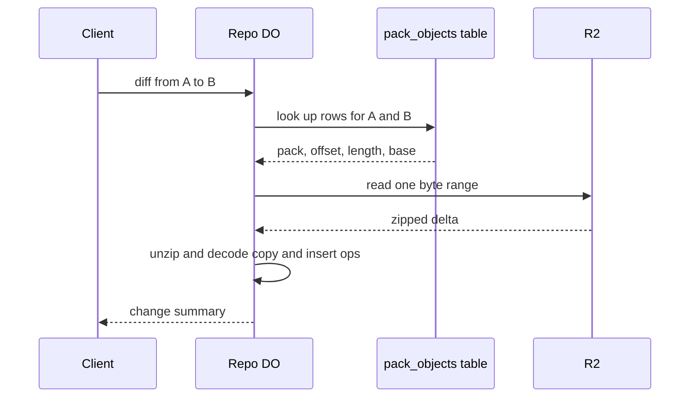

# Diff API served with R2 range reads

> Verdict: **risky** · feasibility 4/5 · reliability 3/5 · correctness 2/5 · effort: weeks
> Read the words in [how-to-read.md](../findings/how-to-read.md). Engineers: [proof](../proofs/diff-api-range-reads.md) · [review](../reviews/diff-api-range-reads.md)

## What this idea is

Git is a tool that keeps every version of a set of files, and lets many people share those versions. A repository, or repo, is one project's full set of files and their history. A diff is a list of what changed between two versions of one file. Normally a server rebuilds both full files and compares them. An object is one stored item in git. An object is a file's content, a folder listing, or a commit. A delta is a stored object written as "the same as that other object, with these changes". This idea reads only the delta from storage. The delta already says which bytes were copied and which bytes were inserted. The server turns that into a change summary without rebuilding the new file.

Think of it like this. A recipe card has a note that says "same as the old recipe, but use two eggs instead of one". You read the note instead of reading both recipes.

## How it works

A packfile, or pack, is one bundle that holds many objects, squeezed to save space. R2 is Cloudflare's large file store. It holds the git objects. A Durable Object, or DO, is a single small program with its own storage that handles one thing at a time. There is one DO for each repo. Think of it like the one librarian who is allowed to update the catalog. DO SQLite is the small database inside each Durable Object. A push is sending your new commits to the server. A SHA, or hash, is a fingerprint of an object's content. Two objects with the same content have the same fingerprint.

1. At push time, the pack parser records one row per object in a pack_objects table in DO SQLite. The row says which pack holds the object, at what offset, how long the entry is, and which base object the delta uses.
2. A client asks for the diff between two file versions, called from and to.
3. The DO looks up both rows. If to is stored as a delta whose base is from, the fast path applies.
4. The DO reads one byte range from the pack in R2, unzips the delta, and decodes the copy and insert instructions.
5. The DO returns the list of instructions as the change summary. The to file is never rebuilt.
6. A full line-by-line diff also needs the base file, which costs one more read.
7. If the base is a different object, the DO falls back to two reads plus a line diff in the Worker. The reply says so.

## What the reviewer decided

The reviewer's verdict is Risky.

| Score | Value |
|---|---|
| Feasibility | 4 of 5 |
| Reliability | 3 of 5 |
| Correctness | 2 of 5 |

Risky. The idea can be built. But the proof shows one or more problems the reviewer could not fully solve, or it does a weaker version of the goal. Think of it like a runway you can see on the map, but nobody has checked it for holes.

For this idea, the mechanism is sound and cheap. One byte range read per pack entry, then decode the delta. GA, or generally available, means a Cloudflare feature that is finished and supported, not a preview. Every Cloudflare feature used is GA. The endpoint only reads, so no ref or object can be lost. A blocker is a problem that stops the idea from working until it is fixed. But the other ideas in this design store whole objects and packs with no deltas, so the fast path never fires. And even with deltas, the zero-read answer is a compression script, not a diff. What lands is a weaker version of the stated goal. The reviewer expects weeks of work for the endpoint, and months if the delta-producing repack is counted.

## Problems that must be fixed first

### Problem 1: No pack stores deltas

**What goes wrong.** The idea assumes that packs in R2 already store deltas. In this design that is false. The pack parser resolves every delta and writes whole objects. The GC and repack idea writes packs with no deltas. The repack that would store each file as a delta against the same file's earlier version does not exist in any other idea. Building that encoder inside a 30 second alarm needs heavy chunking.

**Why it matters.** The fast path hits about 0 percent of requests today.

**How to fix it.** Build a repack that makes deltas and picks the same-path earlier version as the base. This is weeks or months of work, and the reviewer did not solve the problem.

### Problem 2: A delta is not a diff

**What goes wrong.** Git makes deltas to save space, not to describe changes. Copy instructions can be out of order, can overlap and can repeat. Unchanged runs shorter than 16 bytes show up as inserts. So the count of inserted bytes and the list of dropped base ranges disagree with the numbers from git diff.

**Why it matters.** Only "changed or not changed" can be trusted from the fast path. A readable diff still needs the base file, and that can mean walking a chain of deltas. What lands is a weaker version of the goal.

**How to fix it.** Treat the fast path as a change flag only. Rebuild the base file for any real diff.

## Things to know

A caveat is a limit or a condition. The idea works, but only inside this limit.

- The proof assumes that the unzip step in Workers tolerates extra trailing bytes, and that is not verified. Store the exact compressed length instead.
- The fallback path holds every link of a delta chain in memory at once. A large file with a deep chain can then exceed the 128 MB DO limit, so a size cap is needed.
- A pack_objects row must become visible only after the R2 write completes, and old packs need one GC cycle of grace. Otherwise a diff read hits a missing key and the code throws.
- The delta parser's offset math goes negative in JavaScript for base offsets of 2 GiB or more. The last entry's length must exclude the 20 byte pack trailer.
- Decoding delta inserts as text mangles binary files and split UTF-8 characters.
- The step from a commit pair to a list of file pairs is left out. That step is where most R2 reads and DO time actually land.

## How this idea connects to the others

This idea needs [#4 Packfile parsing in a Worker with a streaming inflater](./streaming-pack-parser.md) to keep raw deltas and fill the pack_objects table.

This idea keeps the pack_objects table next to the refs, as set out in [#2 Refs in DO SQLite, objects in R2](./refs-sqlite-objects-r2.md).

This idea needs a delta-producing repack from [#55 GC and repack as a DO alarm](./gc-and-repack-alarm.md), which does not exist yet.

This idea can skip a read when the base file sits in [#9 Tiny in-DO object cache with alarm-driven eviction](./in-do-object-cache.md).
