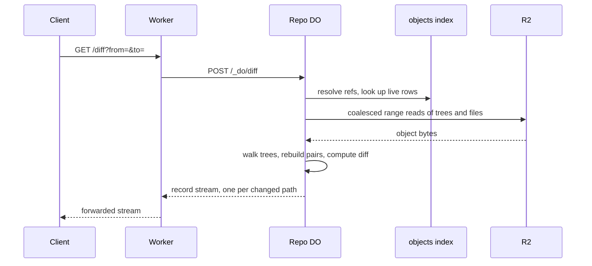

# Diff API served with R2 range reads

> Verdict: **risky** · feasibility 4/5 · reliability 3/5 · correctness 2/5 · effort: weeks
> Read the words in [how-to-read.md](../findings/how-to-read.md). Engineers: [proof](../proofs/diff-api-range-reads.md) · [review](../reviews/diff-api-range-reads.md)

## What this idea is

Git is a tool that keeps every version of a set of files, and lets many people share those versions. A repository, or repo, is one project's full set of files and their history. A diff is a list of what changed between two versions of one file. An object is one stored item in git. An object is a file's content, a folder listing, or a commit.

This idea adds a web endpoint that answers which files changed between two versions, and how. The server finds the files that differ and reads only the bytes of those files out of the object store. The server rebuilds both versions and computes the diff. A delta is a stored object written as "the same as that other object, with these changes". The first pass of this idea tried to answer the diff from stored deltas alone. The shared contract stores no deltas, so the second pass rebuilds both sides instead.

Think of it like this. A library binds every draft of every letter into one big volume. To compare two drafts of one letter, the librarian copies only the pages of that letter and lays them side by side. The rest of the volume stays on the shelf.

## How it works

The second pass writes the design in Rust, against one shared contract that every idea in this set follows. Cloudflare Workers are small programs that run on Cloudflare's network close to the user, with no server to manage. A Durable Object, or DO, is a single small program with its own storage that handles one thing at a time. There is one DO for each repo. Think of it like the one librarian who is allowed to update the catalog. DO SQLite is the small database inside each Durable Object.

A packfile, or pack, is one bundle that holds many objects, squeezed to save space. R2 is Cloudflare's large file store. It holds the git objects. A ref is a name that points at one commit. A branch is a ref. A tag is a ref.

1. A client calls GET /:owner/:repo/diff?from=&to= at the edge. Each argument is a fingerprint or a ref name such as HEAD. A SHA, or hash, is a fingerprint of an object's content. Two objects with the same content have the same fingerprint. The Worker passes the pair to the repo's DO as a POST to /_do/diff.
2. The DO turns each argument into an object fingerprint. A ref name is looked up in the refs table in DO SQLite. A bad name answers 400 and an unknown fingerprint answers 404, before any byte is read.
3. The DO peels each side to a tree or a file. Commits and tags are followed to their targets, at most 8 hops, with one lookup and one range read per hop.
4. If both sides are files, they become one pair. If both sides are trees, the DO walks the two trees side by side. Each step reads the missing trees in one coalesced range read and compares the entries. Every changed file becomes a pair with its path.
5. The reply is a stream of records, one record per line. A header record comes first. Then one record per changed path. A trailer record comes last, with the path count and the subrequest count. A subrequest is one call from a Worker to another service, such as one read from R2.
6. For each batch of up to 32 pairs, the DO asks the objects index where each file's bytes live. The index returns live rows only. Then one call to R2 reads all the ranges in the batch.
7. The DO rebuilds both sides of each pair in memory, up to 16 MiB per side. The DO then computes the diff with the histogram algorithm, the same family git diff uses. A pair that changed only its mode emits a record with no hunks. A binary file emits a record that says binary, with no patch.
8. A failure inside the stream becomes one error record, then the stream ends. More than 64 MiB of decoded bytes ends with a truncated record. More than 20,000 changed paths ends with an error record. The route writes nothing, so a crash leaves nothing behind.

## What the reviewer decided

The reviewer looks for blockers and caveats. A blocker is a problem that stops the idea from working until it is fixed. A caveat is a limit or a condition. The idea works, but only inside this limit.

The verdict is Lands with caveats.

| Score | Value |
|---|---|
| Feasibility | 4 of 5 |
| Reliability | 3 of 5 |
| Correctness | 2 of 5 |

| Score | First pass | Second pass |
|---|---|---|
| Feasibility | 4 of 5 | 4 of 5 |
| Reliability | 3 of 5 | 4 of 5 |
| Correctness | 2 of 5 | 3 of 5 |

Lands with caveats. The idea is sound and can be built. The proof has one or more problems that must be fixed first, and the reviewer described each fix. Think of it like a flight with a runway that needs some repairs before you land. The runway is there. The repairs are known.

For this idea, the second pass moved up from Risky. Both first-pass blockers are gone by the shape of the design. The contract stores every object whole and forbids stored deltas, so the missing delta encoder is no longer needed. The hunks are now computed by a real diff algorithm over rebuilt files, not read off a compression script. The route writes nothing, so every race ends as a clean record instead of a crash. What remains is local. One case loses a deletion record, one diff library call does not compile, and the patch text is not yet something git apply can use. The old promise of answering a diff without rebuilding files is gone, and the proof says so plainly. What lands is an ordinary diff endpoint with a fast read path. The reviewer still expects weeks of work, because the fixes are small and the route is in final shape.

## What changed in the second pass

- No delta-storing pack exists in the foundation: fixed by the contract. The contract stores every object whole in packs and forbids delta compression at rest. The proof drops the fast path instead of building a delta encoder.
- Delta ops are not a diff: fixed. No compression instructions are decoded anywhere. The hunks come from the histogram algorithm over the real contents of both files.
- The unzip step relied on unverified tolerance for trailing bytes: fixed. The index row stores the exact length of each entry, and the decoder unzips exactly those bytes.
- The fallback path could exceed the 128 MB memory limit: fixed. Delta chains no longer exist, and fixed caps bound what one request can hold and decode.
- A row had to appear only after the R2 write, with old packs kept for one sweep: fixed by the contract. A row turns live only after the upload finishes, and a deleted pack keeps its bytes for one hour, longer than any request.
- Decoding delta inserts as text mangled binary files: fixed. A NUL byte in the first 8,000 bytes, or text that fails to decode, marks the file as binary. No patch is sent for a binary file.
- The step from a commit pair to file pairs was left out: partly fixed. Real code now walks the two trees and lists the changed files. But the walk drops the deletion record when a file is replaced by a directory.
- A read could hit a missing key and throw: fixed. Lookups return live rows only, and a row swept mid-request becomes an omitted record or one error record.
- Thin-pack deltas arrived on push but were never stored: fixed. The endpoint does not want delta bytes at all anymore.
- The table rewrite during repack needed one transaction nobody specified: fixed. There is no such table and no repack in this design.
- A diff over many files meant one read per file on one program: partly fixed. Reads now group into coalesced range reads, but the budget charges per span, so the worst case is higher than the proof's count. All diffs on one repo still share one program.

## Problems that must be fixed first

### Problem 1: A file replaced by a directory loses its deletion record

**What goes wrong.** When a path changes from a file to a directory, the tree walk pushes the new directory but skips the record for the old file. The reply lists the added files under the directory but never says the file at that path was deleted.

**Why it matters.** A client that applies the records to the old version keeps a file that git deleted. The diff is silently incomplete on a common case.

**How to fix it.** Emit a deletion pair for the old file before pushing the new directory. The fix is one added line.

### Problem 2: The diff library calls do not compile

**What goes wrong.** The code calls the diff library with names from version 0.1. The pinned version 0.2.0 has a different call shape, so the file does not build as written.

**Why it matters.** The rewrite is mechanical but larger than the one line the proof claims. The patch text also has no file header lines, so git apply cannot use the patch. The test that checks each patch with git apply cannot run.

**How to fix it.** Rewrite the call for the 0.2.0 interface, including the optional pass that places hunks the way git does. Add the file header lines to each patch so git apply can consume the bytes.

### Problem 3: Calls to the object-parsing library use wrong names

**What goes wrong.** Three parse calls miss a second argument that names the hash kind. One call reads a field where a method is needed. Two more calls use names that do not exist in the pinned version.

**Why it matters.** The file does not build until all of these are fixed. Every fix is mechanical, and a sibling idea needs the same set of fixes.

**How to fix it.** Pass the hash kind to each parse call. Call the method instead of the field. Rename the two wrong names to the pinned ones.

## Things to know

- The proof counts one subrequest per read call, but the budget charges one per span inside each call. The worst case is about 64 times the stated count. The diff still ends cleanly, with one error record.
- Headers are sent before the stream finishes, so the subrequest count cannot travel in a header. The trailer record at the end of the stream is the only place the count appears.
- The helper that turns an error into a response has two different shapes across the proofs. The stream's error type also needs a conversion that no sibling shows. One shape must be picked.
- The whole tree walk runs before the first record is sent. A large diff delivers the header, then a pause, then the records.
- The idea's old promise is gone. Both sides of every changed file are fully rebuilt, up to 16 MiB each. What remains ahead of an ordinary diff endpoint is the read path, because every byte comes from an indexed range read.
- A short name like main passes the name check but finds no ref, so the answer is a 404. A 64-character fingerprint also answers 404. A corrupt ref target reports 400 where 500 is the right code.
- Several parts are unverified at run time. These are the URL query reader, the request constructor used to call the DO, and the stream helpers under the chosen feature flags. Real R2 range behavior and the DO subrequest limit are unverified too.

## How this idea connects to the others

- The DO route and the streaming response shape sit next to the fetch route from [#1 One Durable Object per repo as the ref authority](./repo-do-ref-authority.md).
- The objects index, the live-only lookup, and the coalesced range reads come from [#2 Refs in DO SQLite, objects in R2](./refs-sqlite-objects-r2.md).
- The pack entry decoding shares the object libraries used by [#4 Packfile parsing in a Worker with a streaming inflater](./streaming-pack-parser.md).
- The edge route and the read login check come from [#54 Auth and multi-tenancy: owner/repo routing to DO ids](./auth-and-multitenancy.md).
- The first pass needed a delta-producing repack from [#55 GC and repack as a DO alarm](./gc-and-repack-alarm.md). The second pass needs no repack.
