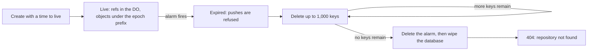

# Ephemeral repos with a self-destruct alarm

> Verdict: **lands with caveats** · feasibility 4/5 · reliability 2/5 · correctness 3/5 · effort: days
> Read the words in [how-to-read.md](../findings/how-to-read.md). Engineers: [proof](../proofs/ephemeral-repos.md) · [review](../reviews/ephemeral-repos.md)

## What this idea is

Git is a tool that keeps every version of a set of files, and lets many people share those versions. A repository, or repo, is one project's full set of files and their history. This idea creates a repo that lives for a set time, such as one hour. When the time runs out, the repo deletes all of its stored files and its own records. After that, git reports that the repo does not exist. A new repo with the same name can be created later, and the new repo starts clean.

Think of it like this. A sandcastle stands on the beach until the tide comes in. The tide washes the castle away on a schedule. The next day, someone can build a new castle in the same spot.

## How it works

1. A user creates the repo with a web request that names a time to live. The request reaches a Worker. Cloudflare Workers are small programs that run on Cloudflare's network close to the user, with no server to manage.
2. The Worker sends the request to the repo's Durable Object. A Durable Object, or DO, is a single small program with its own storage that handles one thing at a time. There is one DO for each repo. Think of it like the one librarian who is allowed to update the catalog.
3. The DO writes a meta record into DO SQLite. DO SQLite is the small database inside each Durable Object. The record holds a life number, called an epoch, and the expiry time.
4. The DO sets an alarm for the expiry time. An alarm is a timer inside a Durable Object. A DO has only one alarm at a time.
5. Every push stores its objects in R2 under a prefix that holds the repo name and the epoch. A push is sending your new commits to the server. A commit is one saved version of the files, with a note about what changed. An object is one stored item in git. An object is a file's content, a folder listing, or a commit. R2 is Cloudflare's large file store. It holds the git objects.
6. A push usually arrives as one packfile. A packfile, or pack, is one bundle that holds many objects, squeezed to save space.
7. When the alarm fires, the DO first marks the repo as expired. A push still in flight then fails its ref update with the message "repo expired". A ref is a name that points at one commit. A branch is a ref. A tag is a ref. A branch is a named line of commits, like a bookmark that moves forward as you save.
8. The DO lists up to 1,000 keys under the prefix and deletes them in one call. If more keys remain, the DO saves its place and sets a new alarm at once.
9. When no keys remain, the DO deletes its alarm and then wipes its whole database.
10. A later fetch gets a 404 answer, and git prints "repository not found". A fetch is getting commits from the server. A clone gets everything for the first time.
11. A later create request gets a new epoch. So its keys never collide with a deletion that is still running.

## What the reviewer decided

The reviewer looks for blockers and caveats. A blocker is a problem that stops the idea from working until it is fixed. A caveat is a limit or a condition. The idea works, but only inside this limit. The reviewer's verdict is "Lands with caveats."

| Score | Out of 5 |
|---|---|
| Feasibility | 4 |
| Reliability | 2 |
| Correctness | 3 |

Lands with caveats means the following. The idea is sound and can be built. The proof has one or more problems that must be fixed first, and the reviewer described each fix. Think of it like a flight with a runway that needs some repairs before you land. The runway is there. The repairs are known.

For this idea, the reviewer said the design has the right shape. The alarm chain deletes one page of keys per run, resumes from a saved place, and keeps each repo life under its own prefix. Every Cloudflare feature used is GA. GA, or generally available, means a Cloudflare feature that is finished and supported, not a preview. The reviewer walked through a crash in the middle of deletion and found no data loss. The reviewer also confirmed that a normal git client works with the create and expire steps.

But the code as pasted has three bugs. After expiry, the DO would return a 500 error instead of a 404. Objects would land under the wrong prefix. And storage would leak when a repo is re-created while its deletion is still running. Each bug is a small fix, but all three must land before the mechanism works.

The reviewer found three blockers and seven caveats. The reviewer expects days of work on top of the ideas this one depends on. One caveat mentions the sideband. A sideband is a way to send two kinds of data in one stream, like a main channel and a progress channel. Another caveat mentions content-addressed keys. Content-addressed means stored under its own fingerprint, so the name tells you what is inside.

## Problems that must be fixed first

### Problem 1: The repo name is empty inside the DO

**What goes wrong.** The code reads the repo name from the DO's own id field. Inside a DO that was created from a name, that field is empty. So the R2 prefix becomes "repos/undefined/<epoch>/" for every repo.

**Why it matters.** The prefix is what the deletion step lists and deletes. Every repo would share one wrong prefix, so the promise that each repo life owns its prefix alone breaks.

**How to fix it.** Pass the repo name in the create request. Store the name in the meta record. Build the R2 prefix from the stored name, never from the id.

### Problem 2: Requests after expiry crash instead of answering 404

**What goes wrong.** The last step wipes the whole database, which also drops the tables the DO created at startup. The DO stays alive in memory for a while after that. Every later request on that live DO fails with "no such table: meta" and returns a 500 error, not the promised 404.

**Why it matters.** Git prints "repository not found" only on a 404. A 500 looks like a server outage to the user and to any script. The wrong answer lasts until Cloudflare evicts the DO from memory.

**How to fix it.** Create the tables again on every request, or right after the wipe. Then a request after expiry finds no meta record and returns 404.

### Problem 3: Re-creating a repo during deletion leaks files

**What goes wrong.** The create request is allowed while the repo is in the expired state. The create request overwrites the old meta record and sets a new alarm. A DO has only one alarm at a time, so the new alarm replaces the deletion alarm. The old epoch's remaining R2 keys are never deleted.

**Why it matters.** Storage leaks for ever, and no other task cleans it up. The proof claims that epochs never collide, and that claim is true. But the old life's files still leak.

**How to fix it.** Refuse the create request with a 409 answer while the state is expired. Or keep a table of pending epochs and finish each deletion before setting a new alarm.

## Things to know

- A push whose pack lands in R2 after the alarm's last list page leaves that pack behind for ever. The fix is a table of pending keys that the alarm drains, or one extra list pass after the DO refuses writes.
- Cloudflare retries a failing alarm only about six times, so a long R2 outage leaves a zombie repo with objects in R2 and no alarm. The design needs a backstop, such as an R2 lifecycle rule on a date-based prefix or a scheduled cleanup task.
- The time to live is "at least one hour", not exactly one hour, because alarms can run late. The proof documents this limit.
- Each repo life must own its R2 prefix alone, so the idea cannot share objects across repos. The idea does not work with global deduplication or with content-addressed keys shared across repos, and the proof documents this limit.
- The push reply is wrapped in a sideband even when the client did not ask for one, so such a client reads garbage. The advertised feature list also lacks "delete-refs", so a normal git push that deletes a branch is refused on the client side.
- The push handler holds the whole pack in memory, so a large push exceeds the DO limit of 128 MB. The fix waits on the streaming pack parser idea.
- Cloudflare cannot delete a DO's identity, only its storage. The name stays wakeable with empty storage, and the proof documents this as unavoidable.

## How this idea connects to the others

This idea needs [#1 One Durable Object per repo as the ref authority](./repo-do-ref-authority.md), because that DO owns the refs, the meta record, and the alarm.

This idea needs [#2 Refs in DO SQLite, objects in R2](./refs-sqlite-objects-r2.md), because refs live in the DO and objects live under the R2 prefix.

This idea needs [#54 Auth and multi-tenancy: owner/repo routing to DO ids](./auth-and-multitenancy.md), because the create request must reach the right DO by name.

This idea needs [#53 The /info/refs?service= entrypoint and pkt-line codec](./info-refs-endpoint.md), because the 404 answer on that entry point tells git the repo is gone.

This idea needs [#4 Packfile parsing in a Worker with a streaming inflater](./streaming-pack-parser.md), because real pushes must stream the pack, not hold it in memory.

This idea can use [#28 Rate-limited, token-scoped remote URLs](./scoped-token-remotes.md), because a token with a time limit is one way to create the repo.
