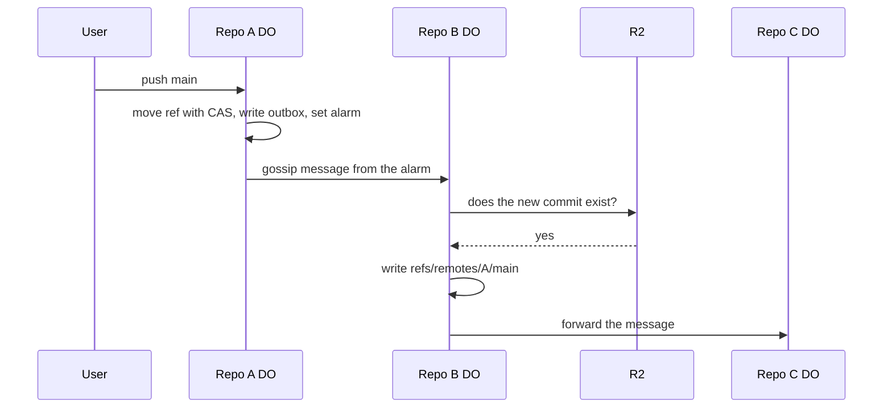

# Federated remotes via DO-to-DO gossip

> Verdict: **risky** · feasibility 3/5 · reliability 2/5 · correctness 3/5 · effort: weeks
> Read the words in [how-to-read.md](../findings/how-to-read.md). Engineers: [proof](../proofs/federated-gossip.md) · [review](../reviews/federated-gossip.md)

## What this idea is

Git is a tool that keeps every version of a set of files, and lets many people share those versions. A repository, or repo, is one project's full set of files and their history. Most git setups have one central server that holds the main copy of a repo. This idea removes the central server. Instead, each repo keeps a list of peer repos. When a branch moves in one repo, that repo tells its peers, and the peers tell their peers.

Think of it like this. In a village with no newspaper, each person tells the news to two neighbours. Soon the whole village knows the news, and nobody was in charge of spreading it.

## How it works

A commit is one saved version of the files, with a note about what changed. A branch is a named line of commits, like a bookmark that moves forward as you save. A ref is a name that points at one commit. A branch is a ref. A tag is a ref. Push is sending your new commits to the server. A Durable Object, or DO, is a single small program with its own storage that handles one thing at a time. There is one DO for each repo. Think of it like the one librarian who is allowed to update the catalog.

1. A user pushes to repo A. The DO for repo A moves the branch with compare-and-swap. Compare-and-swap, or CAS, means: change a value only if it still has the value you expect. If someone changed it first, do nothing and report it.
2. In the same database write, the DO adds one message for each peer to an outbox table. An outbox is a list of messages that wait to be sent.
3. The DO sets an alarm. An alarm is a timer inside a Durable Object. A DO has only one alarm at a time. When the alarm fires, the DO sends each outbox message to the peer's DO.
4. The peer checks whether it has seen the message before. The check uses the name of the origin repo and a message number.
5. The peer checks that the new commit exists in R2. R2 is Cloudflare's large file store. It holds the git objects. An object is one stored item in git. An object is a file's content, a folder listing, or a commit. If the commit is missing, the peer fetches the missing objects from the origin repo.
6. The peer writes the new tip under a tracking name, such as refs/remotes/A/main. The peer never changes its own branches.
7. The peer forwards the message to its own peers. The peer skips the peers the message already visited.
8. Every five minutes, a repair task compares branch lists with one random peer. The repair task resends any message that was lost.

## What the reviewer decided

The reviewer's verdict is Risky.

| Score | Value |
|---|---|
| Feasibility | 3 of 5 |
| Reliability | 2 of 5 |
| Correctness | 3 of 5 |

Risky. The idea can be built. But the proof shows one or more problems the reviewer could not fully solve, or it does a weaker version of the goal. Think of it like a runway you can see on the map, but nobody has checked it for holes.

The proof is the small test program the study wrote to check the idea. For this idea, the core mechanics are sound. The outbox, the alarm, and the check for repeated messages all use Cloudflare features that are finished and supported. But the proof code has one bug that stops it from running at all. The proof also lets a tip move backwards, and its repair task misses some peers. What the proof delivers is also weaker than the goal. A peer gets tracking names, not a true mirror. A normal git clone from a peer does not see the tracking names. The reviewer expects the fixes to take weeks.

## Problems that must be fixed first

A blocker is a problem that stops the idea from working until it is fixed. The reviewer found four blockers.

### Problem 1: The repo does not know its own name

**What goes wrong.** The code reads the repo's name from a field called ctx.id.name inside the Durable Object. Inside a DO, that field is empty. So every message says its origin is "undefined". The check for repeated messages uses the origin name and the message number. With every origin merged into one name, the check drops most updates.

**Why it matters.** The whole design depends on knowing where each message came from. As written, the code does not work at all. A peer receives a message from repo A, then drops the next message from repo B with the same number.

**How to fix it.** Store the repo's name in the DO's own database on the first request. Read the name from that database each time.

### Problem 2: A tip can move backwards

**What goes wrong.** Repo A pushes twice, so message 4 and message 5 both leave repo A. Repo C gets message 5 first, straight from A, and records the newer tip. Then message 4 arrives through repo B on a longer path. The code writes the older tip without any check, so the tracking name for C now points at the older commit.

**Why it matters.** A peer can show a branch that has gone back in time. Nothing compares the old value in the message with the current value. Nothing checks that message numbers only go up. If A is not a direct peer of C, the repair task never corrects the tip.

**How to fix it.** For each origin and ref, keep the highest message number seen. Reject any message with a lower number. Also use CAS on each tracking name. Write the new value only if the current value matches the old value in the message.

### Problem 3: The repair task only checks direct peers

**What goes wrong.** Every five minutes a repo compares branch lists with one random peer. The comparison covers only the peer's own branches, under refs/heads. The comparison never covers the peer's tracking names, under refs/remotes. So a lost message about a repo two hops away is never repaired.

**Why it matters.** The proof claims a dropped message cannot leave a mirror stale forever. That claim is false for any origin that is not a direct peer. Such a tip stays wrong until the origin pushes again.

**How to fix it.** Include the tracking names in the repair comparison. Then a peer can repair a tip for any origin it knows about.

### Problem 4: A foreign fetch blocks the sender

**What goes wrong.** When a peer is on a different Cloudflare deployment, the receiver must fetch the missing objects over the web. Fetch means getting commits from the server. The proof does that fetch inside the same call that the sender's alarm is waiting on. So the sender's alarm waits for the whole transfer. One slow peer stops the sender's outbox from draining. The fetch also runs inside one call with a 128 MB memory limit and a 30 second CPU limit.

**Why it matters.** A single large first sync can stall or fail every other peer's updates. The memory and CPU limits can make a large transfer fail.

**How to fix it.** Make the receiver accept the message at once and reply. Then do the fetch later inside the receiver's own alarm. Split a large fetch across several alarm wakes.

## Things to know

A caveat is a limit or a condition. The idea works, but only inside this limit.

- A clone gets everything from a server for the first time. A normal git clone asks only for refs/heads and refs/tags, so it never sees the tracking names under refs/remotes. Users must ask for those names with an explicit refspec, and the peer's fetch service must treat refs/remotes as valid starting points.
- The origin name is "owner/repo", and two deployments can both host a repo with that name. Cross-deployment checks for repeated messages need a name that is unique world-wide.
- The table of seen messages grows forever, and the repair task's made-up messages are never cleaned up. Both need a janitor, which is a background task that deletes files nobody points to anymore.
- Tags are never sent to peers. The push code queues any ref, but the list and repair code cover only refs/heads.
- Adding a peer needs no login or permission, so anyone can make a repo mirror anything. The proof admits this gap.
- The check that a commit exists reads one object per fingerprint from R2. If related ideas store objects in bundles, the check needs a bundle index instead.
- The code that reads the fetch reply from a foreign server is left out. The reply contains a packfile section, a sideband stream, and extra sections that the proof does not parse.

## How this idea connects to the others

- This idea needs one DO per repo to own the refs, from [#1 One Durable Object per repo as the ref authority](./repo-do-ref-authority.md).
- This idea keeps refs in the DO database and objects in R2, from [#2 Refs in DO SQLite, objects in R2](./refs-sqlite-objects-r2.md).
- This idea checks that a commit exists by its fingerprint, from [#5 Content-addressed R2 keys](./content-addressed-r2-keys.md).
- This idea writes the outbox in phase two of a push, from [#6 Two-phase push](./two-phase-push.md).
- This idea reads a foreign server's pack with the parser from [#4 Packfile parsing in a Worker with a streaming inflater](./streaming-pack-parser.md).
- This idea talks to foreign servers with the newer message set, from [#3 Speak git protocol v2 only, translate v0 at the edge](./protocol-v2-only.md).
- This idea needs login and permission checks on peer lists, from [#54 Auth and multi-tenancy: owner/repo routing to DO ids](./auth-and-multitenancy.md).
