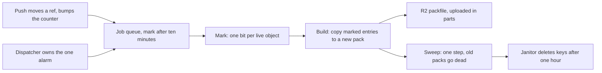

# GC and repack as a DO alarm

> Verdict: **risky** · feasibility 3/5 · reliability 2/5 · correctness 2/5 · effort: weeks
> Read the words in [how-to-read.md](../findings/how-to-read.md). Engineers: [proof](../proofs/gc-and-repack-alarm.md) · [review](../reviews/gc-and-repack-alarm.md)

## What this idea is

git is a tool that keeps every version of a set of files, and lets many people share those versions. A repository is one project's full set of files and their history. Over time a repository collects stored items that nothing points to anymore, such as the leftovers of a rejected upload. A repository also collects thousands of small items that would be faster to serve as one bundle. This idea runs a cleanup in the background, with no server to manage. The cleanup finds every item still in use, writes those items into one bundle, and deletes the rest.

Think of it like this. A gardener prunes a fruit tree once a season. The gardener follows each living branch from the fruit back to the trunk, and cuts off every dead twig that leads to no fruit.

## How it works

The second pass writes the design in Rust, against one shared contract that every idea in this set follows. Wasm, or WebAssembly, is a way to run code from other languages, such as Rust, inside a Worker.

1. A commit is one saved version of the files, with a note about what changed. A ref is a name that points at one commit. A branch is a ref. A tag is a ref. A branch is a named line of commits, like a bookmark that moves forward as you save. A push is sending your new commits to the server.
2. A Durable Object, or DO, is a single small program with its own storage that handles one thing at a time. There is one DO for each repo. Think of it like the one librarian who is allowed to update the catalog. DO SQLite is the small database inside each Durable Object. An alarm is a timer inside a Durable Object. A DO has only one alarm at a time.
3. The one alarm belongs to a shared job dispatcher inside the DO. Every feature adds rows to one job table, and the dispatcher runs one slice of work at a time. Each push moves a ref inside the DO, bumps a counter named refs_version, and queues a mark job for ten minutes later. The queue keeps at most one waiting job of each kind.
4. An object is one stored item in git. An object is a file's content, a folder listing, or a commit. GC is a background task that deletes files nobody points to anymore. GC runs as a chain of three jobs named mark, build, and sweep. Each job does a bounded slice, saves its position in DO SQLite, and continues on the next alarm firing. A job that dies mid-slice replays the same work, because every step is safe to repeat.
5. Mark job. Every object already lives inside a packfile in R2. A packfile, or pack, is one bundle that holds many objects, squeezed to save space. R2 is Cloudflare's large file store. It holds the git objects. A table in DO SQLite lists where each object sits inside its packfile. The job starts from every ref and follows each link from one object to the next.
6. The job reads the stored bytes of commits, tags, and folder listings to find each link. File contents are marked without being read. Each found object sets one bit in the bitmap of the packfile that holds the object. A bitmap covers only the candidate packfiles, which are the packfiles at least one hour old when the mark begins. One object sets at most one bit, so the count of marked entries is exact.
7. Build job. The job copies each marked entry into one new packfile, byte for byte, with no unsqueeze or squeeze. A delta is a stored object written as "the same as that other object, with these changes". The contract stores no deltas, so any subset of entries is a valid packfile. The job uploads the new packfile to R2 in parts of at least 5 MB. After each part, the job records the part and the position in the same step.
8. A SHA, also called a hash, is a fingerprint of an object's content. Two objects with the same content have the same fingerprint. The packfile ends with a fingerprint of all its bytes. The job keeps the half-done fingerprint as plain saved state, so a restarted job resumes the same upload with the same bytes.
9. Sweep job. The input gate is the rule that a Durable Object handles one request at a time while it waits on its own storage. The gate opens when the DO waits on the network instead. The sweep is one step that never waits on the network, so no push can slip inside the step.
10. The sweep first checks the ref counter. If any ref moved during the chain, the sweep throws away the work and queues a fresh mark. Otherwise the sweep marks every candidate packfile dead, deletes its index rows, and bumps a second counter named gc_epoch, all at once or not at all. A push that began before the sweep and commits after sees the new counter and gets a clear retry message.
11. A janitor deletes the dead keys in R2 one hour later. A janitor is a background task that deletes files nobody points to anymore. A fetch that resolved its reads before the sweep still finds the bytes. Fetch means getting commits from the server. A clone gets everything for the first time. The new packfile is an ordinary packfile, so the clone path from idea #7 serves it like a packfile from any push.

## What the reviewer decided

The reviewer looks for blockers and caveats. A blocker is a problem that stops the idea from working until it is fixed. A caveat is a limit or a condition. The idea works, but only inside this limit.

The verdict is Lands with caveats.

| Score | Value |
|---|---|
| Feasibility | 4 of 5 |
| Reliability | 3 of 5 |
| Correctness | 3 of 5 |

| Score | First pass | Second pass |
|---|---|---|
| Feasibility | 3 of 5 | 4 of 5 |
| Reliability | 2 of 5 | 3 of 5 |
| Correctness | 2 of 5 | 3 of 5 |

Lands with caveats. The idea is sound and can be built. The proof has one or more problems that must be fixed first, and the reviewer described each fix. Think of it like a flight with a runway that needs some repairs before you land. The runway is there. The repairs are known.

For this idea, the verdict moved from Risky to Lands with caveats, and every score moved up. All four first-pass blockers are genuinely closed. The sweep is atomic by construction, the alarm belongs to the shared dispatcher, and the stored form matches the contract exactly. The resumable build is shown in code, with a correct fingerprint, instead of asserted. Feasibility rose because every platform call the code makes exists in the worker library.

The remaining work is small and local. Three blockers stay open, and all three fixes are mechanical. The rebuilt packfile's rows never get their position numbers. An abort during the mark can never re-queue the mark. The resume signature disagrees with the sibling idea. The reviewer still expects weeks of work.

## What changed in the second pass

- The mismatch with the sibling ideas is fixed. The old storage model is gone. The mark walks the shared index of objects inside packfiles, the links come from the stored bytes, and the build writes an ordinary packfile that the clone path serves by design.
- The sweep race is fixed. The sweep is one step with no waits and no R2 calls. The counter check, the row deletes, and the epoch bump land together or not at all. The janitor deletes the R2 keys one hour later.
- The stall that could stop the job for good is partly fixed. There is no latch anymore. The job row keeps the chain alive, dead jobs restart at boot, and errors back off. But an abort during the mark never re-queues the mark, and stale running rows need a restart rule the contract does not have yet.
- The fight for the single alarm is fixed by the contract modules. This module never sets the alarm. GC is three job rows in the shared queue, and the dispatcher alone sets the alarm.
- The oversized output buffer is fixed. The part buffer lives only in the pack writer's memory. The saved state is a small position record, one row per uploaded part, and one bitmap per candidate packfile.
- The doubling of storage is partly fixed. Dead bytes are truly deleted after the grace hour, and duplicate copies collapse to one entry. Live bytes still never shrink, because the contract has no delta search.
- The cost of one read and one squeeze per object is fixed. Reads are coalesced ranges over the packfiles, file contents are never read, and entries are copied byte for byte.
- The expiring multi-part upload is fixed. A check on the key tells a finished upload from a dead one. After two dead uploads, the job wipes the build and restarts from the intact marks.
- The fingerprint that was asserted but not shown is fixed. The code is shown in full and checked against the standard test values.
- The packfile that could end up short, or missing its trailer, is fixed. One object sets at most one bit, so the header count is exact. The writer appends the 20-byte fingerprint before completing the upload.
- The cleanup that could starve on a busy repository is still open. A repository pushed faster than a full chain still never sweeps. The reviewer kept this limit by design.

## Problems that must be fixed first

### Problem 1: The new packfile's rows get no position number

**What goes wrong.** The helper that builds an index row for the new packfile takes no position number. If the position defaults to zero, every row of the rebuilt packfile claims position zero. The next mark then sets only bit zero. The build reads every row for that one bit, the counts disagree, and the job throws on every retry.

**Why it matters.** The build job wedges for good on any repository that was ever repacked. The clone path marks bit zero too, so a fast clone streams a packfile whose header promises every object but carries one entry, and git rejects the packfile.

**How to fix it.** Pass the running position of each entry into the row helper. Every row then records where its entry sits in the packfile.

### Problem 2: An abort during the mark can never re-queue the mark

**What goes wrong.** When a push lands mid-mark, the mark job aborts and tries to queue a fresh mark for after the quiet window. The queue allows one waiting or running job per kind, and the running mark row itself counts. The fresh mark is silently dropped. The old row then ends as done, and no mark remains.

**Why it matters.** No mark runs until the next push arrives. The restart that the design promises on exactly this path never happens. The repository simply stops collecting garbage, the same stall the first pass was failed for.

**How to fix it.** Reschedule the running row instead of queueing a new one, or let a job re-queue itself past the duplicate check.

### Problem 3: The resume signature disagrees with the sibling idea

**What goes wrong.** This proof resumes an interrupted upload with a saved state that carries the half-done fingerprint. The sibling idea declared resume with a different argument list that carries no fingerprint state. A writer resumed under that form cannot produce a correct trailer.

**Why it matters.** Rust code with mismatched signatures does not compile. The whole crate stays broken until one side changes.

**How to fix it.** Pick one signature for resume. Change either this idea or the sibling idea to match. Record the choice in the shared contract.

## Things to know

- One error helper takes the wrong error type, so the code does not compile as written. The fix is one word. Two small additions to the shared pack writer are also used but never declared.
- The job kinds are stored as text, and the proofs spell the kind names differently. Whichever spelling loses, that idea's check for a running GC job never matches.
- The uploaded parts are not all the same size, while the contract asks for equal-sized parts. Real R2 enforcement is unverified, along with re-uploading a part before completion and the 7-day cleanup of dead uploads.
- The mark job's check for other GC work ignores dead job rows. On one narrow path a half-written packfile is left orphaned for good.
- An aborted build never cancels its multi-part upload. The uploaded parts sit in R2 until the automatic cleanup, about 7 days later. That is a storage cost only.
- The copy helper must keep the entry count, the commit range, and the fingerprint up to date, or the trailer and the index rows disagree. The contract does not say this yet.
- Some calls are unverified, the same as in the sibling proofs. These are storing raw bytes in a database value, the source of random ids, and enforcement of the subrequest limit inside a DO. A subrequest is one call from a Worker to another service, such as one read from R2.
- Two limits are kept on purpose. No packfile ever holds deltas, so repack merges and prunes but never shrinks live bytes. A repository pushed faster than a full chain never sweeps.

## How this idea connects to the others

This idea needs [#1 One Durable Object per repo as the ref authority](./repo-do-ref-authority.md), which is the DO that owns the refs, the ref counter, and the shared job queue.

This idea needs [#2 Refs in DO SQLite, objects in R2](./refs-sqlite-objects-r2.md), which keeps the index of what each packfile holds.

This idea needs [#5 Content-addressed R2 keys](./content-addressed-r2-keys.md), which sets the key layout the new packfile is written under and the dead keys are deleted from.

This idea needs [#6 Two-phase push](./two-phase-push.md), whose ref moves bump the counter and queue the first mark.

This idea needs [#7 Precomputed pack slices for clone](./precomputed-clone-pack.md), which serves the packfile this chain builds.
