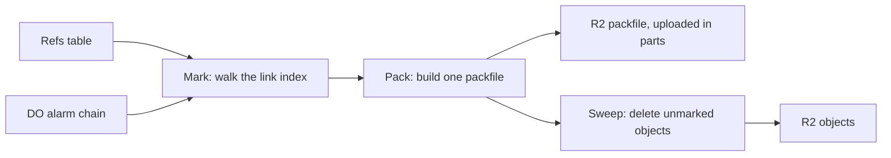

# GC and repack as a DO alarm

> Verdict: **risky** · feasibility 3/5 · reliability 2/5 · correctness 2/5 · effort: weeks
> Read the words in [how-to-read.md](../findings/how-to-read.md). Engineers: [proof](../proofs/gc-and-repack-alarm.md) · [review](../reviews/gc-and-repack-alarm.md)

## What this idea is

git is a tool that keeps every version of a set of files, and lets many people share those versions. A repository is one project's full set of files and their history. Over time a repository collects stored items that nothing points to anymore, such as the leftovers of a rejected upload. A repository also collects thousands of small items that would be faster to serve as one bundle. This idea runs a cleanup in the background, with no server to manage. The cleanup finds every item still in use, writes those items into one bundle, and deletes the rest.

Think of it like this. A gardener prunes a fruit tree once a season. The gardener follows each living branch from the fruit back to the trunk, and cuts off every dead twig that leads to no fruit.

## How it works

1. A commit is one saved version of the files, with a note about what changed. A ref is a name that points at one commit. A branch is a ref. A tag is a ref. A branch is a named line of commits, like a bookmark that moves forward as you save.
2. A Durable Object, or DO, is a single small program with its own storage that handles one thing at a time. There is one DO for each repo. Think of it like the one librarian who is allowed to update the catalog. DO SQLite is the small database inside each Durable Object. An alarm is a timer inside a Durable Object. A DO has only one alarm at a time.
3. An object is one stored item in git. An object is a file's content, a folder listing, or a commit. Push means sending your new commits to the server. Each push moves a ref inside the DO. Each ref move bumps a version counter and sets the alarm for a quiet time, ten minutes after the last push.
4. GC is a background task that deletes files nobody points to anymore. When the alarm fires, the DO runs a GC job in three phases named mark, pack, and sweep. The job saves its state in DO SQLite after each slice of work, so the job survives the CPU limit and DO restarts.
5. Mark phase. The job starts from every ref and follows the links from each object to the objects it points at. Pushes have already stored those links in an index in DO SQLite, so the mark phase reads nothing from R2. R2 is Cloudflare's large file store. It holds the git objects. Each object found goes into a marked table, in batches.
6. Pack phase. A packfile is one bundle that holds many objects, squeezed to save space. The job reads each marked object from R2 and rewrites the object as a packfile entry. The job uploads the packfile to R2 in parts of 5 MB.
7. A SHA, also called a hash, is a fingerprint of an object's content. Two objects with the same content have the same fingerprint. The job keeps a running fingerprint of the packfile in DO SQLite, for the checksum at the end.
8. Sweep phase. The job first checks the ref version counter. If any ref moved during the job, the job throws away the marked table and starts over. Otherwise the job deletes every unmarked object that is older than the job start, 1,000 objects per call, and drops their index rows.
9. Every alarm run does a bounded slice of work, saves its position, and sets the alarm again for right now. So a cleanup of any size runs as a chain of short alarms.
10. Fetch means getting commits from the server. A clone gets everything for the first time. When the packfile is complete, the job records it so that the clone path from idea #7 can serve it.

## What the reviewer decided

The reviewer decided that this idea is risky.

| Score | Value |
|---|---|
| Feasibility | 3 of 5 |
| Reliability | 2 of 5 |
| Correctness | 2 of 5 |

Feasibility asks if Cloudflare can run the idea today. Reliability asks if the idea keeps data safe when things fail. Correctness asks if the idea does what its title says.

Risky. The idea can be built. But the proof shows one or more problems the reviewer could not fully solve, or it does a weaker version of the goal. Think of it like a runway you can see on the map, but nobody has checked it for holes.

A blocker is a problem that stops the idea from working until it is fixed. A caveat is a limit or a condition. The idea works, but only inside this limit. For this idea, the reviewer found four blockers and seven caveats.

GA means a Cloudflare feature that is finished and supported, not a preview. Every feature the proof uses is GA. The shape of the design is right for a cleanup with no server. But the code as written cannot run against the repositories that its sibling ideas build. The sweep can leave a ref that points at deleted bytes, and the job can stop for good in three ways. The reviewer knows each fix, none is done, and the work takes weeks.

## Problems that must be fixed first

### Problem 1: The code does not match the parts it builds on

**What goes wrong.** The objects index that idea #6 creates has no columns for type, size, links, or creation time. So the mark phase throws on the first ref. Idea #5 stores objects unsqueezed, and at a different key, so the pack phase finds nothing. With the key fixed, the unsqueeze step fails on a body that was never squeezed. Idea #7 needs slice offsets and the refs the packfile covers, and this proof writes neither, so the packfile is never served.

**Why it matters.** Mark, pack, and serve each fail against a real repository. Nothing in the job runs end to end.

**How to fix it.** Agree on one index schema, one key layout, and one stored form of objects across the three ideas. Record the slice offsets and covered refs when the packfile is complete.

### Problem 2: A push during the sweep can lose a commit

**What goes wrong.** The input gate is the rule that a Durable Object handles one request at a time while it waits on its own storage. The gate opens when the DO waits on the network instead. The sweep checks the ref version counter, and then waits on R2 to delete a batch of objects. During that wait, a push arrives that brings back one of the doomed objects. The push sees the index row and sees the bytes in R2, so the push uploads nothing and moves a ref to that object. The sweep then finishes deleting the bytes and the row.

**Why it matters.** A ref now points at a commit whose bytes are gone. A normal git clone gets a packfile with a hole in it, and a file check on the client fails.

**How to fix it.** Delete the index rows first, so the push sees no row and uploads the bytes again. Then delete the R2 keys. Or, teach the push to distrust a found object that has no index row.

### Problem 3: The job can stop for good with nobody to restart it

**What goes wrong.** Three faults each make the alarm throw on every retry. First, if the DO dies right after the upload completes, the saved state rolls back, and the retry completes an upload that no longer exists. Second, the code spreads a whole object's bytes as call arguments, which throws for any object over about 100 KB. Third, a marked object with no index row throws. After the retries run out, the alarm is dropped, but the saved job state still exists, so nothing ever sets the alarm again.

**Why it matters.** GC is switched off for that repository for good, without any error message. A finished packfile can sit in R2 with no record of it.

**How to fix it.** Save the completion before the handler returns. Copy bytes in chunks instead of spreading them. Add a watchdog that clears a dead job and sets the alarm again.

### Problem 4: The job takes the only alarm

**What goes wrong.** A DO has only one alarm. The job sets the alarm for right now, over and over, to continue its chain. Each set replaces any alarm another feature had set. Ideas #6, #7, #9, and #30 each rely on their own alarm in the same DO.

**Why it matters.** Those four features lose their timers with no warning while the job runs. Their cleanups and rebuilds never happen.

**How to fix it.** Build one shared alarm scheduler in the DO. Every feature registers its timers there, and the scheduler sets the single alarm for the earliest one.

## Things to know

- The job keeps its output buffer as a list of numbers in JSON, up to 5 MB. That is over the 2 MB limit for one DO SQLite value, and costs about eight times the bytes in memory. The buffer must become binary chunks or a scratch file in R2.
- A delta is a stored object written as "the same as that other object, with these changes". The packfile has no deltas, and the single objects it covers stay in R2 after the pack, so storage about doubles. The job only reclaims objects that nothing points to.
- The packfile header takes its object count from the marked table, but the entries come from a join of marked with the index. Any mismatch gives a packfile that a normal git clone rejects with a bad object error.
- Any push during the mark or pack phase makes the job start over at sweep time. A busy repository can starve, and never finish a cleanup.
- R2 cancels an unfinished multi-part upload after about 7 days. A stalled job must detect the missing upload and restart the pack phase.
- The running fingerprint needs a hash whose state can be saved to a database. The proof asserts such a hash in plain JavaScript, but does not show it.
- Each build costs one billed R2 read and one unsqueeze and squeeze per object still in use. Large repositories need a rule that runs the job only after enough change, not after every quiet window.

## How this idea connects to the others

This idea needs [#1 One Durable Object per repo as the ref authority](./repo-do-ref-authority.md), which is the DO that owns the refs and runs the alarm.

This idea needs [#2 Refs in DO SQLite, objects in R2](./refs-sqlite-objects-r2.md), which puts the refs in the database that the mark phase reads.

This idea needs [#5 Content-addressed R2 keys](./content-addressed-r2-keys.md), which sets the key layout the sweep deletes from, and which does not match this proof yet.

This idea needs [#6 Two-phase push](./two-phase-push.md), which fills the object index with links and creation times, and which does not match this proof yet.

This idea needs [#7 Precomputed pack slices for clone](./precomputed-clone-pack.md), which serves the packfile this job builds, and which does not match this proof yet.
