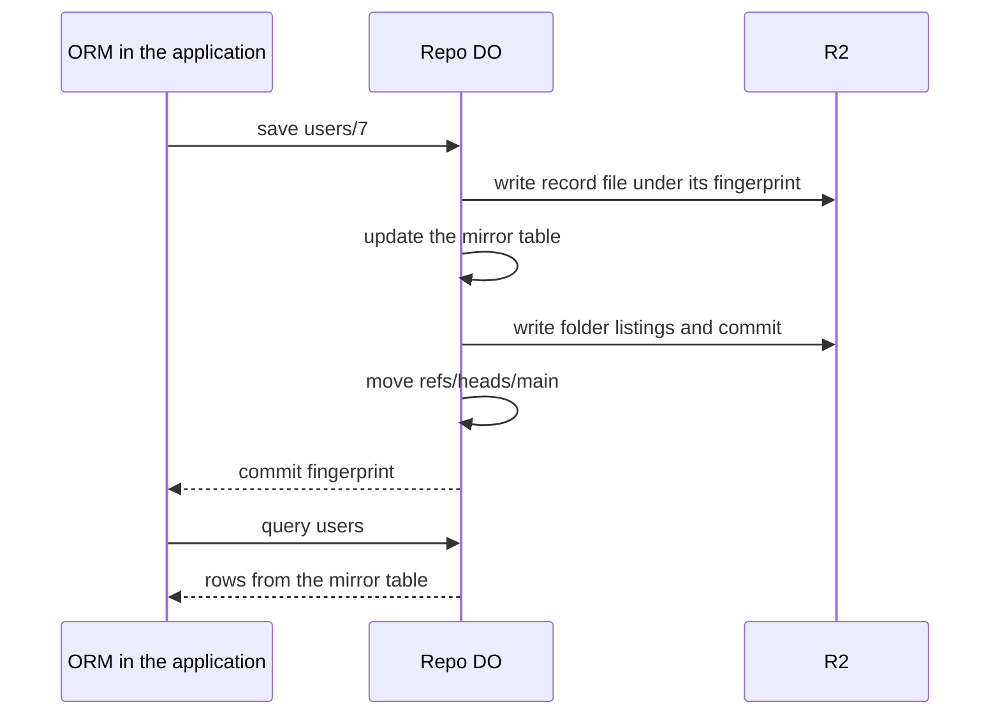

# Git as a database driver

> Verdict: **risky** · feasibility 4/5 · reliability 2/5 · correctness 2/5 · effort: weeks
> Read the words in [how-to-read.md](../findings/how-to-read.md). Engineers: [proof](../proofs/git-as-db-driver.md) · [review](../reviews/git-as-db-driver.md)

## What this idea is

Git is a tool that keeps every version of a set of files, and lets many people share those versions. A repository, or repo, is one project's full set of files and their history. A commit is one saved version of the files, with a note about what changed. This idea uses a git repo as the storage behind an ordinary application database. Every time the application saves a record, the server writes one new commit. Every query reads the current records. A change to the shape of the records is a rewrite of every record on a side branch.

Think of it like this. A shopkeeper keeps the stock list in a notebook and never crosses anything out. Each change goes on a fresh page with the date. You can always turn back to see what the stock was on any day.

## How it works

An ORM is a library that lets a program save and load records without writing database commands by hand. A Durable Object, or DO, is a single small program with its own storage that handles one thing at a time. There is one DO for each repo. Think of it like the one librarian who is allowed to update the catalog. DO SQLite is the small database inside each Durable Object. An object is one stored item in git. An object is a file's content, a folder listing, or a commit. A SHA, or hash, is a fingerprint of an object's content. Two objects with the same content have the same fingerprint. R2 is Cloudflare's large file store. It holds the git objects. A ref is a name that points at one commit. A branch is a ref. A tag is a ref.

1. The ORM sends every save and every query to the repo DO. The DO is the only writer, so the proof claims saves never overlap.
2. On a save, the DO writes the record as one file at tables/table/id.json. The DO squeezes the file and writes it to R2 under its fingerprint.
3. The DO builds new folder listings and a new commit, and writes those objects to R2 as well.
4. The DO moves refs/heads/main to the new commit with compare-and-swap. Compare-and-swap, or CAS, means: change a value only if it still has the value you expect. If someone changed it first, do nothing and report it.
5. The DO also keeps a mirror table of every record in DO SQLite. A query scans that table instead of walking folder listings in R2. The git objects stay the source of truth.
6. A migration rewrites every record into a commit on refs/heads/migrate/name, then moves main to that commit. Saves that arrive during the migration go into a journal. An alarm replays the journal on top of the new commit. An alarm is a timer inside a Durable Object. A DO has only one alarm at a time.

## What the reviewer decided

The reviewer's verdict is Risky.

| Score | Value |
|---|---|
| Feasibility | 4 of 5 |
| Reliability | 2 of 5 |
| Correctness | 2 of 5 |

Risky. The idea can be built. But the proof shows one or more problems the reviewer could not fully solve, or it does a weaker version of the goal. Think of it like a runway you can see on the map, but nobody has checked it for holes.

The proof is the small test program the study wrote to check the idea. Every Cloudflare feature the proof uses is finished and supported. The bytes the proof writes for files and commits are nearly correct git objects. But the proof's central claim is false. The DO does not keep saves apart, because the DO lets other requests in while it waits on R2. So two saves can collide, and the lock that is meant to stop stale writes does nothing. A crash in the middle of a migration bakes a half-changed table into main. The result is also a weaker version of the idea. A query is a scan of a database table, not a walk of git folder listings. A migration is a rewrite plus a replay, not a git rebase. The reviewer expects the fixes to take weeks.

## Problems that must be fixed first

A blocker is a problem that stops the idea from working until it is fixed. The reviewer found four blockers.

### Problem 1: Two saves at the same time collide

**What goes wrong.** An input gate is the rule that a Durable Object handles one request at a time while it waits on its own storage. The gate opens when the DO waits on the network instead. The save step reads the current commit, then waits on about three R2 writes, then writes the ref. During the R2 waits, a second save can start. Both saves see the same parent commit. Both build a commit. The last ref write wins.

**Why it matters.** The losing commit points at nothing and is lost. The winning commit may lack the other save's record, while the mirror table has it. Then the mirror table and the git history disagree. The optional check of the expected parent passes for both saves, so that check does nothing.

**How to fix it.** Update the ref with one database command that checks the old value at the same time, with no wait in between. Or block all other requests during a save. Add a retry loop for the loser.

### Problem 2: A crash during a migration corrupts main

**What goes wrong.** The flag that says "a migration is running" lives only in memory. The migration also sets main and the alarm only at the very end. If the DO dies halfway through, the mirror table holds half old records and half new records. The flag is gone.

**Why it matters.** The next ordinary save sees no migration running. That save builds a commit from the mixed mirror table and writes it to main. The half-finished migration becomes permanent history with no commit that names it. Running the migration again applies the change twice to the first half.

**How to fix it.** Store the migration name, base commit, and progress in DO SQLite. Set the alarm at the start. Make each save check that stored state before it commits.

### Problem 3: A normal git push is not seen by the mirror

**What goes wrong.** Push is sending your new commits to the server. The design allows a normal git push to the same repo. Such a push moves main but never updates the mirror table. The next ORM save rebuilds the folder listings from the stale mirror table.

**Why it matters.** That save silently reverts everything the push changed. That save also drops every file outside the tables folder, because the root listing only ever holds the tables folder.

**How to fix it.** Rebuild the mirror table from the new commit after every push. Keep the paths outside the tables folder when building a new root listing.

### Problem 4: Folder entries are sorted the wrong way

**What goes wrong.** Git sorts folder entries as if each subfolder name ends with a slash. The proof sorts plain names with a normal string compare. For two tables named users and users-old, git puts users-old first and the proof puts users first.

**Why it matters.** A git client that checks objects reports "tree not properly sorted". The git checkout command searches sorted entries and cannot find the misplaced ones. The reviewer also notes that string compare in JavaScript orders some characters differently from git.

**How to fix it.** Sort entries by bytes, and add a slash to each subfolder name before the compare.

## Things to know

A caveat is a limit or a condition. The idea works, but only inside this limit.

- The find and migrate calls take a function as an argument. Over a DO call, the function becomes a stub that returns a promise, so a filter returns every row. The migrate function cannot run again from the alarm or after the DO restarts. Pass a plain query or a named function instead.
- Every save rehashes every table, which costs CPU in proportion to the number of rows and about four paid R2 writes. Expect 50 to 100 saves per second per DO. Near one million rows in one folder, the folder listing is about 38 MB and is copied three times. That risks the 128 MB memory limit. Split folders and cache the fingerprint of each subfolder.
- The alarm replay is not safe to repeat. A retried alarm commits the replayed writes again with new timestamps, which makes duplicate commits and lost files that nobody points to. There is no cleanup anywhere.
- Journaled writes are replayed without the migration change, and the last writer wins on raw record text. The proof admits this. Store the migration name and apply the change on replay.
- The R2 storage format differs from related ideas. This proof squeezes objects and stores them at objects/fingerprint, while related ideas store plain bytes under a prefix path. The fetch path may not serve these objects until the format is agreed. Objects are loose only, so a clone costs one R2 read per object until packing exists.
- "Every query a tree walk" is a scan of record text in DO SQLite. "Migrations are rebases" is a rewrite followed by a replay of writes that were never commits. An ActiveRecord adapter can never be a drop-in replacement for a SQL database.

## How this idea connects to the others

- This idea needs one DO per repo to own the refs, from [#1 One Durable Object per repo as the ref authority](./repo-do-ref-authority.md).
- This idea keeps refs in the DO database and objects in R2, from [#2 Refs in DO SQLite, objects in R2](./refs-sqlite-objects-r2.md).
- This idea writes each object under its fingerprint, from [#5 Content-addressed R2 keys](./content-addressed-r2-keys.md).
- This idea can use saved points in time from [#21 Snapshots via R2 object versioning of ref state](./r2-versioned-snapshots.md).
- This idea needs cleanup and packing from [#55 GC and repack as a DO alarm](./gc-and-repack-alarm.md).
