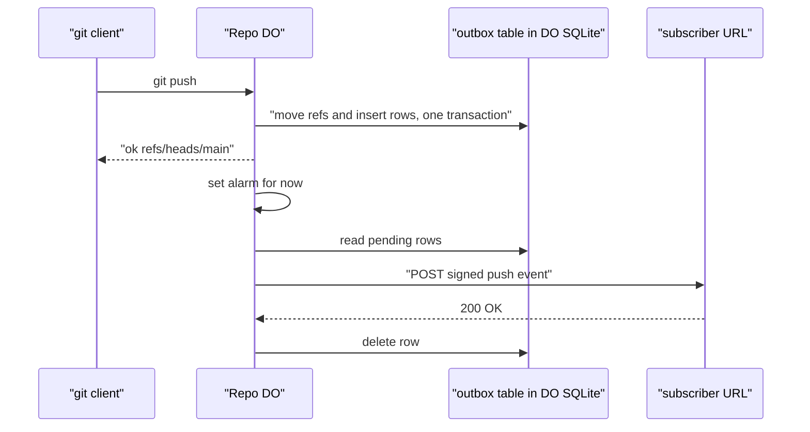

# GitHub-compatible webhook payloads

> Verdict: **lands with caveats** · feasibility 4/5 · reliability 3/5 · correctness 3/5 · effort: days
> Read the words in [how-to-read.md](../findings/how-to-read.md). Engineers: [proof](../proofs/github-webhook-compat.md) · [review](../reviews/github-webhook-compat.md)

## What this idea is

Git is a tool that keeps every version of a set of files, and lets many people share those versions. A push is sending your new commits to the server. A commit is one saved version of the files, with a note about what changed. A webhook is a message that a server sends to another web address when something happens. GitHub sends a push message in a well-known shape, and many tools already accept that shape. This idea makes git-edge send push messages in the GitHub shape, so those tools work without change.

Think of it like this. Every country's post office accepts a letter addressed in the standard format. If you write the address the same way GitHub does, every mail room already knows how to read it.

## How it works

1. A push arrives. A Worker forwards the push to the Durable Object for the repository. Cloudflare Workers are small programs that run on Cloudflare's network close to the user, with no server to manage. A repository is one project's full set of files and their history. A Durable Object is a single small program with its own storage that handles one thing at a time. There is one DO for each repo. Think of it like the one librarian who is allowed to update the catalog.
2. The DO moves the refs in one DO SQLite transaction. A ref is a name that points at one commit. A branch is a ref. A tag is a ref. DO SQLite is the small database inside each Durable Object.
3. In the same transaction, the DO inserts one outbox row for each ref update and each subscribed webhook. Each row holds a push message in the GitHub shape. The DO builds the message from the push commands and from the commit objects in the pushed packfile. A packfile is one bundle that holds many objects, squeezed to save space. An object is one stored item in git. An object is a file's content, a folder listing, or a commit.
4. The DO sets an alarm for now. An alarm is a timer inside a Durable Object. A DO has only one alarm at a time.
5. The alarm reads the outbox rows. For each row, the alarm signs the message with a shared secret and sends the message with GitHub-style headers, including a stable delivery id.
6. If a send fails, the alarm keeps the row and sets the alarm again with a growing wait. Each message arrives at least once. Delivery never delays the answer to the push.

## What the reviewer decided

The verdict is: lands with caveats.

| Score | Value |
|---|---|
| Feasibility | 4 of 5 |
| Reliability | 3 of 5 |
| Correctness | 3 of 5 |

Lands with caveats. The idea is sound and can be built. The proof has one or more problems that must be fixed first, and the reviewer described each fix. Think of it like a flight with a runway that needs some repairs before you land. The runway is there. The repairs are known.

For this idea, the verdict means the following. The reviewer found no blocker. A blocker is a problem that stops the idea from working until it is fixed. An outbox row written in the same transaction as the ref change is the right pattern. Every Cloudflare building block is GA. GA means a Cloudflare feature that is finished and supported, not a preview. A normal git command such as clone, push, or fetch is not affected, because delivery happens after the push has answered. A fetch is getting commits from the server. A clone gets everything for the first time. The message is a GitHub-shaped push event that most receivers accept, not the byte-identical copy the idea claimed. The reviewer listed six caveats. A caveat is a limit or a condition. The idea works, but only inside this limit. Four small fixes make the delivery dependable. The reviewer estimates the work at days.

## Things to know

- When a webhook is deleted after a row was queued, the lookup for that hook throws inside the alarm. The alarm retries until the retries run out, and the final call that sets the next alarm never runs. Every pending delivery for that repository stalls until the next push. This must be fixed before shipping.
- The call that sets the alarm sits outside the transaction. If the DO is evicted between the transaction and that call, the rows are saved but no alarm exists. Nothing is delivered until the next push to that repository.
- The query that reads the outbox has no sort order. Two quick pushes to the same branch can be delivered out of order. A branch is a named line of commits, like a bookmark that moves forward as you save. After five failed attempts, a row is silently deleted with no record of the failure.
- The message is a weaker version of the GitHub message, not a byte-for-byte copy. The lists of added, removed, and changed files are empty. The forced flag is always false. The repository and sender ids are made up. There is no SHA-1 signature header, and the Jenkins GitHub plugin checks that header and returns 403. The head commit is null when the pushed tip was already on the server, such as a new branch from an existing tip. GitHub Actions does not run from webhooks, so that consumer claim in the proof is wrong.
- The alarm sends to each subscriber one after the other with a 10 second timeout each. One dead subscriber delays every delivery in that repository. Beyond a handful of hooks, delivery must move to a queue service.
- The git wire protocol is not affected. The outbox is written after the second push phase moves the refs, and delivery runs out of band. The status lines return to the client promptly.

## How this idea connects to the others

- This idea writes its outbox rows in the second phase of [#6 Two-phase push](./two-phase-push.md).
- This idea needs one Durable Object per repository to own the refs, from [#1 One Durable Object per repo as the ref authority](./repo-do-ref-authority.md).
- This idea keeps refs and the outbox in DO SQLite, from [#2 Refs in DO SQLite, objects in R2](./refs-sqlite-objects-r2.md).
- This idea reads the pushed commits from the parser in [#4 Packfile parsing in a Worker with a streaming inflater](./streaming-pack-parser.md).
- This idea shares the DO alarm with [#14 Push-triggered CI as a DO alarm chain](./alarm-chain-ci.md).
- This idea can move delivery to the queue used by [#34 Commit-as-event-stream](./commit-event-stream.md).
