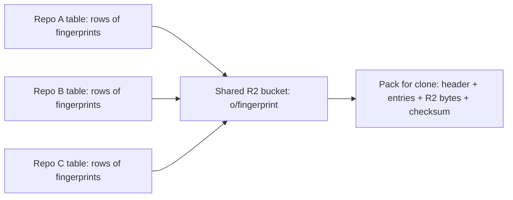

# Deduplication across all repos in one content-addressed bucket

> Verdict: **lands with caveats** · feasibility 4/5 · reliability 3/5 · correctness 3/5 · effort: weeks
> Read the words in [how-to-read.md](../findings/how-to-read.md). Engineers: [proof](../proofs/global-dedup.md) · [review](../reviews/global-dedup.md)

## What this idea is

Git is a tool that keeps every version of a set of files, and lets many people share those versions. A repository, or repo, is one project's full set of files and their history. Many repos hold the same files, such as a popular code library that thousands of projects copy. This idea stores each distinct file once for the whole service, no matter how many repos use it. Each repo keeps only a small note that says "I use this file".

Think of it like this. A city library keeps one copy of each book in a central store. Each branch library keeps only an index card for each book it lends. A book that every branch lends still sits on one shelf.

## How it works

An object is one stored item in git. An object is a file's content, a folder listing, or a commit. A commit is one saved version of the files, with a note about what changed. A SHA, or hash, is a fingerprint of an object's content. Two objects with the same content have the same fingerprint. Content-addressed means stored under its own fingerprint, so the name tells you what is inside. R2 is Cloudflare's large file store. It holds the git objects. A Durable Object, or DO, is a single small program with its own storage that handles one thing at a time. There is one DO for each repo. Think of it like the one librarian who is allowed to update the catalog. DO SQLite is the small database inside each Durable Object.

1. A user pushes to a repo. Push is sending your new commits to the server. The push arrives as a packfile. A packfile, or pack, is one bundle that holds many objects, squeezed to save space.
2. A Cloudflare Worker reads the pack as a stream and unpacks each object. A Worker is a small program that runs on Cloudflare's network close to the user, with no server to manage.
3. For each object, the repo's DO computes the fingerprint. The DO checks its own DO SQLite table. If the repo already has the object, the DO stops here.
4. The DO asks one shared R2 bucket whether the key o/fingerprint exists. The key holds no repo name.
5. If the key is missing, the DO writes the squeezed bytes to R2 under that key, with the object type and size as metadata.
6. The DO adds one small row of about 60 bytes to its own table. That row says the repo uses the object.
7. On clone or fetch, the DO builds a pack from four parts. The parts are a header, one short entry header per object, the R2 bytes as they are, and a checksum. Fetch is getting commits from the server. A clone gets everything for the first time.
8. The DO always reads its own table to decide what a repo has. The DO never reads the shared bucket for that decision, so one repo can never learn what another repo holds.

## What the reviewer decided

The reviewer's verdict is Lands with caveats.

| Score | Value |
|---|---|
| Feasibility | 4 of 5 |
| Reliability | 3 of 5 |
| Correctness | 3 of 5 |

Lands with caveats. The idea is sound and can be built. The proof has one or more problems that must be fixed first, and the reviewer described each fix. Think of it like a flight with a runway that needs some repairs before you land. The runway is there. The repairs are known.

The proof is the small test program the study wrote to check the idea. The sharing layer itself is small and sound, and every feature it uses is finished and supported by Cloudflare. In a mode where nothing is ever deleted, a crash cannot lose data. Two repos that push the same object at the same time write the same bytes under one key, which is harmless. But the pack the proof sends on fetch is not in the format a real git client accepts. There is no safe way to delete unused objects. And the proof does not show that the idea saves space at all. The reviewer expects the work to take weeks.

## Problems that must be fixed first

A blocker is a problem that stops the idea from working until it is fixed. The reviewer found two blockers.

### Problem 1: The fetch reply is not in the format git expects

**What goes wrong.** The proof sends the raw pack as the whole web reply. Protocol v2 is the newer, cleaner set of messages git uses to talk to a server. Protocol v2 requires a "packfile" section header first. Then each piece of the pack must be framed as a pkt-line and sent over a sideband. A pkt-line is git's way of framing a message. Each line starts with four characters that give its length. A sideband is a way to send two kinds of data in one stream, like a main channel and a progress channel. Older clients need a "NAK" line plus the same framing.

**Why it matters.** A real git client rejects the reply as written. A normal git clone or git fetch command fails with an error such as "expected packfile" or "bad pack header". The pack bytes themselves are correct. Only the framing around the pack is missing.

**How to fix it.** Add a small transform of about 30 lines that writes the section header and wraps the pack in sideband pkt-lines. Add the "NAK" line for older clients.

### Problem 2: There is no way to delete objects

**What goes wrong.** The proof has no design for deleting an object once no repo uses it. The proof sketches a set of counters spread across several DOs. That sketch has a gap: a crash between the R2 write and the counter update leaves the counter wrong. The sketch also has a case where two tasks collide. Repo B sees that an object exists, a sweep task deletes that object, then repo B records a row that points at nothing.

**Why it matters.** With no deletion, storage only grows. With the sketched deletion, a repo can end up with a row for an object that is gone. The next clone of that repo fails with "global object missing".

**How to fix it.** Ship version one as append-only, where nothing is ever deleted. A per-repo cleanup task must never delete from the shared bucket. Design a full count or mark-and-sweep system across all repos before any deletion is allowed.

## Things to know

A caveat is a limit or a condition. The idea works, but only inside this limit.

- The time a push takes reveals a secret. A push that finds an object already present is faster than a push that must write it. So an attacker can guess exact file bytes and learn whether any repo on the service holds them. The proof does not reduce this leak.
- The storage saving is not proven. The shared store holds no deltas, and a delta is a stored object written as "the same as that other object, with these changes". The proof's own plan keeps files under 4 KB inside each repo, unshared. So normal per-repo packs with deltas may be smaller for everything except forks and copied libraries.
- Each object costs one check and one write through a single DO that does one thing at a time. That caps a push at about 100 to 300 objects per second, and each new object costs a paid R2 write. A clone needs one R2 read per object, which exceeds the request limits without a precomputed pack.
- The proof passes a whole object as one argument to the DO, so the practical size of one object is well below 128 MB.
- One shared bucket means one mistake can affect every repo, and the Worker binding for R2 does not offer file versioning. Thin pack handling and SHA-256 repos are claimed but not shown. A thin pack is a packfile that contains deltas against objects the server already has.

## How this idea connects to the others

- This idea stores objects under their fingerprints, from [#5 Content-addressed R2 keys](./content-addressed-r2-keys.md).
- This idea unpacks each pushed object with the parser from [#4 Packfile parsing in a Worker with a streaming inflater](./streaming-pack-parser.md).
- This idea keeps refs in the DO database and objects in R2, from [#2 Refs in DO SQLite, objects in R2](./refs-sqlite-objects-r2.md).
- This idea needs one DO per repo to own the refs, from [#1 One Durable Object per repo as the ref authority](./repo-do-ref-authority.md).
- This idea decides what to send on fetch with [#56 Want/have negotiation with a commit-graph in SQLite](./want-have-negotiation.md).
- This idea must keep the per-repo cleanup task from [#55 GC and repack as a DO alarm](./gc-and-repack-alarm.md) away from the shared bucket.
