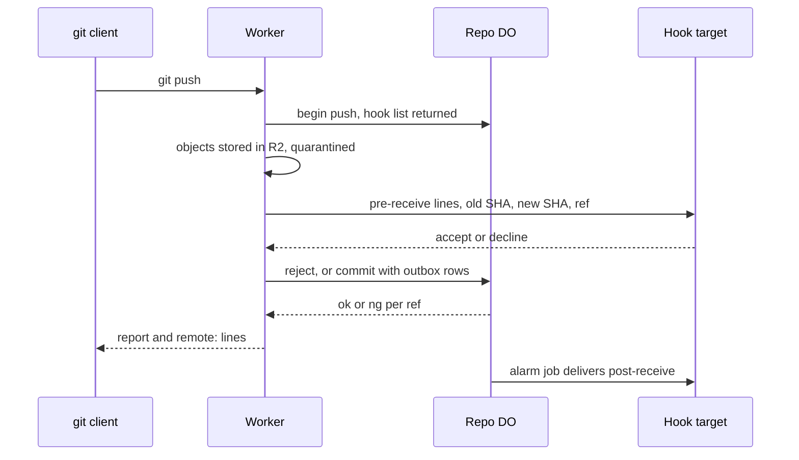

# Pre/post-receive hooks as Workers via service bindings

> Verdict: **risky** · feasibility 4/5 · reliability 2/5 · correctness 3/5 · effort: weeks
> Read the words in [how-to-read.md](../findings/how-to-read.md). Engineers: [proof](../proofs/hooks-as-workers.md) · [review](../reviews/hooks-as-workers.md)

## What this idea is

Git is a tool that keeps every version of a set of files, and lets many people share those versions. A repository, or repo, is one project's full set of files and their history. A push is sending your new commits to the server. A hook is a small program that the server runs when a push arrives. A pre-receive hook runs before the server accepts the push, and can reject the push. A post-receive hook runs after the push, and tells other systems what changed. Cloudflare Workers, or Workers, are small programs that run on Cloudflare's network close to the user, with no server to manage. This idea lets users write hooks as Workers and register them with the repo.

Think of it like this. A concert hall has a doorman and a notice board. The doorman checks each guest before the guest goes in, and can turn a guest away. After the show, the staff pin a notice on the board so the whole town knows what was played.

## How it works

The second pass writes the design in Rust, against one shared contract that every idea in this set follows. The big change is where the pre-receive check runs. The contract gives the Durable Object one storage step for the commit, with no waits on the network. A hook call can take seconds, so the check runs in the edge Worker instead. The check runs after the pushed objects are stored and before any ref moves. This is the same order git uses.

A Durable Object, or DO, is a single small program with its own storage that handles one thing at a time. There is one DO for each repo. Think of it like the one librarian who is allowed to update the catalog. DO SQLite is the small database inside each Durable Object. A commit is one saved version of the files, with a note about what changed. A ref is a name that points at one commit. A branch is a ref. A tag is a ref. A SHA, or hash, is a fingerprint of an object's content. Two objects with the same content have the same fingerprint. An object is one stored item in git. An object is a file's content, a folder listing, or a commit. R2 is Cloudflare's large file store. It holds the git objects. Compare-and-swap, or CAS, means change a value only if it still has the value you expect. If someone changed it first, do nothing and report it. An alarm is a timer inside a Durable Object. A DO has only one alarm at a time. A janitor, also called a sweep or GC, is a background task that deletes files nobody points to anymore.

1. The repo owner registers hooks with one PUT request on the repo. Each target is a service binding name, a Workers for Platforms dispatch name, or an https address. The DO stores the list in a hooks table in DO SQLite. When a push begins, the DO returns the hook list, so the pre-receive set is fixed at the start of the push.
2. A push arrives at the Worker. The Worker stores the pushed objects in R2 and marks the pack as quarantined. Quarantined means stored but invisible to readers until the push commits.
3. The Worker calls each pre-receive hook in turn. The request body carries one line per ref command: the old SHA, the new SHA and the ref name. This is byte for byte what git feeds a hook. The Worker waits at most 10 seconds per hook.
4. A hook can inspect the push. The hook runs a normal fetch with the push id in a header. The DO checks that the push is still open and lets the fetch read the quarantined objects. The token dies when the push commits, is rejected, or expires.
5. If a hook declines or times out, the Worker calls a reject route on the DO. The push is marked rejected and the janitor later deletes the quarantined pack. The client sees `ng <ref> pre-receive hook declined` for each ref. A sideband is a way to send two kinds of data in one stream, like a main channel and a progress channel. The hook's own answer text travels on the second channel of the sideband, as remote: lines. A hook that cannot be reached counts as a failure, and the client sees an unpack error instead.
6. If all hooks accept, the Worker calls commit on the DO. In one storage step, the DO does a compare-and-swap on each ref, writes one outbox row per post-receive hook, and queues a post-receive job.
7. The one alarm is shared by every background job. The post-receive job sends each outbox row to its hook and retries with growing waits, up to 12 tries over about 5 hours. A row that still fails is kept for inspection instead of dropped.
8. A hook may push back to the repo. A depth header over 1 is refused before the body is read, and the nested push still needs normal write permission.

## What the reviewer decided

The reviewer looks for blockers and caveats. A blocker is a problem that stops the idea from working until it is fixed. A caveat is a limit or a condition. The idea works, but only inside this limit.

The verdict is Lands with caveats.

| Score | Value |
|---|---|
| Feasibility | 4 of 5 |
| Reliability | 4 of 5 |
| Correctness | 4 of 5 |

| Score | First pass | Second pass |
|---|---|---|
| Feasibility | 4 of 5 | 4 of 5 |
| Reliability | 2 of 5 | 4 of 5 |
| Correctness | 3 of 5 | 4 of 5 |

Lands with caveats. The idea is sound and can be built. The proof has one or more problems that must be fixed first, and the reviewer described each fix. Think of it like a flight with a runway that needs some repairs before you land. The runway is there. The repairs are known.

For this idea, the second pass moves the verdict up from Risky. All three first-pass blockers are closed by the shape of the design, not by a check at run time. There is no second alarm to collide with the janitor's alarm. Hook text cannot corrupt the push report, because the rejection reason is one fixed string. The quarantine read path is real and guarded by the push id. What remains is mechanical or inherited: a promised signature that is never made, one rearm line a sibling must add, small naming drifts, and a stuck-job gap shared with the janitor. The reviewer still expects weeks of work.

## What changed in the second pass

- The one alarm per DO collided with the janitor: fixed. Nothing in this module touches the alarm now. Delivery is a job row and an outbox row, both written inside the commit step. The shared rearm picks the earliest due time across janitor, cleanup and post-receive rows on the one alarm. One part is still owed: the fix leans on a rearm line that the commit route's proof does not show yet.
- A hook message could break the push report: fixed. The rejection reason is the fixed text `pre-receive hook declined`, so hook text can never reach the report stream. The hook's own answer travels as remote: lines on the sideband, the same thing git does with hook output.
- Hooks could not read the pushed history: fixed. A fetch now accepts the push id as a read token. The DO checks that the push is open in one storage step and widens the read query to the quarantined pack.
- "Users deploy a Worker and register it" needed a paid add-on: partly fixed. The limits are now stated plainly. A service binding is set at deploy time, a dispatch name needs the paid add-on, and an https address is the only target a user can add at run time. The signature promised for the https path is stored but never made.
- Push commands in a 16 KB header: fixed. The commands ride in the request body, which is the hook's normal input anyway. The headers stay around 200 bytes.
- Retries stopped after about 8.5 minutes: fixed. The job retries 12 times with growing waits, about 5 hours in total. A row that still fails is kept for inspection instead of dropped.
- Missing git surface and a costly history check: partly fixed. The quarantine is real, and the history check moved into the hook as one filtered fetch, off the push path. Push options cannot arrive because the server never advertises them. The update hook and the other per-ref hooks stay unmodelled.
- A crash could lose the outbox or cancel the janitor's alarm: fixed. The job row is written inside the commit step, so the row cannot be lost without losing the ref move. There is no second alarm call left to cancel anything.
- The hooks table was read at two times: fixed. Pre-receive uses the snapshot from push begin. Post-receive reads the table inside the commit step. This matches git, which reads the hook program at each phase's run time.
- The depth stop was never enforced: fixed. A depth header over 1 is refused with a 403 before any body byte is read. The stop is advisory, and the real bound is write permission on the nested push.
- Report framing and version-2 option lines: fixed by the contract modules. The wire module owns the framing, and a version-2 report without option lines is allowed.

## Things to know

- The claim "users deploy a Worker and register it" holds only with Workers for Platforms, a paid add-on. An https address is the only target that works without the add-on, and its signature is claimed but not yet made.
- The 10-second cap covers only the hook's status code. The answer body is then read with no time or size cap, so a slow or huge answer can stall the gate.
- Up to 32 hooks run one after another at up to 10 seconds each. That can pass the request's own time budget, so the last hooks never run and the push reports a budget decline.
- A post-receive hook cannot read the repo it was told about. The push id token dies at commit, so a post hook needs a separate read token.
- A broken payload row stops the whole delivery slice, and every later row waits behind it. The fix is to mark the row dead and move on.
- The timeout abandons the hook call but does not cancel it. The hook keeps running and keeps spending its own budget.
- The depth stop is advisory. A hostile hook can omit the header. The real bounds are write permission and the compare-and-swap.
- The push id token reads more than the quarantine. Any writer can mint a token that reads all live objects while the push is open.
- Several calls are unverified at run time. These are the service and dispatch calls from inside a DO alarm, the request constructor, the delay timer inside a DO, the signature primitive, and the call cap on a deployed Worker.
- The update hook, the post-update hook, the proc-receive hook and push options stay unmodelled. Any answer that is not a success becomes the same one decline reason.

## How this idea connects to the others

This idea hooks into the push flow of [#6 Two-phase push](./two-phase-push.md). The pre-receive gate sits between the object ingest and the commit call.

This idea relies on the repo's DO owning the refs, as in [#1 One Durable Object per repo as the ref authority](./repo-do-ref-authority.md).

The object rows and the quarantined pack come from [#2 Refs in DO SQLite, objects in R2](./refs-sqlite-objects-r2.md).

The post-receive job runs as one slice of the alarm dispatcher from [#55 GC and repack as a DO alarm](./gc-and-repack-alarm.md).

This idea finds the right DO for a repo with [#54 Auth and multi-tenancy: owner/repo routing to DO ids](./auth-and-multitenancy.md).

Narrower read tokens for hooks could come from [#28 Rate-limited, token-scoped remote URLs](./scoped-token-remotes.md).

This idea can send post-receive events in the shape set by [#49 GitHub-compatible webhook payloads](./github-webhook-compat.md).
