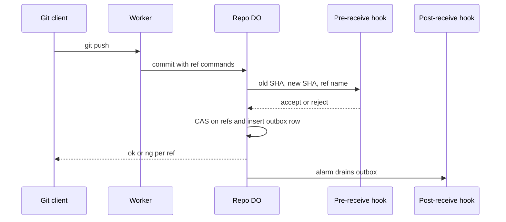

# Pre/post-receive hooks as Workers via service bindings

> Verdict: **risky** · feasibility 4/5 · reliability 2/5 · correctness 3/5 · effort: weeks
> Read the words in [how-to-read.md](../findings/how-to-read.md). Engineers: [proof](../proofs/hooks-as-workers.md) · [review](../reviews/hooks-as-workers.md)

## What this idea is

Git is a tool that keeps every version of a set of files, and lets many people share those versions. A repository, or repo, is one project's full set of files and their history. A push is sending your new commits to the server. A hook is a small program that the server runs when a push arrives. A pre-receive hook runs before the server accepts the push, and can reject the push. A post-receive hook runs after the push, and tells other systems what changed. Cloudflare Workers, or Workers, are small programs that run on Cloudflare's network close to the user, with no server to manage. This idea lets users write hooks as Workers and register them with the repo.

Think of it like this. A concert hall has a doorman and a notice board. The doorman checks each guest before the guest goes in, and can turn a guest away. After the show, the staff pin a notice on the board so the whole town knows what was played.

## How it works

A Durable Object, or DO, is a single small program with its own storage that handles one thing at a time. There is one DO for each repo. Think of it like the one librarian who is allowed to update the catalog. DO SQLite is the small database inside each Durable Object. A commit is one saved version of the files, with a note about what changed. A ref is a name that points at one commit. A branch is a ref. A tag is a ref. A SHA, or hash, is a fingerprint of an object's content. Two objects with the same content have the same fingerprint. An object is one stored item in git. An object is a file's content, a folder listing, or a commit. R2 is Cloudflare's large file store. It holds the git objects. Compare-and-swap, or CAS, means change a value only if it still has the value you expect. If someone changed it first, do nothing and report it. An alarm is a timer inside a Durable Object. A DO has only one alarm at a time.

1. The repo owner registers a hook target in a hooks table in the repo's DO SQLite. A target is either a service binding name or a script name in a Workers for Platforms namespace.
2. A push arrives. The Worker writes the pushed objects to R2 first.
3. Before the DO changes any ref, the DO calls each pre-receive hook. The DO sends one line per ref with the old SHA, the new SHA and the ref name. The DO waits at most 10 seconds.
4. If a hook answers with an error, the DO rejects every ref in the push. The client sees one `ng <ref> <reason>` line per ref, as with real git.
5. If all hooks accept, the DO updates each ref with compare-and-swap inside one database transaction.
6. In the same transaction, the DO inserts one outbox row for each post-receive hook.
7. The DO sets the alarm to now. The alarm handler sends each outbox row to its hook, retries with growing delays, and deletes the row on success.

## What the reviewer decided

The reviewer's verdict is Risky.

| Score | Value |
|---|---|
| Feasibility | 4 of 5 |
| Reliability | 2 of 5 |
| Correctness | 3 of 5 |

Risky. The idea can be built. But the proof shows one or more problems the reviewer could not fully solve, or it does a weaker version of the goal. Think of it like a runway you can see on the map, but nobody has checked it for holes.

For this idea, the skeleton is right. The pre-receive call happens outside the transaction, the CAS check happens inside, and the outbox row is written together with the ref update. GA, or generally available, means a Cloudflare feature that is finished and supported, not a preview. Every Cloudflare feature used is GA. A blocker is a problem that stops the idea from working until it is fixed. But the proof as written breaks the cleanup task of another idea, can corrupt the push report, and leaves the main use of hooks undesigned. The reviewer says the verdict drops to "lands with caveats" once the first two blockers are fixed. The reviewer expects weeks of work.

## Problems that must be fixed first

### Problem 1: Only one alarm per DO

**What goes wrong.** A janitor, also called a sweep or GC, is a background task that deletes files nobody points to anymore. The two-phase push idea uses the DO's one alarm as a janitor for pushes that never finished. This proof's commit step sets the same alarm to now, and this proof's alarm handler only drains the outbox. The janitor's alarm is overwritten. The janitor only arms the alarm when no alarm is set, so the janitor never comes back.

**Why it matters.** For any repo with a post-receive hook, files left behind by a broken push are never cleaned up. This is a regression in an idea that this idea depends on.

**How to fix it.** Write one dispatcher alarm handler. The handler reads the pending table, the outbox table and the GC table. The handler then arms the alarm for the earliest time among them.

### Problem 2: A hook message can break the push report

**What goes wrong.** A pkt-line is git's way of framing a message. Each line starts with four characters that give its length. The DO copies the hook's rejection text straight into the `ng <ref> <reason>` pkt-line. A newline in the hook text splits the line into two pkt-lines. The second line starts with neither "ok" nor "ng".

**Why it matters.** The git client stops with the error "invalid ref status from remote". An ordinary multi-line hook message corrupts the report of a normal git push.

**How to fix it.** Strip newlines from the reason. A sideband is a way to send two kinds of data in one stream, like a main channel and a progress channel. Send long text on the second channel of the sideband as "remote:" lines, as git does with hook output.

### Problem 3: Hooks cannot read the pushed history

**What goes wrong.** The one useful thing a pre-receive hook does is inspect the pushed commits. One example is a check that the push only adds commits on top of the branch. To do that, the hook must fetch objects that are still in the pending area and not yet in the objects index. That fetch must be allowed only with the push id token. The proof asserts this path and never designs it.

**Why it matters.** Without this path, nobody can write a real pre-receive policy.

**How to fix it.** Design and build a fetch of pending objects that is gated by the push id token.

## Things to know

A caveat is a limit or a condition. The idea works, but only inside this limit.

- The claim "users deploy a Worker and register it" holds only with Workers for Platforms, a paid add-on. Without that add-on, the hook becomes a web call signed with a shared secret, and the proof has no storage or rotation for that secret.
- All push commands travel in one request header named x-git-edge-json, and Cloudflare limits one header to 16 KB. A mirror push or a large multi-ref push breaks, so the commands must move to the request body.
- Post-receive retries stop after about 8.5 minutes, and then the row is dropped. Any realistic hook outage loses events, which contradicts the claim "strictly better than git".
- Hooks get only the input lines, with no update hook, no push options, no quarantine folder and no git commands. A check that a push only adds commits costs one R2 read per commit walked.
- The proof assumes that the alarm write commits together with the database transaction, and that two alarm runs never overlap. Both assumptions are plausible but not checked against the docs.
- The hooks table is read twice with waits in between, so a hook registered during a push gets post-receive but not pre-receive. The depth header meant to stop hooks from calling each other forever is never enforced by any endpoint.

## How this idea connects to the others

This idea runs inside the commit step of [#6 Two-phase push](./two-phase-push.md) and shares that idea's alarm.

This idea relies on the repo's DO owning the refs, as in [#1 One Durable Object per repo as the ref authority](./repo-do-ref-authority.md).

This idea finds the right DO for a repo with [#54 Auth and multi-tenancy: owner/repo routing to DO ids](./auth-and-multitenancy.md).

This idea gives each hook a scoped read token from [#28 Rate-limited, token-scoped remote URLs](./scoped-token-remotes.md).

This idea can send post-receive events in the shape set by [#49 GitHub-compatible webhook payloads](./github-webhook-compat.md).
