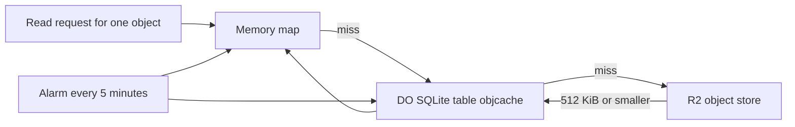

# Tiny in-DO object cache with alarm-driven eviction

> Verdict: **risky** · feasibility 4/5 · reliability 4/5 · correctness 2/5 · effort: days
> Read the words in [how-to-read.md](../findings/how-to-read.md). Engineers: [proof](../proofs/in-do-object-cache.md) · [review](../reviews/in-do-object-cache.md)

## What this idea is

git is a tool that keeps every version of a set of files, and lets many people share those versions. A repository, or repo, is one project's full set of files and their history. This idea gives each repo a small cache of the items that are read most often. A read that hits the cache never goes to the big file store. A timer cleans the cache on a schedule.

Think of it like this. A librarian keeps the most requested books on a small shelf behind the desk. A reader gets one of those books at once, without a walk to the stacks. Every few minutes the librarian returns the books nobody asked for.

## How it works

Some words first. A commit is one saved version of the files, with a note about what changed. A branch is a named line of commits, like a bookmark that moves forward as you save. An object is one stored item in git. An object is a file's content, a folder listing, or a commit.

A SHA, or hash, is a fingerprint of an object's content. Two objects with the same content have the same fingerprint. A packfile, or pack, is one bundle that holds many objects, squeezed to save space. A delta is a stored object written as "the same as that other object, with these changes". A fetch is getting commits from the server. A clone gets everything for the first time.

A Cloudflare Worker is one of the small programs that run on Cloudflare's network close to the user, with no server to manage. A Durable Object, or DO, is a single small program with its own storage that handles one thing at a time. There is one DO for each repo. Think of it like the one librarian who is allowed to update the catalog. DO SQLite is the small database inside each Durable Object.

An alarm is a timer inside a Durable Object. A DO has only one alarm at a time. R2 is Cloudflare's large file store. It holds the git objects.

1. A single-object read arrives. Such reads come from partial clones, from object-info requests, from the raw file API, and from delta lookups.
2. The DO looks in a memory map first. A hit returns at once.
3. On a miss, the DO looks in a DO SQLite table named objcache. A hit fills the memory map and returns.
4. On a second miss, the DO reads the object from R2 by its fingerprint.
5. If the object is 512 KiB or smaller, the DO writes it into objcache and the memory map.
6. The cached bytes are in pack-ready form. The DO can copy a hit straight into an outgoing packfile without squeezing it again.
7. An alarm fires every 5 minutes. The alarm writes the batched hit times to DO SQLite.
8. The alarm deletes rows older than the time limit. Then the alarm deletes the least used rows until the table fits a byte budget.
9. The alarm empties the memory map. The map fills again from DO SQLite on the next reads.

## What the reviewer decided

The verdict is "Risky".

| Score | Value |
|---|---|
| Feasibility | 4 out of 5 |
| Reliability | 4 out of 5 |
| Correctness | 2 out of 5 |

The idea can be built. But the proof shows one or more problems the reviewer could not fully solve, or it does a weaker version of the goal. Think of it like a runway you can see on the map, but nobody has checked it for holes. For this idea, the cache skeleton, the alarm cleanup, and the safety story are sound. Every cached row is a copy of an R2 object, and a crash can never lose data.

GA, or generally available, means a Cloudflare feature that is finished and supported, not a preview. Every feature used is GA. But the proof expects R2 to hold bytes in a form that no other idea writes, so a normal git client cannot read the packfile. And the memory map has no size limit, so one large read burst can kill the DO. Both fixes are small, but neither is in the proof.

## Problems that must be fixed first

A blocker is a problem that stops the idea from working until it is fixed.

### Problem 1: The cache expects a different byte format than R2 holds

**What goes wrong.** This proof expects R2 to hold each object already squeezed, with a number for the type and a size field. The other ideas store each object unsqueezed, with a word for the type, and sometimes without a size. The cache glues a packfile entry header onto the unsqueezed bytes. git reads the entry, reports "inflate returned -3", and stops. When the type is a word, the header gets type zero and size zero, and git rejects the header even earlier.

**Why it matters.** Every fetch that includes one cached or missed object fails. A normal git fetch command would fail, not only on a cache hit.

**How to fix it.** Agree on one byte format for R2 with the other ideas. On a miss, remove the loose header from the R2 bytes. Squeeze the content with a deflate stream. Read the type as a word and store the size from the content length.

### Problem 2: The memory map has no size limit

**What goes wrong.** The alarm empties the memory map every 5 minutes. Between two alarms, every miss up to 512 KiB is added to the map with no limit. A clone without file contents, followed by a checkout, asks for thousands of files within seconds. Ten thousand files of 50 KiB fill 500 MB. A DO dies when its memory passes 128 MB.

**Why it matters.** The repo DO is also the one program that owns the refs. A ref is a name that points at one commit. A branch is a ref. A tag is a ref. When the DO dies, the whole repo stops answering until the DO restarts, and then the same burst kills it again.

**How to fix it.** Count the bytes in the memory map. On each insert, remove the least used entries until the map fits a small budget. Or skip the memory map for the batch fetch path and use it only for single-object reads.

## Things to know

- A DO has only one alarm, and this idea, the cleanup idea, the CI idea, and the self-destruct idea all want it. The proof admits that the scheduler that shares the alarm is left out.
- The DO batches hit times in memory, so a crash loses them and the next cleanup can evict rows that were in use. This weakens the cache, but does not break correctness.
- The cleanup writes one row update per hot object every 5 minutes. Thousands of billed writes every 5 minutes is the same cost the design tries to avoid on a hit.
- The cache admits objects by fingerprint and recent use, not by filename. The promise about package.json and lockfiles is not delivered.
- All cached reads still pass through one DO, one at a time. The gain is fewer R2 reads and lower delay, not more reads at the same time.
- The packfile trailer needs a running fingerprint. The browser crypto API computes a fingerprint in one shot, so the hit path still spends CPU on the trailer.

## How this idea connects to the others

This idea needs [#1 One Durable Object per repo as the ref authority](./repo-do-ref-authority.md) because the cache lives inside that DO.
This idea needs [#2 Refs in DO SQLite, objects in R2](./refs-sqlite-objects-r2.md) because R2 is the source of every cached object.
This idea needs [#5 Content-addressed R2 keys](./content-addressed-r2-keys.md) to read an object from R2 by its fingerprint.
This idea needs [#4 Packfile parsing in a Worker with a streaming inflater](./streaming-pack-parser.md) to write objects to R2 in a form the cache can read.
