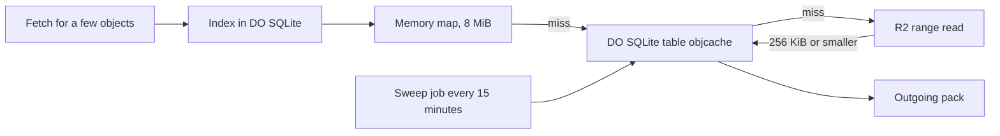

# Tiny in-DO object cache with alarm-driven eviction

> Verdict: **risky** · feasibility 4/5 · reliability 4/5 · correctness 2/5 · effort: days
> Read the words in [how-to-read.md](../findings/how-to-read.md). Engineers: [proof](../proofs/in-do-object-cache.md) · [review](../reviews/in-do-object-cache.md)

## What this idea is

git is a tool that keeps every version of a set of files, and lets many people share those versions. A repository, or repo, is one project's full set of files and their history. This idea gives each repo a small cache of the items that are read most often. A read that hits the cache never goes to the big file store. A background job cleans the cache on a schedule.

Think of it like this. A librarian keeps the most requested books on a small shelf behind the desk. A reader gets one of those books at once, without a walk to the stacks. Every few minutes the librarian returns the books nobody asked for.

## How it works

Some words first. A commit is one saved version of the files, with a note about what changed. An object is one stored item in git. An object is a file's content, a folder listing, or a commit. A SHA, or hash, is a fingerprint of an object's content. Two objects with the same content have the same fingerprint. A packfile, or pack, is one bundle that holds many objects, squeezed to save space.

A fetch is getting commits from the server. A clone gets everything for the first time. A Cloudflare Worker is one of the small programs that run on Cloudflare's network close to the user, with no server to manage. A Durable Object, or DO, is a single small program with its own storage that handles one thing at a time. There is one DO for each repo. Think of it like the one librarian who is allowed to update the catalog.

DO SQLite is the small database inside each Durable Object. An alarm is a timer inside a Durable Object. A DO has only one alarm at a time. R2 is Cloudflare's large file store. It holds the git objects. A subrequest is one call from a Worker to another service, such as one read from R2. Each request may make at most 50 subrequests on the free plan and 10,000 on the paid plan.

The second pass writes the cache in Rust, as one module inside the shared foundation code. The shared contract fixes how every object lies in R2 and how every SHA is resolved. The cache sits behind that read path and changes nothing about it.

1. The foundation stores every object in R2 as one pack entry. A pack entry is a small header followed by the squeezed content.
2. A fetch for a few objects arrives at the repo DO. The DO resolves each SHA through the index in DO SQLite. The index names the pack, the offset, and the length.
3. The DO looks in a memory map first. A hit returns the entry bytes at once. The map holds at most 8 MiB, and no entry above 1 MiB.
4. On a miss, the DO looks in a DO SQLite table named objcache. A hit fills the memory map and returns.
5. On a second miss, the DO reads all missing entries from R2 in one combined range read. A full hit costs zero subrequests.
6. The DO stores each missing entry in objcache when the entry is 256 KiB or smaller. First the DO checks that the entry header agrees with the index row.
7. For a small set, up to 256 entries and 4 MiB, the DO copies the entries straight into an outgoing pack. The DO adds a pack header and a fingerprint trailer. Larger sets bypass the cache.
8. The first stored entry adds one sweep job to the shared job queue. The job scheduler owns the single alarm. No cache code sets the alarm.
9. Every 15 minutes the sweep job runs. The job writes the batched hit times, deletes rows older than 6 hours, then deletes the least used rows until the table fits 64 MiB.

## What the reviewer decided

The reviewer looks for blockers and caveats. A blocker is a problem that stops the idea from working until it is fixed. A caveat is a limit or a condition. The idea works, but only inside this limit.

The verdict is Risky.

| Score | Value |
|---|---|
| Feasibility | 4 of 5 |
| Reliability | 3 of 5 |
| Correctness | 4 of 5 |

| Score | First pass | Second pass |
|---|---|---|
| Feasibility | 4 of 5 | 4 of 5 |
| Reliability | 4 of 5 | 3 of 5 |
| Correctness | 2 of 5 | 4 of 5 |

Risky. The idea can be built. But the proof shows one or more problems the reviewer could not fully solve, or it does a weaker version of the goal. Think of it like a runway you can see on the map, but nobody has checked it for holes.

For this idea, the second pass is a real improvement. Both first-pass blockers are closed by shown code. The read path is correct by construction, because the cached bytes are the exact bytes the shared contract puts in every pack. The reviewer checked every library call against the real source of the pinned crates, and every call exists. No message byte would break a current git client.

But the cleanup job breaks a limit the reviewer found on Cloudflare's own limits page. DO SQLite allows at most 100 bound values in one query. The cleanup binds up to 501. So the cleanup throws on its first run, and the shared job scheduler marks it dead after 8 tries. The cache then grows to 128 MiB and stops admitting new entries. The fix is one line. With that fix and some contract write-backs, the reviewer expects days of work.

## What changed in the second pass

- The cache expected a different byte format than R2 holds. Fixed. The shared contract now stores every object as one pack entry, and the cache stores those bytes unchanged. Before it stores an entry, the cache checks the entry header against the index row.
- The memory map had no size limit. Fixed. The map refuses any entry above 1 MiB and empties itself when it would pass 8 MiB. The hit list stops at 10,000 entries. The objcache table stops admitting at 128 MiB. Sets above 256 entries or 4 MiB bypass the cache.
- No first-pass blocker remains open. The one new blocker, the limit of 100 bound values, is fresh and not a carry-over.

## Problems that must be fixed first

### Problem 1: The cleanup query binds too many values

**What goes wrong.** DO SQLite allows at most 100 bound values in one query. The cleanup updates hit times with one query for 500 SHAs, which binds 501 values. The cleanup then deletes 500 rows in one query, which binds 500 values. Every run throws at the first query. The job scheduler retries 8 times and then marks the job dead.

**Why it matters.** The cleanup is the headline mechanism of this idea. When the cleanup is dead, nothing ever leaves the cache. The objcache table grows to 128 MiB and then refuses every new entry. That state lasts forever for that repo.

**How to fix it.** Split each list of SHAs into groups of 90 or fewer. Or delete with one query that selects the oldest 500 rows inside the same statement. Sum their sizes with the same inner query, in the same run. Note that the contract's own push lookup and object insert have the same limit unless written as multi-row inserts.

### Problem 2: The shared contract lacks the pieces this code needs

**What goes wrong.** The code calls seven helpers that the shared contract does not define. The read helper is called with SHA and location pairs plus a budget, but the contract writes it with locations only. The contract also lacks the CacheSweep job kind, the cache field on the repo DO, and schema version 3.

**Why it matters.** The code cannot compile until the contract names those helpers with the same shapes. Another team member who builds from the contract alone gets a different read helper than this proof expects.

**How to fix it.** Write the seven helpers and the read helper signature into the contract. Add the CacheSweep job kind, the cache field, and schema version 3 in the same change.

## Things to know

- Reading a cached entry back from DO SQLite goes through a generic path that makes one host call per byte. A 256 KiB hit costs about 262,000 calls. Use the raw cursor or a byte-array helper instead.
- The contract says a cleanup run that spends 80 percent of its time budget must continue at once. The proof waits 15 minutes instead. The admission cap bounds the delay.
- The cleanup never reports itself as done. An empty cache still wakes the DO every 15 minutes, per repo, forever.
- The cache lookup runs one query per SHA. A large fetch round with thousands of trees runs thousands of queries. Batches of 90 or fewer would be cleaner.
- Nothing checks that the number of entries read equals the count in the pack header. A short read from R2 would corrupt bytes 8 to 11 of the pack.
- Some gaps come from the contract, not this idea. The job queue helper is sync but the alarm helper is async. Rollback after a crash is unverified. Real R2 range reads and the DO subrequest cap are unmeasured. The contract's own push lookup and object insert also break the limit of 100 bound values.
- The cache admits objects by SHA, size, and recent use, not by filename. The promise about package.json and lockfiles is not delivered.

## How this idea connects to the others

Protocol v2 is the newer, cleaner set of messages git uses to talk to a server.
This idea needs [#3 Speak git protocol v2 only, translate v0 at the edge](./protocol-v2-only.md) because the small pack travels in a protocol v2 reply.
This idea needs [#2 Refs in DO SQLite, objects in R2](./refs-sqlite-objects-r2.md) because that index resolves every SHA and R2 holds every entry.
This idea needs [#5 Content-addressed R2 keys](./content-addressed-r2-keys.md) to read an object from R2 by its fingerprint.
This idea needs [#55 GC and repack as a DO alarm](./gc-and-repack-alarm.md) because the sweep is one job in the scheduler that owns the alarm.
This idea needs [#10 Shallow and partial clone as first-class filters](./partial-clone-filters.md) because the small fetches that hit the cache come from partial clones.
