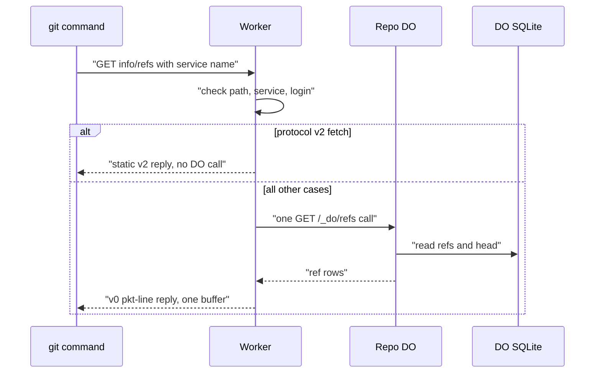

# The /info/refs?service= entrypoint and pkt-line codec

> Verdict: **lands** · feasibility 5/5 · reliability 5/5 · correctness 4/5 · effort: days
> Read the words in [how-to-read.md](../findings/how-to-read.md). Engineers: [proof](../proofs/info-refs-endpoint.md) · [review](../reviews/info-refs-endpoint.md)

## What this idea is

git is a tool that keeps every version of a set of files, and lets many people share those versions. Every talk between git and a server starts with one web request, the handshake. The server answers with a list of its refs and the features it supports. This idea builds that first request in a Worker, plus the small code that frames every git message. In the second pass this idea also owns the one entry point that all git requests pass through.

Think of it like this. When you phone a large shop, the first thing you hear is a greeting that names the shop and lists the departments. Only after that greeting do you say what you want. The greeting is the handshake.

## How it works

The second pass writes the design in Rust, against one shared contract that every idea in this set follows. Wasm, or WebAssembly, is a way to run code from other languages, such as Rust, inside a Worker. The pkt-line codec and the advertisement bytes now live in one shared module named wire. This idea owns the edge module, the single entry point for all three git routes.

1. A repository is one project's full set of files and their history. Fetch means getting commits from the server. A clone gets everything for the first time. Push means sending your new commits to the server. Smart HTTP is the way git talks to a server over normal web requests. A git command first sends a GET request to `/owner/repo.git/info/refs` with a service name.
2. Cloudflare Workers are small programs that run on Cloudflare's network close to the user, with no server to manage. The Worker checks the path. The owner and repo names may hold only letters, digits, dot, underscore, and dash, up to 64 characters. The Worker strips a `.git` suffix. Any other path gets a 404.
3. The Worker then asks the shared auth code who is calling. A failed login gets a 401 answer with a WWW-Authenticate header. That 401 is what makes git ask for credentials and retry.
4. The service name is git-upload-pack for a fetch and git-receive-pack for a push. Protocol v2 is the newer, cleaner set of messages git uses to talk to a server. A modern git adds a Git-Protocol header that asks for protocol v2.
5. For a fetch with protocol v2, the Worker writes the whole answer on its own, with no call to the DO. The answer is a fixed list of features, pinned byte for byte by tests.
6. For every other case, the Worker makes exactly one call to the repo's Durable Object. A Durable Object, or DO, is a single small program with its own storage that handles one thing at a time. There is one DO for each repo. Think of it like the one librarian who is allowed to update the catalog. DO SQLite is the small database inside each Durable Object. The DO reads every ref and the head pointer in one synchronous query. No push running at the same time can tear the list.
7. A commit is one saved version of the files, with a note about what changed. A ref is a name that points at one commit. A branch is a ref. A tag is a ref. Pkt-line is git's way of framing a message. Each line starts with four characters that give its length. The Worker frames the reply as pkt-lines: a service greeting, a flush line, an optional version 1 line, then one line per ref with the features on the first line.
8. The reply goes back as one buffer, not a stream. There is no background writer left to fail when the client disconnects. The reply carries a content type that names the service, and three headers that stop any cache from storing the reply.
9. The same entry point also dispatches the later POST requests. A push POST checks write access before any body byte is read. A wrong method or content type gets a 400, after the Worker drains up to 1 MiB of the body.
10. Every error becomes a status code and a short message before any reply byte is written. The GET gets plain text. The POSTs get one ERR pkt-line. A broken length such as 0003 or -001 is rejected and mapped to a 400.

## What the reviewer decided

The reviewer looks for blockers and caveats. A blocker is a problem that stops the idea from working until it is fixed. A caveat is a limit or a condition. The idea works, but only inside this limit.

The verdict is Lands with caveats.

| Score | Value |
|---|---|
| Feasibility | 5 of 5 |
| Reliability | 5 of 5 |
| Correctness | 4 of 5 |

| Score | First pass | Second pass |
|---|---|---|
| Feasibility | 5 of 5 | 4 of 5 |
| Reliability | 5 of 5 | 5 of 5 |
| Correctness | 4 of 5 | 4 of 5 |

Feasibility asks if Cloudflare can run the idea today. Reliability asks if the idea keeps data safe when things fail. Correctness asks if the idea does what its title says.

Lands with caveats. The idea is sound and can be built. The proof has one or more problems that must be fixed first, and the reviewer described each fix. Think of it like a flight with a runway that needs some repairs before you land. The runway is there. The repairs are known.

For this idea, the second pass moved the verdict from Lands down to Lands with caveats. Feasibility moved down one point. The calls that build the request to the DO are read from the library source but never run, and two small compile gaps remain. Reliability and correctness stayed flat. The handshake still only reads and never writes, so no data can be lost. The exact bytes of both handshakes are now pinned by tests, and five of the six first-pass caveats are closed by code. The cost is one new blocker: three shared helpers sit in the wrong module, so the DO side cannot use them until they move. The reviewer expects two to three days of work.

## What changed in the second pass

- The reply promised features the server did not have: fixed. The feature lists for both handshakes are now written by the shared wire module and pinned byte for byte by tests. The push advertisement no longer names atomic push or push options.
- A git asking for protocol version 1 got an inexact reply: partly fixed. The flag that asks for the version 1 line is in this proof. The line itself is written by the protocol v2 module, and no test pins its bytes yet.
- A failed DO call or a dead stream writer gave an unhandled error: fixed. A failed DO call becomes a 500 with a short body. The reply is one buffer, so a client disconnect has nothing left to abort.
- The decoder treated 0003 as a flush and accepted broken lengths such as -001: fixed by the contract modules. The reader now uses a pinned packet-line library that rejects both cases, and tests pin each case to a 400.
- The login check had to sit in the Worker before the DO call: fixed. The route checks the caller before anything else, and the 401 carries the header that makes git retry with credentials.
- The body cap was stated as 500 MB for paid plans: fixed. The text now gives the cap per zone plan. The caps are 100 MB, 100 MB, 200 MB, and 500 MB for the Free, Pro, Business, and Enterprise plans.

## Problems that must be fixed first

### Problem 1: Shared helpers live in the wrong module

**What goes wrong.** Three items that the DO side must use are placed inside the edge module. They are the reader of the identity headers, the format of the ref list reply, and the error-to-status mapper. The contract says the DO module may not depend on the edge module. The dependency runs the wrong way.

**Why it matters.** Every DO route would have to import the edge module to reach these helpers. That breaks the module order the contract fixes. No DO route can compile against the helpers where they sit now.

**How to fix it.** Move the three items into the error, wire, or store modules, where the contract lets the DO reach them. It is a file move, not a redesign. No bytes on the wire change.

## Things to know

- The code that builds the request to the DO is read from the library source but never run. The proof names a first-day test for it, and a simpler fallback exists if the calls fail.
- The error mapper needs one small conversion that the proof does not show yet. Three libraries must also be added to the manifest. Both are compile gaps, not design gaps.
- The push advertisement still lists HEAD first, which a real git server never sends. A mirror push then tries to delete HEAD and fails. Drop HEAD for the push advertisement and keep it for the fetch advertisement.
- Error replies on this route carry no content type, so git may not print the reason. Set a plain-text content type. On a POST, git may never read the ERR line at all. If the message is swallowed, the contract must decide whether to answer 200 with an ERR line instead.
- The version 1 line still needs a pinned test. A live check is the only guard today.
- The fetch route gets no budget object, so its DO call is uncharged unless the sibling idea charges the call itself. A subrequest is one call from a Worker to another service, such as one read from R2.
- Any caller with a read token can create a new DO, and a recurring alarm, by probing a new repo name on the old-protocol path. A cap or an allowlist is a later contract question.
- A ref name that is not valid text fails in the JSON reply. The refs table already assumes valid text.

## How this idea connects to the others

This idea needs [#1 One Durable Object per repo as the ref authority](./repo-do-ref-authority.md), which is the DO that answers the ref list request.

This idea needs [#2 Refs in DO SQLite, objects in R2](./refs-sqlite-objects-r2.md), which is the refs table the DO reads.

This idea needs [#3 Speak git protocol v2 only, translate v0 at the edge](./protocol-v2-only.md), which owns the shared wire module that frames every pkt-line and writes the advertisements.

This idea needs [#54 Auth and multi-tenancy: owner/repo routing to DO ids](./auth-and-multitenancy.md), which checks the caller before any route runs.

This idea needs [#6 Two-phase push](./two-phase-push.md), which is the receive-pack code that the entry point calls for a push POST.
