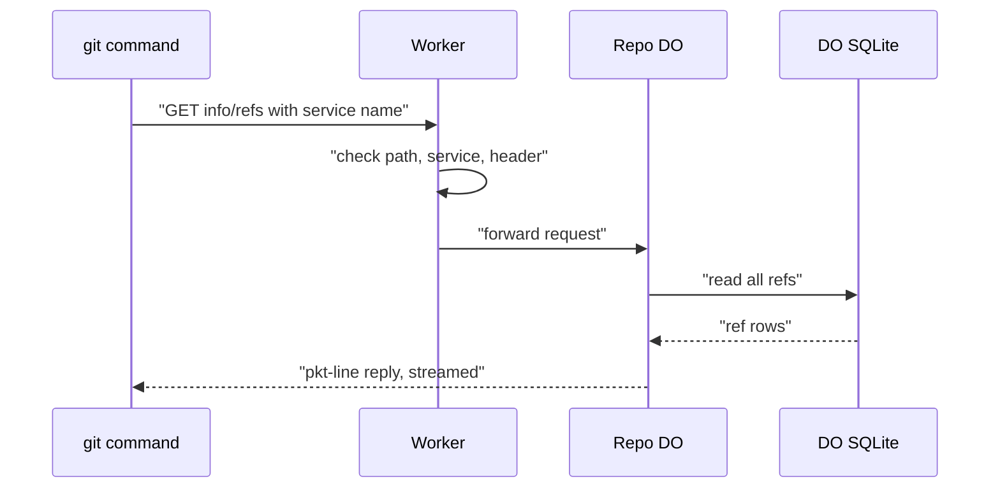

# The /info/refs?service= entrypoint and pkt-line codec

> Verdict: **lands** · feasibility 5/5 · reliability 5/5 · correctness 4/5 · effort: days
> Read the words in [how-to-read.md](../findings/how-to-read.md). Engineers: [proof](../proofs/info-refs-endpoint.md) · [review](../reviews/info-refs-endpoint.md)

## What this idea is

git is a tool that keeps every version of a set of files, and lets many people share those versions. Every talk between git and a server starts with one web request, the handshake. The server answers with a list of its refs and the features it supports. This idea builds that first request in a Worker, plus the small code that frames every git message.

Think of it like this. When you phone a large shop, the first thing you hear is a greeting that names the shop and lists the departments. Only after that greeting do you say what you want. The greeting is the handshake.

## How it works

1. A repository is one project's full set of files and their history. Fetch means getting commits from the server. A clone gets everything for the first time. Push means sending your new commits to the server. Smart HTTP is the way git talks to a server over normal web requests.
2. A git command such as clone, fetch, or push first sends a GET request to `/owner/repo.git/info/refs` with a service name. The service name is git-upload-pack for a fetch and git-receive-pack for a push. Protocol v2 is the newer, cleaner set of messages git uses to talk to a server. A modern git adds a header that asks for protocol v2.
3. Cloudflare Workers are small programs that run on Cloudflare's network close to the user, with no server to manage. The Worker checks the path, the service name, and the header.
4. A Durable Object, or DO, is a single small program with its own storage that handles one thing at a time. There is one DO for each repo. Think of it like the one librarian who is allowed to update the catalog. DO SQLite is the small database inside each Durable Object. The Worker forwards the request to the DO of that repository.
5. A commit is one saved version of the files, with a note about what changed. A branch is a named line of commits, like a bookmark that moves forward as you save. A ref is a name that points at one commit. A branch is a ref. A tag is a ref. The DO reads all refs from a table in DO SQLite, in one query.
6. Pkt-line is git's way of framing a message. Each line starts with four characters that give its length. The DO streams the answer back as pkt-lines. The first line names the service, and then comes an empty flush line.
7. For the old protocol, the DO then sends one line per ref, with the supported features on the first line. For protocol v2, the DO sends a version line and feature lines, and no refs. The git command asks for refs in a later request.
8. The reply carries a content type that names the service, and headers that stop any cache from storing the reply.
9. The same pkt-line code reads the bodies of the later POST requests. git squeezes large bodies with gzip, and the Worker unsqueezes them before reading.

## What the reviewer decided

The reviewer decided that this idea lands.

| Score | Value |
|---|---|
| Feasibility | 5 of 5 |
| Reliability | 5 of 5 |
| Correctness | 4 of 5 |

Feasibility asks if Cloudflare can run the idea today. Reliability asks if the idea keeps data safe when things fail. Correctness asks if the idea does what its title says.

Lands. The proof works on Cloudflare today. The reviewer found no problem that must be fixed first. Think of it like a flight with a clear runway.

A blocker is a problem that stops the idea from working until it is fixed. A caveat is a limit or a condition. The idea works, but only inside this limit. For this idea, the reviewer found no blockers and six caveats.

GA means a Cloudflare feature that is finished and supported, not a preview. Every feature the proof uses is GA. The handshake only reads, and never writes, so no data can be lost. The reviewer checked the exact bytes of both the old and the new handshake against what a current git command expects. A normal git clone, fetch, or push accepts the reply and moves on to the next request. The reviewer expects the remaining work to take days.

## Things to know

- The feature list in the reply is a promise, and the reply promises filter, shallow, wait-for-done, all-or-nothing push, push options, and the newer push report. A git command will use each feature once the server names it, so trim the list until the later request handlers support each feature.
- A git command that asks for protocol version 1 gets the old reply without the version 1 line. git accepts that reply, but the reply is not exact.
- Nothing catches an error from the DO call or from the stream writer. If the DO restarts or the client disconnects mid-reply, the result is an unhandled error page instead of a clean 502 answer.
- The pkt-line reader treats the length 0003 as a flush, and accepts broken lengths such as -001 without a complaint. A broken request body must get a 400 answer instead.
- The login check, which answers 401 with a WWW-Authenticate header, must sit in the Worker before the DO call on this GET request. That check is not part of this idea.
- The proof says that paid plans allow a 500 MB request body, and that is wrong. The cap follows the zone plan, with 100 MB, 100 MB, 200 MB, and 500 MB for the Free, Pro, Business, and Enterprise plans.

## How this idea connects to the others

This idea needs [#1 One Durable Object per repo as the ref authority](./repo-do-ref-authority.md), which is the DO that answers the handshake.

This idea needs [#2 Refs in DO SQLite, objects in R2](./refs-sqlite-objects-r2.md), which is the refs table the DO reads.

This idea needs [#3 Speak git protocol v2 only, translate v0 at the edge](./protocol-v2-only.md), which answers the later request for refs under protocol v2.
