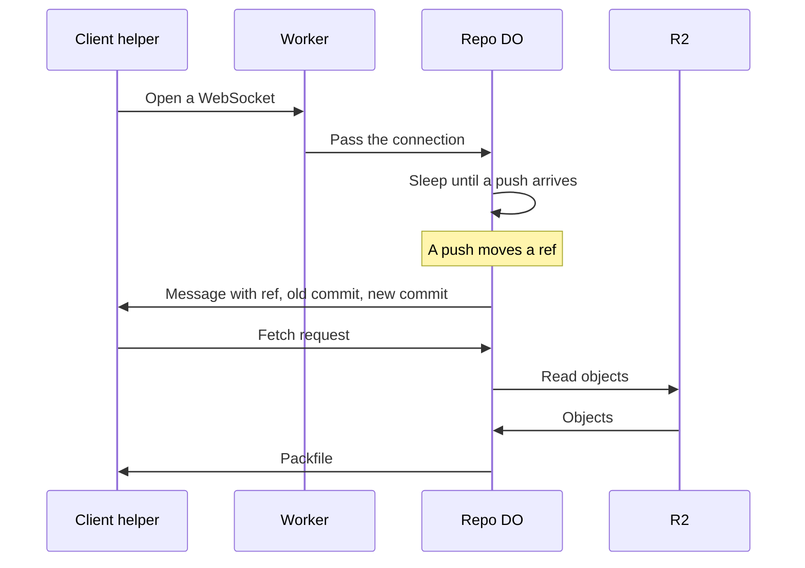

# Live fetch over hibernating WebSockets

> Verdict: **lands with caveats** · feasibility 4/5 · reliability 3/5 · correctness 2/5 · effort: weeks
> Read the words in [how-to-read.md](../findings/how-to-read.md). Engineers: [proof](../proofs/live-fetch-websocket.md) · [review](../reviews/live-fetch-websocket.md)

## What this idea is

Git is a tool that keeps every version of a set of files, and lets many people share those versions. A repository, or repo, is one project's full set of files and their history. A commit is one saved version of the files, with a note about what changed. A ref is a name that points at one commit. A branch is a ref. A tag is a ref.

A push is sending your new commits to the server. A fetch is getting commits from the server. A clone gets everything for the first time. Cloudflare Workers are small programs that run on Cloudflare's network close to the user, with no server to manage.

A Durable Object, or DO, is a single small program with its own storage that handles one thing at a time. There is one DO for each repo. Think of it like the one librarian who is allowed to update the catalog.

Today a client must ask the server again and again to learn that a ref moved. This idea keeps one open connection, called a WebSocket, between the client and the repo DO. The DO sleeps while nothing happens, and wakes to send a small message the moment a push moves a ref. The client then fetches the new commits, either over the same connection or with a normal fetch.

Think of it like this. A doorbell is better than walking to the door every minute to check for visitors. The bell rings only when someone arrives, and then you go to the door.

## How it works

1. A helper program on the client opens a WebSocket connection to the Worker. The Worker passes the connection to the repo DO.
2. The DO accepts the connection and tags the connection with the names of the refs the client wants to watch.
3. The DO writes the client's last known commit for each ref into a small note attached to the connection. The note can hold at most 2 KiB.
4. The DO goes to sleep. Cloudflare calls this sleep hibernation. A sleeping DO costs nothing while the connection waits.
5. The proof plans an alarm that closes connections whose login has expired. An alarm is a timer inside a Durable Object. A DO has only one alarm at a time.
6. A push arrives. The DO updates the ref in DO SQLite with a compare-and-swap. DO SQLite is the small database inside each Durable Object. Compare-and-swap, or CAS, means change a value only if it still has the value you expect. If someone changed it first, do nothing and report it.
7. The DO finds every connection tagged with that ref. The DO sends each one a short message with the ref name, the old commit, and the new commit.
8. The helper answers on the same connection with a protocol v2 fetch request. Protocol v2 is the newer, cleaner set of messages git uses to talk to a server.
9. The DO reads the needed objects from R2 and streams back a packfile. An object is one stored item in git. An object is a file's content, a folder listing, or a commit. R2 is Cloudflare's large file store. It holds the git objects. A packfile, or pack, is one bundle that holds many objects, squeezed to save space.
10. The DO frames the packfile as pkt-lines with a sideband. A pkt-line is git's way of framing a message. Each line starts with four characters that give its length. A sideband is a way to send two kinds of data in one stream, like a main channel and a progress channel.
11. A normal git client cannot use a WebSocket. For a normal git client, the helper only listens for the message and then runs a normal git fetch over smart HTTP. Smart HTTP is the way git talks to a server over normal web requests.

## What the reviewer decided

The reviewer's verdict is Lands with caveats.

| Score | Value |
|---|---|
| Feasibility | 4 of 5 |
| Reliability | 3 of 5 |
| Correctness | 2 of 5 |

Lands with caveats. The idea is sound and can be built. The proof has one or more problems that must be fixed first, and the reviewer described each fix. Think of it like a flight with a runway that needs some repairs before you land. The runway is there. The repairs are known.

For this idea, the verdict holds only for the simple path. In the simple path the DO sends the message, and the client runs a normal git fetch over smart HTTP. Every Cloudflare feature the proof uses is GA. GA, or generally available, means a Cloudflare feature that is finished and supported, not a preview. Refs cannot end up as two records that disagree, because the single DO does the CAS in one database step.

The path that sends the packfile over the WebSocket has three blockers. A blocker is a problem that stops the idea from working until it is fixed. The reviewer says that path is a demo until the three blockers and flow control are fixed. The reviewer expects the work to take weeks.

The idea also has caveats. A caveat is a limit or a condition. The idea works, but only inside this limit.

## Problems that must be fixed first

### Problem 1: Missed ref moves after a reconnect

**What goes wrong.** When a client reconnects, the DO fills the note with the server's current commits, not the commits the client reports. If a ref moved while the client was away, the DO now believes the client already has the new commit. The DO sends nothing. The same thing happens when Cloudflare removes the DO from memory between the database write and the send loop. The message is lost, and the client waits with no news.

**Why it matters.** The goal of the idea is that the client learns about every ref move at once. One removal from memory breaks that goal. No data is lost, but the client stays on the old commit until some other push happens.

**How to fix it.** Make the helper send its own known commits when the connection opens. Make the DO compare those commits with the current refs. Make the DO send a message for each ref that differs.

### Problem 2: Wrong reply framing for a fetch with done

**What goes wrong.** The proof sends an "acknowledgments" section and a "NAK" line before the "packfile" section. When the client's request contains "done", a real git server leaves out the acknowledgments section. Git's fetch code then expects "packfile" as the first section. Git stops with the error "expected 'packfile', received 'acknowledgments'". A helper that feeds these bytes to a normal git fetch command fails on the first frame.

**Why it matters.** The proof claims the bytes are the same as the smart HTTP reply. The bytes are not the same. The fetch over the WebSocket fails before the first object arrives.

**How to fix it.** Leave out the acknowledgments section when the request contains "done". Start the reply with the packfile section, as a real git server does.

### Problem 3: The note on the connection grows without limit

**What goes wrong.** After each fetch, the DO adds every wanted commit to the note attached to the connection. The note never shrinks. Cloudflare limits the note to 2 KiB. After a few dozen fetches the note is too big. The save call throws an error, and the record of what the client has is destroyed.

**Why it matters.** A long-lived connection is the whole point of the idea. A connection that breaks after a few dozen fetches does not deliver that.

**How to fix it.** Keep only the latest commit for each watched ref in the note. Replace the old value instead of adding a new one.

## Things to know

- One connection can carry at most 10 tags, so a client cannot watch more than 10 refs. The design needs a scheme that groups refs under one tag.
- The DO cannot see how much data still waits to be sent. A slow client on a large packfile fills the 128 MB DO memory, so large fetches must go over smart HTTP instead.
- A code deploy or a DO restart closes every sleeping connection. Clients must reconnect and compare their commits with the server's commits.
- A push during a fetch on the same connection can place a text message in the middle of the binary packfile stream. The proof also sends some pkt-line strings as text frames, which breaks its own rule that text frames carry only control messages.
- Two parts are not written: the alarm that closes connections with an expired login, and the real negotiation of which objects to send. The database setup in the constructor must also run inside blockConcurrencyWhile.
- A repo with constant pushes never sleeps, so the zero-cost claim holds only for quiet repos. A normal git client cannot use the connection at all without a helper program.

## How this idea connects to the others

This idea needs one DO to own the refs of each repo, as in [#1 One Durable Object per repo as the ref authority](./repo-do-ref-authority.md).

This idea keeps refs in DO SQLite and objects in R2, as in [#2 Refs in DO SQLite, objects in R2](./refs-sqlite-objects-r2.md).

The fetch request on the connection uses protocol v2, as in [#3 Speak git protocol v2 only, translate v0 at the edge](./protocol-v2-only.md).

The pkt-line framing comes from [#53 The /info/refs?service= entrypoint and pkt-line codec](./info-refs-endpoint.md).

The DO must work out which objects the client lacks, as in [#56 Want/have negotiation with a commit-graph in SQLite](./want-have-negotiation.md).

The push that moves the ref and sends the message is the push from [#6 Two-phase push](./two-phase-push.md).
