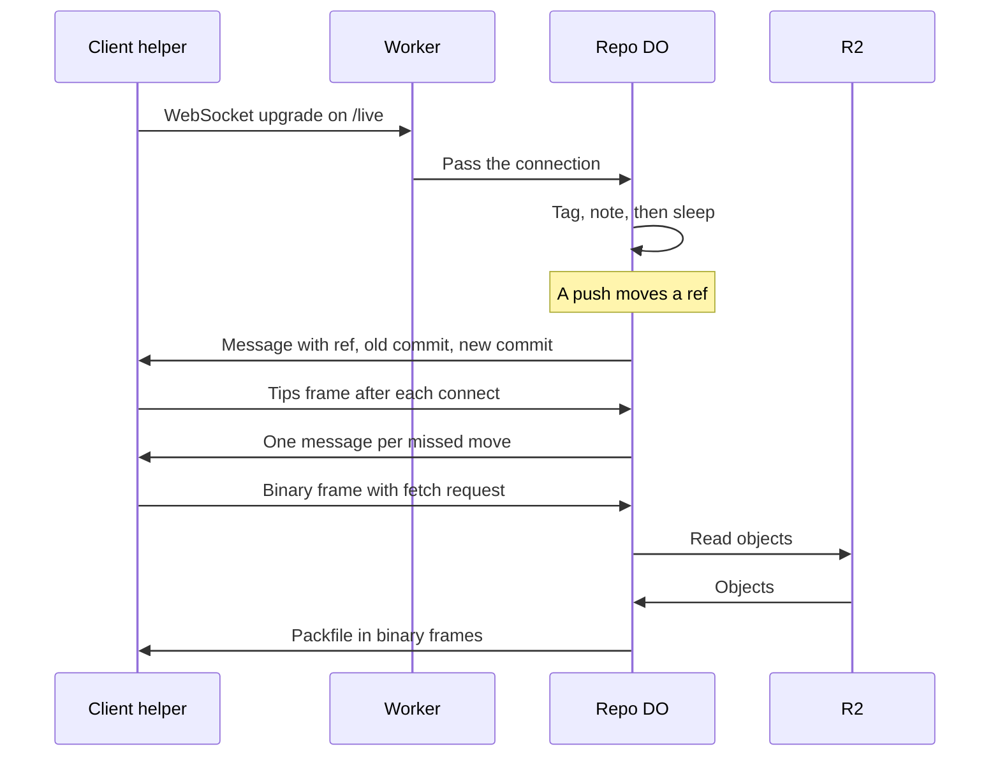

# Live fetch over hibernating WebSockets

> Verdict: **lands with caveats** · feasibility 4/5 · reliability 3/5 · correctness 2/5 · effort: weeks
> Read the words in [how-to-read.md](../findings/how-to-read.md). Engineers: [proof](../proofs/live-fetch-websocket.md) · [review](../reviews/live-fetch-websocket.md)

## What this idea is

Git is a tool that keeps every version of a set of files, and lets many people share those versions. A repository, or repo, is one project's full set of files and their history. A commit is one saved version of the files, with a note about what changed. A ref is a name that points at one commit. A branch is a ref. A tag is a ref.

A push is sending your new commits to the server. A fetch is getting commits from the server. A clone gets everything for the first time. Cloudflare Workers are small programs that run on Cloudflare's network close to the user, with no server to manage.

A Durable Object, or DO, is a single small program with its own storage that handles one thing at a time. There is one DO for each repo. Think of it like the one librarian who is allowed to update the catalog.

Today a client must ask the server again and again to learn that a ref moved. This idea keeps one open connection, called a WebSocket, between the client and the repo DO. The DO sleeps while nothing happens, and wakes to send a small message the moment a push moves a ref. The client then fetches the new commits, either over the same connection or with a normal fetch.

Think of it like this. A doorbell is better than walking to the door every minute to check for visitors. The bell rings only when someone arrives, and then you go to the door.

## How it works

The second pass writes the design in Rust, against one shared contract that every idea in this set follows. Wasm, or WebAssembly, is a way to run code from other languages, such as Rust, inside a Worker.

1. A helper program on the client opens a WebSocket connection to a new route on the Worker. The Worker checks the login and passes the connection to the repo DO. The Worker never answers on the connection itself.
2. The DO accepts the connection for hibernation and tags the connection with the refs the client wants to watch. A request for all refs, or for more than 10 refs, gets the single tag "*". One connection can hold at most 10 tags.
3. The DO stores a note on the connection with two values only. One value says when the login expires. The other value says whether a fetch is in flight. The note is about 40 bytes, so the 2 KiB limit can never be reached.
4. The DO tells the platform to answer ping messages with pong on its own, so keepalives never wake the DO. The DO also queues a sweep job on its alarm. An alarm is a timer inside a Durable Object. A DO has only one alarm at a time. The sweep job closes connections whose login has expired. Then the DO goes to sleep. Cloudflare calls this sleep hibernation. A sleeping DO costs nothing while the connection waits.
5. A push arrives. The commit code in the DO moves the ref with a compare-and-swap. Compare-and-swap, or CAS, means change a value only if it still has the value you expect. If someone changed it first, do nothing and report it.
6. Inside the same step, the DO finds every connection tagged with that ref name or with "*". The DO sends each one a short message with the ref name, the old commit, and the new commit. The platform releases the messages only if the ref move is durable.
7. On every connect, the helper sends a control frame that lists the commit each of its refs points at. The DO compares that list with the refs table in DO SQLite. DO SQLite is the small database inside each Durable Object. The DO sends a message for each ref that differs, including deleted refs.
8. To fetch over the connection, the helper sends one binary frame that holds a complete protocol v2 fetch request. Protocol v2 is the newer, cleaner set of messages git uses to talk to a server.
9. The DO runs the same code path as a normal fetch. The DO looks up the wanted objects, works out which objects to send, and writes a packfile. An object is one stored item in git. An object is a file's content, a folder listing, or a commit. R2 is Cloudflare's large file store. It holds the git objects. A packfile, or pack, is one bundle that holds many objects, squeezed to save space.
10. The reply uses pkt-line framing with a sideband, the same bytes a normal fetch produces. A pkt-line is git's way of framing a message. Each line starts with four characters that give its length. A sideband is a way to send two kinds of data in one stream, like a main channel and a progress channel. After "done", the reply starts with the packfile section, as a real git server does.
11. The DO splits the reply into binary messages of 64 KiB. If the reply is larger than 8 MiB, the DO sends a control frame instead, and the helper runs a normal git fetch over smart HTTP. Smart HTTP is the way git talks to a server over normal web requests.
12. Text frames carry only control messages. Binary frames carry only fetch bytes. A ref message during a fetch lands between binary messages, never inside the pack bytes. One fetch can be in flight on a connection. A second request gets an error reply.
13. A normal git client cannot use a WebSocket. For a normal git client, the helper only listens for the message and then runs a normal git fetch over smart HTTP.

## What the reviewer decided

The reviewer's verdict is Lands with caveats.

| Score | Value |
|---|---|
| Feasibility | 4 of 5 |
| Reliability | 3 of 5 |
| Correctness | 2 of 5 |

| Score | First pass | Second pass |
|---|---|---|
| Feasibility | 4 of 5 | 4 of 5 |
| Reliability | 3 of 5 | 4 of 5 |
| Correctness | 2 of 5 | 4 of 5 |

Lands with caveats. The idea is sound and can be built. The proof has one or more problems that must be fixed first, and the reviewer described each fix. Think of it like a flight with a runway that needs some repairs before you land. The runway is there. The repairs are known.

For this idea, the second pass is a real rewrite, not a patch. All three first-pass blockers and the crash-window finding are closed by the shape of the design. The client now claims its own tips. The fetch bytes come from the same code as the normal fetch route. The note on the connection has a fixed size. The send loop runs inside the commit step, so only the output gate can split a ref move from its message. The output gate is the rule that holds sent messages until the step's writes are durable. Reliability rose from 3 to 4. Correctness rose from 2 to 4.

The remaining work is small. Three one-line gaps stop the Rust code from compiling against the sibling ideas. One test step uses a git command that cannot read the reply. The sweep job scans every connection in one step with no budget check. A ref created while the client was away is still never announced. The reviewer still expects weeks of work, because the idea needs the whole fetch path and a helper that is not yet built.

The idea also has caveats. A caveat is a limit or a condition. The idea works, but only inside this limit.

## What changed in the second pass

- Missed ref moves after a reconnect: fixed. The note on the connection stores no tips at all. The client claims its own tips in a control frame on every connect. The DO sends a message for each ref that differs, moved, created, and deleted alike.
- Wrong reply framing for a fetch with done: fixed by the contract modules. The reply now comes from the same prelude and pack code as the normal fetch route. That code leaves out the acknowledgments section after done.
- The note on the connection grew without limit: fixed. The note holds two numbers, about 40 bytes, and never grows. The client's haves travel inside each fetch frame.
- A crash between the ref move and the send loop lost the message: fixed. The send loop runs inside the same step as the ref move, with no wait in between. Only the output gate can separate the two, and the tips frame heals any missed message at reconnect.
- More than 10 watched refs did not fit in the tags: fixed. A short list becomes one tag per ref. A request for all refs or a longer list becomes the single "*" tag, and the send loop checks both kinds of tag.
- No flow control on sends: fixed. The DO counts the exact reply size before it writes the pack. Over 8 MiB the reply is a control frame, and the helper fetches over smart HTTP. One reply is in flight per connection.
- Deploys and restarts drop every connection: partly fixed. The tips frame on reconnect heals the missed moves. A ref created while the client was away is still never announced.
- The alarm for expired logins and the constructor setup were not written: fixed. A sweep job now closes expired connections every 15 minutes. The schema runs in the boot code inside each request, so no constructor setup exists.
- A busy repo never sleeps: still open. This is a platform fact. The zero-cost claim holds only for quiet repos.
- A message could land inside the pack stream, and some protocol bytes went out as text frames: fixed. All protocol bytes go in binary frames. Text frames carry only control messages. A ref message lands between binary messages.

## Problems that must be fixed first

### Problem 1: The code does not compile as written

**What goes wrong.** Three small gaps separate this file from the sibling ideas. The code calls a sideband constructor that does not exist outside the wire module. The code reads fields of the push command record that are private to the sibling module. The code calls a clock helper that is never imported.

**Why it matters.** Rust code that does not compile cannot run or be tested. The whole crate stays broken until the fixes land. Each fix is mechanical, but nothing can be checked before they land.

**How to fix it.** Add a sideband constructor to the wire module and register the change in the contract. Mark the command fields visible inside the crate. Add the missing import. Each fix is one line.

### Problem 2: One test step uses the wrong git command

**What goes wrong.** The new scenario feeds the reply bytes to a git command that reads only a raw packfile. The reply is framed with pkt-lines and a sideband, so that command cannot read the reply.

**Why it matters.** The step is the regression check for the framing fix from the first pass. As written, the check fails for the wrong reason and proves nothing.

**How to fix it.** Feed the bytes to git fetch-pack in stateless mode, or split the sideband channels before the packfile check. The rule that the first section is packfile stays the right check.

## Things to know

- The catch-up after a reconnect covers only refs the client already knows. A ref created while the client was away is never announced. The client contract needs a periodic ref listing over HTTP, or a server-side diff of the claimed tips.
- The platform claims the proof depends on are not measured. Unmeasured are the rule that sent messages wait for the ref move to be durable and the upgrade pass-through to the DO. Also unmeasured are the wake on an incoming message and the caps of 10 tags, 2 KiB, and 1 MiB per message.
- Every Cloudflare feature the proof uses is GA. GA, or generally available, means a Cloudflare feature that is finished and supported, not a preview.
- The sweep job scans every connection in one step with no budget check. At the platform's connection cap this step is unbounded.
- The edge route does not charge its DO call against the request budget. Each upgrade makes one uncharged subrequest. A subrequest is one call from a Worker to another service, such as one read from R2.
- The reply prelude gains a new parameter that belongs to the sibling idea. Both proofs now depend on the same edit landing.
- A ping text frame to an awake DO gets an error reply, not a pong. The automatic answer works only while the DO sleeps.
- A repo with constant pushes never sleeps, so the zero-cost claim holds only for quiet repos. Each ref move also sends one message per subscriber inside the commit step.
- A normal git client still needs the helper. Listening for the message and running git fetch over smart HTTP remains the only mode a normal client can use.

## How this idea connects to the others

This idea needs one DO to own the refs of each repo, as in [#1 One Durable Object per repo as the ref authority](./repo-do-ref-authority.md).

This idea keeps refs in DO SQLite and objects in R2, as in [#2 Refs in DO SQLite, objects in R2](./refs-sqlite-objects-r2.md).

The fetch request on the connection uses protocol v2, as in [#3 Speak git protocol v2 only, translate v0 at the edge](./protocol-v2-only.md).

The pkt-line framing comes from [#53 The /info/refs?service= entrypoint and pkt-line codec](./info-refs-endpoint.md).

The DO must work out which objects the client lacks, as in [#56 Want/have negotiation with a commit-graph in SQLite](./want-have-negotiation.md).

The push that moves the ref and sends the message is the push from [#6 Two-phase push](./two-phase-push.md).
