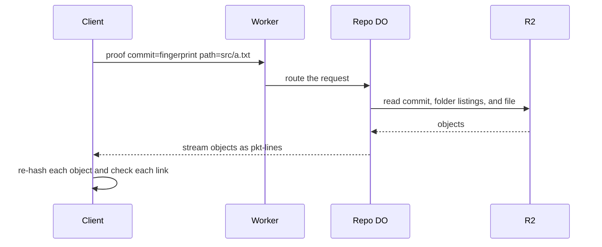

# Merkle inclusion proofs on fetch

> Verdict: **lands with caveats** · feasibility 4/5 · reliability 5/5 · correctness 3/5 · effort: weeks
> Read the words in [how-to-read.md](../findings/how-to-read.md). Engineers: [proof](../proofs/merkle-proofs.md) · [review](../reviews/merkle-proofs.md)

## What this idea is

Git is a tool that keeps every version of a set of files, and lets many people share those versions. A repository, or repo, is one project's full set of files and their history. Sometimes a user wants one file from a repo without downloading the whole repo. The user also does not want to trust the server. This idea lets the server send the file plus a short chain of evidence. The user checks the chain with math and knows the file is the real one.

Think of it like this. A friend gives you one page torn from a book. The friend also gives you the table of contents and the chapter page that names your page. You check that each piece names the next, and you know the page belongs to that book.

## How it works

An object is one stored item in git. An object is a file's content, a folder listing, or a commit. A commit is one saved version of the files, with a note about what changed. A SHA, or hash, is a fingerprint of an object's content. Two objects with the same content have the same fingerprint. In git, a commit names its top folder listing by fingerprint. Each folder listing names its files and subfolders by fingerprint. So a chain of objects from a commit down to a file is a chain of fingerprints. Fetch is getting commits from the server.

1. The user already trusts one commit fingerprint, for example from a signed tag.
2. The user sends the server a "proof" request with that commit fingerprint and a file path. Protocol v2 is the newer, cleaner set of messages git uses to talk to a server. The request is a new protocol v2 command.
3. A Cloudflare Worker routes the request to the repo's Durable Object. A Worker is a small program that runs on Cloudflare's network close to the user, with no server to manage. A Durable Object, or DO, is a single small program with its own storage that handles one thing at a time. There is one DO for each repo. Think of it like the one librarian who is allowed to update the catalog.
4. The DO reads the commit from R2, then the top folder listing, then each subfolder, then the file. R2 is Cloudflare's large file store. It holds the git objects. Each read is one R2 request.
5. The DO streams each object back as a pkt-line and ends with a flush line. A pkt-line is git's way of framing a message. Each line starts with four characters that give its length. The DO writes nothing to R2.
6. The user's program computes the fingerprint of each object it receives. The program checks that the first object is the trusted commit. The program checks that each object names the next one. If every check passes, the last object is the real file.

## What the reviewer decided

The reviewer's verdict is Lands with caveats.

| Score | Value |
|---|---|
| Feasibility | 4 of 5 |
| Reliability | 5 of 5 |
| Correctness | 3 of 5 |

Lands with caveats. The idea is sound and can be built. The proof has one or more problems that must be fixed first, and the reviewer described each fix. Think of it like a flight with a runway that needs some repairs before you land. The runway is there. The repairs are known.

The proof is the small test program the study wrote to check the idea. The math is right, and the check on the client is a real chain-of-evidence proof. The server only reads, so nothing can be lost or damaged. But the shown code cannot ship. The framing breaks on any object over 64 KB. Whole objects are held in memory inside a DO with a 128 MB limit. And the code cannot read objects stored in packs. A normal git client ignores the new command, so a normal git clone, fetch, or push still works and is not affected. Only a custom client uses the proof. The reviewer also notes that the gain is small. Git already checks fingerprints on every object it downloads. The reviewer expects the work to take weeks.

## Problems that must be fixed first

A blocker is a problem that stops the idea from working until it is fixed. The reviewer found two blockers.

### Problem 1: One pkt-line cannot hold a large object

**What goes wrong.** The proof sends each object as one pkt-line. The length field of a pkt-line has four characters, so one line can hold at most 65,516 bytes. Any folder listing or file over 64 KB produces a length that does not fit. The code does not cut the length, so the framing becomes garbage.

**Why it matters.** Git folder listings are flat and can be large. The proof itself says a folder with 10,000 entries is about 300 KB. So most realistic proofs break before the custom client can check them.

**How to fix it.** Split each object across many pkt-lines, using sideband style framing. A sideband is a way to send two kinds of data in one stream, like a main channel and a progress channel. Or send each object with its own length prefix followed by many pkt-lines.

### Problem 2: Objects inside packs cannot be read

**What goes wrong.** The proof reads only loose objects, each stored under its own fingerprint in R2. A packfile, or pack, is one bundle that holds many objects, squeezed to save space. Any repo that has been repacked keeps its objects inside packs. Reading an object from a pack needs an index in DO SQLite, a range read from R2, and delta resolution. DO SQLite is the small database inside each Durable Object. A delta is a stored object written as "the same as that other object, with these changes". The proof leaves all of that out.

**Why it matters.** Without pack support, the proof works only on a repo that has never been repacked. That is almost no real repo.

**How to fix it.** Build the pack index in DO SQLite. Read one object from a pack with an R2 range read. Resolve deltas by reading the base object first.

## Things to know

A caveat is a limit or a condition. The idea works, but only inside this limit.

- The server reads each whole object into memory, and it copies bytes through function argument lists. So the total size of one proof is limited by the 128 MB DO memory, and proofs running at the same time share that memory.
- The server labels the last object as a file every time. If the path names a folder, the client reports a false fingerprint mismatch. If the path names a submodule, the object is not in this repo, and the server stops with "missing object".
- The client expects exactly one object per path segment plus two. The client does not read error lines from the server. So a server error makes the client lose its place instead of showing the message.
- The DO writes a memo table of path to fingerprint with a fixed file mode, and nothing ever reads that table. That code is dead.
- The gain is small. A partial clone that skips file content already checks the fingerprint of every file it downloads later. The new trust in the chain comes from signed refs, not from this idea.
- SHA-256 repos are not supported as shown. Each proof needs one R2 read per path segment, one after another. The server does not slow down for a slow client, so a slow client holds objects in DO memory.

## How this idea connects to the others

- This idea keeps refs in the DO database and objects in R2, from [#2 Refs in DO SQLite, objects in R2](./refs-sqlite-objects-r2.md).
- This idea reads each object by its fingerprint, from [#5 Content-addressed R2 keys](./content-addressed-r2-keys.md).
- This idea adds a new command to the newer message set from [#3 Speak git protocol v2 only, translate v0 at the edge](./protocol-v2-only.md).
- This idea serves users who fetched only part of a repo with [#10 Shallow and partial clone as first-class filters](./partial-clone-filters.md).
- This idea needs a trusted commit fingerprint, which comes from [#19 Signed refs by default with append-only DO reflog](./signed-reflog.md).
