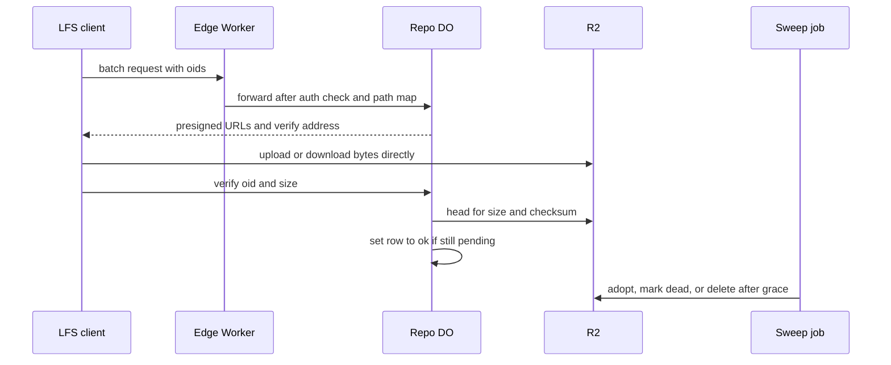

# Git LFS natively via presigned R2 URLs

> Verdict: **lands with caveats** · feasibility 4/5 · reliability 3/5 · correctness 4/5 · effort: days
> Read the words in [how-to-read.md](../findings/how-to-read.md). Engineers: [proof](../proofs/native-lfs.md) · [review](../reviews/native-lfs.md)

## What this idea is

git is a tool that keeps every version of a set of files, and lets many people share those versions. A repository, or repo, is one project's full set of files and their history. Git LFS, or Large File Storage, is a git add-on for big files such as images and videos. LFS keeps the big file outside the repo and stores a small pointer in the repo instead. This idea makes the server speak the LFS batch API and hand each client a signed web address for the big file store. The client moves the bytes itself, so the big bytes never pass through the server.

Think of it like this. A coat check desk hands you a numbered ticket. You carry your coat to the cloakroom shelf yourself, and later you collect it yourself with the ticket. The desk only writes tickets and keeps a list, so the desk never gets tired.

## How it works

Some words first. A commit is one saved version of the files, with a note about what changed. A push is sending your new commits to the server. An object is one stored item in git. An object is a file's content, a folder listing, or a commit.

R2 is Cloudflare's large file store. It holds the git objects. A presigned URL is a web address with a built-in signature that allows one action for a limited time. A SHA, or hash, is a fingerprint of an object's content. Two objects with the same content have the same fingerprint. LFS names each big file by its fingerprint, and calls that name the oid.

A Cloudflare Worker is one of the small programs that run on Cloudflare's network close to the user, with no server to manage. Wasm, or WebAssembly, is a way to run code from other languages, such as Rust, inside a Worker. The second pass writes the whole idea in Rust against the shared contract for the foundation. A Durable Object, or DO, is a single small program with its own storage that handles one thing at a time. There is one DO for each repo. Think of it like the one librarian who is allowed to update the catalog. DO SQLite is the small database inside each Durable Object.

An alarm is a timer inside a Durable Object. A DO has only one alarm at a time. The input gate is the rule that a Durable Object handles one request at a time while it waits on its own storage. The gate opens when the DO waits on the network instead. A janitor, or sweep, is a background task that deletes files nobody points to anymore. A subrequest is one call from a Worker to another service, such as one read from R2.

1. The LFS client posts a batch request to the edge Worker. The batch lists the oids and says download or upload.
2. The edge Worker checks the user's identity. An upload or a verify needs write rights, and a download needs any signed-in user.
3. The edge Worker maps the two public paths onto two DO routes and adds the public web address of the repo.
4. The DO checks every oid before any other use. An oid must be exactly 64 lowercase hex characters, or the DO rejects the batch.
5. The DO keeps a table named lfs_objects in DO SQLite, with the oid, the size, and a state. The state is pending, ok, or dead.
6. For a download, the DO answers with a presigned R2 read URL for each oid in state ok. Any other oid gets a 404 answer.
7. For an upload, the DO writes a pending row for each oid. The DO signs the write URL in pure Rust, with no network call.
8. The signature on the write URL covers a checksum header equal to the oid. R2 must reject any upload whose bytes do not match that fingerprint.
9. The DO also queues one sweep job in the shared job table. The queue keeps one job per kind, so the sweep can never starve.
10. The client writes the bytes straight to R2 under the key r/repo/lfs/oid. Then the client posts the verify request.
11. The DO asks R2 for the file's size and checksum. Then the DO writes the row as ok, but only if the row is still pending.
12. The sweep runs from the shared alarm. The sweep adopts an intact upload nobody verified, marks a bad one dead, and drops a row with no file.
13. The sweep deletes an R2 file only for a row that has been dead for at least one hour of grace.

## What the reviewer decided

The reviewer looks for blockers and caveats. A blocker is a problem that stops the idea from working until it is fixed. A caveat is a limit or a condition. The idea works, but only inside this limit.

The verdict is Lands with caveats.

| Score | Value |
|---|---|
| Feasibility | 4 of 5 |
| Reliability | 4 of 5 |
| Correctness | 4 of 5 |

Lands with caveats. The idea is sound and can be built. The proof has one or more problems that must be fixed first, and the reviewer described each fix. Think of it like a flight with a runway that needs some repairs before you land. The runway is there. The repairs are known.

For this idea, the reviewer checked every R2 and DO call against the pinned library source, and every call exists. All three first-pass blockers are closed with code the reviewer can point at. The proof never sets the alarm itself, and the sweep follows the shared mark-then-delete rule. The crash paths walk clean. Three new blockers remain, and none of them is a redesign. The reviewer expects days of work once the foundation exists.

| Score | First pass | Second pass |
|---|---|---|
| Feasibility | 4 of 5 | 4 of 5 |
| Reliability | 3 of 5 | 4 of 5 |
| Correctness | 4 of 5 | 4 of 5 |

Reliability went up because the stranded 404 and the starved sweep are closed by construction. Feasibility stayed flat because four crates are new and unbuilt, and the proof wrongly said two of them were already present. Correctness stayed flat because one new client-visible regression and one panic path arrived with the fixes.

## What changed in the second pass

- The verify step could succeed without recording the file. Fixed. The verify step now inserts or updates the row as ok, and the code checks that exactly one row changed. The sweep adopts an intact upload instead of deleting the row.
- The oid was never checked. Fixed. One function accepts exactly 64 lowercase hex characters and is the only path from an oid to a key, a signature, or a database value. The key is built by plain text formatting under the lfs prefix, with no web address parsing.
- The web addresses did not match the DO routes. Fixed. The edge Worker now maps the batch path and the verify path onto the two DO routes. The edge adds the public address, so the verify address in the answer is absolute.
- The first-pass caveat about a mismatched upload body is still open. The proof admits that a real bucket must confirm that R2 rejects such a body. Nobody has run that test yet.
- The verify fix brought a new problem. A verify of an object that is already ok now fails with a 409 answer. See Problem 1 below.

## Problems that must be fixed first

### Problem 1: Verify fails on an object that is already ok

**What goes wrong.** The verify step writes the row only while the row is still pending. When the row is already ok, the write changes zero rows, and the DO answers with a 409 error. Three normal cases hit that path. Two users push the same file at once, the sweep adopted the upload first, or a client retries a verify whose 200 answer was lost.

**Why it matters.** The git-lfs client treats a 4xx answer as a final error and does not retry. The push fails at the last step, after the bytes are already in R2. Only a manual second push repairs the push.

**How to fix it.** On a zero-row write, read the row again in the same sync span. Answer 200 when the state is ok and the size matches.

### Problem 2: The edge indexes client JSON and can panic

**What goes wrong.** The edge Worker writes the public address into the request body with an index on a JSON value. When the body is a list, a number, or a string, that index panics. The shared contract forbids index expressions in the edge for exactly that reason.

**Why it matters.** Any client with a login can crash the edge Worker with a three-byte body. A panic is a client-controlled failure path, and the lint rules of the contract deny it.

**How to fix it.** Read the body into the typed batch struct at the edge. Or check that the value is an object before writing into it.

### Problem 3: The code does not compile against the shared contract

**What goes wrong.** The proof reads two private fields of the store's bucket type, and that type has no head, get, or delete_multiple wrappers. The sweep job calls a query helper that is private to the DO module. Three more helpers are used but defined in no proof file.

**Why it matters.** The contract requires every proof to compile against the section 1 signatures exactly as written. Until the seams are spelled out, nobody can build the four files.

**How to fix it.** Add bucket wrappers for head, get, and delete_multiple that charge the budget. Make the query helper public to jobs, and define the three missing helpers in the DO proof.

## Things to know

- Test on a real bucket on day one that R2 rejects a presigned upload whose body does not match the signed checksum. Also test that R2 stores the checksum. If the stored checksum is absent, every object above 256 MiB is marked dead and deleted after grace. That is a silent size ceiling that destroys data.
- The proof says two of its crates are already in the spike's dependency tree. The lock file shows none of them. The hmac, hex, sha2, and base64 crates are four new crates, all pure Rust, and none has been built for Wasm.
- A dead row can be revived by a new upload batch, and the revived row reuses the same R2 key. A sweep delete in flight can then remove a fresh good upload, and the verify answers 409. The shared deletion rule assumes keys are never reused, so add a generation suffix or refuse to revive a dead row until it is swept.
- The sweep uses a fixed count of 320 head calls and a 20 second wall budget. A slow slice turns into an error and a retry instead of a normal continue. Eight slow slices in a row mark the job dead until the next batch queues it again.
- The shared error mapping gains a 409 answer and JSON error bodies on the LFS paths. The helper that copies a DO answer to the client must carry that JSON body through, and the proof does not show that.
- Several limits are admitted in the proof. Nothing deletes an ok payload whose pointer is no longer reachable. Uploads above 5 GiB fail, and there is no lock API and no multipart transfer. Presigned addresses skip the CDN and custom domains, and the same payload in two repos is stored twice. The subrequest budget is not measured in production.
- The local wrangler R2 simulator has no S3 endpoint. Both test scenarios need wrangler dev in remote mode or a deployed Worker with an R2 API token.
- The signing code is written by hand from the AWS spec and has never run. The reviewer read the code as correct. A mistake would show up as a 403 signature error on the first upload, not silently.

## How this idea connects to the others

This idea needs [#1 One Durable Object per repo as the ref authority](./repo-do-ref-authority.md) because the LFS table and the query helpers live in that DO.
This idea needs [#2 Refs in DO SQLite, objects in R2](./refs-sqlite-objects-r2.md) as the base layout for the repo and the bucket type.
This idea needs [#6 Two-phase push](./two-phase-push.md) for the helper that forwards a JSON request from the edge to the DO.
This idea needs [#54 Auth and multi-tenancy: owner/repo routing to DO ids](./auth-and-multitenancy.md) to check who is allowed to read or write each repo.
This idea needs [#55 GC and repack as a DO alarm](./gc-and-repack-alarm.md) for the shared job table, the alarm, and a future check of LFS pointers.
