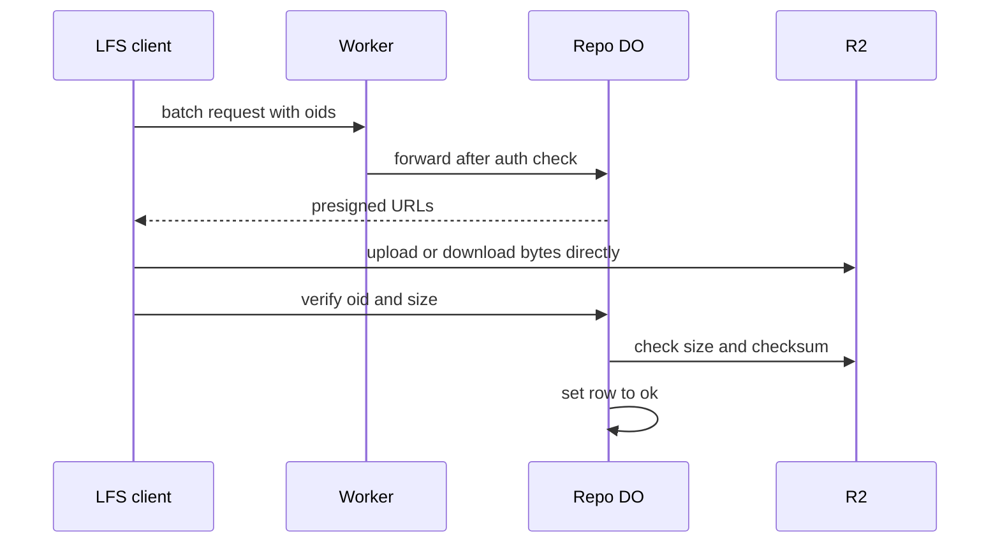

# Git LFS natively via presigned R2 URLs

> Verdict: **lands with caveats** · feasibility 4/5 · reliability 3/5 · correctness 4/5 · effort: days
> Read the words in [how-to-read.md](../findings/how-to-read.md). Engineers: [proof](../proofs/native-lfs.md) · [review](../reviews/native-lfs.md)

## What this idea is

git is a tool that keeps every version of a set of files, and lets many people share those versions. A repository, or repo, is one project's full set of files and their history. Git LFS, or Large File Storage, is a git add-on for big files such as images and videos. LFS keeps the big file outside the repo and stores a small pointer in the repo instead. This idea makes the server speak the LFS batch API and hand each client a signed web address for the big file store. The client moves the bytes itself, so the big bytes never pass through the server.

Think of it like this. A coat check desk hands you a numbered ticket. You carry your coat to the cloakroom shelf yourself, and later you collect it yourself with the ticket. The desk only writes tickets and keeps a list, so the desk never gets tired.

## How it works

Some words first. A commit is one saved version of the files, with a note about what changed. A push is sending your new commits to the server. An object is one stored item in git. An object is a file's content, a folder listing, or a commit.

R2 is Cloudflare's large file store. It holds the git objects. A presigned URL is a web address with a built-in signature that allows one action for a limited time. A SHA, or hash, is a fingerprint of an object's content. Two objects with the same content have the same fingerprint. LFS names each big file by its fingerprint, and calls that name the oid.

A Cloudflare Worker is one of the small programs that run on Cloudflare's network close to the user, with no server to manage. A Durable Object, or DO, is a single small program with its own storage that handles one thing at a time. There is one DO for each repo. Think of it like the one librarian who is allowed to update the catalog. DO SQLite is the small database inside each Durable Object.

An alarm is a timer inside a Durable Object. A DO has only one alarm at a time. The input gate is the rule that a Durable Object handles one request at a time while it waits on its own storage. The gate opens when the DO waits on the network instead. A janitor is a background task that deletes files nobody points to anymore.

1. The LFS client posts a batch request to the Worker. The batch lists the oids and says download or upload.
2. The Worker checks the user's identity and forwards the batch to the repo DO.
3. The DO keeps a table named lfs_objects in DO SQLite, with the oid, the size, and a state.
4. For a download, the DO answers with a presigned R2 read URL for each oid it knows.
5. For an upload, the DO inserts a pending row for each oid. The DO answers with a presigned R2 write URL and a verify address.
6. The signature on the write URL covers a checksum header equal to the oid. R2 rejects any upload whose bytes do not match that fingerprint.
7. The client writes the bytes straight to R2. Then the client posts the verify request to the DO.
8. The DO asks R2 for the file's size and checksum, checks them, and sets the row to ok.
9. An alarm removes pending rows that are older than the URL lifetime.
10. LFS files live under a separate lfs prefix in the same R2 bucket, because they are not git objects.

## What the reviewer decided

The verdict is "Lands with caveats".

| Score | Value |
|---|---|
| Feasibility | 4 out of 5 |
| Reliability | 3 out of 5 |
| Correctness | 4 out of 5 |

The idea is sound and can be built. The proof has one or more problems that must be fixed first, and the reviewer described each fix. Think of it like a flight with a runway that needs some repairs before you land. The runway is there. The repairs are known.

A caveat is a limit or a condition. The idea works, but only inside this limit. GA, or generally available, means a Cloudflare feature that is finished and supported, not a preview.

For this idea, the proof is a real LFS batch API, the same shape that large code hosts serve. Every R2 and DO feature used is GA, and the big bytes never touch the Worker. Three small defects and one alarm bug stand between the proof and a normal LFS client. The reviewer expects days of work.

## Problems that must be fixed first

A blocker is a problem that stops the idea from working until it is fixed.

### Problem 1: The verify step can succeed without recording the file

**What goes wrong.** The verify step updates the pending row, and does not insert a row when the row is missing. A slow upload can outlive the URL lifetime, and the alarm deletes the pending row in the meantime. The alarm can also run while verify waits on R2, because the input gate is open during a network wait. Verify then updates zero rows and still answers with success.

**Why it matters.** R2 holds the bytes, but DO SQLite says nothing. Every later download answers "404, object does not exist" until someone pushes the same file again. The client was told the push worked, so nobody knows.

**How to fix it.** Make verify insert or replace the row with state ok. One line changes.

### Problem 2: The oid is never checked

**What goes wrong.** An oid must be 64 hex characters. The proof never checks that. The URL builder collapses dot-dot path steps. A crafted oid can start with dot-dot path steps and end in the git object area. The DO then signs a write URL into that area of the same bucket. Only the checksum header stands in the way.

**Why it matters.** A user with upload rights could overwrite or plant git objects. That turns a feature into a security hole.

**How to fix it.** Check that the oid matches 64 hex characters before you build the R2 key or sign anything. Reject any other value.

### Problem 3: The web addresses do not match the DO routes

**What goes wrong.** The verify address the DO hands out ends in "/info/lfs/verify". The batch address ends in "/info/lfs/objects/batch". The DO only matches "/verify" and "/objects/batch". The proof assumes an edge Worker rewrites the path, but does not show that Worker.

**Why it matters.** Without the rewrite, every LFS push ends with "verify failed" after the bytes are already in R2. A normal git push with LFS files would fail at the last step.

**How to fix it.** Add the edge route that maps the two public paths onto the DO paths. Show that route in the proof.

## Things to know

- The R2 changelog says R2 checks a sha256 checksum on a put, but the R2 compatibility table still omits that header. Test on a real bucket that a mismatched body is rejected with a 400 error.
- Every batch call sets the alarm again and overwrites the pending alarm. A repo with a batch at least once an hour never cleans up its pending rows.
- Nothing deletes LFS payloads from R2. Files nobody points to collect until a global janitor learns the lfs prefix.
- Presigned URLs point at the raw R2 host, not a cached custom domain. Every hot download costs one R2 class B operation.
- The batch handler does not check whether the caller is allowed to read or write. That check is left to the auth idea and must not be forgotten.
- Only the basic transfer is supported, so files above the 5 GiB single upload limit fail. There is no lock API and no expiry timestamp in the answers.

## How this idea connects to the others

This idea needs [#1 One Durable Object per repo as the ref authority](./repo-do-ref-authority.md) because the LFS table lives in that DO.
This idea needs [#54 Auth and multi-tenancy: owner/repo routing to DO ids](./auth-and-multitenancy.md) to check who is allowed to read or write each repo.
This idea needs [#5 Content-addressed R2 keys](./content-addressed-r2-keys.md) for the fingerprint-based key layout in the bucket.
This idea needs [#2 Refs in DO SQLite, objects in R2](./refs-sqlite-objects-r2.md) as the base layout for the repo.
