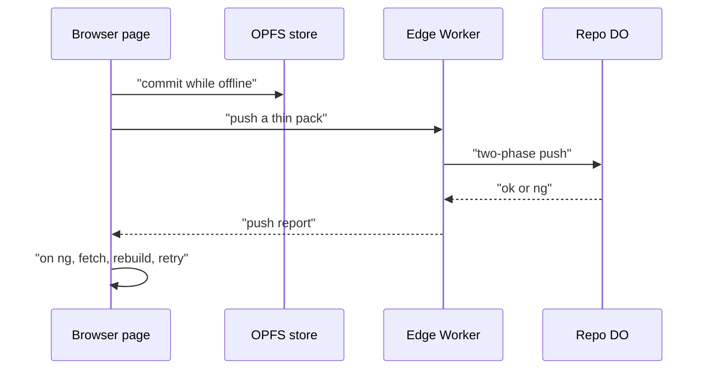

# Offline-first browser client with OPFS and the same Wasm core

> Verdict: **risky** · feasibility 3/5 · reliability 3/5 · correctness 2/5 · effort: months
> Read the words in [how-to-read.md](../findings/how-to-read.md). Engineers: [proof](../proofs/offline-browser-client.md) · [review](../reviews/offline-browser-client.md)

## What this idea is

git is a tool that keeps every version of a set of files, and lets many people share those versions. This idea turns a web page into a git client. The page runs the same git code as the server, and stores files in the browser's own private file store, called OPFS. You can save your work with no network. When the network returns, the page sends your new work to the server.

Think of it like this. You carry a field notebook on a long walk. You write notes in the notebook far from the office. When you return, you copy the notes into the shared office file. If a colleague changed the same page while you were away, you must first merge the two.

## How it works

1. Cloudflare Workers are small programs that run on Cloudflare's network close to the user, with no server to manage. Wasm, or WebAssembly, is a way to run code from other languages, such as Rust, inside a Worker. The git core is one Wasm module that reads and writes git's messages and bundles. The core talks to storage through one small interface with five calls: has, get, put, ref, and cas.
2. A repository is one project's full set of files and their history. R2 is Cloudflare's large file store. It holds the git objects. An object is one stored item in git. An object is a file's content, a folder listing, or a commit. A commit is one saved version of the files, with a note about what changed.
3. A Durable Object, or DO, is a single small program with its own storage that handles one thing at a time. There is one DO for each repo. Think of it like the one librarian who is allowed to update the catalog. DO SQLite is the small database inside each Durable Object. On the server, a Worker binds the core to R2 for objects and to DO SQLite for refs.
4. A ref is a name that points at one commit. A branch is a ref. A tag is a ref. A branch is a named line of commits, like a bookmark that moves forward as you save. In the browser, the same core binds to OPFS for objects and to IndexedDB, the browser's small database, for refs. The core runs in a Web Worker, which is a background thread inside the page.
5. Smart HTTP is the way git talks to a server over normal web requests. Protocol v2 is the newer, cleaner set of messages git uses to talk to a server. Fetch means getting commits from the server. A clone gets everything for the first time. Online, the page fetches from the server over smart HTTP with protocol v2, the same way the git command does.
6. Offline, a commit writes objects and refs into OPFS only.
7. Push means sending your new commits to the server. A packfile is one bundle that holds many objects, squeezed to save space. A delta is a stored object written as "the same as that other object, with these changes". A thin pack is a packfile that contains deltas against objects the server already has. When the network returns, the page builds a thin pack of the objects the server lacks, and pushes it.
8. Compare-and-swap, or CAS, means change a value only if it still has the value you expect. If someone changed it first, do nothing and report it. The server DO moves the ref with compare-and-swap, and answers ok or ng.
9. If the answer is ng, someone else moved the branch first. The page fetches, rebuilds its commits on top of the new tip, and pushes again.

## What the reviewer decided

The reviewer decided that this idea is risky.

| Score | Value |
|---|---|
| Feasibility | 3 of 5 |
| Reliability | 3 of 5 |
| Correctness | 2 of 5 |

Feasibility asks if Cloudflare can run the idea today. Reliability asks if the idea keeps data safe when things fail. Correctness asks if the idea does what its title says.

Risky. The idea can be built. But the proof shows one or more problems the reviewer could not fully solve, or it does a weaker version of the goal. Think of it like a runway you can see on the map, but nobody has checked it for holes.

A blocker is a problem that stops the idea from working until it is fixed. A caveat is a limit or a condition. The idea works, but only inside this limit. For this idea, the reviewer found four blockers and seven caveats.

GA means a Cloudflare feature that is finished and supported, not a preview. Every Cloudflare feature and every browser feature the proof uses is GA. The server side does not change, so the normal git command still works with the server. The problems are all in the browser code as written.

The page cannot see that a push worked, and cannot find out what to fetch. The page also breaks the request cap on large pushes, and can damage its own store. The reviewer expects months of work to reach the stated goal.

## Problems that must be fixed first

### Problem 1: The page never sees that a push worked

**What goes wrong.** Sideband is a way to send two kinds of data in one stream, like a main channel and a progress channel. The page asks the server to send the push report inside a sideband. In a sideband, every report line starts with a pkt-line length and a channel byte, not with a newline. Pkt-line is git's way of framing a message. Each line starts with four characters that give its length. The page reads the reply as plain text and looks for a line that begins with the word ok, and that check never matches.

**Why it matters.** Every push that worked looks like a failure. The page never moves its record of the server's branch tip, so the next push sends the wrong old value and fails too.

**How to fix it.** Do not ask for sideband on push. Or, split the sideband channels before reading the report.

### Problem 2: A fetch has no list of refs

**What goes wrong.** With protocol v2, the first request returns only a list of server features, not refs. A client must then send a command named ls-refs to get the refs. The page never sends ls-refs. So the page has nothing to put in its list of wanted commits.

**Why it matters.** The page cannot fetch anything from the server. A normal git fetch does send ls-refs, so the git command works and the page does not.

**How to fix it.** Send the ls-refs command before the fetch command.

### Problem 3: Large pushes exceed the request cap

**What goes wrong.** A subrequest is one call from a Worker to another service, such as one read from R2. Each request may make at most 1,000 subrequests. The server DO writes each pushed object to R2 with one call, and checks each object with one more call. A push of more than about 1,000 objects goes over the cap.

**Why it matters.** Any large push fails on the server side, with no way around it.

**How to fix it.** Use the packed and indexed object store from idea #5, instead of one call per object.

### Problem 4: A crash leaves half-written objects in the browser

**What goes wrong.** The page creates each object file at its final name, then writes the bytes, then flushes. If the tab dies in between, a cut-off file stays at the final name. The has call only checks that the file exists. So the next thin pack leaves that object out as already known, and the next delta step reads garbage.

**Why it matters.** The local store is damaged without any warning. Later pushes send packs the server cannot complete, and later fetches build wrong files.

**How to fix it.** Write each object to a temporary name and move it into place when complete. Safari cannot move files, so there the page must check the fingerprint on every read. A SHA, also called a hash, is a fingerprint of an object's content. Two objects with the same content have the same fingerprint.

## Things to know

- The title promises an offline-first client, but the proof is only a transport and an object store. Checkout, the index, merge, and rebase are left to the Wasm git core idea, and the recovery path after ng needs rebase.
- The browser's built-in unsqueeze tool cannot unsqueeze entries inside a packfile, because it does not report how many bytes it used. A Wasm unsqueeze tool is required, as the proof admits.
- The server code reads a ref row with a helper that throws when there is no row. So asking for a ref that does not exist crashes instead of returning nothing.
- The pkt-line writer measures the length in UTF-16 units instead of bytes. Any ref name with non-ASCII letters gets a wrong length and a broken pkt-line.
- Safari deletes OPFS data after 7 days without a visit, and gives it a small quota. Background sync while the tab is closed works only in Chromium browsers.
- The server has 128 MB of memory and 30 seconds of CPU, so delta resolution on the server must stream. The server get call loads whole objects into memory instead.
- Two tabs that write the same object at the same time get a NoModificationAllowedError. The page does not catch that error, though the two writes hold the same content.

## How this idea connects to the others

This idea needs [#25 Wasm git core](./wasm-git-core.md), which is the shared core, and which must be complete before merge and rebase work in the page.

This idea needs [#4 Packfile parsing in a Worker with a streaming inflater](./streaming-pack-parser.md), because the server must read pushed packs as a stream.

This idea needs [#3 Speak git protocol v2 only, translate v0 at the edge](./protocol-v2-only.md), because the page speaks protocol v2 only.

This idea needs [#53 The /info/refs?service= entrypoint and pkt-line codec](./info-refs-endpoint.md), which is the first request the page sends.

This idea needs [#1 One Durable Object per repo as the ref authority](./repo-do-ref-authority.md), which is the DO that does the compare-and-swap on refs.

This idea needs [#6 Two-phase push](./two-phase-push.md), which is the push path that accepts the thin pack.

This idea needs [#54 Auth and multi-tenancy](./auth-and-multitenancy.md), because the page must send a bearer token across origins.
