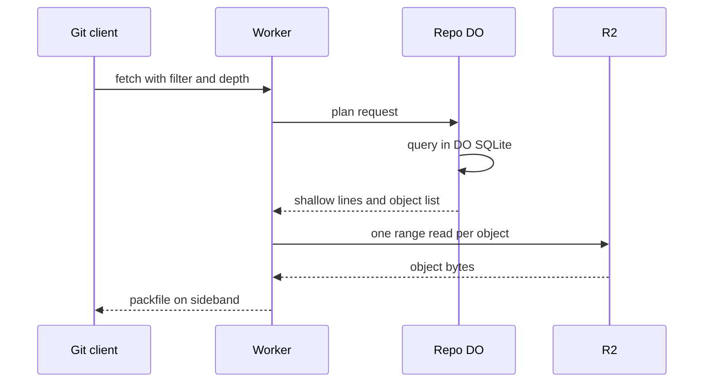

# Shallow and partial clone as first-class filters

> Verdict: **risky** · feasibility 3/5 · reliability 4/5 · correctness 3/5 · effort: weeks
> Read the words in [how-to-read.md](../findings/how-to-read.md). Engineers: [proof](../proofs/partial-clone-filters.md) · [review](../reviews/partial-clone-filters.md)

## What this idea is

git is a tool that keeps every version of a set of files, and lets many people share those versions. A repository, or repo, is one project's full set of files and their history. A partial clone downloads the history but leaves the file contents on the server. A shallow clone downloads only the newest few saved versions. This idea makes both kinds of download a normal part of the server. The server plans the answer in a small database, and then reads each needed file from the big file store exactly once.

Think of it like this. You ask a library for the table of contents of a long book series. The library sends you the contents pages only. Later you ask for one chapter at a time, and each request fetches exactly that chapter from the shelf.

## How it works

Some words first. A commit is one saved version of the files, with a note about what changed. A push is sending your new commits to the server. A fetch is getting commits from the server. A clone gets everything for the first time.

An object is one stored item in git. An object is a file's content, a folder listing, or a commit. A SHA, or hash, is a fingerprint of an object's content. Two objects with the same content have the same fingerprint. A packfile, or pack, is one bundle that holds many objects, squeezed to save space. A delta is a stored object written as "the same as that other object, with these changes".

Protocol v2 is the newer, cleaner set of messages git uses to talk to a server. A Cloudflare Worker is one of the small programs that run on Cloudflare's network close to the user, with no server to manage. A Durable Object, or DO, is a single small program with its own storage that handles one thing at a time. There is one DO for each repo. Think of it like the one librarian who is allowed to update the catalog. DO SQLite is the small database inside each Durable Object.

R2 is Cloudflare's large file store. It holds the git objects. Sideband is a way to send two kinds of data in one stream, like a main channel and a progress channel.

1. The Worker reads a protocol v2 fetch command. The Worker sends the wanted objects, the filter, the depth limit, and the client's shallow list to the repo DO in one call.
2. The DO plans the whole answer in DO SQLite. Three tables filled at push time list every object, every commit, and every folder entry.
3. A depth limit caps the walk over commits. A filter such as "no file contents" becomes a condition in the query.
4. The DO returns the shallow lines and an exact list of objects, each with its type and size.
5. The Worker streams the shallow section, then the packfile section, on sideband.
6. For each object, the Worker reads exactly one range from R2. The range skips the loose header, because the size is already known.
7. The Worker squeezes each object with a deflate stream and writes it into a packfile with no deltas.
8. Later, when the client needs one file content, it sends one want for that file. The same path answers with one DO SQLite lookup and one R2 read.

## What the reviewer decided

The verdict is "Risky".

| Score | Value |
|---|---|
| Feasibility | 3 out of 5 |
| Reliability | 4 out of 5 |
| Correctness | 3 out of 5 |

The idea can be built. But the proof shows one or more problems the reviewer could not fully solve, or it does a weaker version of the goal. Think of it like a runway you can see on the map, but nobody has checked it for holes. For this idea, the split between a planner in DO SQLite and a streamer from R2 is the right design. The message layout, the sideband framing, the packfile headers, and the filter rules are mostly correct.

This path only reads, so nothing can be lost. But the proof cannot survive a normal git checkout after a partial clone, and cannot clone a repo that has a tag. The missing fan-out is the real engineering work, and the proof does not show it.

## Problems that must be fixed first

A blocker is a problem that stops the idea from working until it is fixed.

### Problem 1: One request can need more than 1,000 reads from R2

**What goes wrong.** A subrequest is one call from a Worker to another service, such as one read from R2. Each request may make at most 50 subrequests on the free plan and 10,000 on the paid plan. Since git 2.24, a checkout does not ask for missing files one by one. It collects every missing file and issues one fetch for all of them. A partial clone of a tree with 5,000 files makes one fetch with 5,000 wants, so the Worker issues 5,000 R2 reads. The runtime stops the Worker at read 1,001.

**Why it matters.** The fetch command that git checkout runs after a partial clone would fail every time for any tree over 1,000 files. This is the main use of the idea, not a rare case.

**How to fix it.** Split the wants into chunks of about 500. Send each chunk to a copy of the same Worker through a service binding. Each nested call counts as one subrequest and can make 1,000 reads inside. Or serve objects from a packfile through an index table with grouped range reads.

### Problem 2: Tag objects are never sent

**What goes wrong.** An annotated tag is an object of its own. A clone asks for every advertised tag. The planner accepts the tag want but never adds the tag object to the query. The packfile arrives without the tag. git then asks again, gets an empty packfile, and reports "remote did not send all necessary objects".

**Why it matters.** A normal git clone command would fail on any repo that has one annotated tag. Most real repos have tags.

**How to fix it.** Add tag objects to the plan. Follow each tag to the commit it points at. Also handle the include-tag argument.

### Problem 3: The ideas disagree about how objects are stored in R2

**What goes wrong.** This proof reads objects at the key objects, owner, repo, and fingerprint, stored unsqueezed with a loose header. Other ideas write objects at the key objects and fingerprint, and one of them stores them squeezed. The range read that skips the header only works on unsqueezed bytes. On squeezed bytes the range read returns garbage.

**Why it matters.** The whole streaming trick depends on the exact bytes in R2. If the ideas ship with different layouts, the packfile is wrong on every fetch.

**How to fix it.** Fix one key layout and one byte format for R2 across all ideas. Store objects unsqueezed with a loose header, so the range offset trick stays valid.

## Things to know

- The planning query runs for seconds on a large repo and blocks the DO for that time. Page the object list, because one call to the DO can return at most 32 MiB.
- The client's shallow lines never stop the walk. The deepen-relative, deepen-since, and deepen-not arguments are dropped, so a deepen or unshallow fetch gets a wrong shallow list.
- There is no prefetch window. Reading and squeezing 1,000 objects one after another takes 10 to 30 seconds.
- The objects the client already has are ignored until the negotiation idea is joined in. The include-tag, combine, and sparse filters, and the k and m suffixes on blob:limit, are absent.
- A force-push followed by a cleanup can delete an object while a packfile is streaming. The packfile is cut short and the client retries, and no data is lost.

## How this idea connects to the others

This idea needs [#5 Content-addressed R2 keys](./content-addressed-r2-keys.md) to read each object from R2 by its fingerprint.
This idea needs [#2 Refs in DO SQLite, objects in R2](./refs-sqlite-objects-r2.md) for the tables the planner queries.
This idea needs [#3 Speak git protocol v2 only, translate v0 at the edge](./protocol-v2-only.md) to parse the fetch command and its filter.
This idea needs [#4 Packfile parsing in a Worker with a streaming inflater](./streaming-pack-parser.md) to fill the object and folder tables at push time.
This idea needs [#56 Want/have negotiation with a commit-graph in SQLite](./want-have-negotiation.md) to remove the objects the client already has.
This idea needs [#7 Precomputed pack slices for clone](./precomputed-clone-pack.md) for first clones that exceed the subrequest budget.
