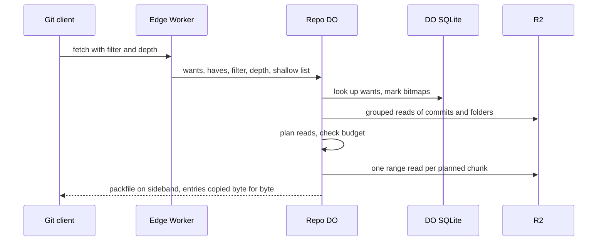

# Shallow and partial clone as first-class filters

> Verdict: **risky** · feasibility 3/5 · reliability 4/5 · correctness 3/5 · effort: weeks
> Read the words in [how-to-read.md](../findings/how-to-read.md). Engineers: [proof](../proofs/partial-clone-filters.md) · [review](../reviews/partial-clone-filters.md)

## What this idea is

git is a tool that keeps every version of a set of files, and lets many people share those versions. A repository, or repo, is one project's full set of files and their history. A partial clone downloads the history but leaves the file contents on the server. A shallow clone downloads only the newest few saved versions. This idea makes both kinds of download a normal part of the server. The server marks the needed items in a small database, then copies them out of big bundles in the file store with a few large reads.

Think of it like this. You ask a library for the table of contents of a long book series. The library sends you the contents pages only. Later you ask for a stack of chapters at once. The librarian pulls each shelf once and copies every chapter you named from that shelf.

## How it works

Some words first. A commit is one saved version of the files, with a note about what changed. A push is sending your new commits to the server. A fetch is getting commits from the server. A clone gets everything for the first time.

An object is one stored item in git. An object is a file's content, a folder listing, or a commit. A SHA, or hash, is a fingerprint of an object's content. Two objects with the same content have the same fingerprint. A packfile, or pack, is one bundle that holds many objects, squeezed to save space. A ref is a name that points at one commit. A branch is a ref. A tag is a ref.

Protocol v2 is the newer, cleaner set of messages git uses to talk to a server. A Cloudflare Worker is one of the small programs that run on Cloudflare's network close to the user, with no server to manage. A Durable Object, or DO, is a single small program with its own storage that handles one thing at a time. There is one DO for each repo. Think of it like the one librarian who is allowed to update the catalog. DO SQLite is the small database inside each Durable Object.

R2 is Cloudflare's large file store. It holds the git objects. Wasm, or WebAssembly, is a way to run code from other languages, such as Rust, inside a Worker. A subrequest is one call from a Worker to another service, such as one read from R2. Each request may make at most 50 subrequests on the free plan and 10,000 on the paid plan. Sideband is a way to send two kinds of data in one stream, like a main channel and a progress channel.

All foundation ideas now share one written contract. The contract fixes the module names, the storage layout, and the limits. In the contract, every push becomes one pack in R2. DO SQLite keeps one row per object with the pack, the offset, the length, the type, and the size. The proof is one Rust module inside the repo DO, and the module is called by the fetch handler.

1. The edge Worker parses a protocol v2 fetch command. The Worker passes the wants, the haves, the filter, the depth limit, and the client's shallow list to the repo DO.
2. The DO looks up every want in DO SQLite. Each want is marked in a bitmap, one bit per object row of its pack. A wanted object is always sent, whatever the filter says.
3. Any wanted tag is read from R2 and peeled. The target of the tag joins the commit, folder, or file list. A tag that points at a tag loops again.
4. The DO walks commits level by level. Each level does one lookup in DO SQLite, one grouped read from R2, and parsing in memory. A depth limit stops the walk and writes the shallow and unshallow lines. The client's haves and shallow lines also stop the walk.
5. The DO walks folder listings the same way. It skips a subtree when the client already holds that subtree. A "no file contents" filter marks no files. A size filter decides from the size column, so no file content is ever read during the walk.
6. The DO plans the reads. It sorts the marked entries of each pack by offset and merges neighbours closer than 256 KiB. When that gives too many reads, it groups by 8 MiB windows instead. If the read count exceeds the request budget, the DO refuses with HTTP 413 before the first byte.
7. The DO streams the answer on sideband. It writes the pack header with the exact count, then one planned read at a time. Each marked entry is copied byte for byte out of the read buffer, with no unpacking and no squeezing.
8. Later, git checkout asks for every missing file in one fetch with many wants and no walk. Step 2 marks all of them from rows alone, and step 6 turns thousands of wants into a handful of reads.

## What the reviewer decided

The verdict is "Risky".

| Score | Value |
|---|---|
| Feasibility | 4 out of 5 |
| Reliability | 4 out of 5 |
| Correctness | 3 out of 5 |

The idea can be built. But the proof shows one or more problems the reviewer could not fully solve, or it does a weaker version of the goal. Think of it like a runway you can see on the map, but nobody has checked it for holes. For this idea, the second pass is much better than the first. All three first-pass blockers are closed by code. The shallow, unshallow, and filter rules match the real git server code.

Two problems keep the verdict at "Risky". The commit walk reads R2 once per level, so a normal clone of a repo with a long history runs out of subrequest budget. And the proof declares several changes to the shared contract but does not adopt them, so the code does not compile against the contract as written. Both fixes have a written design and take days. The "tree:0" filter in the title is out of scope by contract.

| Score | First pass | Second pass |
|---|---|---|
| Feasibility | 3 out of 5 | 4 out of 5 |
| Reliability | 4 out of 5 | 4 out of 5 |
| Correctness | 3 out of 5 | 3 out of 5 |

## What changed in the second pass

- Fixed: one request needed more than 1,000 reads from R2. Objects are now entries inside packs, not separate R2 keys. The read planner merges neighbouring entries and falls back to 8 MiB windows, so the read count depends on pack size, not on the number of wants. The planner checks the budget before the first byte and refuses with 413 instead of stopping mid-stream. The proof adds a test scenario that asserts the read count after a checkout of 2,500 files.
- Fixed: tag objects were never sent. Every wanted tag is now marked at step 2. A peel loop reads the tag, finds the type of its target, and adds the target to the right list. A tag that points at another tag loops again.
- Fixed: the ideas disagreed about how objects are stored in R2. The shared contract now pins the layout for every idea. Each push becomes one pack in R2, and DO SQLite records the offset and length of every entry. The streamer copies each entry byte for byte, with no header arithmetic and no squeezing.

## Problems that must be fixed first

A blocker is a problem that stops the idea from working until it is fixed.

### Problem 1: The commit walk reads R2 once per level

**What goes wrong.** The contract says to read the whole commit region of each pack once per request and keep it in memory. The proof leaves that read out and defers it to the negotiation idea. Instead, each level of the commit walk does one grouped read from R2. A repo whose longest chain of commits exceeds about 9,000 needs more than 9,000 reads. The planner refuses the request with 413. A chain of about 5,000 commits spends most of the 240 second wall clock on reads done one after another.

**Why it matters.** A "no file contents" clone and a plain clone both walk the whole history. Many ordinary repos have more than 9,000 commits in a row. The main path of the idea fails on them. A shallow clone with a depth limit is not affected.

**How to fix it.** Implement the contract's own rule inside this module. Read the commit region of each pack once per request and cache it. Fall back to single entry reads only for the few commits outside that region. This is days of work with the design already written.

### Problem 2: Contract changes are declared but not adopted

**What goes wrong.** The proof calls the pack reader with a list of pairs and a budget, but the contract's reader takes a list of locations only. The proof uses two index helpers and a default constructor that the contract does not define. The proof adds a new entry point that accepts the client's shallow list, but the contract's entry point has no such input. The proof reads private fields of two other modules and imports the repo DO type against the dependency rule of the contract.

**Why it matters.** The code does not compile against the shared contract as written. Every sibling idea builds against the same contract. Until the changes land in the contract or the proof adopts the contract, nothing links.

**How to fix it.** Write each declared change into the contract and update the siblings that assume the old shapes. Pass the index and the bucket into the module instead of the whole repo DO, so no private fields and no forbidden import are needed. Give the contract's entry point a shallow input.

## Things to know

- The "tree:0" filter is not delivered. The contract puts it out of scope, and the parser answers it with a 400 error. The title of the idea promises more than the proof delivers.
- The contract caps the command section of a fetch at 1 MiB. A checkout that asks for more than about 20,900 files is refused with 400 every time. The proposed rise to 16 MiB is needed for large repos with one folder tree.
- The signed pack writer keeps the whole pack in memory before sending. The stream driver that sends one chunk at a time is described in words but not shown in code.
- The index helper that lists the marked entries of a pack loads every row of that pack at once, 56 bytes each. A pack with one million entries costs seconds of DO time and about 56 MB of memory.
- The memory caps are per request, not per DO. Two large fetches at the same time in one DO can exceed the 128 MB limit.
- The walk reads the edge commits even when the edge list is empty. The claim of zero waits for a checkout fetch holds only if an empty read makes no subrequest.
- Several library names are not yet verified against the pinned versions, such as the streaming hasher and the tag target reader. Real R2 range reads over multi-gigabyte packs and the subrequest limit on a deployed Worker are not tested.
- A wire problem lives in the sibling module that writes the fetch preamble. The contract rule would emit an empty separator before the packfile section when there is no shallow section. git then dies with "expected packfile". The response must start with the packfile line directly.
- A want for an unknown ref returns HTTP 400 instead of git's normal 200 with an error line. The client prints "RPC failed" instead of the ref name. This only affects the error path.
- A deepen on a clone that is already shallow resends the commits the client already has inside the new depth. The result is correct but larger, bounded by the depth. The size filter sends one size class more than git does, which is harmless.

## How this idea connects to the others

This idea needs [#3 Speak git protocol v2 only, translate v0 at the edge](./protocol-v2-only.md) to parse the fetch command, the filter, and the depth arguments.
This idea needs [#56 Want/have negotiation with a commit-graph in SQLite](./want-have-negotiation.md) for the haves that stop the commit walk.
This idea needs [#2 Refs in DO SQLite, objects in R2](./refs-sqlite-objects-r2.md) for the object rows the planner marks.
This idea needs [#5 Content-addressed R2 keys](./content-addressed-r2-keys.md) for the pack keys the streamer reads.
This idea needs [#4 Packfile parsing in a Worker with a streaming inflater](./streaming-pack-parser.md) to write the object rows at push time.
This idea needs [#6 Two-phase push](./two-phase-push.md) so that every pack a lookup returns is already durable in R2.
This idea needs [#55 GC and repack as a DO alarm](./gc-and-repack-alarm.md) to keep the bytes of a dead pack for one hour while a fetch streams.
This idea needs [#7 Precomputed pack slices for clone](./precomputed-clone-pack.md) for first clones above the walk limits.
This idea needs [#9 Tiny in-DO object cache with alarm-driven eviction](./in-do-object-cache.md) to serve small fetches with no R2 read at all.
