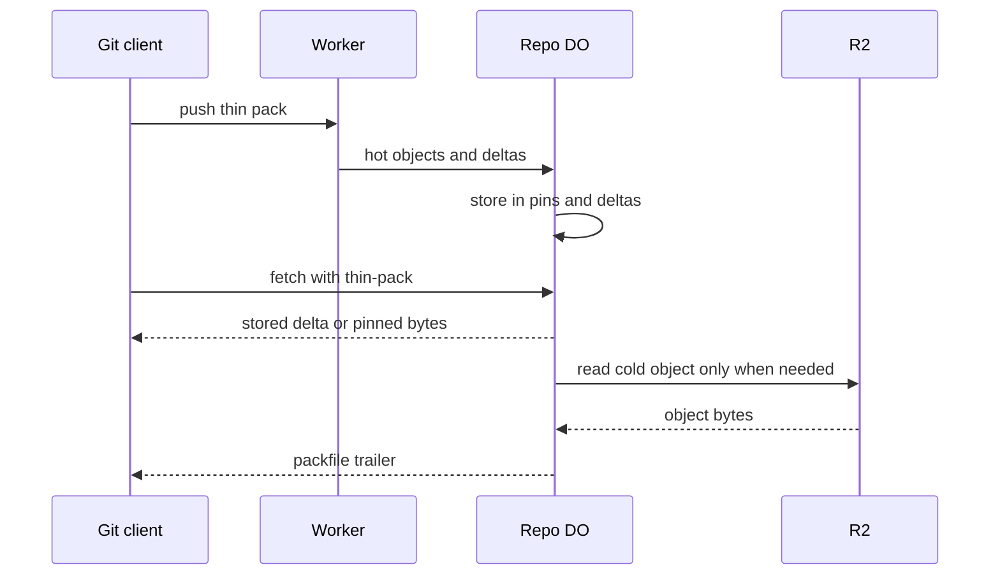

# Delta bases pinned per repo

> Verdict: **lands with caveats** · feasibility 4/5 · reliability 4/5 · correctness 3/5 · effort: weeks
> Read the words in [how-to-read.md](../findings/how-to-read.md). Engineers: [proof](../proofs/pinned-delta-bases.md) · [review](../reviews/pinned-delta-bases.md)

## What this idea is

git is a tool that keeps every version of a set of files, and lets many people share those versions. A repository, or repo, is one project's full set of files and their history. When one person uploads new work, other people usually download that work soon after. This idea keeps the newest items from each upload close at hand on the server. A download soon after an upload then needs no read from the big file store.

Think of it like this. A cook keeps yesterday's recipe card on the counter. When today's recipe changes one line, the cook writes only that line on a sticky note. The cook does not walk to the archive room to copy the whole recipe again.

## How it works

Some words first. A commit is one saved version of the files, with a note about what changed. A push is sending your new commits to the server. A fetch is getting commits from the server. A clone gets everything for the first time.

An object is one stored item in git. An object is a file's content, a folder listing, or a commit. A SHA, or hash, is a fingerprint of an object's content. Two objects with the same content have the same fingerprint. A delta is a stored object written as "the same as that other object, with these changes". A packfile, or pack, is one bundle that holds many objects, squeezed to save space.

A thin pack is a packfile that contains deltas against objects the server already has. Protocol v2 is the newer, cleaner set of messages git uses to talk to a server. Sideband is a way to send two kinds of data in one stream, like a main channel and a progress channel. A Cloudflare Worker is one of the small programs that run on Cloudflare's network close to the user, with no server to manage.

A Durable Object, or DO, is a single small program with its own storage that handles one thing at a time. There is one DO for each repo. Think of it like the one librarian who is allowed to update the catalog. DO SQLite is the small database inside each Durable Object. R2 is Cloudflare's large file store. It holds the git objects.

An alarm is a timer inside a Durable Object. A DO has only one alarm at a time. Wasm, or WebAssembly, is a way to run code from other languages, such as Rust, inside a Worker.

1. A user pushes new commits. The Worker reads the thin pack and indexes the objects.
2. The Worker picks the hot objects of the new tip. The hot objects are the tip commit, the root folder listing, and a few named files such as package.json.
3. The Worker sends the squeezed bytes of the hot objects to the repo DO. The Worker also sends each delta from the push whose base object is already pinned.
4. The DO writes the hot objects into a table named pins. The DO writes the deltas into a table named deltas. Both tables live in DO SQLite.
5. An alarm removes the pins that were used least, until the pins fit a byte budget.
6. A user fetches. The DO builds the packfile itself, one wanted object at a time.
7. If a stored delta exists and the user already has its base, the DO sends the delta as it is.
8. If the object is pinned, the DO copies the pinned bytes into the packfile.
9. In all other cases, the DO reads the object from R2 once and squeezes it.
10. The DO computes a running fingerprint while it writes. The fingerprint becomes the packfile's trailer, so the response streams.

## What the reviewer decided

The verdict is "Lands with caveats".

| Score | Value |
|---|---|
| Feasibility | 4 out of 5 |
| Reliability | 4 out of 5 |
| Correctness | 3 out of 5 |

The idea is sound and can be built. The proof has one or more problems that must be fixed first, and the reviewer described each fix. Think of it like a flight with a runway that needs some repairs before you land. The runway is there. The repairs are known.

A caveat is a limit or a condition. The idea works, but only inside this limit. GA, or generally available, means a Cloudflare feature that is finished and supported, not a preview.

For this idea, the packfile format reasoning is correct and every Cloudflare feature is GA. The pins and deltas are only a copy of what R2 holds. A crash or two users at once can slow a fetch, but can never lose data. Two defects in the code must be fixed before a normal git client works.

## Problems that must be fixed first

A blocker is a problem that stops the idea from working until it is fixed.

### Problem 1: The DO does not know its own repo name

**What goes wrong.** The DO builds the R2 key for a cold object from its own name field. Inside a DO that was created from a name, that field is empty. The key becomes "objects/undefined/" plus the fingerprint. R2 never has such a key, so the DO reports every cold object as missing.

**Why it matters.** Every object that is not pinned takes the cold path. So almost every fetch fails as written. A normal git fetch command would fail.

**How to fix it.** Send the owner and repo name from the Worker to the DO on the first request. Write both into DO SQLite. Read the repo name from DO SQLite every time the DO builds an R2 key.

### Problem 2: The DO sends deltas that some clients cannot use

**What goes wrong.** Before the DO sends a delta, it asks "does the client have the base object?". The check only asks "can the client reach the base from a commit it has?". A client that cloned with a depth limit, or a client that cloned without file contents, has the commit but not the base. The check says yes, and the DO sends the delta anyway. git reports "pack has 1 unresolved delta" and stops.

**Why it matters.** A normal git fetch command would fail for every client that used a depth limit or a filter. Nothing on the server tells the user why.

**How to fix it.** Look at the fetch arguments. If the arguments contain shallow, deepen, or filter, do not send any thin deltas. Send full objects to that client instead.

## Things to know

- The pack reader must know where each delta's squeezed stream ends, and the standard browser inflater does not report that. The reader needs the Node zlib inflater with the info option, a Wasm inflater, or must squeeze the delta again.
- The proof returns a raw packfile. The protocol v2 packfile section and the sideband framing of at most 65,520 bytes per line are assumed, not shown.
- A cold object is loaded whole into memory and squeezed with a blocking call. A large file stalls all pushes to that repo and can hit the 128 MB memory limit or the CPU limit.
- The alarm deletes rows from the pins table while it still reads that table, so copy the rows into a list first. The deltas table only shrinks when pins are removed.
- The server never computes deltas itself, and only the deltas the client sent on push are reused. A fetch that is several pushes behind gets full objects, so the gain is limited to a fetch soon after a push.

## How this idea connects to the others

This idea needs [#4 Packfile parsing in a Worker with a streaming inflater](./streaming-pack-parser.md) to read the push and cut out each delta.
This idea needs [#5 Content-addressed R2 keys](./content-addressed-r2-keys.md) to find a cold object in R2 by its fingerprint.
This idea needs [#2 Refs in DO SQLite, objects in R2](./refs-sqlite-objects-r2.md) as the base layout for refs and objects.
This idea needs [#56 Want/have negotiation with a commit-graph in SQLite](./want-have-negotiation.md) to decide which objects the client already has.
This idea needs [#3 Speak git protocol v2 only, translate v0 at the edge](./protocol-v2-only.md) for the fetch command and its arguments.
