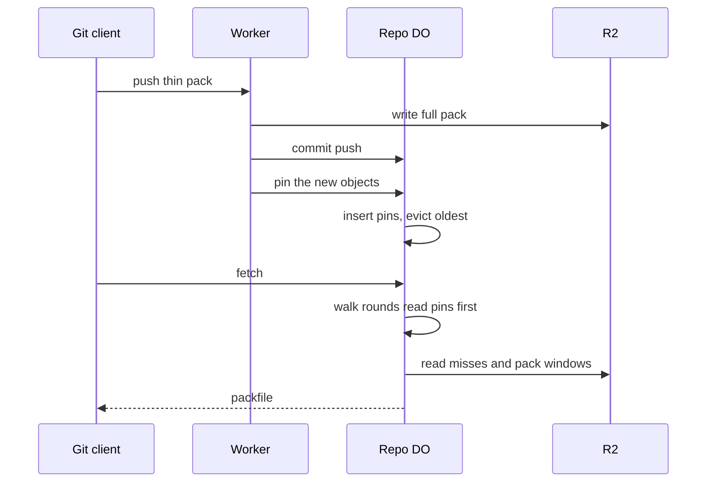

# Delta bases pinned per repo

> Verdict: **lands with caveats** · feasibility 4/5 · reliability 4/5 · correctness 3/5 · effort: weeks
> Read the words in [how-to-read.md](../findings/how-to-read.md). Engineers: [proof](../proofs/pinned-delta-bases.md) · [review](../reviews/pinned-delta-bases.md)

## What this idea is

git is a tool that keeps every version of a set of files, and lets many people share those versions. A repository, or repo, is one project's full set of files and their history. When one person uploads new work, other people usually download that work soon after. This idea keeps the newest items from each upload close at hand on the server. A download soon after an upload then waits less on the big file store.

Think of it like this. A cook keeps yesterday's recipe card on the counter. When today's recipe changes one line, the cook reads the card on the counter. The cook does not walk to the archive room to look up the old recipe first.

## How it works

Some words first. A commit is one saved version of the files, with a note about what changed. A push is sending your new commits to the server. A fetch is getting commits from the server. A clone gets everything for the first time.

An object is one stored item in git. An object is a file's content, a folder listing, or a commit. A SHA, or hash, is a fingerprint of an object's content. Two objects with the same content have the same fingerprint. A delta is a stored object written as "the same as that other object, with these changes". A packfile, or pack, is one bundle that holds many objects, squeezed to save space.

A thin pack is a packfile that contains deltas against objects the server already has. A Cloudflare Worker is one of the small programs that run on Cloudflare's network close to the user, with no server to manage. A Durable Object, or DO, is a single small program with its own storage that handles one thing at a time. There is one DO for each repo. Think of it like the one librarian who is allowed to update the catalog.

DO SQLite is the small database inside each Durable Object. R2 is Cloudflare's large file store. It holds the git objects. A subrequest is one call from a Worker to another service, such as one read from R2. Wasm, or WebAssembly, is a way to run code from other languages, such as Rust, inside a Worker. The proof is written in Rust and follows a shared contract that every idea in this set obeys.

The shared contract changes the shape of this idea. The server turns every delta from a push into a full object before it stores the object. The server never sends a delta to a client. So the server stores no deltas and replays no deltas. What remains is a small byte cache inside the DO, filled by each push.

1. A user pushes a thin pack. The Worker turns each delta into a full object and writes the pack to R2.
2. While the Worker does that, a collector copies each full object into a small buffer. Commits and folder listings go first. File contents fill the rest.
3. The buffer holds at most 2 MiB per push. One object may be at most 256 KiB.
4. The DO confirms that the push is committed. Only then does the Worker post the buffer to the DO.
5. The DO writes each object into a table named pins in DO SQLite. Each row carries a generation number taken from the repo's refs version.
6. In the same step, the DO deletes the oldest generations until the table fits an 8 MiB budget. No alarm is used.
7. A user fetches soon after. The DO must walk the new commits and folder listings to find the objects the user lacks.
8. For each walk round, the DO reads pinned bytes from the table first. Only misses go to R2, and misses are read together in one call.
9. The DO then writes the packfile from R2 as before. The response bytes are the same with or without pins.
10. A later thin push needs the base objects of its deltas. The Worker asks the DO for pinned bases with one call. Only misses go to R2.

## What the reviewer decided

The verdict is "Lands with caveats".

| Score | Value |
|---|---|
| Feasibility | 4 out of 5 |
| Reliability | 3 out of 5 |
| Correctness | 4 out of 5 |

| Score | First pass | Second pass |
|---|---|---|
| Feasibility | 4 | 4 |
| Reliability | 4 | 3 |
| Correctness | 3 | 4 |

The idea is sound and can be built. The proof has one or more problems that must be fixed first, and the reviewer described each fix. Think of it like a flight with a runway that needs some repairs before you land. The runway is there. The repairs are known.

A caveat is a limit or a condition. The idea works, but only inside this limit. A blocker is a problem that stops the idea from working until it is fixed.

For this idea, both first-pass blockers are gone by design. No wire delta exists, so the old client failure cannot happen. Every library call is traced to a source line. Pins are only a copy of bytes that live in a pack, so a crash or two users at once can never lose data. But the idea shrank. The server no longer sends deltas, and the packfile still comes from R2. The pins only remove the serial waits before the packfile is written. Reliability fell because the one rule the module owns, the 8 MiB budget, is broken by a loop with a fixed bound. Two one-line fixes remain.

## What changed in the second pass

- First-pass blocker "the DO does not know its own repo name": fixed. The module builds no R2 key at all. Cold reads go through the shared store, which builds the key from the repo id stored in DO SQLite.
- First-pass blocker "the DO sends deltas that some clients cannot use": fixed by removing the feature. The server never sends a delta, so a client with a depth limit or a filter always gets full objects. The check that went wrong no longer exists.
- First-pass caveat about the squeezed stream boundary: fixed. The collector squeezes each full object again with the shared codec, so no raw delta bytes are stored.
- First-pass caveat about protocol v2 framing and sideband: fixed. This module writes no wire bytes. The wire module owns the framing.
- First-pass caveat about squeezing a whole cold object inside the DO: fixed. The DO never squeezes. The Worker squeezes at most 2 MiB per push, with a 256 KiB cap per object.
- First-pass caveat about deleting rows while reading the same table: fixed. There is no alarm and no cursor. The DO re-reads the table size each round and deletes by generation.
- First-pass caveat about the deltas table growing: fixed. The deltas table is gone.

## Problems that must be fixed first

### Problem 1: The eviction loop stops too early

**What goes wrong.** After each push, the DO deletes the oldest generation, up to eight times, until the table fits 8 MiB. The comment says four rounds always suffice. That is false. One small commit can pin about 1 KiB, and several pushes can share one generation. After 8,000 small commits, each 2 MiB push removes about 8 KiB and adds 2 MiB. After 1,000 such pushes the table holds about 2 GB.

**Why it matters.** The budget is the one rule this module owns. The proof claims the table is bounded by the budget, and the claim does not hold. DO storage grows without limit under a common pattern. The bytes stay correct, but the cost does not.

**How to fix it.** Loop until the table size is at or under the budget. Each round deletes at least one row, so the loop ends. Or run one delete for every generation below a cut point found by a running total.

### Problem 2: The wrong error class for an internal body

**What goes wrong.** The frame decoder returns a "Protocol" error when the pin body is malformed. The contract defines "Protocol" as bad bytes from a client, answered with status 400. The pin body comes from our own Worker, so a bad body is an internal fault.

**Why it matters.** The contract maps each error class to one status code. An internal fault reported as a client fault hides a server bug and returns the wrong status.

**How to fix it.** Return the "Internal" error class from the frame decoder. This is a one-word change.

## Things to know

- The generation number is the refs version at pin time, not a push count. Pushes that commit close together share one generation and are deleted together. This is fine for a cache, but it is not push order.
- The size check counts object bytes only. The fingerprint text, the index, and the row overhead add about 100 bytes per row. An 8 MiB budget of small objects takes about 12 MiB of DO storage.
- The collector needs a hook inside the shared ingest function, and that function's contract signature has no such hook. The fetch rounds and the between-passes step must also change in two other ideas' modules.
- The gain is unmeasured and smaller than the title says. The contract already reads commits together per pack. The real saving is the serial rounds over folder depth and one call for thin-push bases. The packfile still comes from R2. This overlaps heavily with idea #9, so one of the two must absorb the other.
- Several calls are unverified at runtime. These are the blob round trip through DO SQLite, the request body on the DO call, and level-0 deflate in Wasm. The 2 MB value cap and 100 bindings in one query are also unverified.
- The pin call and its burst of inserts sit in the push's response path and block the DO. The proof flags a timing test but does not move the call after the client's status report.
- If the DO route turns a mid-step error into a 500 response without throwing, partial inserts stay and no eviction runs. The bytes stay correct, but the budget rule is soft in a second way.

## How this idea connects to the others

This idea needs [#2 Refs in DO SQLite, objects in R2](./refs-sqlite-objects-r2.md) for the object index, the pack store, and the coalesced cold reads.
This idea needs [#4 Packfile parsing in a Worker with a streaming inflater](./streaming-pack-parser.md) to turn each pushed delta into a full object for the collector.
This idea needs [#6 Two-phase push](./two-phase-push.md) for the commit step that must succeed before any pin is sent.
This idea needs [#3 Speak git protocol v2 only, translate v0 at the edge](./protocol-v2-only.md) for the fetch rounds where pinned bytes are read first.
This idea needs [#1 One Durable Object per repo as the ref authority](./repo-do-ref-authority.md) for the refs version used as the generation number.
This idea needs [#55 GC and repack as a DO alarm](./gc-and-repack-alarm.md) so that a swept object is never served from a stale pin.
This idea overlaps with [#9 Tiny in-DO object cache with alarm-driven eviction](./in-do-object-cache.md), and one of the two must absorb the other.
