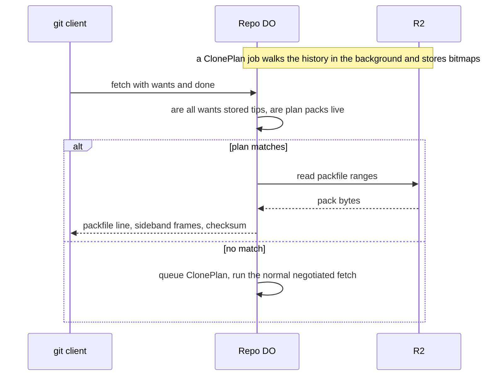

# Precomputed pack slices for clone

> Verdict: **lands with caveats** · feasibility 4/5 · reliability 3/5 · correctness 3/5 · effort: weeks
> Read the words in [how-to-read.md](../findings/how-to-read.md). Engineers: [proof](../proofs/precomputed-clone-pack.md) · [review](../reviews/precomputed-clone-pack.md)

## What this idea is

git is a tool that keeps every version of a set of files, and lets many people share those versions. A repository, or repo, is one project's full set of files and their history. A commit is one saved version of the files, with a note about what changed. A branch is a named line of commits, like a bookmark that moves forward as you save.

A ref is a name that points at one commit. A branch is a ref. A tag is a ref.

A push is sending your new commits to the server. A fetch is getting commits from the server. A clone gets everything for the first time. An object is one stored item in git. An object is a file's content, a folder listing, or a commit.

A clone normally makes the server search the whole history on the spot and build one packfile. A packfile is one bundle that holds many objects, squeezed to save space.

In the second pass, this idea no longer builds a second packfile. The repo already keeps its objects in one big packfile in R2. R2 is Cloudflare's large file store. It holds the git objects. This idea works out ahead of time which entries of that packfile a fresh clone needs, and stores the answer as a small bitmap. A fresh clone then streams straight from the stored packfile. No search happens while the client waits.

Think of it like this. A bakery already has every loaf on the shelf. Before the shop opens, the baker writes a slip that lists which loaves make up the standard order. A customer who wants the standard order gets those loaves at once. Only a customer with an unusual order waits while the baker picks loaves one by one.

## How it works

Cloudflare Workers are small programs that run on Cloudflare's network close to the user, with no server to manage. The proof is written in Rust and runs inside a Worker as Wasm. Wasm, or WebAssembly, is a way to run code from other languages, such as Rust, inside a Worker. The proof follows the shared contract that every idea in this study builds on. A SHA is a fingerprint of an object's content. Two objects with the same content have the same fingerprint.

1. Each push updates refs in the repo's Durable Object and moves a counter named refs_version. A Durable Object, or DO, is a single small program with its own storage that handles one thing at a time. There is one DO for each repo. Think of it like the one librarian who is allowed to update the catalog.
2. A background GC task from idea #55 keeps the repo's objects in one or two packfiles in R2. A janitor, sweep, or GC is a background task that deletes files nobody points to anymore. Every entry in those packfiles is a full object, with no deltas. So any subset of entries, in any order, is a valid packfile.
3. When a fresh clone finds no plan, the DO queues a job named ClonePlan. The job queue drops duplicate requests. The job runs ten minutes later at the earliest.
4. On its first run, the job copies every ref tip and the refs_version into its cursor. A cursor is the saved position of a job between runs. If a GC job is queued or running, the job waits and retries.
5. The job walks from the tips, one round per level of the history. Each round looks up the objects in DO SQLite, reads commits, tags, and folder listings from R2, and adds their children to the next round. DO SQLite is the small database inside each Durable Object. File contents are never read, only marked.
6. The job keeps two bitmaps per packfile, one with file contents and one without. Each bitmap has one bit per packfile entry. The job saves the bitmaps and the cursor before each run ends, and continues on the next alarm firing. An alarm is a timer inside a Durable Object. A DO has only one alarm at a time.
7. When the walk ends, the job swaps the bitmaps into the served table and stores the tips, all at once, or not at all. If refs moved during the build, the job reschedules itself for a later rebuild.
8. A fresh clone sends a protocol v2 fetch with wants and done, and with no haves, no depth limit, and no filter other than blob:none. Protocol v2 is the newer, cleaner set of messages git uses to talk to a server.
9. The DO checks the request in the same step that resolves the wants. Every want must be a stored tip, and every plan packfile must still be live. If the check fails, the request goes to the normal negotiated fetch, and the DO queues a rebuild.
10. If the check passes, the DO hands the stored bitmaps to the shared pack writer from idea #3. That writer streams the entries as sideband frames inside pkt-lines and computes the checksum. Sideband is a way to send two kinds of data in one stream, like a main channel and a progress channel. A pkt-line is git's way of framing a message. Each line starts with four characters that give its length.
11. When the plan is one whole packfile with no filter, the DO streams the R2 object byte for byte. No hashing runs, because the stored packfile already carries its own header and checksum.

## What the reviewer decided

The reviewer looks for blockers and caveats. A blocker is a problem that stops the idea from working until it is fixed. A caveat is a limit or a condition. The idea works, but only inside this limit.

The verdict is Risky.

| Score | Value |
|---|---|
| Feasibility | 4 of 5 |
| Reliability | 3 of 5 |
| Correctness | 4 of 5 |

| Score | First pass | Second pass |
|---|---|---|
| Feasibility | 4 of 5 | 4 of 5 |
| Reliability | 3 of 5 | 3 of 5 |
| Correctness | 3 of 5 | 4 of 5 |

Risky. The idea can be built. But the proof shows one or more problems the reviewer could not fully solve, or it does a weaker version of the goal. Think of it like a runway you can see on the map, but nobody has checked it for holes.

For this idea, the verdict moved from Lands with caveats to Risky, even though the proof got better. The first pass could not complete one clone, and it left the packfile builder undesigned. The second pass drops the builder, reuses the GC packfile, and sends bytes through the shared wire code. The reviewer found no wrong byte on the wire for a fresh clone with git 2.43 to 2.47.

The new risk is in saved state, not in bytes. Two bugs in the job make it serve incomplete packfiles forever, or die on repos with a few hundred refs. Each fix is about twenty lines. With both fixes, the reviewer expects the verdict to be Lands with caveats. The reviewer expects weeks of work.

## What changed in the second pass

- Problem 1, the pkt-line length bug, is fixed. No hand-written framing remains. The prelude comes from the shared PktWriter, and pack bytes go through the shared Sideband writer.
- Problem 2, the wrong blobless checksum, is fixed. No stored checksum exists. The blobless bitmap goes to the shared pack writer, which hashes its own header and stream. The byte-for-byte path runs only with no filter, where the stored checksum is the right one.
- Problem 3, the undesigned pack builder, is fixed by changing the shape of the idea. There is no pack build at all. The physical packfile belongs to the GC task, and the job only reads entries under the slice budget.
- The caveat about the life of old packs is fixed. This module owns no R2 file. The GC task marks and deletes packs, with a one hour grace period that outlasts any request.
- The caveat about sideband-all and ref-in-want is fixed. The shared wire code fixes the advertisement, and neither feature is advertised.
- The caveat about the wrong bundle-uri claim is fixed. The claim is dropped, and the packfile is served in-band only.
- The review note about a moving target during a chunked build is fixed. The job captures the tips into its cursor on the first run and publishes that list.
- The review note about annotated tags is fixed. The walk follows each tag to its target, so tag objects and their targets are marked.
- The caveat that busy repos rarely hit the fast path is only partly fixed. The plan is demand-driven with a ten minute quiet time. A build that overlaps a push is exactly the case that triggers new Problem 1.
- The caveat that a single-branch clone gets the whole repo is still open. The proof lists it as a known limit, and a per-tip bitmap would fix it at the cost of a longer walk.

## Problems that must be fixed first

### Problem 1: The job resumes a stale cursor after a reschedule

**What goes wrong.** A build that takes two runs saves its cursor after the first run. The second run finishes, publishes the plan, and deletes its work table. Then it sees that refs moved, and reschedules. The contract leaves the old cursor in the job row. The next run resumes that stale cursor against an empty work table.

**Why it matters.** The job publishes a plan that covers only part of the history, with the old tips, and reschedules forever. Every fresh clone of an unchanged branch passes the check and gets a packfile with missing objects. git stops with "remote did not send all necessary objects". No miss is ever raised, and the queue drops duplicate requests, so the repo never heals.

**How to fix it.** Require a non-empty work table on the resume branch. Or clear the cursor before every reschedule.

### Problem 2: One round of the walk can exceed the subrequest budget

**What goes wrong.** A subrequest is one call from a Worker to another service, such as one read from R2. Each request may make at most 50 subrequests on the free plan and 10,000 on the paid plan. The job reads every object in one round with one call, which charges every R2 range at once. The first round is every ref tip. A repo with more than about 320 tips in different regions of the packfile exceeds the slice budget.

**Why it matters.** The same cursor fails eight times, and the job row goes dead. The next miss queues the same job again, which fails the same way. The repo never gets a plan.

**How to fix it.** Bound the number of objects per round. Check the budget after each chunk. Continue with the rest of the round on the next run.

## Things to know

- DO SQLite caps one value at 2 MB. The tips list and the first cursor, which stores the tips twice, cap the module at about 22,000 distinct ref targets. The proof's own example of 4 MB in one value would not write.
- The walk costs one R2 round per level of history, and does not use the commit-region read from the contract. A line of 100,000 commits costs about 100,000 subrequests and 250 job runs. That is slow, but it runs in the background.
- The job nudges GC after every build with more than one packfile. So every push costs a second full consolidation of the repo, and every sweep invalidates the plan and forces a rebuild. That is a cost, not a correctness bug. The job stores a GC epoch but never compares it.
- A force push plus a sweep during a build makes a lookup return nothing. The job treats that as an internal error and retries the same cursor eight times. The job must restart instead. The "gc running" wait also burns the retry ladder, where a reschedule was intended.
- Reading a BLOB column back as a byte list likely fails, because DO SQLite returns an ArrayBuffer. Use the raw row and copy the bytes. The streaming response also needs an error conversion the proof does not write. The proof marks both as unverified.
- Some parts are unverified. These are real R2 range reads on multi-GB objects and the subrequest limit on a deployed DO. Three gix-object names on version 0.64.1 and the stream helper under the streaming response are also unverified.
- The choice between the shared pack writer and the byte-for-byte stream is described, not coded. The byte-for-byte test can be relaxed to one packfile and no filter, because any superset is a valid packfile.
- Several small write-backs to the contract are needed. The JSON crate is missing from the manifest, two private fields are read across modules, and two read functions have different signatures from the contract.

## How this idea connects to the others

- The v2 fetch handling, the shared pack writer, and the sideband framing come from [#3 Speak git protocol v2 only, translate v0 at the edge](./protocol-v2-only.md).
- The refs table and the object index in DO SQLite come from [#2 Refs in DO SQLite, objects in R2](./refs-sqlite-objects-r2.md).
- The R2 key layout for packfiles comes from [#5 Content-addressed R2 keys](./content-addressed-r2-keys.md).
- The physical packfile, the job queue, and the live and dead pack states come from [#55 GC and repack as a DO alarm](./gc-and-repack-alarm.md).
- The fallback for every other fetch comes from [#56 Want/have negotiation with a commit-graph in SQLite](./want-have-negotiation.md).
