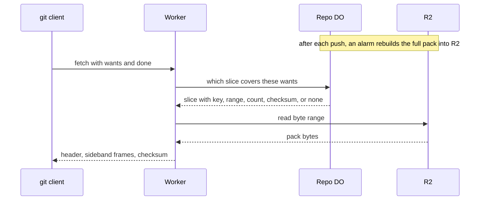

# Precomputed pack slices for clone

> Verdict: **lands with caveats** · feasibility 4/5 · reliability 3/5 · correctness 3/5 · effort: weeks
> Read the words in [how-to-read.md](../findings/how-to-read.md). Engineers: [proof](../proofs/precomputed-clone-pack.md) · [review](../reviews/precomputed-clone-pack.md)

## What this idea is

git is a tool that keeps every version of a set of files, and lets many people share those versions. A repository, or repo, is one project's full set of files and their history. A commit is one saved version of the files, with a note about what changed. A branch is a named line of commits, like a bookmark that moves forward as you save.

A ref is a name that points at one commit. A branch is a ref. A tag is a ref.

A push is sending your new commits to the server. A fetch is getting commits from the server. A clone gets everything for the first time. An object is one stored item in git. An object is a file's content, a folder listing, or a commit.

A clone normally makes the server build one packfile on the spot. A packfile is one bundle that holds many objects, squeezed to save space.

This idea builds the full packfile ahead of time, after each push, and keeps it in R2. R2 is Cloudflare's large file store. It holds the git objects. A fresh clone then streams a slice of that file straight from R2. No build happens while the client waits.

Think of it like this. A bakery bakes the day's bread before the shop opens. A customer who wants a whole loaf gets one from the shelf at once. Only a customer with an unusual order waits for something to be made.

## How it works

Cloudflare Workers are small programs that run on Cloudflare's network close to the user, with no server to manage. A SHA is a fingerprint of an object's content. Two objects with the same content have the same fingerprint.

1. Each push updates refs in the repo's Durable Object. A Durable Object, or DO, is a single small program with its own storage that handles one thing at a time. There is one DO for each repo. Think of it like the one librarian who is allowed to update the catalog.
2. The DO sets an alarm for 30 seconds later. An alarm is a timer inside a Durable Object. A DO has only one alarm at a time.
3. When the alarm fires, the DO builds one full packfile into R2 with a multipart upload. The build writes commits first, then folder listings, then file contents.
4. The DO records in DO SQLite which ref tips the build covers. DO SQLite is the small database inside each Durable Object. The DO also records byte ranges for two slices, full and blobless, each with an object count and a precomputed checksum.
5. A fresh clone sends a protocol v2 fetch with only wants and done. Protocol v2 is the newer, cleaner set of messages git uses to talk to a server.
6. The Worker asks the DO for a slice. The DO answers only if every wanted commit is one of the covered tips.
7. The Worker writes a fresh 12-byte pack header, then streams the byte range from R2 as sideband frames inside pkt-lines. Sideband is a way to send two kinds of data in one stream, like a main channel and a progress channel. A pkt-line is git's way of framing a message. Each line starts with four characters that give its length.
8. The Worker appends the stored checksum. The DO never carries pack bytes.
9. If the refs moved since the build, or the client sent haves or a depth limit, the request falls through to the normal negotiated fetch.

## What the reviewer decided

The reviewer looks for blockers and caveats. A blocker is a problem that stops the idea from working until it is fixed. A caveat is a limit or a condition. The idea works, but only inside this limit.

The verdict is Lands with caveats.

| Score | Value |
|---|---|
| Feasibility | 4 of 5 |
| Reliability | 3 of 5 |
| Correctness | 3 of 5 |

Lands with caveats. The idea is sound and can be built. The proof has one or more problems that must be fixed first, and the reviewer described each fix. Think of it like a flight with a runway that needs some repairs before you land. The runway is there. The repairs are known.

For this idea, the design has the right shape for Workers. The DO decides, R2 streams, and a v2 fetch with done and no haves can skip the acknowledgments section. Every building block is GA. GA, or generally available, means a Cloudflare feature that is finished and supported, not a preview.

The proof code as written cannot complete one clone, because of a pkt-line length bug and a wrong checksum for the blobless slice. The pack builder holds the real platform risk, and the proof defers it to another idea. The reviewer expects weeks of work, mostly for the builder.

## Problems that must be fixed first

### Problem 1: The pkt-line length leaves out its own four characters

**What goes wrong.** The length at the start of a pkt-line must include the four length characters themselves. The helper in the proof leaves them out. The line "packfile" is sent with length 0009 instead of 000d.

**Why it matters.** A normal git clone on the fast path would fail. The client reads a short packet, then reads letters where a length belongs. The client stops with "protocol error: bad line length character".

**How to fix it.** Add 4 to the text length before writing the four characters.

### Problem 2: The blobless slice carries the wrong checksum

**What goes wrong.** The proof computes the blobless checksum by saving the state of the full pack's hasher at the point where file contents begin. But the blobless slice has its own header with a different object count. The two byte streams differ from byte 8 onward, so the saved hash is wrong.

**Why it matters.** A normal git clone that asks for a blobless pack would fail. The client stops with "pack is corrupted, SHA1 mismatch".

**How to fix it.** Run a second hasher that starts with the blobless header. The object counts are known after enumeration and before writing, so the extra hasher is cheap.

### Problem 3: The pack builder is not designed

**What goes wrong.** The function writePack is left out of the proof, and that function is where the platform risk lives. An alarm run gets 1,000 subrequests, and each R2 call counts. A subrequest is one call from a Worker to another service, such as one read from R2. Each request may make at most 50 subrequests on the free plan and 10,000 on the paid plan. The multipart upload state must survive across chained alarm runs.

Deltas must be ordered so each base comes before the delta. A delta is a stored object written as "the same as that other object, with these changes". And idea #2 stores objects as loose files, so there are no existing delta entries to copy.

**Why it matters.** Without a builder, no pack exists and the fast path never runs. A large repo needs many chained alarm runs, and the proof shows none of that.

**How to fix it.** Design the builder as a chunked task. Save the multipart state and the captured ref tips in DO SQLite after each chunk. Order objects so every delta base comes first. Reconcile the loose-object layout of idea #2 with this builder.

## Things to know

- The life of an old pack is not designed: no deletion, no grace period, and no rule for a delete during a running clone. A crash between the upload and the database row leaves a lost pack that nobody points to, so a cleanup task must find it.
- Do not advertise sideband-all or ref-in-want. Both change the wire format that the fast path writes or reads.
- The proof's claim that the stored file works as a bundle-uri target is wrong, because a bare pack is not a bundle. The v2 feature that takes a raw pack is packfile-uris.
- The stored pack holds the whole repo, so a clone of one branch or one tag gets everything. That answer is valid, but it is not what the client asked for.
- Every push burst rewrites the whole pack, which costs R2 writes in proportion to the repo size. A build lags a push by at least 30 seconds plus build time, so busy repos rarely hit the fast path.

## How this idea connects to the others

- The single DO that owns the refs comes from [#1 One Durable Object per repo as the ref authority](./repo-do-ref-authority.md).
- The refs table and the object store come from [#2 Refs in DO SQLite, objects in R2](./refs-sqlite-objects-r2.md).
- The v2 fetch handling and sideband framing come from [#3 Speak git protocol v2 only, translate v0 at the edge](./protocol-v2-only.md).
- The first request and the pkt-line code come from [#53 The /info/refs?service= entrypoint and pkt-line codec](./info-refs-endpoint.md).
- The chunked pack builder is shared with [#55 GC and repack as a DO alarm](./gc-and-repack-alarm.md).
- The fallback for every other fetch comes from [#56 Want/have negotiation with a commit-graph in SQLite](./want-have-negotiation.md).
